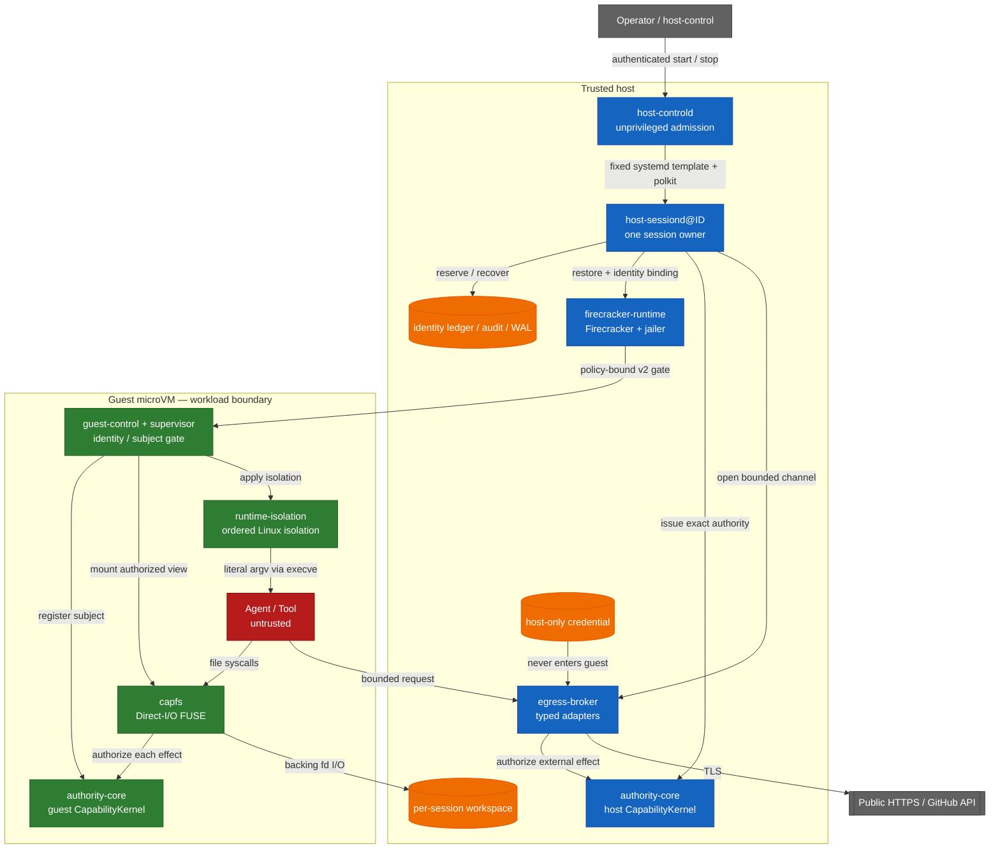

<!-- locale: de -->
<!-- translation-source: README.md -->

# Capability-based AI Agent Runtime

[English](README.md) · [日本語](README-ja.md) · [简体中文](README-zh-CN.md) · [繁體中文](README-zh-TW.md) · [한국어](README-ko.md) · [Español](README-es.md) · [Français](README-fr.md) · [Deutsch](README-de.md) · [Português (Brasil)](README-pt-BR.md)

[](https://github.com/Aqua-218/SecCamp-AIAgent/actions/workflows/ci.yml)
[](LICENSE)

Führt nicht vertrauenswürdige Agent- und Tool-Workloads unter Linux und Firecracker aus und hält Capability-Prüfungen, Isolation, Egress Policy, Audit und Recovery an den Stellen aufrecht, an denen Seiteneffekte entstehen.

> **Status:** Dies ist ein Source Repository und keine Behauptung absoluter Isolation. In dieser Revision verzeichnet das Verification Manifest 38 `verified` Claims und 3 `blocked` Claims. Lesen Sie die Scope-Tabelle, bevor Sie ein Ergebnis als Beleg für eine andere Umgebung behandeln.

<a id="start-here"></a>
## Hier beginnen

| Ziel | Lesen |
|---|---|
| Einen Hosted Smoke Test ausführen | [Quick start](#quick-start) |
| Die Trust Boundary verstehen | [Architecture and trust boundaries](#architecture-and-trust-boundaries) |
| Prüfen, was verifiziert ist und was nicht | [Verification status](#verification-status) und [`docs/verification-status.yml`](docs/verification-status.yml) |
| Den Production Daemon deployen | [`deploy/README.md`](deploy/README.md) |
| Das Cross-Crate-Design lesen | [`docs/design/architecture.md`](docs/design/architecture.md) |
| Die gesamte Projektdokumentation durchsuchen | [`docs/README.md`](docs/README.md) / [deutscher docs hub](docs/i18n/de/README.md) |

<a id="overview"></a>
## Überblick

Die Runtime behandelt Agent, Tools und Workload-Prozesse als untrusted. Dateioperationen, öffentliche HTTPS-Fetches und typisierte GitHub-Operationen sind geschlossene Datentypen und keine beliebigen Commands. `authority-core` trifft die Authorization Decision; CapFS und der Host Egress Broker setzen sie unmittelbar vor Filesystem- oder External-Effects durch.

Die Production Unit besteht aus genau einem Worker, einer Session und einer Firecracker MicroVM. Der unprivilegierte `host-controld` lässt mehrere Worker über authentifizierte, Quota-begrenzte Start/Stop-Requests zu. Jeder `host-sessiond@ID.service` besitzt eine Session und ihre Cleanup-Records. Das aktuelle Trust Model ist Single-Host: Multi-Host-HA, Distributed Revocation und replizierter Broker-State gehören nicht zur Garantie des Repositorys.

<a id="what-the-runtime-enforces"></a>
## Was die Runtime erzwingt

- **Typed least privilege:** File-Effects, HTTP-Methoden und -Pfade sowie GitHub-Operationen werden durch geschlossene Rust-Typen und bounded Authority Envelopes dargestellt.
- **Effect-point authorization:** CapFS autorisiert jeden Filesystem-Effect erneut; der Host Broker autorisiert typisierte External-Effects über den Host `CapabilityKernel`.
- **Revocation linearization:** Der Authorization Read Guard bleibt bis zum Commit Point des Effects gehalten. Nach der Rückkehr von `revoke` darf ein späterer Commit nicht allein auf der widerrufenen Capability oder einem ihrer Descendants beruhen. Vor dem Widerruf commitete Effects werden nicht zurückgerollt.
- **No guest credentials:** Provider-Credentials bleiben auf dem Host, werden nie in das Guest Image gelegt und nicht in einer Response zurückgegeben.
- **No guest network device:** Der Guest hat kein `virtio-net`; Egress verwendet ein bounded `AF_VSOCK` Protocol und typisierte Host-Adapter.
- **Identity non-reuse:** Die Identitäten von Session, Request, Workspace, VM, Broker-Session, Subject und Capability werden in dauerhaften Ledgers aufgezeichnet und nach einem Restart nicht stillschweigend wiederverwendet.
- **Bound guest startup:** Pinned Artifacts, dm-verity, Paused Restore und an den Policy Digest gebundene v2 Guest Acknowledgements steuern die Freigabe des Workloads.
- **Fail-closed recovery:** Unklare Effects werden als `CommitUnknown` aufgezeichnet; ein partielles Shutdown und beschädigte Durable Records schlagen geschlossen fehl und hinterlassen Typed Recovery State für den nächsten Start.

<a id="architecture-and-trust-boundaries"></a>
## Architektur und Trust Boundaries

Host-Services, Pinned Artifacts, Firecracker/Jailer und Host-Kernel gehören zur Trusted Host Boundary. Guest-Services erzwingen die Guest-Side Contracts; Agent- und Tool-Prozesse sind untrusted. Das Diagramm zeigt die vorgesehenen Effect-Pfade, nicht den Beweis einer VM Escape Resistance.



Die Pfade, die Grenzen überschreiten, sind absichtlich eng.

| Boundary | Path | Important limits |
|---|---|---|
| Workload → workspace | CapFS Direct-I/O FUSE | Re-Authorization für jeden Effect; Repository, Path und Effect müssen übereinstimmen |
| Workload → supervisor | `SOCK_SEQPACKET` | 4-KiB-Request-Limit und vom Kernel abgeleitete `SO_PEERCRED`-Identity |
| Guest → host | `AF_VSOCK` framed transport | 4-Byte-Längenpräfix, 1-MiB-Payload-Limit, Canonical CBOR sowie Session/Replay/Budget-Prüfungen |
| Host → microVM | Firecracker API plus guest-control API | Pinned Artifact Digests, dm-verity, Paused Restore und Policy-bound v2 ACKs |
| Host → external provider | Typed Broker adapter | Nur Public HTTPS oder typisierte GitHub-Operationen; DNS/IP-, Redirect-, Response- und Deadline-Policy |

Raw Guest TCP, beliebiges Host-Filesystem-Sharing und Guest-Credential-Injection gehören nicht zur Schnittstelle. Der Launcher interpretiert keine Shell-Strings, sondern führt das im Image konfigurierte Programm mit literal argv über `execve` aus. Startet ein Workload selbst eine Shell, gelten Namespace-, Cgroup-, Seccomp-, Landlock-, Read-only-Rootfs- und Capability-Grenzen weiterhin; dieses Projekt behauptet nicht, Shell Parsing sicher zu machen.

Startup committet Resources in dieser Reihenfolge:

```text
workspace → Broker → VM → capability → workload
```

Shutdown folgt der folgenden Dependency Order. Ein fehlgeschlagenes Stage bleibt dauerhaft erhalten; nur unfertige Stages werden erneut versucht:

```text
capability revoke → VM kill → Broker close → workspace isolation → Closed
```

<a id="verification-status"></a>
## Verification-Status

Die maschinenlesbare Source of Truth ist [`docs/verification-status.yml`](docs/verification-status.yml). Statuses sind nach Scope begrenzte Claims und keine Green-List aller möglichen Umgebungen. `verified` bedeutet, dass der Required Gate im angegebenen Scope lief; `blocked` vermerkt ein nicht verfügbares Prerequisite oder einen externen Owner. Das Manifest dieser Revision enthält 38 `verified` Claims und 3 `blocked` Claims, aber keine `unverified` Claims.

| Scope | Current manifest status | Evidence and boundary |
|---|---|---|
| Hosted | 14 verified | Locked Rust Tests, Clippy, Property Tests, Durable-State Tests und der Rust/Lean Corpus, soweit vom Claim erfasst |
| Privileged Linux | 10 verified, 1 blocked | Echtes FUSE, Linux-Isolation, Rollback, Supervisor-Ressourcen und Controlled-HTTPS-Fixtures; der Blocked-Claim betrifft den privilegierten aarch64-Architektur-Runner |
| KVM | 14 verified | Pinned Firecracker Guest, dm-verity, Guest-Control, Production `Runtime::launch` / `SessionOwner`, alle 13 erklärten CapFS-Effects und Multi-Session-Cleanup-Gates |
| External | 2 blocked | Live GitHub Credential/Provider Mutation und unabhängige External-Review-Evidence sind in diesem Checkout nicht verfügbar |

Diese Ergebnisse belegen weder VM Escape Resistance, Host-Kernel/KVM/Firecracker Correctness, Resistenz gegen physische oder mikroarchitektonische Side Channels noch beliebiges External-Provider-Verhalten. Die Verification-Seiten der Crates nennen Annahmen und Grenzen der finiten Tests:

- [`authority-core` verification](docs/authority-core/verification.md)
- [`capfs` verification](docs/capfs/verification.md)
- [`egress-broker` verification](docs/egress-broker/verification.md)
- [`firecracker-runtime` verification](docs/firecracker-runtime/verification.md)
- [`runtime-isolation` verification](docs/runtime-isolation/verification.md)
- [`session-orchestrator` verification](docs/session-orchestrator/verification.md)
- [`supervisor` verification](docs/supervisor/verification.md)

<a id="quick-start"></a>
## Schnellstart

Dieser Pfad führt nur Hosted Code aus. Er startet keinen Service, benötigt kein Root, mountet kein FUSE, benötigt kein `/dev/kvm` und liest keine Provider-Credentials. Der erste Checkout braucht Netzwerkzugriff für Cargos Locked Dependencies; spätere Läufe verwenden den lokalen Cargo-Cache.

<a id="prerequisites"></a>
### Voraussetzungen

- Linux, Git und `rustup`
- Rust `1.93.1`, ausgewählt durch [`rust-toolchain.toml`](rust-toolchain.toml)

<a id="run-a-hosted-smoke-test"></a>
### Einen Hosted Smoke Test ausführen

```bash
git clone https://github.com/Aqua-218/SecCamp-AIAgent.git
cd SecCamp-AIAgent

cargo test --locked -p authority-core --all-targets
cargo run --locked -p session-orchestrator --bin host-sessiond -- --help
```

Der erste Command führt das Authority Model und seine Corpus-Facing Tests aus. Der zweite Command gibt die erforderliche Artifact-, Snapshot-, Authority- und Egress-Konfiguration des Production Daemons aus; `host-sessiond` besitzt absichtlich keinen Placeholder Mode, der einen unvollständigen Production Stack startet.

<a id="development-and-verification"></a>
## Entwicklung und Verification

Lokale Entwicklung und CI verwenden denselben Entry Point [`scripts/ci/run.sh`](scripts/ci/run.sh). Installieren Sie nur die Tool Groups für die Gates, die Sie ausführen möchten; die Tools liegen im privaten `.ci-tools/`-Verzeichnis des Repositorys.

```bash
scripts/ci/install-cargo-tools.sh nextest coverage security public-api
scripts/ci/install-pipeline-tools.sh
scripts/ci/install-lean.sh
```

<a id="standard-hosted-gates"></a>
### Standard-Hosted-Gates

```bash
scripts/ci/run.sh format
scripts/ci/run.sh check
scripts/ci/run.sh clippy
scripts/ci/run.sh docs
scripts/ci/run.sh docs-policy

for shard in 1 2 3 4; do
  scripts/ci/run.sh test "$shard"
done

scripts/ci/run.sh doctest
scripts/ci/run.sh loom
scripts/ci/run.sh lean
scripts/ci/run.sh differential
scripts/ci/run.sh coverage
scripts/ci/run.sh audit
scripts/ci/run.sh deny
scripts/ci/run.sh api-surface
```

Das Coverage Gate verwendet einen Workspace-Line-Coverage-Floor von 75 %. Dieses Threshold ist ein CI Gate, kein Coverage Badge und keine Behauptung, dass alle privilegierten oder KVM-Pfade ausgeführt wurden. Die genaue Matrix für Miri, Sanitizer, Mutation Testing, Fuzzing und Benchmarks steht in [`ci/gates.yml`](ci/gates.yml).

<a id="privileged-and-kvm-gates"></a>
### Privilegierte und KVM-Gates

Diese Commands benötigen die von ihren Scripts genannten Prerequisites. Fehlendes `/dev/fuse`, `/dev/kvm`, delegiertes Cgroup v2, Device-Mapper-Tools oder Pinned Guest Artifacts sind eine Verification Failure und kein erfolgreicher Skip.

```bash
# Root and delegated cgroup v2
scripts/ci/run.sh privileged-isolation

# Root, /dev/kvm, /dev/vhost-vsock, veritysetup, busybox, and mkfs.ext4
scripts/ci/verify-real-guest-control.sh
scripts/ci/verify-real-session-owner.sh
```

Den vollständigen Protected-Runner-Contract finden Sie auf den [Crate Verification Pages](#verification-status) und in [`docs/ci-cd.md`](docs/ci-cd.md).

<a id="running-host-sessiond"></a>
## `host-sessiond` ausführen

Der deploybare Entry Point ist [`host-sessiond`](crates/session-orchestrator/src/bin/host-sessiond.rs). Das Production Installation Procedure erfordert einen extern reviewed Full Commit und ein extern authenticated SHA-256 Manifest; es ist kein generisches `cargo install` Target.

```bash
cargo build --release --locked \
  -p session-orchestrator \
  --bin host-sessiond --bin host-controld --bin host-control
```

Für Installation, Artifact Pinning, System Accounts, systemd/polkit, Device Access, Snapshots, Credential Handling und Recovery folgen Sie [`deploy/README.md`](deploy/README.md). Die eingecheckten Examples sind die Source des Service Contracts.

| Artifact | Purpose |
|---|---|
| [`deploy/host-sessiond-worker.env.example`](deploy/host-sessiond-worker.env.example) | Multi-Session-Worker-Environment und Pinned-Artifact-Felder |
| [`deploy/host-sessiond.env.example`](deploy/host-sessiond.env.example) | Legacy-Single-Session-Environment-Example |
| [`service/host-sessiond@.service`](service/host-sessiond@.service) | Eine Worker-Instance pro Session |
| [`service/host-sessiond-recover@.service`](service/host-sessiond-recover@.service) | Recovery-only Worker Cleanup |
| [`service/host-controld.service`](service/host-controld.service) | Unprivileged Authenticated Controller |
| [`deploy/polkit-1/rules.d/50-host-controld.rules`](deploy/polkit-1/rules.d/50-host-controld.rules) | Enge Start/Stop Authorization |

Der Example Service wählt `--egress-authority none` und liest kein GitHub Token. Public HTTPS oder GitHub müssen explizit mit dem passenden Authority- und Host-only-Credential-Profil aktiviert werden. `EGRESS_GITHUB_TOKEN` bleibt ausschließlich ein expliziter Non-Systemd-Fallback; Production-Systemd-Deployments sollten das im Deploy Guide beschriebene verschlüsselte `github-token` Credential verwenden. Eine `publish-branch` Operation benötigt außerdem einen Host-owned Expected-old-object-Plan.

<a id="workspace-layout"></a>
## Workspace-Layout

| Path | Responsibility |
|---|---|
| [`crates/authority-core/`](crates/authority-core/) | Typed Authority Families, Delegation, Policy Digests, State, Revocation, Audit und Durable Audit |
| [`crates/capfs/`](crates/capfs/) | Repository Preflight, Namespace/Node Tables, Backing I/O und Direct-I/O FUSE |
| [`crates/egress-protocol/`](crates/egress-protocol/) | Bounded Frames, Canonical CBOR, Session/Replay Identity und Budgets |
| [`crates/egress-broker/`](crates/egress-broker/) | Host-Vsock-Transport, Public-HTTPS-Policy, Typed-GitHub-Adapter und Durable Dispatch |
| [`crates/firecracker-runtime/`](crates/firecracker-runtime/) | Pinned Artifacts, dm-verity, Jailer, Snapshot/Restore und Guest-Control-Transport |
| [`crates/runtime-isolation/`](crates/runtime-isolation/) | Geordnete Linux-Namespace-, Mount-, Cgroup-, Landlock-, Capability- und Seccomp-Transaktion |
| [`crates/supervisor/`](crates/supervisor/) | Guest-Subject- und Handle-Lifecycle, Control Socket und CapFS Composition |
| [`crates/session-orchestrator/`](crates/session-orchestrator/) | Session Lifecycle, Leases, Production Adapters, Durable Recovery und Daemon Binaries |
| [`lean/`](lean/) | Lean 4 (`leanprover/lean4:v4.16.0`) Authority/Runtime Model und Proof-Corpus-Executables |
| [`guest/`](guest/) | Pinned Guest-Kernel-Konfiguration und Patch |
| [`ci/`](ci/) | Gate Manifest, API Baselines, Benchmark Baseline und Fixtures |
| [`scripts/ci/`](scripts/ci/) | Gemeinsame GitHub-, GitLab- und lokale Gate Implementations |
| [`docs/`](docs/README.md) | Design, Crate Contracts, Verification Boundaries, Decisions und Glossary |
| [`deploy/`](deploy/README.md) und [`service/`](service/) | Production Installation und systemd/polkit Artifacts |

`authority-core` und `runtime-isolation` bleiben Blätter des Dependency Graphs, sodass ihre Authorization- und Isolation-Contracts nicht von höherer Orchestrierung abhängen. Der tatsächliche Dependency Graph und die Runtime-Platzierung sind in [`docs/design/architecture.md`](docs/design/architecture.md) dokumentiert.

<a id="ci-and-release"></a>
## CI und Release

[`ci/gates.yml`](ci/gates.yml) ist die Single Source of Truth für die Pipeline Topology. Derzeit definiert sie 53 Implemented Gates für Validation, Quality, Tests, Analysis, Security und Protected System Verification. Vier geordnete Release Stages (`package`, `verify`, `publish` und `record`) werden getrennt verfolgt. GitHub Actions und GitLab CI müssen dieselben Manifest-owned Gates implementieren; bei fehlenden oder unerwarteten Jobs schlagen Parity und Result Reconciliation fail closed fehl.

Der Deep Workflow läuft geplant oder manuell, weil normale Pull-Request-Runner kein echtes FUSE, KVM, Device-Mapper, systemd oder External-Provider-Fixtures bereitstellen. Das External-Provider-Gate ist opt-in und bleibt in diesem Checkout ohne Protected Credential und Disposable Provider Owner blocked.

Die Release Automation ist auf Semantic-Version-Tags beschränkt. Sie paketiert das reproduzierbare `authority-corpus` Linux Binary mit License Text, Build Metadata, SPDX SBOM, Checksum und Platform-specific Provenance/Signature Record. Dieses Repository veröffentlicht kein Version Badge; Workspace Version in [`Cargo.toml`](Cargo.toml) und Release Workflow sind die maßgeblichen Inputs.

Siehe [`docs/ci-cd.md`](docs/ci-cd.md) für Runner Contracts, Branch Protection, Release Recovery und Signature Handling.

<a id="documentation"></a>
## Dokumentation

[`docs/README.md`](docs/README.md) ist der Documentation Index. Die nützlichsten Einstiegspunkte sind:

| Topic | Document |
|---|---|
| Cross-Crate Architecture | [`docs/design/architecture.md`](docs/design/architecture.md) |
| Threat Model und Non-Goals | [`docs/design/threat-model.md`](docs/design/threat-model.md) |
| Capability-, Isolation- und Egress-Design | [`docs/design/README.md`](docs/design/README.md) |
| Verification Strategy | [`docs/design/verification.md`](docs/design/verification.md) |
| Machine-readable Verification Claims | [`docs/verification-status.yml`](docs/verification-status.yml) |
| Decision Records | [`docs/decisions/README.md`](docs/decisions/README.md) |
| Deployment und Recovery | [`deploy/README.md`](deploy/README.md) |
| CI/CD Operations | [`docs/ci-cd.md`](docs/ci-cd.md) |
| Terminology | [`docs/glossary.md`](docs/glossary.md) |

Die README- und Verification-Seite jedes Crates trennt Implementation, Hosted Tests, Privileged Tests, KVM Evidence und External-Provider-Gaps. Wenn eine Änderung nur ein Subsystem betrifft, beginnen Sie beim entsprechenden Crate im [Workspace Layout](#workspace-layout).

<a id="license"></a>
## Lizenz

Copyright © 2026 Aqua-218.

Dieses Projekt wird unter der [GNU Affero General Public License v3.0 only](LICENSE) (`AGPL-3.0-only`) veröffentlicht. Lesen Sie den Lizenztext für die Bedingungen zu Nutzung, Änderung, Weiterverteilung und Netzwerk-Service-Bereitstellung.

<a id="related"></a>
## Verwandte Dokumente

- [Documentation index](docs/README.md)
- [Architecture](docs/design/architecture.md)
- [Threat model](docs/design/threat-model.md)
- [Verification strategy](docs/design/verification.md)
- [Deployment guide](deploy/README.md)
- [CI/CD operations](docs/ci-cd.md)
