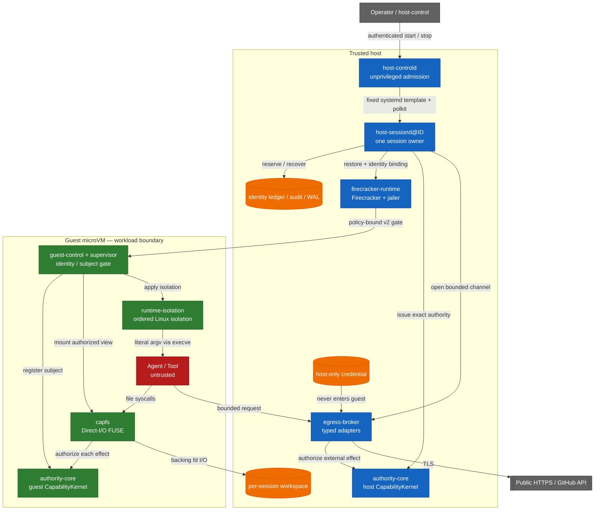

<!-- locale: es -->
<!-- translation-source: README.md -->

# Capability-based AI Agent Runtime

[English](README.md) · [日本語](README-ja.md) · [简体中文](README-zh-CN.md) · [繁體中文](README-zh-TW.md) · [한국어](README-ko.md) · [Español](README-es.md) · [Français](README-fr.md) · [Deutsch](README-de.md) · [Português (Brasil)](README-pt-BR.md)

[](https://github.com/Aqua-218/SecCamp-AIAgent/actions/workflows/ci.yml)
[](LICENSE)

Ejecuta workloads de agent y tool no confiables en Linux y Firecracker, manteniendo las comprobaciones de capability, el aislamiento, la egress policy, la auditoría y la recuperación en los puntos donde aparecen los efectos secundarios.

> **Status:** Este es un source repository, no una afirmación de aislamiento absoluto. En esta revisión, el verification manifest registra 38 claims `verified` y 3 claims `blocked`. Lee la tabla de scope antes de tratar cualquier resultado como evidencia para otro entorno.

<a id="start-here"></a>
## Empieza aquí

| Objetivo | Leer |
|---|---|
| Ejecutar un hosted smoke test | [Quick start](#quick-start) |
| Entender el trust boundary | [Architecture and trust boundaries](#architecture-and-trust-boundaries) |
| Comprobar qué está y qué no está verificado | [Verification status](#verification-status) y [`docs/verification-status.yml`](docs/verification-status.yml) |
| Desplegar el production daemon | [`deploy/README.md`](deploy/README.md) |
| Leer el diseño entre crates | [`docs/design/architecture.md`](docs/design/architecture.md) |
| Explorar toda la documentación del proyecto | [`docs/README.md`](docs/README.md) / [docs hub en español](docs/i18n/es/README.md) |

<a id="overview"></a>
## Descripción general

El runtime trata al agent, las tools y los workload processes como untrusted. Las operaciones de archivos, los public HTTPS fetches y las operaciones tipadas de GitHub son closed data types, no commands arbitrarios. `authority-core` toma la authorization decision; CapFS y el host Egress Broker la aplican justo antes de los efectos filesystem o external.

La unidad de producción es un worker, una session y una Firecracker microVM. El `host-controld` sin privilegios admite varios workers mediante requests start/stop autenticados y limitados por quota. Cada `host-sessiond@ID.service` posee una session y sus cleanup records. El trust model actual es single-host: multi-host HA, distributed revocation y replicated Broker state quedan fuera de la garantía del repository.

<a id="what-the-runtime-enforces"></a>
## Lo que el runtime impone

- **Typed least privilege:** los file effects, los HTTP methods y paths y las GitHub operations se representan con closed Rust types y bounded authority envelopes.
- **Effect-point authorization:** CapFS vuelve a autorizar cada filesystem effect; el host Broker autoriza los external effects tipados mediante el host `CapabilityKernel`.
- **Revocation linearization:** el authorization read guard se mantiene hasta el commit point del effect. Después de que `revoke` retorna, un commit posterior no puede depender solamente de la capability revocada o de uno de sus descendants. Los effects comprometidos antes de la revocación no se rollback.
- **No guest credentials:** las credenciales del provider permanecen en el host y nunca entran en el guest image ni se devuelven en una response.
- **No guest network device:** el guest no tiene `virtio-net`; el egress usa un bounded `AF_VSOCK` protocol y typed host adapters.
- **Identity non-reuse:** las identities de session, request, workspace, VM, Broker session, subject y capability se registran en durable ledgers y no se reutilizan silenciosamente tras un restart.
- **Bound guest startup:** los pinned artifacts, dm-verity, paused restore y los v2 guest acknowledgements bound al policy digest controlan la liberación del workload.
- **Fail-closed recovery:** los effects ambiguos se registran como `CommitUnknown`; el partial shutdown y los durable records dañados fallan closed y dejan typed recovery state para el siguiente start.

<a id="architecture-and-trust-boundaries"></a>
## Arquitectura y trust boundaries

Los host services, pinned artifacts, Firecracker/jailer y el host kernel forman parte del trusted host boundary. Los guest services imponen los guest-side contracts; los procesos de agent y tool son untrusted. El diagrama muestra las rutas de effects previstas, no una prueba de VM escape resistance.



Los recorridos que cruzan límites son deliberadamente estrechos.

| Boundary | Path | Important limits |
|---|---|---|
| Workload → workspace | CapFS Direct-I/O FUSE | Reautorización para cada effect; repository, path y effect deben coincidir |
| Workload → supervisor | `SOCK_SEQPACKET` | Límite de 4 KiB por request e identity `SO_PEERCRED` derivada por el kernel |
| Guest → host | `AF_VSOCK` framed transport | Prefijo de longitud de 4 bytes, límite de payload de 1 MiB, canonical CBOR y comprobaciones de session/replay/budget |
| Host → microVM | Firecracker API plus guest-control API | Pinned artifact digests, dm-verity, paused restore y policy-bound v2 ACKs |
| Host → external provider | Typed Broker adapter | Solo public HTTPS u operaciones GitHub tipadas; policy de DNS/IP, redirect, response y deadline |

El raw guest TCP, el arbitrary host filesystem sharing y el guest credential injection no forman parte de la interface. El launcher no interpreta shell strings: ejecuta el image-configured program con literal argv mediante `execve`. Si un workload inicia un shell por sí mismo, siguen aplicándose los límites de namespace, cgroup, seccomp, Landlock, read-only rootfs y capability; este proyecto no afirma que haga seguro el shell parsing.

El startup hace commit de los resources en este orden:

```text
workspace → Broker → VM → capability → workload
```

El shutdown sigue el dependency order siguiente. Un stage fallido permanece durable y solo se reintentan los stages sin terminar:

```text
capability revoke → VM kill → Broker close → workspace isolation → Closed
```

<a id="verification-status"></a>
## Estado de la verification

La source of truth machine-readable es [`docs/verification-status.yml`](docs/verification-status.yml). Los status son claims con scope, no una green-list de todos los entornos posibles. `verified` significa que el required gate se ejecutó en el scope declarado; `blocked` registra un prerequisite o external owner no disponible. En esta revisión el manifest contiene 38 claims `verified` y 3 `blocked`, sin claims `unverified`.

| Scope | Current manifest status | Evidence and boundary |
|---|---|---|
| Hosted | 14 verified | Locked Rust tests, Clippy, property tests, durable-state tests y el Rust/Lean corpus cuando el claim lo declara |
| Privileged Linux | 10 verified, 1 blocked | Real FUSE, Linux isolation, rollback, supervisor resources y controlled HTTPS fixtures; el blocked claim es el aarch64 privileged architecture runner |
| KVM | 14 verified | Pinned Firecracker guest, dm-verity, guest-control, production `Runtime::launch` / `SessionOwner`, los 13 CapFS effects declarados y multi-session cleanup gates |
| External | 2 blocked | Live GitHub credential/provider mutation y la evidencia de independent external review no están disponibles en este checkout |

Estos resultados no establecen VM escape resistance, host-kernel/KVM/Firecracker correctness, resistencia a side channels físicos o microarquitectónicos, ni arbitrary external-provider behavior. Las páginas de verification de cada crate enumeran las assumptions y los límites de finite tests:

- [`authority-core` verification](docs/authority-core/verification.md)
- [`capfs` verification](docs/capfs/verification.md)
- [`egress-broker` verification](docs/egress-broker/verification.md)
- [`firecracker-runtime` verification](docs/firecracker-runtime/verification.md)
- [`runtime-isolation` verification](docs/runtime-isolation/verification.md)
- [`session-orchestrator` verification](docs/session-orchestrator/verification.md)
- [`supervisor` verification](docs/supervisor/verification.md)

<a id="quick-start"></a>
## Inicio rápido

Esta ruta solo ejecuta hosted code. No inicia un service, no necesita root, no monta FUSE, no requiere `/dev/kvm` ni lee provider credentials. El primer checkout necesita network access para las locked dependencies de Cargo; las ejecuciones posteriores usan el Cargo cache local.

<a id="prerequisites"></a>
### Requisitos previos

- Linux, Git y `rustup`
- Rust `1.93.1`, seleccionado por [`rust-toolchain.toml`](rust-toolchain.toml)

<a id="run-a-hosted-smoke-test"></a>
### Ejecutar un hosted smoke test

```bash
git clone https://github.com/Aqua-218/SecCamp-AIAgent.git
cd SecCamp-AIAgent

cargo test --locked -p authority-core --all-targets
cargo run --locked -p session-orchestrator --bin host-sessiond -- --help
```

El primer command ejecuta el authority model y sus corpus-facing tests. El segundo command imprime la configuración de artifact, snapshot, authority y egress que requiere el production daemon; `host-sessiond` no tiene un placeholder mode que inicie un production stack incompleto.

<a id="development-and-verification"></a>
## Desarrollo y verification

El desarrollo local y CI usan el mismo entry point [`scripts/ci/run.sh`](scripts/ci/run.sh). Instala solo los tool groups necesarios para los gates que vayas a ejecutar; los tools se colocan en el `.ci-tools/` privado del repository.

```bash
scripts/ci/install-cargo-tools.sh nextest coverage security public-api
scripts/ci/install-pipeline-tools.sh
scripts/ci/install-lean.sh
```

<a id="standard-hosted-gates"></a>
### Gates hosted estándar

```bash
scripts/ci/run.sh format
scripts/ci/run.sh check
scripts/ci/run.sh clippy
scripts/ci/run.sh docs
scripts/ci/run.sh docs-policy

for shard in 1 2 3 4; do
  scripts/ci/run.sh test "$shard"
done

scripts/ci/run.sh doctest
scripts/ci/run.sh loom
scripts/ci/run.sh lean
scripts/ci/run.sh differential
scripts/ci/run.sh coverage
scripts/ci/run.sh audit
scripts/ci/run.sh deny
scripts/ci/run.sh api-surface
```

El coverage gate usa un floor de line coverage del workspace del 75 %. Ese threshold es un CI gate, no un coverage badge ni una afirmación de que se hayan ejercitado todos los paths privileged o KVM. La matrix exacta de Miri, sanitizers, mutation testing, fuzzing y benchmarks está en [`ci/gates.yml`](ci/gates.yml).

<a id="privileged-and-kvm-gates"></a>
### Gates privilegiados y KVM

Estos commands necesitan los prerequisites indicados por sus scripts. La ausencia de `/dev/fuse`, `/dev/kvm`, delegated cgroup v2, device-mapper tools o pinned guest artifacts es una verification failure, no un skip exitoso.

```bash
# Root and delegated cgroup v2
scripts/ci/run.sh privileged-isolation

# Root, /dev/kvm, /dev/vhost-vsock, veritysetup, busybox, and mkfs.ext4
scripts/ci/verify-real-guest-control.sh
scripts/ci/verify-real-session-owner.sh
```

Consulta las [crate verification pages](#verification-status) y [`docs/ci-cd.md`](docs/ci-cd.md) para el protected-runner contract completo.

<a id="running-host-sessiond"></a>
## Ejecutar `host-sessiond`

El entry point desplegable es [`host-sessiond`](crates/session-orchestrator/src/bin/host-sessiond.rs). El production installation procedure exige un full commit externally reviewed y un manifest SHA-256 externally authenticated; no es un target genérico de `cargo install`.

```bash
cargo build --release --locked \
  -p session-orchestrator \
  --bin host-sessiond --bin host-controld --bin host-control
```

Para installation, artifact pinning, system accounts, systemd/polkit, device access, snapshots, credential handling y recovery, sigue [`deploy/README.md`](deploy/README.md). Los examples del repository son la source del service contract.

| Artifact | Purpose |
|---|---|
| [`deploy/host-sessiond-worker.env.example`](deploy/host-sessiond-worker.env.example) | Multi-session worker environment y pinned artifact fields |
| [`deploy/host-sessiond.env.example`](deploy/host-sessiond.env.example) | Legacy single-session environment example |
| [`service/host-sessiond@.service`](service/host-sessiond@.service) | Una worker instance por session |
| [`service/host-sessiond-recover@.service`](service/host-sessiond-recover@.service) | Recovery-only worker cleanup |
| [`service/host-controld.service`](service/host-controld.service) | Unprivileged authenticated controller |
| [`deploy/polkit-1/rules.d/50-host-controld.rules`](deploy/polkit-1/rules.d/50-host-controld.rules) | Narrow start/stop authorization |

El example service selecciona `--egress-authority none` y no lee el GitHub token. Public HTTPS o GitHub deben habilitarse explícitamente con el authority y host-only credential profile correspondientes. `EGRESS_GITHUB_TOKEN` se conserva solo como non-systemd fallback explícito; las production systemd deployments deben usar la credential encrypted `github-token` del deploy guide. La operation `publish-branch` también requiere un expected-old-object plan propiedad del host.

<a id="workspace-layout"></a>
## Diseño del workspace

| Path | Responsibility |
|---|---|
| [`crates/authority-core/`](crates/authority-core/) | Typed authority families, delegation, policy digests, state, revocation, audit y durable audit |
| [`crates/capfs/`](crates/capfs/) | Repository preflight, namespace/node tables, backing I/O y Direct-I/O FUSE |
| [`crates/egress-protocol/`](crates/egress-protocol/) | Bounded frames, canonical CBOR, session/replay identity y budgets |
| [`crates/egress-broker/`](crates/egress-broker/) | Host vsock transport, public HTTPS policy, typed GitHub adapter y durable dispatch |
| [`crates/firecracker-runtime/`](crates/firecracker-runtime/) | Pinned artifacts, dm-verity, jailer, snapshot/restore y guest-control transport |
| [`crates/runtime-isolation/`](crates/runtime-isolation/) | Ordered Linux namespace, mount, cgroup, Landlock, capability y seccomp transaction |
| [`crates/supervisor/`](crates/supervisor/) | Guest subject y handle lifecycle, control socket y CapFS composition |
| [`crates/session-orchestrator/`](crates/session-orchestrator/) | Session lifecycle, leases, production adapters, durable recovery y daemon binaries |
| [`lean/`](lean/) | Lean 4 (`leanprover/lean4:v4.16.0`) authority/runtime model y proof corpus executables |
| [`guest/`](guest/) | Pinned guest kernel configuration y patch |
| [`ci/`](ci/) | Gate manifest, API baselines, benchmark baseline y fixtures |
| [`scripts/ci/`](scripts/ci/) | Shared GitHub, GitLab y local gate implementations |
| [`docs/`](docs/README.md) | Design, crate contracts, verification boundaries, decisions y glossary |
| [`deploy/`](deploy/README.md) y [`service/`](service/) | Production installation y systemd/polkit artifacts |

`authority-core` y `runtime-isolation` siguen siendo hojas del dependency graph, por lo que sus authorization e isolation contracts no dependen de la higher-level orchestration. El dependency graph real y la ubicación en runtime están documentados en [`docs/design/architecture.md`](docs/design/architecture.md).

<a id="ci-and-release"></a>
## CI y release

[`ci/gates.yml`](ci/gates.yml) es la single source of truth de la pipeline topology. Actualmente declara 53 implemented gates en validation, quality, tests, analysis, security y protected system verification. Cuatro release stages ordenados (`package`, `verify`, `publish` y `record`) se siguen por separado. GitHub Actions y GitLab CI deben implementar los mismos manifest-owned gates; si falta un job o aparece uno inesperado, parity y result reconciliation fallan closed.

El deep workflow se ejecuta por schedule o manual dispatch porque los pull-request runners normales no ofrecen real FUSE, KVM, device-mapper, systemd ni external-provider fixtures. El external-provider gate es opt-in y sigue blocked en este checkout sin el protected credential y el disposable provider owner.

La release automation se limita a semantic-version tags. Empaqueta el `authority-corpus` Linux binary reproducible con license text, build metadata, SPDX SBOM, checksum y el platform-specific provenance/signature record. Este repository no publica un version badge; el workspace version de [`Cargo.toml`](Cargo.toml) y el release workflow son las entradas authoritative.

Consulta [`docs/ci-cd.md`](docs/ci-cd.md) para runner contracts, branch protection, release recovery y signature handling.

<a id="documentation"></a>
## Documentación

[`docs/README.md`](docs/README.md) es el documentation index. Las entradas más útiles son:

| Topic | Document |
|---|---|
| Cross-crate architecture | [`docs/design/architecture.md`](docs/design/architecture.md) |
| Threat model y non-goals | [`docs/design/threat-model.md`](docs/design/threat-model.md) |
| Capability, isolation y egress design | [`docs/design/README.md`](docs/design/README.md) |
| Verification strategy | [`docs/design/verification.md`](docs/design/verification.md) |
| Machine-readable verification claims | [`docs/verification-status.yml`](docs/verification-status.yml) |
| Decision records | [`docs/decisions/README.md`](docs/decisions/README.md) |
| Deployment y recovery | [`deploy/README.md`](deploy/README.md) |
| CI/CD operations | [`docs/ci-cd.md`](docs/ci-cd.md) |
| Terminology | [`docs/glossary.md`](docs/glossary.md) |

El README y la verification page de cada crate separan implementation, hosted tests, privileged tests, KVM evidence y external-provider gaps. Si el cambio afecta a un solo subsystem, empieza por el crate correspondiente en [workspace layout](#workspace-layout).

<a id="license"></a>
## Licencia

Copyright © 2026 Aqua-218.

Este proyecto se distribuye bajo [GNU Affero General Public License v3.0 only](LICENSE) (`AGPL-3.0-only`). Revisa el texto de la license para las condiciones aplicables al uso, modificación, redistribución y network service deployment.

<a id="related"></a>
## Relacionado

- [Documentation index](docs/README.md)
- [Architecture](docs/design/architecture.md)
- [Threat model](docs/design/threat-model.md)
- [Verification strategy](docs/design/verification.md)
- [Deployment guide](deploy/README.md)
- [CI/CD operations](docs/ci-cd.md)
