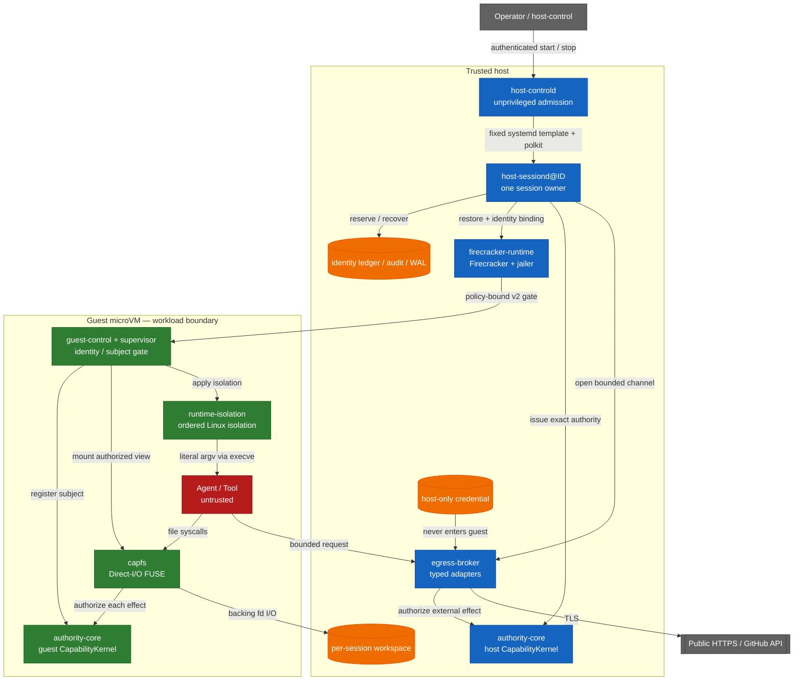

<!-- locale: fr -->
<!-- translation-source: README.md -->

# Capability-based AI Agent Runtime

[English](README.md) · [日本語](README-ja.md) · [简体中文](README-zh-CN.md) · [繁體中文](README-zh-TW.md) · [한국어](README-ko.md) · [Español](README-es.md) · [Français](README-fr.md) · [Deutsch](README-de.md) · [Português (Brasil)](README-pt-BR.md)

[](https://github.com/Aqua-218/SecCamp-AIAgent/actions/workflows/ci.yml)
[](LICENSE)

Exécute des workloads d’agent et d’outil non fiables sur Linux et Firecracker, tout en maintenant les vérifications de capability, l’isolation, la egress policy, l’audit et la récupération aux points où se produisent les effets de bord.

> **Status:** Il s’agit d’un source repository, et non d’une affirmation d’isolation absolue. À cette révision, le verification manifest contient 38 claims `verified` et 3 claims `blocked`. Consultez le tableau de scope ci-dessous avant de considérer un résultat comme une preuve pour un autre environnement.

<a id="start-here"></a>
## Commencer ici

| Objectif | Lire |
|---|---|
| Exécuter un hosted smoke test | [Quick start](#quick-start) |
| Comprendre le trust boundary | [Architecture and trust boundaries](#architecture-and-trust-boundaries) |
| Vérifier ce qui est ou n’est pas vérifié | [Verification status](#verification-status) et [`docs/verification-status.yml`](docs/verification-status.yml) |
| Déployer le production daemon | [`deploy/README.md`](deploy/README.md) |
| Lire la conception inter-crates | [`docs/design/architecture.md`](docs/design/architecture.md) |
| Parcourir toute la documentation du projet | [`docs/README.md`](docs/README.md) / [hub docs en français](docs/i18n/fr/README.md) |

<a id="overview"></a>
## Vue d’ensemble

Le runtime traite l’agent, les tools et les workload processes comme untrusted. Les opérations de fichiers, les public HTTPS fetches et les opérations GitHub typées sont des closed data types, et non des commands arbitraires. `authority-core` produit la authorization decision ; CapFS et le host Egress Broker l’appliquent juste avant les effets filesystem ou external.

L’unité de production est constituée d’un worker, d’une session et d’une Firecracker microVM. Le `host-controld` non privilégié admet plusieurs workers au moyen de requests start/stop authentifiées et limitées par quota. Chaque `host-sessiond@ID.service` possède une session et ses cleanup records. Le trust model actuel est single-host : la multi-host HA, la distributed revocation et le replicated Broker state sont hors de la garantie du repository.

<a id="what-the-runtime-enforces"></a>
## Ce que le runtime impose

- **Typed least privilege:** les file effects, les HTTP methods et paths, ainsi que les GitHub operations sont représentés par des closed Rust types et des bounded authority envelopes.
- **Effect-point authorization:** CapFS réautorise chaque filesystem effect ; le host Broker autorise les external effects typés via le host `CapabilityKernel`.
- **Revocation linearization:** l’authorization read guard reste détenu jusqu’au commit point de l’effect. Après le retour de `revoke`, un commit ultérieur ne peut pas reposer uniquement sur la capability révoquée ou sur l’un de ses descendants. Les effects commités avant la révocation ne sont pas rollback.
- **No guest credentials:** les credentials du provider restent sur le host, ne sont jamais placés dans le guest image et ne sont pas renvoyés dans une response.
- **No guest network device:** le guest ne possède pas de `virtio-net` ; l’egress utilise un bounded `AF_VSOCK` protocol et des host adapters typés.
- **Identity non-reuse:** les identities de session, request, workspace, VM, Broker session, subject et capability sont enregistrées dans des durable ledgers et ne sont pas réutilisées silencieusement après un restart.
- **Bound guest startup:** les pinned artifacts, dm-verity, paused restore et les v2 guest acknowledgements liés au policy digest contrôlent la libération du workload.
- **Fail-closed recovery:** les effets ambigus sont enregistrés comme `CommitUnknown` ; le partial shutdown et les durable records endommagés échouent closed et laissent un typed recovery state pour le prochain start.

<a id="architecture-and-trust-boundaries"></a>
## Architecture et trust boundaries

Les host services, pinned artifacts, Firecracker/jailer et le host kernel font partie du trusted host boundary. Les guest services appliquent les guest-side contracts ; les processus agent et tool sont untrusted. Le diagramme montre les chemins d’effets prévus, pas une preuve de VM escape resistance.



Les chemins qui traversent les limites sont volontairement étroits.

| Boundary | Path | Important limits |
|---|---|---|
| Workload → workspace | CapFS Direct-I/O FUSE | Réautorisation pour chaque effect ; repository, path et effect doivent correspondre |
| Workload → supervisor | `SOCK_SEQPACKET` | Limite de 4 KiB par request et identity `SO_PEERCRED` dérivée par le kernel |
| Guest → host | `AF_VSOCK` framed transport | Préfixe de longueur de 4 bytes, limite de payload de 1 MiB, canonical CBOR et contrôles session/replay/budget |
| Host → microVM | Firecracker API plus guest-control API | Pinned artifact digests, dm-verity, paused restore et policy-bound v2 ACKs |
| Host → external provider | Typed Broker adapter | Uniquement public HTTPS ou opérations GitHub typées ; policies DNS/IP, redirect, response et deadline |

Le raw guest TCP, le arbitrary host filesystem sharing et le guest credential injection ne font pas partie de l’interface. Le launcher n’interprète pas les shell strings : il exécute l’image-configured program avec un literal argv via `execve`. Si un workload démarre lui-même un shell, les limites de namespace, cgroup, seccomp, Landlock, read-only rootfs et capability restent applicables ; ce projet ne prétend pas sécuriser le shell parsing.

Le startup commit les resources dans l’ordre suivant :

```text
workspace → Broker → VM → capability → workload
```

Le shutdown suit le dependency order ci-dessous. Un stage en échec reste durable et seuls les stages non terminés sont retry :

```text
capability revoke → VM kill → Broker close → workspace isolation → Closed
```

<a id="verification-status"></a>
## État de la verification

La source of truth machine-readable est [`docs/verification-status.yml`](docs/verification-status.yml). Les status sont des claims limités par scope, pas une green-list de tous les environnements possibles. `verified` signifie que le required gate a été exécuté dans le scope déclaré ; `blocked` enregistre un prerequisite ou un external owner indisponible. À cette révision, le manifest contient 38 claims `verified` et 3 claims `blocked`, sans claim `unverified`.

| Scope | Current manifest status | Evidence and boundary |
|---|---|---|
| Hosted | 14 verified | Locked Rust tests, Clippy, property tests, durable-state tests et le Rust/Lean corpus lorsqu’il est déclaré par le claim |
| Privileged Linux | 10 verified, 1 blocked | Real FUSE, Linux isolation, rollback, supervisor resources et controlled HTTPS fixtures ; le blocked claim concerne l’aarch64 privileged architecture runner |
| KVM | 14 verified | Pinned Firecracker guest, dm-verity, guest-control, production `Runtime::launch` / `SessionOwner`, les 13 CapFS effects déclarés et les multi-session cleanup gates |
| External | 2 blocked | La live GitHub credential/provider mutation et l’evidence d’independent external review sont indisponibles dans ce checkout |

Ces résultats n’établissent ni VM escape resistance, ni host-kernel/KVM/Firecracker correctness, ni résistance aux side channels physiques ou microarchitecturaux, ni arbitrary external-provider behavior. Les pages de verification de chaque crate listent les hypothèses et les limites des finite tests :

- [`authority-core` verification](docs/authority-core/verification.md)
- [`capfs` verification](docs/capfs/verification.md)
- [`egress-broker` verification](docs/egress-broker/verification.md)
- [`firecracker-runtime` verification](docs/firecracker-runtime/verification.md)
- [`runtime-isolation` verification](docs/runtime-isolation/verification.md)
- [`session-orchestrator` verification](docs/session-orchestrator/verification.md)
- [`supervisor` verification](docs/supervisor/verification.md)

<a id="quick-start"></a>
## Démarrage rapide

Ce chemin n’exécute que du hosted code. Il ne démarre pas de service, ne requiert pas root, ne monte pas FUSE, n’a pas besoin de `/dev/kvm` et ne lit pas de provider credentials. Le premier checkout nécessite un accès réseau pour les locked dependencies de Cargo ; les exécutions suivantes utilisent le Cargo cache local.

<a id="prerequisites"></a>
### Prérequis

- Linux, Git et `rustup`
- Rust `1.93.1`, sélectionné par [`rust-toolchain.toml`](rust-toolchain.toml)

<a id="run-a-hosted-smoke-test"></a>
### Exécuter un hosted smoke test

```bash
git clone https://github.com/Aqua-218/SecCamp-AIAgent.git
cd SecCamp-AIAgent

cargo test --locked -p authority-core --all-targets
cargo run --locked -p session-orchestrator --bin host-sessiond -- --help
```

La première command exécute l’authority model et ses corpus-facing tests. La seconde affiche la configuration d’artifact, snapshot, authority et egress requise par le production daemon ; `host-sessiond` n’a volontairement aucun placeholder mode qui démarre un production stack incomplet.

<a id="development-and-verification"></a>
## Développement et verification

Le développement local et la CI utilisent le même entry point [`scripts/ci/run.sh`](scripts/ci/run.sh). N’installez que les tool groups nécessaires aux gates que vous comptez exécuter ; les tools sont placés dans le `.ci-tools/` privé du repository.

```bash
scripts/ci/install-cargo-tools.sh nextest coverage security public-api
scripts/ci/install-pipeline-tools.sh
scripts/ci/install-lean.sh
```

<a id="standard-hosted-gates"></a>
### Gates hosted standard

```bash
scripts/ci/run.sh format
scripts/ci/run.sh check
scripts/ci/run.sh clippy
scripts/ci/run.sh docs
scripts/ci/run.sh docs-policy

for shard in 1 2 3 4; do
  scripts/ci/run.sh test "$shard"
done

scripts/ci/run.sh doctest
scripts/ci/run.sh loom
scripts/ci/run.sh lean
scripts/ci/run.sh differential
scripts/ci/run.sh coverage
scripts/ci/run.sh audit
scripts/ci/run.sh deny
scripts/ci/run.sh api-surface
```

Le coverage gate utilise un floor de line coverage du workspace de 75 %. Ce threshold est un CI gate, pas un coverage badge ni une affirmation que tous les paths privileged ou KVM ont été exercés. La matrix exacte de Miri, sanitizers, mutation testing, fuzzing et benchmarks se trouve dans [`ci/gates.yml`](ci/gates.yml).

<a id="privileged-and-kvm-gates"></a>
### Gates privilégiés et KVM

Ces commands nécessitent les prerequisites indiqués par leurs scripts. L’absence de `/dev/fuse`, `/dev/kvm`, delegated cgroup v2, device-mapper tools ou pinned guest artifacts est une verification failure, pas un skip réussi.

```bash
# Root and delegated cgroup v2
scripts/ci/run.sh privileged-isolation

# Root, /dev/kvm, /dev/vhost-vsock, veritysetup, busybox, and mkfs.ext4
scripts/ci/verify-real-guest-control.sh
scripts/ci/verify-real-session-owner.sh
```

Consultez les [crate verification pages](#verification-status) et [`docs/ci-cd.md`](docs/ci-cd.md) pour le protected-runner contract complet.

<a id="running-host-sessiond"></a>
## Exécuter `host-sessiond`

L’entry point déployable est [`host-sessiond`](crates/session-orchestrator/src/bin/host-sessiond.rs). Le production installation procedure exige un full commit externally reviewed et un manifest SHA-256 externally authenticated ; ce n’est pas une cible générique `cargo install`.

```bash
cargo build --release --locked \
  -p session-orchestrator \
  --bin host-sessiond --bin host-controld --bin host-control
```

Pour l’installation, l’artifact pinning, les system accounts, systemd/polkit, device access, snapshots, credential handling et recovery, suivez [`deploy/README.md`](deploy/README.md). Les examples versionnés sont la source du service contract.

| Artifact | Purpose |
|---|---|
| [`deploy/host-sessiond-worker.env.example`](deploy/host-sessiond-worker.env.example) | Multi-session worker environment et pinned artifact fields |
| [`deploy/host-sessiond.env.example`](deploy/host-sessiond.env.example) | Legacy single-session environment example |
| [`service/host-sessiond@.service`](service/host-sessiond@.service) | Un worker instance par session |
| [`service/host-sessiond-recover@.service`](service/host-sessiond-recover@.service) | Recovery-only worker cleanup |
| [`service/host-controld.service`](service/host-controld.service) | Unprivileged authenticated controller |
| [`deploy/polkit-1/rules.d/50-host-controld.rules`](deploy/polkit-1/rules.d/50-host-controld.rules) | Narrow start/stop authorization |

L’example service sélectionne `--egress-authority none` et ne lit aucun GitHub token. Public HTTPS ou GitHub doivent être activés explicitement avec l’authority et le host-only credential profile correspondants. `EGRESS_GITHUB_TOKEN` reste uniquement un non-systemd fallback explicite ; les deployments production systemd devraient utiliser la credential encrypted `github-token` décrite dans le deploy guide. L’operation `publish-branch` requiert aussi un expected-old-object plan détenu par le host.

<a id="workspace-layout"></a>
## Organisation du workspace

| Path | Responsibility |
|---|---|
| [`crates/authority-core/`](crates/authority-core/) | Typed authority families, delegation, policy digests, state, revocation, audit et durable audit |
| [`crates/capfs/`](crates/capfs/) | Repository preflight, namespace/node tables, backing I/O et Direct-I/O FUSE |
| [`crates/egress-protocol/`](crates/egress-protocol/) | Bounded frames, canonical CBOR, session/replay identity et budgets |
| [`crates/egress-broker/`](crates/egress-broker/) | Host vsock transport, public HTTPS policy, typed GitHub adapter et durable dispatch |
| [`crates/firecracker-runtime/`](crates/firecracker-runtime/) | Pinned artifacts, dm-verity, jailer, snapshot/restore et guest-control transport |
| [`crates/runtime-isolation/`](crates/runtime-isolation/) | Ordered Linux namespace, mount, cgroup, Landlock, capability et seccomp transaction |
| [`crates/supervisor/`](crates/supervisor/) | Guest subject et handle lifecycle, control socket et CapFS composition |
| [`crates/session-orchestrator/`](crates/session-orchestrator/) | Session lifecycle, leases, production adapters, durable recovery et daemon binaries |
| [`lean/`](lean/) | Lean 4 (`leanprover/lean4:v4.16.0`) authority/runtime model et proof corpus executables |
| [`guest/`](guest/) | Pinned guest kernel configuration et patch |
| [`ci/`](ci/) | Gate manifest, API baselines, benchmark baseline et fixtures |
| [`scripts/ci/`](scripts/ci/) | Shared GitHub, GitLab et local gate implementations |
| [`docs/`](docs/README.md) | Design, crate contracts, verification boundaries, decisions et glossary |
| [`deploy/`](deploy/README.md) et [`service/`](service/) | Production installation et systemd/polkit artifacts |

`authority-core` et `runtime-isolation` restent des feuilles du dependency graph ; leurs authorization et isolation contracts ne dépendent donc pas de la higher-level orchestration. Le dependency graph réel et le placement runtime sont documentés dans [`docs/design/architecture.md`](docs/design/architecture.md).

<a id="ci-and-release"></a>
## CI et release

[`ci/gates.yml`](ci/gates.yml) est la single source of truth de la pipeline topology. Il déclare actuellement 53 implemented gates pour validation, quality, tests, analysis, security et protected system verification. Quatre release stages ordonnés (`package`, `verify`, `publish` et `record`) sont suivis séparément. GitHub Actions et GitLab CI doivent implémenter les mêmes manifest-owned gates ; un job manquant ou inattendu fait échouer closed la parity et la result reconciliation.

Le deep workflow est planifié ou lancé manuellement, car les pull-request runners ordinaires ne disposent pas de real FUSE, KVM, device-mapper, systemd et external-provider fixtures. L’external-provider gate est opt-in et reste blocked dans ce checkout sans protected credential ni disposable provider owner.

La release automation est limitée aux semantic-version tags. Elle empaquette le `authority-corpus` Linux binary reproductible avec license text, build metadata, SPDX SBOM, checksum et platform-specific provenance/signature record. Ce repository ne publie pas de version badge ; le workspace version de [`Cargo.toml`](Cargo.toml) et le release workflow sont les authoritative inputs.

Voir [`docs/ci-cd.md`](docs/ci-cd.md) pour les runner contracts, branch protection, release recovery et signature handling.

<a id="documentation"></a>
## Documentation

[`docs/README.md`](docs/README.md) est le documentation index. Les points d’entrée les plus utiles sont :

| Topic | Document |
|---|---|
| Cross-crate architecture | [`docs/design/architecture.md`](docs/design/architecture.md) |
| Threat model et non-goals | [`docs/design/threat-model.md`](docs/design/threat-model.md) |
| Capability, isolation et egress design | [`docs/design/README.md`](docs/design/README.md) |
| Verification strategy | [`docs/design/verification.md`](docs/design/verification.md) |
| Machine-readable verification claims | [`docs/verification-status.yml`](docs/verification-status.yml) |
| Decision records | [`docs/decisions/README.md`](docs/decisions/README.md) |
| Deployment et recovery | [`deploy/README.md`](deploy/README.md) |
| CI/CD operations | [`docs/ci-cd.md`](docs/ci-cd.md) |
| Terminology | [`docs/glossary.md`](docs/glossary.md) |

Le README et la verification page de chaque crate séparent implementation, hosted tests, privileged tests, KVM evidence et external-provider gaps. Si une modification ne concerne qu’un subsystem, commencez par le crate correspondant dans [workspace layout](#workspace-layout).

<a id="license"></a>
## Licence

Copyright © 2026 Aqua-218.

Ce projet est distribué sous [GNU Affero General Public License v3.0 only](LICENSE) (`AGPL-3.0-only`). Consultez le texte de la license pour les conditions applicables à l’utilisation, la modification, la redistribution et au network service deployment.

<a id="related"></a>
## Documents associés

- [Documentation index](docs/README.md)
- [Architecture](docs/design/architecture.md)
- [Threat model](docs/design/threat-model.md)
- [Verification strategy](docs/design/verification.md)
- [Deployment guide](deploy/README.md)
- [CI/CD operations](docs/ci-cd.md)
