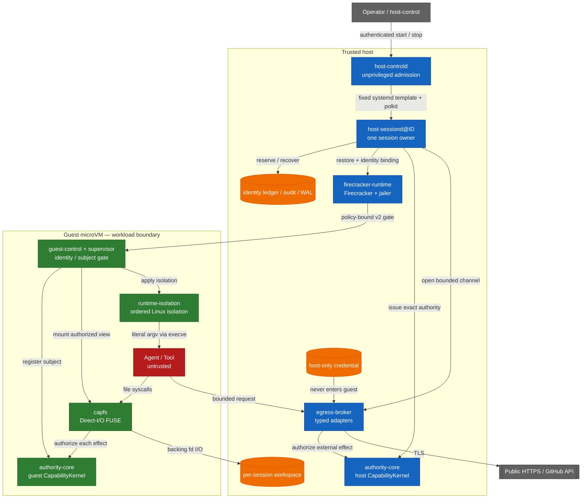

<!-- locale: ja -->
<!-- translation-source: README.md -->

# Capability-based AI Agent Runtime

[English](README.md) · [日本語](README-ja.md) · [简体中文](README-zh-CN.md) · [繁體中文](README-zh-TW.md) · [한국어](README-ko.md) · [Español](README-es.md) · [Français](README-fr.md) · [Deutsch](README-de.md) · [Português (Brasil)](README-pt-BR.md)

[](https://github.com/Aqua-218/SecCamp-AIAgent/actions/workflows/ci.yml)
[](LICENSE)

Linux と Firecracker 上で、Capability 検査、隔離、egress policy、監査、復旧を副作用が発生する地点に維持したまま、untrusted な agent と tool workload を実行します。

> **Status:** これは絶対的な隔離を主張するものではなく、source repository です。この revision では、verification manifest に 38 件の `verified` claim と 3 件の `blocked` claim が記録されています。結果を別の環境の証拠として扱う前に、下の scope 表を読んでください。

<a id="start-here"></a>
## まず読む

| 目的 | 読む場所 |
|---|---|
| hosted smoke test を実行する | [Quick start](#quick-start) |
| trust boundary を理解する | [Architecture and trust boundaries](#architecture-and-trust-boundaries) |
| 検証済み・未検証を確認する | [Verification status](#verification-status) と [`docs/verification-status.yml`](docs/verification-status.yml) |
| production daemon を配置する | [`deploy/README.md`](deploy/README.md) |
| crate をまたぐ設計を読む | [`docs/design/architecture.md`](docs/design/architecture.md) |
| プロジェクト全体の文書を探す | [`docs/README.md`](docs/README.md) / [日本語 docs hub](docs/i18n/ja/README.md) |

<a id="overview"></a>
## 概要

runtime は agent、tools、workload process を untrusted として扱います。公開 HTTPS の fetch と型付き GitHub 操作を含む file operation は、任意の command ではなく closed な data type です。`authority-core` が authorization decision を作り、CapFS と host Egress Broker が filesystem または external effect の直前に enforcement します。

production の実行単位は 1 worker、1 session、1 Firecracker microVM です。非特権の `host-controld` は、authenticated で quota 制限された start/stop request を通して複数の worker を受け入れます。各 `host-sessiond@ID.service` は 1 つの session と、その cleanup record を所有します。現在の trust model は single-host です。multi-host HA、distributed revocation、replicated Broker state は、この repository の保証範囲外です。

<a id="what-the-runtime-enforces"></a>
## runtime が強制すること

- **Typed least privilege:** file effect、HTTP method と path、GitHub operation を closed Rust type と bounded authority envelope で表します。
- **Effect-point authorization:** CapFS は各 filesystem effect を再認可し、host Broker は host `CapabilityKernel` を通して型付き external effect を認可します。
- **Revocation linearization:** authorization read guard は effect の commit point まで保持されます。`revoke` が返った後の commit は、失効した capability またはその descendant だけを根拠にできません。失効前に commit された effect は rollback されません。
- **No guest credentials:** provider credential は host に留まり、guest image に入らず、response にも返しません。
- **No guest network device:** guest に `virtio-net` はなく、egress は bounded `AF_VSOCK` protocol と型付き host adapter を使います。
- **Identity non-reuse:** session、request、workspace、VM、Broker session、subject、capability の identity は durable ledger に記録され、restart 後も暗黙に再利用されません。
- **Bound guest startup:** pinned artifact、dm-verity、paused restore、policy digest に束縛された v2 guest acknowledgement が workload の release を制御します。
- **Fail-closed recovery:** 曖昧な effect は `CommitUnknown` として記録し、partial shutdown と破損した durable record は fail closed で次回起動用の typed recovery state を残します。

<a id="architecture-and-trust-boundaries"></a>
## アーキテクチャと trust boundary

host service、pinned artifact、Firecracker/jailer、host kernel は trusted host boundary の一部です。guest service は guest-side contract を強制し、agent と tool process は untrusted です。図は意図した effect path を示すものであり、VM escape resistance の証明ではありません。



境界を横切る経路は意図的に狭くしています。

| 境界 | 経路 | 主な制約 |
|---|---|---|
| Workload → workspace | CapFS Direct-I/O FUSE | 各 effect の再認可。repository、path、effect が一致する必要があります |
| Workload → supervisor | `SOCK_SEQPACKET` | 4 KiB request bound と kernel-derived `SO_PEERCRED` identity |
| Guest → host | `AF_VSOCK` framed transport | 4-byte length prefix、1 MiB payload bound、canonical CBOR、session/replay/budget check |
| Host → microVM | Firecracker API plus guest-control API | Pinned artifact digest、dm-verity、paused restore、policy-bound v2 ACK |
| Host → external provider | Typed Broker adapter | Public HTTPS または型付き GitHub operation のみ。DNS/IP、redirect、response、deadline policy |

raw guest TCP、任意の host filesystem sharing、guest への credential injection は interface に含まれません。launcher は shell string を解釈せず、image-configured program を literal argv として `execve` で実行します。workload が自分で shell を起動する場合も namespace、cgroup、seccomp、Landlock、read-only rootfs、capability boundary が適用されます。この project は shell parsing を安全にするものではありません。

startup は次の順で resource を commit します。

```text
workspace → Broker → VM → capability → workload
```

shutdown は次の dependency order で進みます。失敗した stage は durable に残り、未完了 stage だけが retry されます。

```text
capability revoke → VM kill → Broker close → workspace isolation → Closed
```

<a id="verification-status"></a>
## 検証ステータス

machine-readable な source of truth は [`docs/verification-status.yml`](docs/verification-status.yml) です。status は scope に束縛された claim であり、あらゆる環境の green-list ではありません。`verified` は宣言された scope で required gate が実行されたことを意味し、`blocked` は利用できない prerequisite または external owner を記録します。この revision の manifest には 38 件の `verified` claim と 3 件の `blocked` claim があり、`unverified` claim はありません。

| Scope | 現在の manifest status | Evidence と境界 |
|---|---|---|
| Hosted | 14 verified | Locked Rust test、Clippy、property test、durable-state test、および claim が対象とする Rust/Lean corpus |
| Privileged Linux | 10 verified, 1 blocked | 実 FUSE、Linux isolation、rollback、supervisor resource、controlled HTTPS fixture。blocked claim は aarch64 privileged architecture runner |
| KVM | 14 verified | Pinned Firecracker guest、dm-verity、guest-control、production `Runtime::launch` / `SessionOwner`、宣言された全 13 CapFS effect、multi-session cleanup gate |
| External | 2 blocked | Live GitHub credential/provider mutation と独立した external review evidence はこの checkout では利用できません |

この結果は VM escape resistance、host-kernel/KVM/Firecracker correctness、physical または microarchitectural side-channel resistance、任意の external-provider behavior を確立しません。crate ごとの verification page に仮定と有限 test の境界を記載しています。

- [`authority-core` verification](docs/authority-core/verification.md)
- [`capfs` verification](docs/capfs/verification.md)
- [`egress-broker` verification](docs/egress-broker/verification.md)
- [`firecracker-runtime` verification](docs/firecracker-runtime/verification.md)
- [`runtime-isolation` verification](docs/runtime-isolation/verification.md)
- [`session-orchestrator` verification](docs/session-orchestrator/verification.md)
- [`supervisor` verification](docs/supervisor/verification.md)

<a id="quick-start"></a>
## クイックスタート

この経路が実行するのは hosted code だけです。service の起動、root、FUSE mount、`/dev/kvm`、provider credential は必要ありません。初回 checkout では Cargo の locked dependency を取得するため network access が必要です。以後の実行では local Cargo cache を使います。

<a id="prerequisites"></a>
### 前提条件

- Linux、Git、`rustup`
- [`rust-toolchain.toml`](rust-toolchain.toml) が選択する Rust `1.93.1`

<a id="run-a-hosted-smoke-test"></a>
### hosted smoke test を実行する

```bash
git clone https://github.com/Aqua-218/SecCamp-AIAgent.git
cd SecCamp-AIAgent

cargo test --locked -p authority-core --all-targets
cargo run --locked -p session-orchestrator --bin host-sessiond -- --help
```

最初の command は authority model と corpus-facing test を実行します。2 番目の command は production daemon が必要とする artifact、snapshot、authority、egress configuration を表示します。`host-sessiond` には不完全な production stack を起動する placeholder mode は意図的にありません。

<a id="development-and-verification"></a>
## 開発と検証

local development と CI は同じ [`scripts/ci/run.sh`](scripts/ci/run.sh) entry point を使います。実行する gate に必要な tool group だけを install してください。tool は repository private な `.ci-tools/` directory に置かれます。

```bash
scripts/ci/install-cargo-tools.sh nextest coverage security public-api
scripts/ci/install-pipeline-tools.sh
scripts/ci/install-lean.sh
```

<a id="standard-hosted-gates"></a>
### 標準 hosted gate

```bash
scripts/ci/run.sh format
scripts/ci/run.sh check
scripts/ci/run.sh clippy
scripts/ci/run.sh docs
scripts/ci/run.sh docs-policy

for shard in 1 2 3 4; do
  scripts/ci/run.sh test "$shard"
done

scripts/ci/run.sh doctest
scripts/ci/run.sh loom
scripts/ci/run.sh lean
scripts/ci/run.sh differential
scripts/ci/run.sh coverage
scripts/ci/run.sh audit
scripts/ci/run.sh deny
scripts/ci/run.sh api-surface
```

coverage gate は workspace line coverage 75% を下限とします。この threshold は CI gate であり、coverage badge でも、privileged または KVM path 全てを実行したという claim でもありません。Miri、sanitizer、mutation test、fuzzing、benchmark の正確な matrix は [`ci/gates.yml`](ci/gates.yml) にあります。

<a id="privileged-and-kvm-gates"></a>
### 特権 Linux と KVM の gate

これらの command には各 script が示す prerequisite が必要です。`/dev/fuse`、`/dev/kvm`、delegated cgroup v2、device-mapper tool、pinned guest artifact が不足することは、成功した skip ではなく verification failure です。

```bash
# Root and delegated cgroup v2
scripts/ci/run.sh privileged-isolation

# Root, /dev/kvm, /dev/vhost-vsock, veritysetup, busybox, and mkfs.ext4
scripts/ci/verify-real-guest-control.sh
scripts/ci/verify-real-session-owner.sh
```

完全な protected-runner contract は専用の [crate verification page](#verification-status) と [`docs/ci-cd.md`](docs/ci-cd.md) を参照してください。

<a id="running-host-sessiond"></a>
## `host-sessiond` の実行

deployable entry point は [`host-sessiond`](crates/session-orchestrator/src/bin/host-sessiond.rs) です。production installation procedure には externally reviewed な full commit と externally authenticated な SHA-256 manifest が必要であり、generic な `cargo install` target ではありません。

```bash
cargo build --release --locked \
  -p session-orchestrator \
  --bin host-sessiond --bin host-controld --bin host-control
```

installation、artifact pinning、system account、systemd/polkit、device access、snapshot、credential handling、recovery については [`deploy/README.md`](deploy/README.md) に従ってください。check-in 済みの example が service contract の source です。

| Artifact | 用途 |
|---|---|
| [`deploy/host-sessiond-worker.env.example`](deploy/host-sessiond-worker.env.example) | multi-session worker environment と pinned artifact field |
| [`deploy/host-sessiond.env.example`](deploy/host-sessiond.env.example) | legacy single-session environment example |
| [`service/host-sessiond@.service`](service/host-sessiond@.service) | session ごとに 1 worker instance |
| [`service/host-sessiond-recover@.service`](service/host-sessiond-recover@.service) | recovery 専用 worker cleanup |
| [`service/host-controld.service`](service/host-controld.service) | 非特権の authenticated controller |
| [`deploy/polkit-1/rules.d/50-host-controld.rules`](deploy/polkit-1/rules.d/50-host-controld.rules) | 狭く限定した start/stop authorization |

example service は `--egress-authority none` を選択し、GitHub token を読みません。Public HTTPS または GitHub は、対応する authority と host-only credential profile を明示的に有効化する必要があります。`EGRESS_GITHUB_TOKEN` は明示的な non-systemd fallback としてだけ残されており、production systemd deployment では deploy guide にある encrypted `github-token` credential を使うべきです。`publish-branch` operation には host-owned expected-old-object plan も必要です。

<a id="workspace-layout"></a>
## workspace の構成

| Path | 責務 |
|---|---|
| [`crates/authority-core/`](crates/authority-core/) | typed authority family、delegation、policy digest、state、revocation、audit、durable audit |
| [`crates/capfs/`](crates/capfs/) | repository preflight、namespace/node table、backing I/O、Direct-I/O FUSE |
| [`crates/egress-protocol/`](crates/egress-protocol/) | bounded frame、canonical CBOR、session/replay identity、budget |
| [`crates/egress-broker/`](crates/egress-broker/) | host vsock transport、public HTTPS policy、typed GitHub adapter、durable dispatch |
| [`crates/firecracker-runtime/`](crates/firecracker-runtime/) | pinned artifact、dm-verity、jailer、snapshot/restore、guest-control transport |
| [`crates/runtime-isolation/`](crates/runtime-isolation/) | ordered Linux namespace、mount、cgroup、Landlock、capability、seccomp transaction |
| [`crates/supervisor/`](crates/supervisor/) | guest subject と handle lifecycle、control socket、CapFS composition |
| [`crates/session-orchestrator/`](crates/session-orchestrator/) | session lifecycle、lease、production adapter、durable recovery、daemon binary |
| [`lean/`](lean/) | Lean 4 (`leanprover/lean4:v4.16.0`) の authority/runtime model と proof corpus executable |
| [`guest/`](guest/) | pinned guest kernel configuration と patch |
| [`ci/`](ci/) | gate manifest、API baseline、benchmark baseline、fixture |
| [`scripts/ci/`](scripts/ci/) | GitHub、GitLab、local が共有する gate implementation |
| [`docs/`](docs/README.md) | design、crate contract、verification boundary、decision、glossary |
| [`deploy/`](deploy/README.md) と [`service/`](service/) | production installation と systemd/polkit artifact |

`authority-core` と `runtime-isolation` は dependency graph の leaf のままです。これにより authorization と isolation contract が higher-level orchestration に依存しません。実際の dependency graph と runtime placement は [`docs/design/architecture.md`](docs/design/architecture.md) に記載しています。

<a id="ci-and-release"></a>
## CI と release

[`ci/gates.yml`](ci/gates.yml) は pipeline topology の single source of truth です。現在は validation、quality、test、analysis、security、protected system verification にまたがる 53 個の implemented gate を宣言しています。4 つの順序付き release stage（`package`、`verify`、`publish`、`record`）は別に追跡されます。GitHub Actions と GitLab CI は manifest が所有する同じ gate を実装し、job の欠落または予期しない job があれば parity と result reconciliation は fail closed になります。

deep workflow は scheduled または手動 dispatch です。通常の pull-request runner には実 FUSE、KVM、device-mapper、systemd、external-provider fixture がないためです。external-provider gate は opt-in であり、この checkout では protected credential と disposable provider owner がないため blocked のままです。

release automation は semantic-version tag に限定されています。reproducible な `authority-corpus` Linux binary に license text、build metadata、SPDX SBOM、checksum、platform-specific provenance/signature record を付けて package します。この repository は version badge を publish しません。workspace version は [`Cargo.toml`](Cargo.toml) と release workflow が authoritative input です。

runner contract、branch protection、release recovery、signature handling は [`docs/ci-cd.md`](docs/ci-cd.md) を参照してください。

<a id="documentation"></a>
## ドキュメント

[`docs/README.md`](docs/README.md) が documentation index です。特に有用な入口は次のとおりです。

| Topic | Document |
|---|---|
| crate をまたぐ architecture | [`docs/design/architecture.md`](docs/design/architecture.md) |
| threat model と non-goal | [`docs/design/threat-model.md`](docs/design/threat-model.md) |
| Capability、isolation、egress design | [`docs/design/README.md`](docs/design/README.md) |
| verification strategy | [`docs/design/verification.md`](docs/design/verification.md) |
| machine-readable verification claim | [`docs/verification-status.yml`](docs/verification-status.yml) |
| decision record | [`docs/decisions/README.md`](docs/decisions/README.md) |
| deployment と recovery | [`deploy/README.md`](deploy/README.md) |
| CI/CD operations | [`docs/ci-cd.md`](docs/ci-cd.md) |
| terminology | [`docs/glossary.md`](docs/glossary.md) |

各 crate の README と verification page は、implementation、hosted test、privileged test、KVM evidence、external-provider gap を分けて記載しています。一つの subsystem だけに変更が及ぶ場合は、[workspace layout](#workspace-layout) の該当 crate から読み始めてください。

<a id="license"></a>
## ライセンス

Copyright © 2026 Aqua-218.

この project は [GNU Affero General Public License v3.0 only](LICENSE)（`AGPL-3.0-only`）で公開されています。利用、改変、再配布、network service deployment に適用される条件は license 本文を確認してください。

<a id="related"></a>
## 関連

- [Documentation index](docs/README.md)
- [Architecture](docs/design/architecture.md)
- [Threat model](docs/design/threat-model.md)
- [Verification strategy](docs/design/verification.md)
- [Deployment guide](deploy/README.md)
- [CI/CD operations](docs/ci-cd.md)
