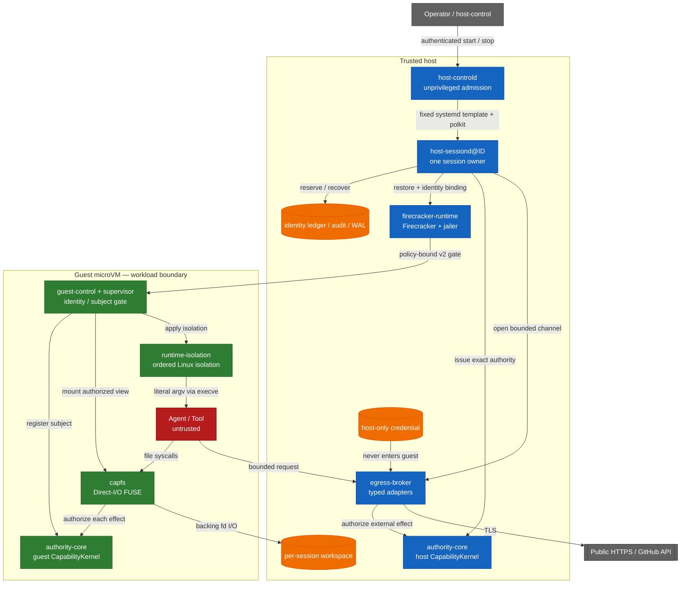

<!-- locale: ko -->
<!-- translation-source: README.md -->

# Capability-based AI Agent Runtime

[English](README.md) · [日本語](README-ja.md) · [简体中文](README-zh-CN.md) · [繁體中文](README-zh-TW.md) · [한국어](README-ko.md) · [Español](README-es.md) · [Français](README-fr.md) · [Deutsch](README-de.md) · [Português (Brasil)](README-pt-BR.md)

[](https://github.com/Aqua-218/SecCamp-AIAgent/actions/workflows/ci.yml)
[](LICENSE)

Linux와 Firecracker에서 신뢰하지 않는 agent 및 tool workload를 실행하면서, capability 검사, 격리, egress policy, 감사 및 복구를 부작용이 발생하는 지점에 유지합니다.

> **Status:** 이 저장소는 절대적인 격리를 주장하는 source repository가 아닙니다. 이 revision의 verification manifest에는 38개의 `verified` claim과 3개의 `blocked` claim이 기록되어 있습니다. 어떤 결과를 다른 환경의 증거로 보기 전에 아래 scope 표를 확인하세요.

<a id="start-here"></a>
## 먼저 읽기

| 목적 | 읽을 곳 |
|---|---|
| hosted smoke test 실행 | [Quick start](#quick-start) |
| trust boundary 이해 | [Architecture and trust boundaries](#architecture-and-trust-boundaries) |
| 검증된 범위와 검증되지 않은 범위 확인 | [Verification status](#verification-status) 및 [`docs/verification-status.yml`](docs/verification-status.yml) |
| production daemon 배포 | [`deploy/README.md`](deploy/README.md) |
| crate를 가로지르는 설계 읽기 | [`docs/design/architecture.md`](docs/design/architecture.md) |
| 프로젝트의 모든 문서 탐색 | [`docs/README.md`](docs/README.md) / [한국어 docs hub](docs/i18n/ko/README.md) |

<a id="overview"></a>
## 개요

runtime은 agent, tools 및 workload process를 untrusted로 취급합니다. 파일 조작, public HTTPS fetch 및 typed GitHub operation은 임의의 command가 아니라 closed data type입니다. `authority-core`가 authorization decision을 만들고, CapFS와 host Egress Broker가 filesystem 또는 external effect 직전에 이를 적용합니다.

production 실행 단위는 worker 하나, session 하나, Firecracker microVM 하나입니다. 비특권 `host-controld`는 인증되고 quota가 제한된 start/stop request를 통해 여러 worker를 허용합니다. 각 `host-sessiond@ID.service`는 하나의 session과 그 cleanup record를 소유합니다. 현재 trust model은 single-host입니다. multi-host HA, distributed revocation 및 replicated Broker state는 repository의 보장 범위 밖입니다.

<a id="what-the-runtime-enforces"></a>
## runtime이 강제하는 것

- **Typed least privilege:** file effect, HTTP method와 path, GitHub operation을 closed Rust type과 bounded authority envelope로 표현합니다.
- **Effect-point authorization:** CapFS는 각 filesystem effect를 다시 인증하고, host Broker는 host `CapabilityKernel`을 통해 typed external effect를 인증합니다.
- **Revocation linearization:** authorization read guard는 effect의 commit point까지 유지됩니다. `revoke`가 반환된 뒤의 commit은 revoke된 capability 또는 그 descendant만을 근거로 할 수 없습니다. revoke 전에 commit된 effect는 rollback되지 않습니다.
- **No guest credentials:** provider credential은 host에 남으며 guest image에 넣거나 response로 반환하지 않습니다.
- **No guest network device:** guest에는 `virtio-net`이 없고, egress는 bounded `AF_VSOCK` protocol과 typed host adapter를 사용합니다.
- **Identity non-reuse:** session, request, workspace, VM, Broker session, subject 및 capability identity를 durable ledger에 기록하며 restart 뒤 조용히 재사용하지 않습니다.
- **Bound guest startup:** pinned artifact, dm-verity, paused restore 및 policy digest에 bound된 v2 guest acknowledgement가 workload release를 제어합니다.
- **Fail-closed recovery:** 모호한 effect는 `CommitUnknown`으로 기록합니다. partial shutdown과 손상된 durable record는 fail closed로 처리하고 다음 시작을 위한 typed recovery state를 남깁니다.

<a id="architecture-and-trust-boundaries"></a>
## 아키텍처와 trust boundary

host service, pinned artifact, Firecracker/jailer 및 host kernel은 trusted host boundary의 일부입니다. guest service는 guest-side contract를 강제하고 agent와 tool process는 untrusted입니다. 다이어그램은 의도한 effect path를 보여 주며 VM escape resistance의 증명은 아닙니다.



경계를 가로지르는 경로는 의도적으로 좁게 유지됩니다.

| Boundary | Path | Important limits |
|---|---|---|
| Workload → workspace | CapFS Direct-I/O FUSE | 각 effect를 다시 인증하며 repository, path 및 effect가 일치해야 합니다 |
| Workload → supervisor | `SOCK_SEQPACKET` | 4 KiB request bound와 kernel에서 유도한 `SO_PEERCRED` identity |
| Guest → host | `AF_VSOCK` framed transport | 4-byte length prefix, 1 MiB payload bound, canonical CBOR, session/replay/budget checks |
| Host → microVM | Firecracker API plus guest-control API | Pinned artifact digests, dm-verity, paused restore, policy-bound v2 ACKs |
| Host → external provider | Typed Broker adapter | public HTTPS 또는 typed GitHub operation만 허용하며 DNS/IP, redirect, response 및 deadline policy를 적용합니다 |

raw guest TCP, 임의의 host filesystem sharing 및 guest credential injection은 interface에 포함되지 않습니다. launcher는 shell string을 해석하지 않고 `execve`를 통해 image-configured program을 literal argv로 실행합니다. workload가 직접 shell을 시작해도 namespace, cgroup, seccomp, Landlock, read-only rootfs 및 capability boundary는 적용됩니다. 이 project는 shell parsing을 안전하게 만든다고 주장하지 않습니다.

startup은 다음 순서로 resource를 commit합니다.

```text
workspace → Broker → VM → capability → workload
```

shutdown은 아래 dependency order로 진행됩니다. 실패한 stage는 durable하게 남고 완료되지 않은 stage만 retry합니다.

```text
capability revoke → VM kill → Broker close → workspace isolation → Closed
```

<a id="verification-status"></a>
## 검증 상태

machine-readable source of truth는 [`docs/verification-status.yml`](docs/verification-status.yml)입니다. status는 scope가 지정된 claim이며 가능한 모든 환경의 green-list가 아닙니다. `verified`는 선언된 scope에서 required gate가 실행되었음을 뜻하고, `blocked`는 사용할 수 없는 prerequisite 또는 external owner를 기록합니다. 이 revision의 manifest에는 38개의 `verified` claim과 3개의 `blocked` claim이 있으며 `unverified` claim은 없습니다.

| Scope | Current manifest status | Evidence and boundary |
|---|---|---|
| Hosted | 14 verified | Locked Rust tests, Clippy, property tests, durable-state tests 및 claim에 포함된 Rust/Lean corpus |
| Privileged Linux | 10 verified, 1 blocked | Real FUSE, Linux isolation, rollback, supervisor resources 및 controlled HTTPS fixtures; blocked claim은 aarch64 privileged architecture runner입니다 |
| KVM | 14 verified | Pinned Firecracker guest, dm-verity, guest-control, production `Runtime::launch` / `SessionOwner`, 선언된 13개 CapFS effect 전부 및 multi-session cleanup gates |
| External | 2 blocked | Live GitHub credential/provider mutation과 독립적인 external review evidence를 이 checkout에서는 사용할 수 없습니다 |

이 결과는 VM escape resistance, host-kernel/KVM/Firecracker correctness, physical 또는 microarchitectural side-channel resistance, 임의의 external-provider behavior를 확립하지 않습니다. 각 crate의 verification page에 가정과 finite-test boundary가 정리되어 있습니다.

- [`authority-core` verification](docs/authority-core/verification.md)
- [`capfs` verification](docs/capfs/verification.md)
- [`egress-broker` verification](docs/egress-broker/verification.md)
- [`firecracker-runtime` verification](docs/firecracker-runtime/verification.md)
- [`runtime-isolation` verification](docs/runtime-isolation/verification.md)
- [`session-orchestrator` verification](docs/session-orchestrator/verification.md)
- [`supervisor` verification](docs/supervisor/verification.md)

<a id="quick-start"></a>
## 빠른 시작

이 경로는 hosted code만 실행합니다. service를 시작하지 않고, root를 요구하지 않으며, FUSE를 mount하지 않고, `/dev/kvm`이 필요하지 않으며, provider credential을 읽지 않습니다. 최초 checkout에서는 Cargo의 locked dependency를 가져오기 위한 network access가 필요하고 이후 실행은 local Cargo cache를 사용합니다.

<a id="prerequisites"></a>
### 사전 요구 사항

- Linux, Git 및 `rustup`
- [`rust-toolchain.toml`](rust-toolchain.toml)이 선택하는 Rust `1.93.1`

<a id="run-a-hosted-smoke-test"></a>
### hosted smoke test 실행

```bash
git clone https://github.com/Aqua-218/SecCamp-AIAgent.git
cd SecCamp-AIAgent

cargo test --locked -p authority-core --all-targets
cargo run --locked -p session-orchestrator --bin host-sessiond -- --help
```

첫 번째 command는 authority model과 corpus-facing tests를 실행합니다. 두 번째 command는 production daemon에 필요한 artifact, snapshot, authority 및 egress configuration을 출력합니다. `host-sessiond`에는 불완전한 production stack을 시작하는 placeholder mode가 의도적으로 없습니다.

<a id="development-and-verification"></a>
## 개발 및 검증

local development와 CI는 동일한 [`scripts/ci/run.sh`](scripts/ci/run.sh) entry point를 사용합니다. 실행할 gate에 필요한 tool group만 설치하세요. tool은 repository의 private `.ci-tools/` directory 아래에 배치됩니다.

```bash
scripts/ci/install-cargo-tools.sh nextest coverage security public-api
scripts/ci/install-pipeline-tools.sh
scripts/ci/install-lean.sh
```

<a id="standard-hosted-gates"></a>
### 표준 hosted gates

```bash
scripts/ci/run.sh format
scripts/ci/run.sh check
scripts/ci/run.sh clippy
scripts/ci/run.sh docs
scripts/ci/run.sh docs-policy

for shard in 1 2 3 4; do
  scripts/ci/run.sh test "$shard"
done

scripts/ci/run.sh doctest
scripts/ci/run.sh loom
scripts/ci/run.sh lean
scripts/ci/run.sh differential
scripts/ci/run.sh coverage
scripts/ci/run.sh audit
scripts/ci/run.sh deny
scripts/ci/run.sh api-surface
```

coverage gate는 workspace line coverage 75%를 하한으로 사용합니다. 이 threshold는 CI gate이며 coverage badge도, 모든 privileged 또는 KVM path를 실행했다는 claim도 아닙니다. Miri, sanitizers, mutation testing, fuzzing 및 benchmarks의 정확한 matrix는 [`ci/gates.yml`](ci/gates.yml)에 있습니다.

<a id="privileged-and-kvm-gates"></a>
### 특권 Linux 및 KVM gates

이 command들은 각 script에 명시된 prerequisite가 필요합니다. `/dev/fuse`, `/dev/kvm`, delegated cgroup v2, device-mapper tools 또는 pinned guest artifacts가 없으면 성공한 skip이 아니라 verification failure입니다.

```bash
# Root and delegated cgroup v2
scripts/ci/run.sh privileged-isolation

# Root, /dev/kvm, /dev/vhost-vsock, veritysetup, busybox, and mkfs.ext4
scripts/ci/verify-real-guest-control.sh
scripts/ci/verify-real-session-owner.sh
```

전체 protected-runner contract는 전용 [crate verification pages](#verification-status)와 [`docs/ci-cd.md`](docs/ci-cd.md)를 참조하세요.

<a id="running-host-sessiond"></a>
## `host-sessiond` 실행

배포 가능한 entry point는 [`host-sessiond`](crates/session-orchestrator/src/bin/host-sessiond.rs)입니다. production installation procedure에는 externally reviewed full commit과 externally authenticated SHA-256 manifest가 필요하며 일반적인 `cargo install` target이 아닙니다.

```bash
cargo build --release --locked \
  -p session-orchestrator \
  --bin host-sessiond --bin host-controld --bin host-control
```

설치, artifact pinning, system account, systemd/polkit, device access, snapshot, credential handling 및 recovery는 [`deploy/README.md`](deploy/README.md)를 따르세요. check-in된 example이 service contract의 source입니다.

| Artifact | Purpose |
|---|---|
| [`deploy/host-sessiond-worker.env.example`](deploy/host-sessiond-worker.env.example) | Multi-session worker environment 및 pinned artifact fields |
| [`deploy/host-sessiond.env.example`](deploy/host-sessiond.env.example) | Legacy single-session environment example |
| [`service/host-sessiond@.service`](service/host-sessiond@.service) | session마다 worker instance 하나 |
| [`service/host-sessiond-recover@.service`](service/host-sessiond-recover@.service) | Recovery-only worker cleanup |
| [`service/host-controld.service`](service/host-controld.service) | Unprivileged authenticated controller |
| [`deploy/polkit-1/rules.d/50-host-controld.rules`](deploy/polkit-1/rules.d/50-host-controld.rules) | Narrow start/stop authorization |

example service는 `--egress-authority none`을 선택하고 GitHub token을 읽지 않습니다. Public HTTPS나 GitHub는 해당 authority와 host-only credential profile을 명시적으로 활성화해야 합니다. `EGRESS_GITHUB_TOKEN`은 명시적인 non-systemd fallback으로만 유지되며 production systemd deployment에서는 deploy guide에 설명된 encrypted `github-token` credential을 사용해야 합니다. `publish-branch` operation에는 host-owned expected-old-object plan도 필요합니다.

<a id="workspace-layout"></a>
## workspace 구성

| Path | Responsibility |
|---|---|
| [`crates/authority-core/`](crates/authority-core/) | Typed authority families, delegation, policy digests, state, revocation, audit 및 durable audit |
| [`crates/capfs/`](crates/capfs/) | Repository preflight, namespace/node tables, backing I/O 및 Direct-I/O FUSE |
| [`crates/egress-protocol/`](crates/egress-protocol/) | Bounded frames, canonical CBOR, session/replay identity 및 budgets |
| [`crates/egress-broker/`](crates/egress-broker/) | Host vsock transport, public HTTPS policy, typed GitHub adapter 및 durable dispatch |
| [`crates/firecracker-runtime/`](crates/firecracker-runtime/) | Pinned artifacts, dm-verity, jailer, snapshot/restore 및 guest-control transport |
| [`crates/runtime-isolation/`](crates/runtime-isolation/) | Ordered Linux namespace, mount, cgroup, Landlock, capability 및 seccomp transaction |
| [`crates/supervisor/`](crates/supervisor/) | Guest subject와 handle lifecycle, control socket 및 CapFS composition |
| [`crates/session-orchestrator/`](crates/session-orchestrator/) | Session lifecycle, leases, production adapters, durable recovery 및 daemon binaries |
| [`lean/`](lean/) | Lean 4 (`leanprover/lean4:v4.16.0`) authority/runtime model 및 proof corpus executables |
| [`guest/`](guest/) | Pinned guest kernel configuration 및 patch |
| [`ci/`](ci/) | Gate manifest, API baselines, benchmark baseline 및 fixtures |
| [`scripts/ci/`](scripts/ci/) | Shared GitHub, GitLab 및 local gate implementations |
| [`docs/`](docs/README.md) | Design, crate contracts, verification boundaries, decisions 및 glossary |
| [`deploy/`](deploy/README.md) 및 [`service/`](service/) | Production installation 및 systemd/polkit artifacts |

`authority-core`와 `runtime-isolation`은 dependency graph의 leaves로 남아 있으므로 authorization 및 isolation contracts가 higher-level orchestration에 의존하지 않습니다. 실제 dependency graph와 runtime placement는 [`docs/design/architecture.md`](docs/design/architecture.md)에 문서화되어 있습니다.

<a id="ci-and-release"></a>
## CI 및 release

[`ci/gates.yml`](ci/gates.yml)은 pipeline topology의 single source of truth입니다. 현재 validation, quality, tests, analysis, security 및 protected system verification에 걸쳐 53개의 implemented gates를 선언합니다. 네 개의 순서가 있는 release stage(`package`, `verify`, `publish`, `record`)는 별도로 추적합니다. GitHub Actions와 GitLab CI는 동일한 manifest-owned gates를 구현해야 하며, job이 누락되거나 예상 밖이면 parity와 result reconciliation이 fail closed됩니다.

deep workflow는 일반 pull-request runner에서 real FUSE, KVM, device-mapper, systemd 및 external-provider fixtures를 사용할 수 없기 때문에 schedule 또는 수동 dispatch로 실행합니다. external-provider gate는 opt-in이며 이 checkout에서는 protected credential과 disposable provider owner가 없어 계속 blocked입니다.

release automation은 semantic-version tag로 제한됩니다. 재현 가능한 `authority-corpus` Linux binary에 license text, build metadata, SPDX SBOM, checksum 및 platform-specific provenance/signature record를 함께 package합니다. 이 repository는 version badge를 publish하지 않습니다. workspace version과 [`Cargo.toml`](Cargo.toml), release workflow가 authoritative inputs입니다.

runner contract, branch protection, release recovery 및 signature handling은 [`docs/ci-cd.md`](docs/ci-cd.md)를 참조하세요.

<a id="documentation"></a>
## 문서

[`docs/README.md`](docs/README.md)가 documentation index입니다. 가장 유용한 시작점은 다음과 같습니다.

| Topic | Document |
|---|---|
| Cross-crate architecture | [`docs/design/architecture.md`](docs/design/architecture.md) |
| Threat model과 non-goals | [`docs/design/threat-model.md`](docs/design/threat-model.md) |
| Capability, isolation 및 egress design | [`docs/design/README.md`](docs/design/README.md) |
| Verification strategy | [`docs/design/verification.md`](docs/design/verification.md) |
| Machine-readable verification claims | [`docs/verification-status.yml`](docs/verification-status.yml) |
| Decision records | [`docs/decisions/README.md`](docs/decisions/README.md) |
| Deployment 및 recovery | [`deploy/README.md`](deploy/README.md) |
| CI/CD operations | [`docs/ci-cd.md`](docs/ci-cd.md) |
| Terminology | [`docs/glossary.md`](docs/glossary.md) |

각 crate의 README와 verification page는 implementation, hosted tests, privileged tests, KVM evidence 및 external-provider gaps를 구분합니다. 하나의 subsystem만 변경한다면 [workspace layout](#workspace-layout)의 해당 crate부터 읽으세요.

<a id="license"></a>
## 라이선스

Copyright © 2026 Aqua-218.

이 프로젝트는 [GNU Affero General Public License v3.0 only](LICENSE)(`AGPL-3.0-only`)에 따라 배포됩니다. 사용, 수정, 재배포 및 network service deployment에 적용되는 조건은 license 본문을 확인하세요.

<a id="related"></a>
## 관련 문서

- [Documentation index](docs/README.md)
- [Architecture](docs/design/architecture.md)
- [Threat model](docs/design/threat-model.md)
- [Verification strategy](docs/design/verification.md)
- [Deployment guide](deploy/README.md)
- [CI/CD operations](docs/ci-cd.md)
