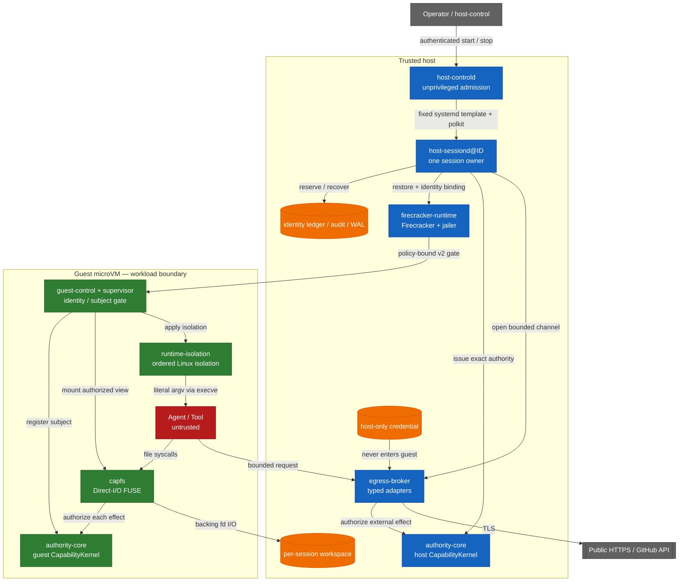

<!-- locale: pt-BR -->
<!-- translation-source: README.md -->

# Capability-based AI Agent Runtime

[English](README.md) · [日本語](README-ja.md) · [简体中文](README-zh-CN.md) · [繁體中文](README-zh-TW.md) · [한국어](README-ko.md) · [Español](README-es.md) · [Français](README-fr.md) · [Deutsch](README-de.md) · [Português (Brasil)](README-pt-BR.md)

[](https://github.com/Aqua-218/SecCamp-AIAgent/actions/workflows/ci.yml)
[](LICENSE)

Executa workloads de agent e tool não confiáveis no Linux e no Firecracker, mantendo verificações de capability, isolamento, egress policy, auditoria e recuperação nos pontos em que os efeitos colaterais ocorrem.

> **Status:** Este é um source repository, não uma alegação de isolamento absoluto. Nesta revisão, o verification manifest registra 38 claims `verified` e 3 claims `blocked`. Leia a tabela de scope antes de tratar qualquer resultado como evidência para outro ambiente.

<a id="start-here"></a>
## Comece aqui

| Objetivo | Leia |
|---|---|
| Executar um hosted smoke test | [Quick start](#quick-start) |
| Entender o trust boundary | [Architecture and trust boundaries](#architecture-and-trust-boundaries) |
| Conferir o que está e o que não está verificado | [Verification status](#verification-status) e [`docs/verification-status.yml`](docs/verification-status.yml) |
| Fazer deploy do production daemon | [`deploy/README.md`](deploy/README.md) |
| Ler o design entre crates | [`docs/design/architecture.md`](docs/design/architecture.md) |
| Navegar por toda a documentação do projeto | [`docs/README.md`](docs/README.md) / [hub docs em português](docs/i18n/pt-BR/README.md) |

<a id="overview"></a>
## Visão geral

O runtime trata o agent, as tools e os workload processes como untrusted. Operações de arquivos, public HTTPS fetches e operações tipadas do GitHub são closed data types, não commands arbitrários. `authority-core` produz a authorization decision; CapFS e o host Egress Broker a aplicam imediatamente antes de filesystem ou external effects.

A unidade de produção é um worker, uma session e uma Firecracker microVM. O `host-controld` sem privilégios admite múltiplos workers por meio de requests start/stop autenticadas e limitadas por quota. Cada `host-sessiond@ID.service` possui uma session e seus cleanup records. O trust model atual é single-host: multi-host HA, distributed revocation e replicated Broker state estão fora da garantia do repository.

<a id="what-the-runtime-enforces"></a>
## O que o runtime impõe

- **Typed least privilege:** file effects, HTTP methods e paths e GitHub operations são representados por closed Rust types e bounded authority envelopes.
- **Effect-point authorization:** CapFS reautoriza cada filesystem effect; o host Broker autoriza external effects tipados por meio do host `CapabilityKernel`.
- **Revocation linearization:** o authorization read guard permanece mantido até o commit point do effect. Depois que `revoke` retorna, um commit posterior não pode depender apenas da capability revogada ou de um de seus descendants. Effects commitados antes da revogação não são rollback.
- **No guest credentials:** as credenciais do provider ficam no host, nunca entram no guest image e não são devolvidas em uma response.
- **No guest network device:** o guest não tem `virtio-net`; o egress usa um bounded `AF_VSOCK` protocol e typed host adapters.
- **Identity non-reuse:** as identities de session, request, workspace, VM, Broker session, subject e capability são registradas em durable ledgers e não são reutilizadas silenciosamente após um restart.
- **Bound guest startup:** pinned artifacts, dm-verity, paused restore e v2 guest acknowledgements vinculados ao policy digest controlam a liberação do workload.
- **Fail-closed recovery:** effects ambíguos são registrados como `CommitUnknown`; partial shutdown e durable records danificados falham closed e deixam typed recovery state para o próximo start.

<a id="architecture-and-trust-boundaries"></a>
## Arquitetura e trust boundaries

Os host services, pinned artifacts, Firecracker/jailer e o host kernel fazem parte do trusted host boundary. Os guest services impõem os guest-side contracts; os processos de agent e tool são untrusted. O diagrama mostra os caminhos de effects pretendidos, não uma prova de VM escape resistance.



Os caminhos que atravessam os limites são intencionalmente estreitos.

| Boundary | Path | Important limits |
|---|---|---|
| Workload → workspace | CapFS Direct-I/O FUSE | Reautorização para cada effect; repository, path e effect devem corresponder |
| Workload → supervisor | `SOCK_SEQPACKET` | Limite de 4 KiB por request e identity `SO_PEERCRED` derivada pelo kernel |
| Guest → host | `AF_VSOCK` framed transport | Prefixo de tamanho de 4 bytes, limite de payload de 1 MiB, canonical CBOR e verificações de session/replay/budget |
| Host → microVM | Firecracker API plus guest-control API | Pinned artifact digests, dm-verity, paused restore e policy-bound v2 ACKs |
| Host → external provider | Typed Broker adapter | Apenas public HTTPS ou typed GitHub operations; policies de DNS/IP, redirect, response e deadline |

Raw guest TCP, arbitrary host filesystem sharing e guest credential injection não fazem parte da interface. O launcher não interpreta shell strings: executa o image-configured program com literal argv via `execve`. Se o workload iniciar um shell por conta própria, os limites de namespace, cgroup, seccomp, Landlock, read-only rootfs e capability continuam valendo; este projeto não afirma tornar shell parsing seguro.

O startup faz commit dos resources nesta ordem:

```text
workspace → Broker → VM → capability → workload
```

O shutdown segue o dependency order abaixo. Um stage que falha permanece durable e somente os stages inacabados são retry:

```text
capability revoke → VM kill → Broker close → workspace isolation → Closed
```

<a id="verification-status"></a>
## Status da verificação

A source of truth machine-readable é [`docs/verification-status.yml`](docs/verification-status.yml). Os statuses são claims limitados por scope, não uma green-list de todos os ambientes possíveis. `verified` significa que o required gate foi executado no scope declarado; `blocked` registra um prerequisite ou external owner indisponível. Nesta revisão, o manifest contém 38 claims `verified` e 3 `blocked`, sem claims `unverified`.

| Scope | Current manifest status | Evidence and boundary |
|---|---|---|
| Hosted | 14 verified | Locked Rust tests, Clippy, property tests, durable-state tests e o Rust/Lean corpus quando declarado pelo claim |
| Privileged Linux | 10 verified, 1 blocked | Real FUSE, Linux isolation, rollback, supervisor resources e controlled HTTPS fixtures; o blocked claim é o aarch64 privileged architecture runner |
| KVM | 14 verified | Pinned Firecracker guest, dm-verity, guest-control, production `Runtime::launch` / `SessionOwner`, todos os 13 CapFS effects declarados e multi-session cleanup gates |
| External | 2 blocked | Live GitHub credential/provider mutation e a evidência de independent external review não estão disponíveis neste checkout |

Esses resultados não estabelecem VM escape resistance, host-kernel/KVM/Firecracker correctness, resistência a side channels físicos ou microarquiteturais, nem arbitrary external-provider behavior. As verification pages de cada crate listam as premissas e os limites de finite tests:

- [`authority-core` verification](docs/authority-core/verification.md)
- [`capfs` verification](docs/capfs/verification.md)
- [`egress-broker` verification](docs/egress-broker/verification.md)
- [`firecracker-runtime` verification](docs/firecracker-runtime/verification.md)
- [`runtime-isolation` verification](docs/runtime-isolation/verification.md)
- [`session-orchestrator` verification](docs/session-orchestrator/verification.md)
- [`supervisor` verification](docs/supervisor/verification.md)

<a id="quick-start"></a>
## Início rápido

Este caminho executa apenas hosted code. Ele não inicia um service, não requer root, não monta FUSE, não precisa de `/dev/kvm` e não lê provider credentials. O primeiro checkout precisa de network access para as locked dependencies do Cargo; execuções posteriores usam o Cargo cache local.

<a id="prerequisites"></a>
### Pré-requisitos

- Linux, Git e `rustup`
- Rust `1.93.1`, selecionado por [`rust-toolchain.toml`](rust-toolchain.toml)

<a id="run-a-hosted-smoke-test"></a>
### Executar um hosted smoke test

```bash
git clone https://github.com/Aqua-218/SecCamp-AIAgent.git
cd SecCamp-AIAgent

cargo test --locked -p authority-core --all-targets
cargo run --locked -p session-orchestrator --bin host-sessiond -- --help
```

O primeiro command executa o authority model e seus corpus-facing tests. O segundo command imprime a configuração de artifact, snapshot, authority e egress exigida pelo production daemon; `host-sessiond` intencionalmente não tem um placeholder mode que inicie um production stack incompleto.

<a id="development-and-verification"></a>
## Desenvolvimento e verificação

O desenvolvimento local e o CI usam o mesmo entry point [`scripts/ci/run.sh`](scripts/ci/run.sh). Instale apenas os tool groups necessários aos gates que pretende executar; as tools ficam no `.ci-tools/` privado do repository.

```bash
scripts/ci/install-cargo-tools.sh nextest coverage security public-api
scripts/ci/install-pipeline-tools.sh
scripts/ci/install-lean.sh
```

<a id="standard-hosted-gates"></a>
### Gates hosted padrão

```bash
scripts/ci/run.sh format
scripts/ci/run.sh check
scripts/ci/run.sh clippy
scripts/ci/run.sh docs
scripts/ci/run.sh docs-policy

for shard in 1 2 3 4; do
  scripts/ci/run.sh test "$shard"
done

scripts/ci/run.sh doctest
scripts/ci/run.sh loom
scripts/ci/run.sh lean
scripts/ci/run.sh differential
scripts/ci/run.sh coverage
scripts/ci/run.sh audit
scripts/ci/run.sh deny
scripts/ci/run.sh api-surface
```

O coverage gate usa um piso de line coverage do workspace de 75%. Esse threshold é um CI gate, não um coverage badge nem uma alegação de que todos os paths privileged ou KVM foram exercitados. A matrix exata para Miri, sanitizers, mutation testing, fuzzing e benchmarks está em [`ci/gates.yml`](ci/gates.yml).

<a id="privileged-and-kvm-gates"></a>
### Gates privilegiados e KVM

Esses commands precisam dos prerequisites indicados pelos respectivos scripts. A ausência de `/dev/fuse`, `/dev/kvm`, delegated cgroup v2, device-mapper tools ou pinned guest artifacts é uma verification failure, não um skip bem-sucedido.

```bash
# Root and delegated cgroup v2
scripts/ci/run.sh privileged-isolation

# Root, /dev/kvm, /dev/vhost-vsock, veritysetup, busybox, and mkfs.ext4
scripts/ci/verify-real-guest-control.sh
scripts/ci/verify-real-session-owner.sh
```

Consulte as [crate verification pages](#verification-status) e [`docs/ci-cd.md`](docs/ci-cd.md) para o protected-runner contract completo.

<a id="running-host-sessiond"></a>
## Executar `host-sessiond`

O entry point implantável é [`host-sessiond`](crates/session-orchestrator/src/bin/host-sessiond.rs). O production installation procedure exige um full commit externally reviewed e um manifest SHA-256 externally authenticated; não é um target genérico de `cargo install`.

```bash
cargo build --release --locked \
  -p session-orchestrator \
  --bin host-sessiond --bin host-controld --bin host-control
```

Para installation, artifact pinning, system accounts, systemd/polkit, device access, snapshots, credential handling e recovery, siga [`deploy/README.md`](deploy/README.md). Os examples versionados são a source do service contract.

| Artifact | Purpose |
|---|---|
| [`deploy/host-sessiond-worker.env.example`](deploy/host-sessiond-worker.env.example) | Multi-session worker environment e pinned artifact fields |
| [`deploy/host-sessiond.env.example`](deploy/host-sessiond.env.example) | Legacy single-session environment example |
| [`service/host-sessiond@.service`](service/host-sessiond@.service) | Uma worker instance por session |
| [`service/host-sessiond-recover@.service`](service/host-sessiond-recover@.service) | Recovery-only worker cleanup |
| [`service/host-controld.service`](service/host-controld.service) | Unprivileged authenticated controller |
| [`deploy/polkit-1/rules.d/50-host-controld.rules`](deploy/polkit-1/rules.d/50-host-controld.rules) | Narrow start/stop authorization |

O example service seleciona `--egress-authority none` e não lê o GitHub token. Public HTTPS ou GitHub devem ser habilitados explicitamente com a authority e o host-only credential profile correspondentes. `EGRESS_GITHUB_TOKEN` permanece apenas como non-systemd fallback explícito; production systemd deployments devem usar a credential encrypted `github-token` descrita no deploy guide. A operation `publish-branch` também requer um expected-old-object plan mantido pelo host.

<a id="workspace-layout"></a>
## Layout do workspace

| Path | Responsibility |
|---|---|
| [`crates/authority-core/`](crates/authority-core/) | Typed authority families, delegation, policy digests, state, revocation, audit e durable audit |
| [`crates/capfs/`](crates/capfs/) | Repository preflight, namespace/node tables, backing I/O e Direct-I/O FUSE |
| [`crates/egress-protocol/`](crates/egress-protocol/) | Bounded frames, canonical CBOR, session/replay identity e budgets |
| [`crates/egress-broker/`](crates/egress-broker/) | Host vsock transport, public HTTPS policy, typed GitHub adapter e durable dispatch |
| [`crates/firecracker-runtime/`](crates/firecracker-runtime/) | Pinned artifacts, dm-verity, jailer, snapshot/restore e guest-control transport |
| [`crates/runtime-isolation/`](crates/runtime-isolation/) | Ordered Linux namespace, mount, cgroup, Landlock, capability e seccomp transaction |
| [`crates/supervisor/`](crates/supervisor/) | Guest subject e handle lifecycle, control socket e CapFS composition |
| [`crates/session-orchestrator/`](crates/session-orchestrator/) | Session lifecycle, leases, production adapters, durable recovery e daemon binaries |
| [`lean/`](lean/) | Lean 4 (`leanprover/lean4:v4.16.0`) authority/runtime model e proof corpus executables |
| [`guest/`](guest/) | Pinned guest kernel configuration e patch |
| [`ci/`](ci/) | Gate manifest, API baselines, benchmark baseline e fixtures |
| [`scripts/ci/`](scripts/ci/) | Shared GitHub, GitLab e local gate implementations |
| [`docs/`](docs/README.md) | Design, crate contracts, verification boundaries, decisions e glossary |
| [`deploy/`](deploy/README.md) e [`service/`](service/) | Production installation e systemd/polkit artifacts |

`authority-core` e `runtime-isolation` continuam como leaves do dependency graph, portanto seus authorization e isolation contracts não dependem da higher-level orchestration. O dependency graph real e a posição em runtime estão documentados em [`docs/design/architecture.md`](docs/design/architecture.md).

<a id="ci-and-release"></a>
## CI e release

[`ci/gates.yml`](ci/gates.yml) é a single source of truth para a pipeline topology. Atualmente declara 53 implemented gates em validation, quality, tests, analysis, security e protected system verification. Quatro release stages ordenados (`package`, `verify`, `publish` e `record`) são acompanhados separadamente. GitHub Actions e GitLab CI devem implementar os mesmos manifest-owned gates; um job ausente ou inesperado faz parity e result reconciliation falharem closed.

O deep workflow é agendado ou disparado manualmente porque pull-request runners comuns não oferecem real FUSE, KVM, device-mapper, systemd e external-provider fixtures. O external-provider gate é opt-in e continua blocked neste checkout sem o protected credential e o disposable provider owner.

A release automation é limitada a semantic-version tags. Ela empacota o `authority-corpus` Linux binary reproduzível com license text, build metadata, SPDX SBOM, checksum e o platform-specific provenance/signature record. Este repository não publica um version badge; o workspace version em [`Cargo.toml`](Cargo.toml) e o release workflow são os authoritative inputs.

Veja [`docs/ci-cd.md`](docs/ci-cd.md) para runner contracts, branch protection, release recovery e signature handling.

<a id="documentation"></a>
## Documentação

[`docs/README.md`](docs/README.md) é o documentation index. Os pontos de entrada mais úteis são:

| Topic | Document |
|---|---|
| Cross-crate architecture | [`docs/design/architecture.md`](docs/design/architecture.md) |
| Threat model e non-goals | [`docs/design/threat-model.md`](docs/design/threat-model.md) |
| Capability, isolation e egress design | [`docs/design/README.md`](docs/design/README.md) |
| Verification strategy | [`docs/design/verification.md`](docs/design/verification.md) |
| Machine-readable verification claims | [`docs/verification-status.yml`](docs/verification-status.yml) |
| Decision records | [`docs/decisions/README.md`](docs/decisions/README.md) |
| Deployment e recovery | [`deploy/README.md`](deploy/README.md) |
| CI/CD operations | [`docs/ci-cd.md`](docs/ci-cd.md) |
| Terminology | [`docs/glossary.md`](docs/glossary.md) |

O README e a verification page de cada crate separam implementation, hosted tests, privileged tests, KVM evidence e external-provider gaps. Se a mudança afetar apenas um subsystem, comece pelo crate correspondente no [workspace layout](#workspace-layout).

<a id="license"></a>
## Licença

Copyright © 2026 Aqua-218.

Este projeto é distribuído sob a [GNU Affero General Public License v3.0 only](LICENSE) (`AGPL-3.0-only`). Consulte o texto da license para as condições aplicáveis a uso, modificação, redistribuição e network service deployment.

<a id="related"></a>
## Relacionado

- [Documentation index](docs/README.md)
- [Architecture](docs/design/architecture.md)
- [Threat model](docs/design/threat-model.md)
- [Verification strategy](docs/design/verification.md)
- [Deployment guide](deploy/README.md)
- [CI/CD operations](docs/ci-cd.md)
