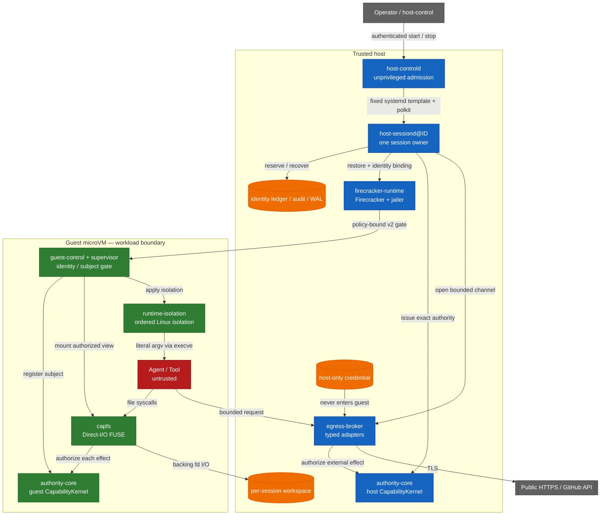

<!-- locale: zh-TW -->
<!-- translation-source: README.md -->

# Capability-based AI Agent Runtime

[English](README.md) · [日本語](README-ja.md) · [简体中文](README-zh-CN.md) · [繁體中文](README-zh-TW.md) · [한국어](README-ko.md) · [Español](README-es.md) · [Français](README-fr.md) · [Deutsch](README-de.md) · [Português (Brasil)](README-pt-BR.md)

[](https://github.com/Aqua-218/SecCamp-AIAgent/actions/workflows/ci.yml)
[](LICENSE)

在 Linux 與 Firecracker 上執行不受信任的 agent 與 tool workload，同時讓 capability 檢查、隔離、egress policy、稽核與復原都停留在副作用發生的邊界。

> **Status:** 這是一個 source repository，並不宣稱絕對隔離。在此 revision 中，verification manifest 記錄了 38 個 `verified` claim 與 3 個 `blocked` claim。請先閱讀下方的 scope 表，再把任何結果視為其他環境的證據。

<a id="start-here"></a>
## 從這裡開始

| 目標 | 閱讀 |
|---|---|
| 執行 hosted smoke test | [Quick start](#quick-start) |
| 理解 trust boundary | [Architecture and trust boundaries](#architecture-and-trust-boundaries) |
| 查看哪些已驗證、哪些未驗證 | [Verification status](#verification-status) 與 [`docs/verification-status.yml`](docs/verification-status.yml) |
| 部署 production daemon | [`deploy/README.md`](deploy/README.md) |
| 閱讀跨 crate 設計 | [`docs/design/architecture.md`](docs/design/architecture.md) |
| 瀏覽全部專案文件 | [`docs/README.md`](docs/README.md) / [繁體中文 docs hub](docs/i18n/zh-TW/README.md) |

<a id="overview"></a>
## 概覽

runtime 將 agent、tools 與 workload process 視為 untrusted。檔案操作、公開 HTTPS fetch 以及型別化 GitHub 操作都是 closed data type，而不是任意 command。`authority-core` 產生 authorization decision；CapFS 與 host Egress Broker 在 filesystem 或 external effect 發生前立即執行它。

production 的執行單位是一個 worker、一個 session 與一個 Firecracker microVM。非特權 `host-controld` 透過經過認證且受 quota 限制的 start/stop request 接納多個 worker。每個 `host-sessiond@ID.service` 擁有一個 session 及其 cleanup record。目前的 trust model 是 single-host；multi-host HA、distributed revocation 與 replicated Broker state 不在 repository 的保證範圍內。

<a id="what-the-runtime-enforces"></a>
## runtime 強制的約束

- **Typed least privilege:** file effect、HTTP method 與 path、以及 GitHub operation 都由 closed Rust type 與 bounded authority envelope 表示。
- **Effect-point authorization:** CapFS 對每個 filesystem effect 重新授權；host Broker 透過 host `CapabilityKernel` 授權型別化的 external effect。
- **Revocation linearization:** authorization read guard 一直保持到 effect 的 commit point。`revoke` 返回後，後續 commit 不能只依賴已撤銷的 capability 或其 descendant。撤銷前已 commit 的 effect 不會 rollback。
- **No guest credentials:** provider credential 留在 host 上，從不放入 guest image，也不在 response 中返回。
- **No guest network device:** guest 沒有 `virtio-net`；egress 使用 bounded `AF_VSOCK` protocol 與型別化 host adapter。
- **Identity non-reuse:** session、request、workspace、VM、Broker session、subject 與 capability identity 都記錄在 durable ledger 中，restart 後不會被默默重用。
- **Bound guest startup:** pinned artifact、dm-verity、paused restore 以及綁定 policy digest 的 v2 guest acknowledgement 共同控制 workload release。
- **Fail-closed recovery:** 模糊的 effect 記錄為 `CommitUnknown`；partial shutdown 與損壞的 durable record 會 fail closed，並為下一次啟動留下 typed recovery state。

<a id="architecture-and-trust-boundaries"></a>
## 架構與 trust boundary

host service、pinned artifact、Firecracker/jailer 與 host kernel 屬於 trusted host boundary。guest service 強制 guest-side contract；agent 與 tool process 是 untrusted。此圖展示預期的 effect path，而不是 VM escape resistance 的證明。



刻意將跨越邊界的路徑保持狹窄。

| Boundary | Path | Important limits |
|---|---|---|
| Workload → workspace | CapFS Direct-I/O FUSE | 每個 effect 都重新授權；repository、path 與 effect 必須匹配 |
| Workload → supervisor | `SOCK_SEQPACKET` | 4 KiB request bound，以及由 kernel 推導的 `SO_PEERCRED` identity |
| Guest → host | `AF_VSOCK` framed transport | 4-byte length prefix、1 MiB payload bound、canonical CBOR、session/replay/budget checks |
| Host → microVM | Firecracker API plus guest-control API | Pinned artifact digests、dm-verity、paused restore、policy-bound v2 ACKs |
| Host → external provider | Typed Broker adapter | 只允許 public HTTPS 或型別化 GitHub operation；遵守 DNS/IP、redirect、response 與 deadline policy |

raw guest TCP、任意 host filesystem sharing 與 guest credential injection 不屬於這個 interface。launcher 不解釋 shell string，而是透過 `execve` 使用 literal argv 執行 image-configured program。如果 workload 自行啟動 shell，namespace、cgroup、seccomp、Landlock、read-only rootfs 與 capability boundary 仍然適用；本專案不宣稱能讓 shell parsing 安全。

startup 依照以下順序 commit resource：

```text
workspace → Broker → VM → capability → workload
```

shutdown 依照下列 dependency order 進行。失敗的 stage 會以 durable 形式保留，只 retry 尚未完成的 stage：

```text
capability revoke → VM kill → Broker close → workspace isolation → Closed
```

<a id="verification-status"></a>
## 驗證狀態

machine-readable source of truth 是 [`docs/verification-status.yml`](docs/verification-status.yml)。status 是按 scope 分割的 claim，不是涵蓋所有可能環境的 green-list。`verified` 表示 required gate 在宣告的 scope 中執行；`blocked` 記錄不可用的 prerequisite 或 external owner。本 revision 的 manifest 包含 38 個 `verified` claim 與 3 個 `blocked` claim，沒有 `unverified` claim。

| Scope | Current manifest status | Evidence and boundary |
|---|---|---|
| Hosted | 14 verified | Locked Rust tests、Clippy、property tests、durable-state tests，以及 claim 所涵蓋的 Rust/Lean corpus |
| Privileged Linux | 10 verified, 1 blocked | Real FUSE、Linux isolation、rollback、supervisor resources 與 controlled HTTPS fixtures；blocked claim 是 aarch64 privileged architecture runner |
| KVM | 14 verified | Pinned Firecracker guest、dm-verity、guest-control、production `Runtime::launch` / `SessionOwner`、全部 13 個宣告的 CapFS effects，以及 multi-session cleanup gates |
| External | 2 blocked | Live GitHub credential/provider mutation 與獨立 external review evidence 在此 checkout 中不可用 |

這些結果不建立 VM escape resistance、host-kernel/KVM/Firecracker correctness、physical 或 microarchitectural side-channel resistance，也不建立任意 external-provider behavior。各 crate 的 verification page 列出假設與 finite-test boundary：

- [`authority-core` verification](docs/authority-core/verification.md)
- [`capfs` verification](docs/capfs/verification.md)
- [`egress-broker` verification](docs/egress-broker/verification.md)
- [`firecracker-runtime` verification](docs/firecracker-runtime/verification.md)
- [`runtime-isolation` verification](docs/runtime-isolation/verification.md)
- [`session-orchestrator` verification](docs/session-orchestrator/verification.md)
- [`supervisor` verification](docs/supervisor/verification.md)

<a id="quick-start"></a>
## 快速開始

這條路徑只執行 hosted code。它不會啟動 service、不要求 root、不掛載 FUSE、不需要 `/dev/kvm`，也不會讀取 provider credential。第一次 checkout 需要網路來取得 Cargo 的 locked dependency；之後的執行使用本機 Cargo cache。

<a id="prerequisites"></a>
### 前置條件

- Linux、Git 與 `rustup`
- 由 [`rust-toolchain.toml`](rust-toolchain.toml) 選取的 Rust `1.93.1`

<a id="run-a-hosted-smoke-test"></a>
### 執行 hosted smoke test

```bash
git clone https://github.com/Aqua-218/SecCamp-AIAgent.git
cd SecCamp-AIAgent

cargo test --locked -p authority-core --all-targets
cargo run --locked -p session-orchestrator --bin host-sessiond -- --help
```

第一個 command 執行 authority model 及其 corpus-facing tests。第二個 command 顯示 production daemon 所需的 artifact、snapshot、authority 與 egress configuration；`host-sessiond` 刻意沒有會啟動不完整 production stack 的 placeholder mode。

<a id="development-and-verification"></a>
## 開發與驗證

本機開發與 CI 使用同一個 [`scripts/ci/run.sh`](scripts/ci/run.sh) entry point。只安裝預定執行的 gate 所需 tool group；tool 會放在 repository 私有的 `.ci-tools/` directory。

```bash
scripts/ci/install-cargo-tools.sh nextest coverage security public-api
scripts/ci/install-pipeline-tools.sh
scripts/ci/install-lean.sh
```

<a id="standard-hosted-gates"></a>
### 標準 hosted gates

```bash
scripts/ci/run.sh format
scripts/ci/run.sh check
scripts/ci/run.sh clippy
scripts/ci/run.sh docs
scripts/ci/run.sh docs-policy

for shard in 1 2 3 4; do
  scripts/ci/run.sh test "$shard"
done

scripts/ci/run.sh doctest
scripts/ci/run.sh loom
scripts/ci/run.sh lean
scripts/ci/run.sh differential
scripts/ci/run.sh coverage
scripts/ci/run.sh audit
scripts/ci/run.sh deny
scripts/ci/run.sh api-surface
```

coverage gate 使用 workspace line coverage 75% 的下限。這個 threshold 是 CI gate，不是 coverage badge，也不是所有 privileged 或 KVM path 都被執行過的 claim。Miri、sanitizers、mutation testing、fuzzing 與 benchmarks 的準確 matrix 位於 [`ci/gates.yml`](ci/gates.yml)。

<a id="privileged-and-kvm-gates"></a>
### 特權 Linux 與 KVM gates

這些 command 需要其 script 宣告的 prerequisite。缺少 `/dev/fuse`、`/dev/kvm`、delegated cgroup v2、device-mapper tools 或 pinned guest artifacts 是 verification failure，而不是成功的 skip。

```bash
# Root and delegated cgroup v2
scripts/ci/run.sh privileged-isolation

# Root, /dev/kvm, /dev/vhost-vsock, veritysetup, busybox, and mkfs.ext4
scripts/ci/verify-real-guest-control.sh
scripts/ci/verify-real-session-owner.sh
```

完整的 protected-runner contract 請參閱專用的 [crate verification pages](#verification-status) 與 [`docs/ci-cd.md`](docs/ci-cd.md)。

<a id="running-host-sessiond"></a>
## 執行 `host-sessiond`

可部署的 entry point 是 [`host-sessiond`](crates/session-orchestrator/src/bin/host-sessiond.rs)。production installation procedure 要求 externally reviewed 的 full commit 與 externally authenticated 的 SHA-256 manifest；它不是通用的 `cargo install` target。

```bash
cargo build --release --locked \
  -p session-orchestrator \
  --bin host-sessiond --bin host-controld --bin host-control
```

安裝、artifact pinning、system account、systemd/polkit、device access、snapshot、credential handling 與 recovery 請遵循 [`deploy/README.md`](deploy/README.md)。已提交的 example 是 service contract 的 source。

| Artifact | Purpose |
|---|---|
| [`deploy/host-sessiond-worker.env.example`](deploy/host-sessiond-worker.env.example) | Multi-session worker environment 與 pinned artifact fields |
| [`deploy/host-sessiond.env.example`](deploy/host-sessiond.env.example) | Legacy single-session environment example |
| [`service/host-sessiond@.service`](service/host-sessiond@.service) | 每個 session 一個 worker instance |
| [`service/host-sessiond-recover@.service`](service/host-sessiond-recover@.service) | Recovery-only worker cleanup |
| [`service/host-controld.service`](service/host-controld.service) | Unprivileged authenticated controller |
| [`deploy/polkit-1/rules.d/50-host-controld.rules`](deploy/polkit-1/rules.d/50-host-controld.rules) | Narrow start/stop authorization |

example service 選擇 `--egress-authority none`，不讀取 GitHub token。必須透過相應的 authority 與 host-only credential profile 明確啟用 Public HTTPS 或 GitHub。`EGRESS_GITHUB_TOKEN` 只保留為明確的 non-systemd fallback；production systemd deployment 應使用 deploy guide 所述的 encrypted `github-token` credential。`publish-branch` operation 另外需要 host-owned expected-old-object plan。

<a id="workspace-layout"></a>
## 工作區配置

| Path | Responsibility |
|---|---|
| [`crates/authority-core/`](crates/authority-core/) | Typed authority families、delegation、policy digests、state、revocation、audit 與 durable audit |
| [`crates/capfs/`](crates/capfs/) | Repository preflight、namespace/node tables、backing I/O 與 Direct-I/O FUSE |
| [`crates/egress-protocol/`](crates/egress-protocol/) | Bounded frames、canonical CBOR、session/replay identity 與 budgets |
| [`crates/egress-broker/`](crates/egress-broker/) | Host vsock transport、public HTTPS policy、typed GitHub adapter 與 durable dispatch |
| [`crates/firecracker-runtime/`](crates/firecracker-runtime/) | Pinned artifacts、dm-verity、jailer、snapshot/restore 與 guest-control transport |
| [`crates/runtime-isolation/`](crates/runtime-isolation/) | Ordered Linux namespace、mount、cgroup、Landlock、capability 與 seccomp transaction |
| [`crates/supervisor/`](crates/supervisor/) | Guest subject 與 handle lifecycle、control socket 與 CapFS composition |
| [`crates/session-orchestrator/`](crates/session-orchestrator/) | Session lifecycle、leases、production adapters、durable recovery 與 daemon binaries |
| [`lean/`](lean/) | Lean 4 (`leanprover/lean4:v4.16.0`) authority/runtime model 與 proof corpus executables |
| [`guest/`](guest/) | Pinned guest kernel configuration 與 patch |
| [`ci/`](ci/) | Gate manifest、API baselines、benchmark baseline 與 fixtures |
| [`scripts/ci/`](scripts/ci/) | Shared GitHub、GitLab 與 local gate implementations |
| [`docs/`](docs/README.md) | Design、crate contracts、verification boundaries、decisions 與 glossary |
| [`deploy/`](deploy/README.md) 與 [`service/`](service/) | Production installation 與 systemd/polkit artifacts |

`authority-core` 與 `runtime-isolation` 仍是 dependency graph 的 leaves，因此它們的 authorization 與 isolation contracts 不依賴 higher-level orchestration。實際 dependency graph 與 runtime placement 記錄在 [`docs/design/architecture.md`](docs/design/architecture.md)。

<a id="ci-and-release"></a>
## CI 與 release

[`ci/gates.yml`](ci/gates.yml) 是 pipeline topology 的 single source of truth。目前它在 validation、quality、tests、analysis、security 與 protected system verification 中宣告 53 個 implemented gates。四個有序 release stage（`package`、`verify`、`publish` 與 `record`）分開追蹤。GitHub Actions 與 GitLab CI 必須實作相同的 manifest-owned gates；job 缺少或意外出現時，parity 與 result reconciliation 會 fail closed。

deep workflow 由 schedule 或手動 dispatch 觸發，因為一般 pull-request runner 不提供 real FUSE、KVM、device-mapper、systemd 與 external-provider fixtures。external-provider gate 是 opt-in；在此 checkout 中因缺少 protected credential 與 disposable provider owner，仍保持 blocked。

release automation 僅限 semantic-version tag。它會為可重現的 `authority-corpus` Linux binary 打包 license text、build metadata、SPDX SBOM、checksum 與 platform-specific provenance/signature record。本 repository 不發布 version badge；workspace version、[`Cargo.toml`](Cargo.toml) 與 release workflow 才是 authoritative inputs。

runner contracts、branch protection、release recovery 與 signature handling 請參閱 [`docs/ci-cd.md`](docs/ci-cd.md)。

<a id="documentation"></a>
## 文件

[`docs/README.md`](docs/README.md) 是 documentation index。最有用的入口包括：

| Topic | Document |
|---|---|
| 跨 crate architecture | [`docs/design/architecture.md`](docs/design/architecture.md) |
| threat model 與 non-goals | [`docs/design/threat-model.md`](docs/design/threat-model.md) |
| Capability、isolation 與 egress design | [`docs/design/README.md`](docs/design/README.md) |
| verification strategy | [`docs/design/verification.md`](docs/design/verification.md) |
| machine-readable verification claims | [`docs/verification-status.yml`](docs/verification-status.yml) |
| decision records | [`docs/decisions/README.md`](docs/decisions/README.md) |
| deployment 與 recovery | [`deploy/README.md`](deploy/README.md) |
| CI/CD operations | [`docs/ci-cd.md`](docs/ci-cd.md) |
| terminology | [`docs/glossary.md`](docs/glossary.md) |

每個 crate 的 README 與 verification page 都區分 implementation、hosted tests、privileged tests、KVM evidence 與 external-provider gaps。如果變更只涉及一個 subsystem，請從 [workspace layout](#workspace-layout) 中對應的 crate 開始閱讀。

<a id="license"></a>
## 授權條款

Copyright © 2026 Aqua-218.

本專案依據 [GNU Affero General Public License v3.0 only](LICENSE)（`AGPL-3.0-only`）發布。適用於使用、修改、再分發及 network service deployment 的條件請閱讀 license 正文。

<a id="related"></a>
## 相關

- [Documentation index](docs/README.md)
- [Architecture](docs/design/architecture.md)
- [Threat model](docs/design/threat-model.md)
- [Verification strategy](docs/design/verification.md)
- [Deployment guide](deploy/README.md)
- [CI/CD operations](docs/ci-cd.md)
