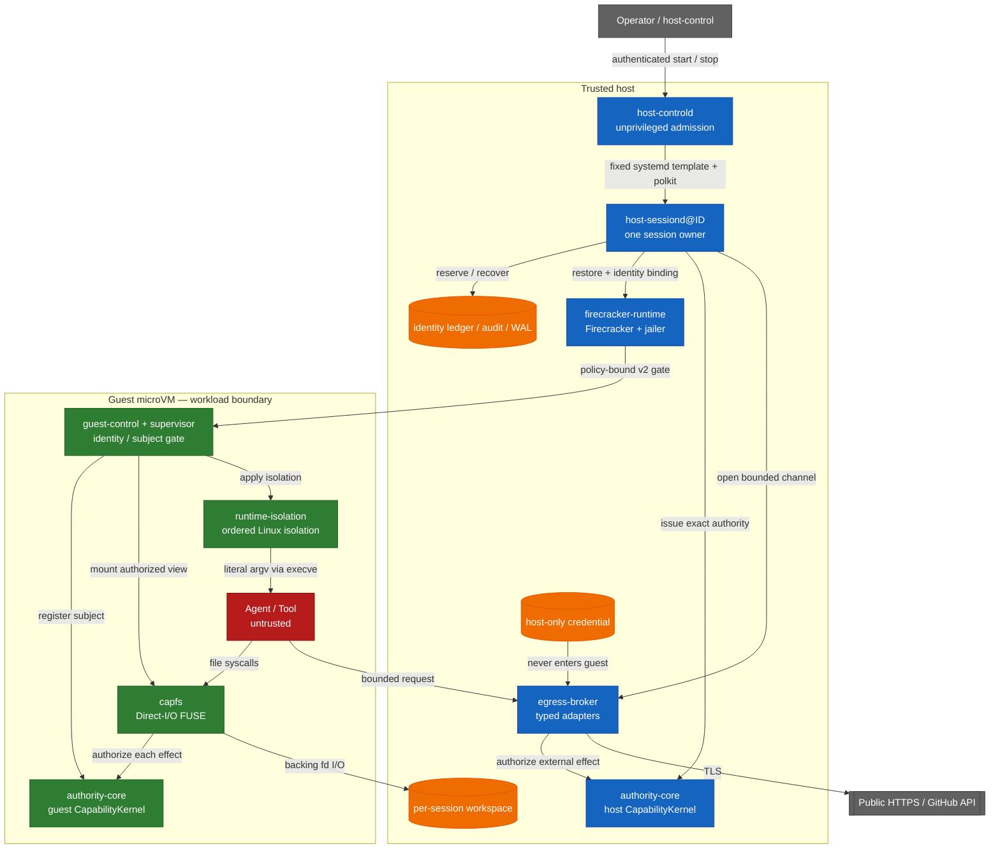

# Airlock

Capability-based AI Agent Runtime

[English](README.md) · [日本語](README-ja.md) · [简体中文](README-zh-CN.md) · [繁體中文](README-zh-TW.md) · [한국어](README-ko.md) · [Español](README-es.md) · [Français](README-fr.md) · [Deutsch](README-de.md) · [Português (Brasil)](README-pt-BR.md)

[](https://github.com/Aqua-218/SecCamp-AIAgent/actions/workflows/ci.yml)
[](LICENSE)

Run untrusted agent and tool workloads on Linux and Firecracker while capability checks,
isolation, egress policy, audit, and recovery remain at the points where side effects occur.

> **Status:** This is a source repository, not a claim of absolute isolation. At this revision,
> the verification manifest records 38 verified claims and 3 blocked claims. Read the scope table
> below before treating any result as evidence for a different environment.

## Start here

| Goal | Read |
|---|---|
| Run a hosted smoke test | [Quick start](#quick-start) |
| Understand the trust boundary | [Architecture and trust boundaries](#architecture-and-trust-boundaries) |
| Check what is and is not verified | [Verification status](#verification-status) and [`docs/verification-status.yml`](docs/verification-status.yml) |
| Deploy the production daemon | [`deploy/README.md`](deploy/README.md) |
| Read the cross-crate design | [`docs/design/architecture.md`](docs/design/architecture.md) |
| Browse all project documentation | [`docs/README.md`](docs/README.md) / [English docs hub](docs/i18n/en/README.md) |

## Overview

The runtime treats the agent, tools, and workload processes as untrusted. File operations,
public HTTPS fetches, and typed GitHub operations are closed data types rather than arbitrary
commands. `authority-core` makes the authorization decision; CapFS and the host Egress Broker
enforce it immediately before filesystem or external effects.

The production unit is one worker, one session, and one Firecracker microVM. An unprivileged
`host-controld` admits multiple workers through authenticated, quota-limited start/stop requests.
Each `host-sessiond@ID.service` owns one session and its cleanup records. The current trust model
is single-host: multi-host HA, distributed revocation, and replicated Broker state are outside
the repository's guarantee.

## What the runtime enforces

- **Typed least privilege:** file effects, HTTP methods and paths, and GitHub operations are
  represented by closed Rust types and bounded authority envelopes.
- **Effect-point authorization:** CapFS re-authorizes each filesystem effect; the host Broker
  authorizes typed external effects through the host `CapabilityKernel`.
- **Revocation linearization:** the authorization read guard remains held through the effect's
  commit point. After `revoke` returns, a later commit cannot rely only on the revoked capability
  or one of its descendants. Effects committed before revocation are not rolled back.
- **No guest credentials:** provider credentials stay on the host and are never put in the guest
  image or returned in a response.
- **No guest network device:** the guest has no `virtio-net`; egress uses a bounded `AF_VSOCK`
  protocol and typed host adapters.
- **Identity non-reuse:** session, request, workspace, VM, Broker session, subject, and capability
  identities are recorded in durable ledgers and are not silently reused after restart.
- **Bound guest startup:** pinned artifacts, dm-verity, paused restore, and policy-digest-bound
  v2 guest acknowledgements gate workload release.
- **Fail-closed recovery:** ambiguous effects are recorded as `CommitUnknown`; partial shutdown
  and damaged durable records fail closed and leave typed recovery state for the next start.

## Architecture and trust boundaries

The host services, pinned artifacts, Firecracker/jailer, and host kernel are part of the trusted
host boundary. Guest services enforce the guest-side contracts; the agent and tool processes are
untrusted. The diagram shows the intended effect paths, not a proof of VM escape resistance.



The crossing points are intentionally narrow:

| Boundary | Path | Important limits |
|---|---|---|
| Workload → workspace | CapFS Direct-I/O FUSE | Re-authorization for each effect; repository, path, and effect must match |
| Workload → supervisor | `SOCK_SEQPACKET` | 4 KiB request bound and kernel-derived `SO_PEERCRED` identity |
| Guest → host | `AF_VSOCK` framed transport | 4-byte length prefix, 1 MiB payload bound, canonical CBOR, session/replay/budget checks |
| Host → microVM | Firecracker API plus guest-control API | Pinned artifact digests, dm-verity, paused restore, policy-bound v2 ACKs |
| Host → external provider | Typed Broker adapter | Public HTTPS or typed GitHub operations only; DNS/IP, redirect, response, and deadline policy |

Raw guest TCP, arbitrary host filesystem sharing, and guest credential injection are not part of
the interface. The launcher does not interpret shell strings: it executes the image-configured
program with literal argv through `execve`. If a workload starts a shell itself, the namespace,
cgroup, seccomp, Landlock, read-only rootfs, and capability boundaries still apply; this project
does not claim to make shell parsing safe.

Startup commits resources in this order:

```text
workspace → Broker → VM → capability → workload
```

Shutdown proceeds in the dependency order below. A failed stage remains durable and only the
unfinished stages are retried:

```text
capability revoke → VM kill → Broker close → workspace isolation → Closed
```

## Verification status

The machine-readable source of truth is [`docs/verification-status.yml`](docs/verification-status.yml).
Statuses are scoped claims, not a green-list of all possible environments. `verified` means that
the required gate ran in the declared scope; `blocked` records a named prerequisite or external
owner that is unavailable. At this revision the manifest contains 38 verified claims and 3 blocked
claims, with no `unverified` claims.

| Scope | Current manifest status | Evidence and boundary |
|---|---|---|
| Hosted | 14 verified | Locked Rust tests, Clippy, property tests, durable-state tests, and the Rust/Lean corpus where claimed |
| Privileged Linux | 10 verified, 1 blocked | Real FUSE, Linux isolation, rollback, supervisor resources, and controlled HTTPS fixtures; the blocked claim is the aarch64 privileged architecture runner |
| KVM | 14 verified | Pinned Firecracker guest, dm-verity, guest-control, production `Runtime::launch` / `SessionOwner`, all 13 declared CapFS effects, and multi-session cleanup gates |
| External | 2 blocked | Live GitHub credential/provider mutation and independent external review evidence are unavailable in this checkout |

These results do not establish VM escape resistance, host-kernel/KVM/Firecracker correctness,
physical or microarchitectural side-channel resistance, or arbitrary external-provider behavior.
The crate-specific verification pages list the assumptions and finite-test boundaries:

- [`authority-core` verification](docs/authority-core/verification.md)
- [`capfs` verification](docs/capfs/verification.md)
- [`egress-broker` verification](docs/egress-broker/verification.md)
- [`firecracker-runtime` verification](docs/firecracker-runtime/verification.md)
- [`runtime-isolation` verification](docs/runtime-isolation/verification.md)
- [`session-orchestrator` verification](docs/session-orchestrator/verification.md)
- [`supervisor` verification](docs/supervisor/verification.md)

## Quick start

This path exercises hosted code only. It does not start a service, require root, mount FUSE, need
`/dev/kvm`, or read provider credentials. A first checkout needs network access for Cargo's locked
dependencies; subsequent runs use the local Cargo cache.

### Prerequisites

- Linux, Git, and `rustup`
- Rust `1.93.1`, selected by [`rust-toolchain.toml`](rust-toolchain.toml)

### Run a hosted smoke test

```bash
git clone https://github.com/Aqua-218/SecCamp-AIAgent.git
cd SecCamp-AIAgent

cargo test --locked -p authority-core --all-targets
cargo run --locked -p session-orchestrator --bin host-sessiond -- --help
```

The first command runs the authority model and its corpus-facing tests. The second command
prints the production daemon's required artifact, snapshot, authority, and egress configuration;
`host-sessiond` intentionally has no placeholder mode that starts an incomplete production stack.

## Development and verification

The same [`scripts/ci/run.sh`](scripts/ci/run.sh) entry point is used by local development and CI.
Install only the tool groups needed for the gates you intend to run; tools are placed under the
repository's private `.ci-tools/` directory.

```bash
scripts/ci/install-cargo-tools.sh nextest coverage security public-api
scripts/ci/install-pipeline-tools.sh
scripts/ci/install-lean.sh
```

### Standard hosted gates

```bash
scripts/ci/run.sh format
scripts/ci/run.sh check
scripts/ci/run.sh clippy
scripts/ci/run.sh docs
scripts/ci/run.sh docs-policy

for shard in 1 2 3 4; do
  scripts/ci/run.sh test "$shard"
done

scripts/ci/run.sh doctest
scripts/ci/run.sh loom
scripts/ci/run.sh lean
scripts/ci/run.sh differential
scripts/ci/run.sh coverage
scripts/ci/run.sh audit
scripts/ci/run.sh deny
scripts/ci/run.sh api-surface
```

The coverage gate uses a 75% workspace line-coverage floor. That threshold is a CI gate, not a
coverage badge or a claim that every privileged or KVM path was exercised. The exact matrix for
Miri, sanitizers, mutation testing, fuzzing, and benchmarks lives in [`ci/gates.yml`](ci/gates.yml).

### Privileged and KVM gates

These commands need the prerequisites named by their scripts. Missing `/dev/fuse`, `/dev/kvm`,
delegated cgroup v2, device-mapper tools, or pinned guest artifacts is a failed verification
condition, not a successful skip.

```bash
# Root and delegated cgroup v2
scripts/ci/run.sh privileged-isolation

# Root, /dev/kvm, /dev/vhost-vsock, veritysetup, busybox, and mkfs.ext4
scripts/ci/verify-real-guest-control.sh
scripts/ci/verify-real-session-owner.sh
```

Use the dedicated [crate verification pages](#verification-status) and [`docs/ci-cd.md`](docs/ci-cd.md)
for the full protected-runner contract.

## Running `host-sessiond`

The deployable entry point is [`host-sessiond`](crates/session-orchestrator/src/bin/host-sessiond.rs).
The production installation procedure requires an externally reviewed full commit and an
externally authenticated SHA-256 manifest; it is not a generic `cargo install` target.

```bash
cargo build --release --locked \
  -p session-orchestrator \
  --bin host-sessiond --bin host-controld --bin host-control
```

For installation, artifact pinning, system accounts, systemd/polkit, device access, snapshots,
credential handling, and recovery, follow [`deploy/README.md`](deploy/README.md). The checked-in
examples are the source for the service contract:

| Artifact | Purpose |
|---|---|
| [`deploy/host-sessiond-worker.env.example`](deploy/host-sessiond-worker.env.example) | Multi-session worker environment and pinned artifact fields |
| [`deploy/host-sessiond.env.example`](deploy/host-sessiond.env.example) | Legacy single-session environment example |
| [`service/host-sessiond@.service`](service/host-sessiond@.service) | One worker instance per session |
| [`service/host-sessiond-recover@.service`](service/host-sessiond-recover@.service) | Recovery-only worker cleanup |
| [`service/host-controld.service`](service/host-controld.service) | Unprivileged authenticated controller |
| [`deploy/polkit-1/rules.d/50-host-controld.rules`](deploy/polkit-1/rules.d/50-host-controld.rules) | Narrow start/stop authorization |

The example service selects `--egress-authority none` and reads no GitHub token. Public HTTPS or
GitHub must be enabled explicitly with the corresponding authority and host-only credential
profile. `EGRESS_GITHUB_TOKEN` is retained only as the explicit non-systemd fallback; production
systemd deployments should use the encrypted `github-token` credential described in the deploy
guide. A `publish-branch` operation also requires a host-owned expected-old-object plan.

## Workspace layout

| Path | Responsibility |
|---|---|
| [`crates/authority-core/`](crates/authority-core/) | Typed authority families, delegation, policy digests, state, revocation, audit, and durable audit |
| [`crates/capfs/`](crates/capfs/) | Repository preflight, namespace/node tables, backing I/O, and Direct-I/O FUSE |
| [`crates/egress-protocol/`](crates/egress-protocol/) | Bounded frames, canonical CBOR, session/replay identity, and budgets |
| [`crates/egress-broker/`](crates/egress-broker/) | Host vsock transport, public HTTPS policy, typed GitHub adapter, and durable dispatch |
| [`crates/firecracker-runtime/`](crates/firecracker-runtime/) | Pinned artifacts, dm-verity, jailer, snapshot/restore, and guest-control transport |
| [`crates/runtime-isolation/`](crates/runtime-isolation/) | Ordered Linux namespace, mount, cgroup, Landlock, capability, and seccomp transaction |
| [`crates/supervisor/`](crates/supervisor/) | Guest subject and handle lifecycle, control socket, and CapFS composition |
| [`crates/session-orchestrator/`](crates/session-orchestrator/) | Session lifecycle, leases, production adapters, durable recovery, and daemon binaries |
| [`lean/`](lean/) | Lean 4 (`leanprover/lean4:v4.16.0`) authority/runtime model and proof corpus executables |
| [`guest/`](guest/) | Pinned guest kernel configuration and patch |
| [`ci/`](ci/) | Gate manifest, API baselines, benchmark baseline, and fixtures |
| [`scripts/ci/`](scripts/ci/) | Shared GitHub, GitLab, and local gate implementations |
| [`docs/`](docs/README.md) | Design, crate contracts, verification boundaries, decisions, and glossary |
| [`deploy/`](deploy/README.md) and [`service/`](service/) | Production installation and systemd/polkit artifacts |

`authority-core` and `runtime-isolation` remain dependency-graph leaves so their authorization
and isolation contracts do not depend on higher-level orchestration. The actual dependency graph
and runtime placement are documented in [`docs/design/architecture.md`](docs/design/architecture.md).

## CI and release

[`ci/gates.yml`](ci/gates.yml) is the single source of truth for pipeline topology. It currently
declares 53 implemented gates across validation, quality, tests, analysis, security, and protected
system verification. Four ordered release stages (`package`, `verify`, `publish`, and `record`) are
tracked separately. GitHub Actions and GitLab CI must implement the same manifest-owned gates;
parity and result reconciliation fail closed when a job is missing or unexpected.

The deep workflow is scheduled or manually dispatched because real FUSE, KVM, device-mapper,
systemd, and external-provider fixtures are not available on ordinary pull-request runners. The
external-provider gate is opt-in and remains blocked in this checkout without the protected
credential and disposable provider owner.

Release automation is restricted to semantic-version tags. It packages the reproducible
`authority-corpus` Linux binary with license text, build metadata, SPDX SBOM, checksum, and the
platform-specific provenance/signature record. This repository does not publish a version badge;
the workspace version in [`Cargo.toml`](Cargo.toml) and the release workflow are the authoritative
inputs.

See [`docs/ci-cd.md`](docs/ci-cd.md) for runner contracts, branch protection, release recovery,
and signature handling.

## Documentation

[`docs/README.md`](docs/README.md) is the documentation index. The most useful entry points are:

| Topic | Document |
|---|---|
| Cross-crate architecture | [`docs/design/architecture.md`](docs/design/architecture.md) |
| Threat model and non-goals | [`docs/design/threat-model.md`](docs/design/threat-model.md) |
| Capability, isolation, and egress design | [`docs/design/README.md`](docs/design/README.md) |
| Verification strategy | [`docs/design/verification.md`](docs/design/verification.md) |
| Machine-readable verification claims | [`docs/verification-status.yml`](docs/verification-status.yml) |
| Decision records | [`docs/decisions/README.md`](docs/decisions/README.md) |
| Deployment and recovery | [`deploy/README.md`](deploy/README.md) |
| CI/CD operations | [`docs/ci-cd.md`](docs/ci-cd.md) |
| Terminology | [`docs/glossary.md`](docs/glossary.md) |

Each crate's README and verification page separates implementation, hosted tests, privileged
tests, KVM evidence, and external-provider gaps. Start with the relevant crate in the
[workspace layout](#workspace-layout) when a change crosses only one subsystem.

## License

Copyright © 2026 Aqua-218.

This project is released under the [GNU Affero General Public License v3.0 only](LICENSE)
(`AGPL-3.0-only`). Review the license text for the conditions that apply to use, modification,
redistribution, and network service deployment.

## Related

- [Documentation index](docs/README.md)
- [Architecture](docs/design/architecture.md)
- [Threat model](docs/design/threat-model.md)
- [Verification strategy](docs/design/verification.md)
- [Deployment guide](deploy/README.md)
- [CI/CD operations](docs/ci-cd.md)
