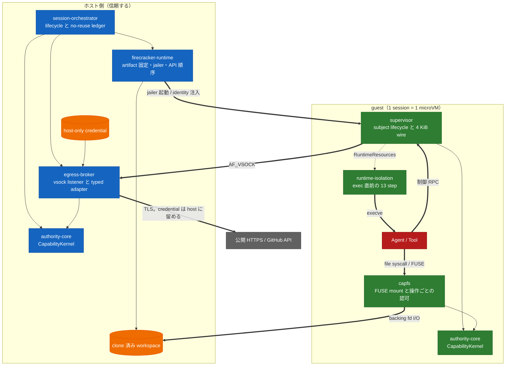

# Capability-based Agent 実行基盤

Agent が書いたコードを実際に走らせ、file を書き換えさせ、外部 API まで操作させるための実行基盤。Agent と Tool を最初から信用せず、何をしてよいかを Capability で明示し、副作用が実際に起きる場所で強制する。

Rust workspace 8 crate と、権限判定を Lean 4 で二重実装した証明群からなる。**まだ組み立てて動く製品ではない。** 何が確かで何が未検証かは[現在どこまで動くのか](#現在どこまで動くのか)に分けて書いてある。

## 何を強制するのか

守る境界は 3 段ある。

1. Agent 同士を subject と Capability で分ける。
2. guest 内の仕組みが破られても、被害をその VM の workspace と session envelope に留める。
3. GitHub などの credential は guest に入れず、host 側だけで扱う。

そのために、境界を越える手段を 5 つに限る。ここに無い経路 — 生の TCP socket、guest から host への任意 file 共有、credential の guest 配布 — は作らない。

| 越える境界 | 手段 | 上限 |
|---|---|---|
| Agent → 自分の workspace | FUSE operation | 上限ではなく、操作ごとに認可 |
| Agent → subject 制御 | supervisor の bounded envelope | 4 KiB、version 1、tag は 2 つ |
| guest → host egress | `AF_VSOCK` の length-prefixed frame | payload 1 MiB |
| host → VM | Firecracker API と guest control API | `network_devices` が空でなければ拒否 |
| host → 外部 | Broker の型付き adapter | response 32 MiB、redirect 5 hop、全体 60 秒 |

guest に `virtio-net` は付かない。外へ出る経路が vsock 1 本しかないので、egress の検査点は Broker に集約される。

file を書く経路と外へ出る経路は、途中はまったく別物でも、最後は同じ `CapabilityKernel::authorize_and_commit` に入る。認可してから効果が確定するまで Capability の read guard を離さないため、その間に走った revoke は待たされる。これが次の 1 行を経路によらず成立させている。

> revoke が返った後に commit される副作用は、失効した Capability やその子孫だけを根拠には実行されない。

逆に、revoke より先に線形化点を越えた操作は巻き戻さない。詳細は[状態機械と revoke](docs/design/state-and-revocation.md)。

## 実行時の配置



点線は設計上必要だが、まだ繋ぐコードが無い線である。全ての未接続線は[全体アーキテクチャ](docs/design/architecture.md#まだコードになっていない線)に一覧がある。

## 現在どこまで動くのか

**mock test の成功を、実機動作の根拠にしない。** この repository はその区別を文書の構造そのものに持ち込んでいる。各 crate の検証ページには `## 未検証の境界` が必須節としてあり、CI が存在を検査する。

### まだ無いもの

- **完全な composition root は無い。** `guest-control-init` は実 VM 内で identity gate を担うが、host daemon と、guest の CapabilityKernel / capfs / supervisor / runtime-isolation を一つの session として組み立てる入口は無い。
- **実 VM の一部分だけを検証済み。** KVM 上の実 Firecracker、実 dm-verity mapper、guest の `AF_VSOCK` listener、host からの identity 注入と workload gate は [`verify-real-guest-control.sh`](scripts/ci/verify-real-guest-control.sh) で通る。一方、実 jailer、snapshot restore、Broker の host listener、外部 DNS / HTTPS / GitHub API、full isolation は未検証である。
- **特権 isolation の実 syscall は未実行。** 13 step の apply / rollback は mock backend と純粋関数までしか動かしていない。

これは書き忘れではなく順序の結果で、[実装順序](docs/design/implementation-plan.md)が「Authority core と capfs を確定してから統合する」という並びを選んでいる。

### 確かなもの

- `authority-core` の権限判定は Rust と Lean 4 の二重実装で、[150 件の共通 corpus](tests/fixtures/authority-core.tsv) に対して両者の正規化済み判定が byte 単位で一致することを CI が要求する。
- `authority-core` の認可と revoke の線形化は loom で探索し、positive / negative control 付きで検査している。
- `capfs` は `/dev/fuse` がある環境で実 mount test まで通る。
- workspace 全体で line coverage 75% を下限に強制している。

crate ごとの正確な線引きは各 crate の検証対応表（`docs/<crate>/verification.md`）を読む。

## repository の構成

| path | 内容 |
|---|---|
| [crates/](crates/) | Rust workspace の 8 crate。`authority-core` を底とする依存木 |
| [lean/](lean/) | Lean 4 による判定の二重実装と定理。`leanprover/lean4:v4.16.0` に固定 |
| [docs/](docs/README.md) | 設計、実装、決定記録、検証対応表。ページ型ごとの構造を CI が検査する |
| [scripts/ci/](scripts/ci/) | CI と local が共有する gate 入口。pipeline から script を呼ぶだけにしてある |
| [ci/gates.yml](ci/gates.yml) | gate 定義の single source of truth。GitHub と GitLab が同じ gate を実装していることを parity check が証明する |
| [tests/fixtures/](tests/fixtures/) | Rust と Lean が共有する判定 corpus |
| [.github/workflows/](.github/workflows/) | `ci` / `security` / `release` |
| [.gitlab-ci.yml](.gitlab-ci.yml), [.gitlab/](.gitlab/) | 同等の GitLab pipeline |
| [deny.toml](deny.toml), [.semgrep.yml](.semgrep.yml) | dependency policy と repository 固有の静的解析 rule |

## crate 一覧

| crate | 実装している境界 | 検証の水準 |
|---|---|---|
| [authority-core](crates/authority-core/) | 権限の表現、委譲判定、状態、revoke、監査。Rust と Lean の二重実装 | unit / property / loom / Lean 定理 / 共通 corpus |
| [capfs](crates/capfs/) | backing root、namespace registry、node table、Direct-I/O FUSE adapter | 実 mount test を含む。実 VM 内は未検証 |
| [egress-protocol](crates/egress-protocol/) | bounded frame、canonical CBOR、session と sequence、budget | module test |
| [egress-broker](crates/egress-broker/) | `AF_VSOCK` frame、replay、budget、公開 HTTPS、型付き GitHub adapter | fake resolver / connector / provider。実 vsock と外部 API は未検証 |
| [firecracker-runtime](crates/firecracker-runtime/) | artifact 固定、dm-verity、jailer、API 順序、snapshot / restore、identity gate、guest-control PID 1 | fake boundary test に加え、実 Firecracker + dm-verity + guest `AF_VSOCK` identity gate。jailer / snapshot restore は未検証 |
| [runtime-isolation](crates/runtime-isolation/) | exec 直前の 13 step。namespace、mount、cgroup、Landlock、capability、seccomp | mock backend と純粋関数。実 syscall は未検証 |
| [supervisor](crates/supervisor/) | 認証済み connection の subject binding、wire protocol、subject lifecycle | `CapabilityKernel` と `FakeResources`。実 socket は未検証 |
| [session-orchestrator](crates/session-orchestrator/) | session identity、backend lease、startup / rollback / stop | production adapter composition test。実 VM は未検証 |

`firecracker-runtime` と `runtime-isolation` はどの crate からも依存されておらず、`authority-core` すら参照しない。前者は `rustix` と `sha2`、後者は `libc` だけで立っている。

## 開発環境の準備

Rust toolchain は [`rust-toolchain.toml`](rust-toolchain.toml) が `1.93.1` に固定する。`rustup` があれば自動で解決される。全ての cargo 呼び出しは `--locked` を使う。

CI と同じ version の外部 tool を入れる。

```bash
scripts/ci/install-cargo-tools.sh nextest coverage security
scripts/ci/install-pipeline-tools.sh   # actionlint / ShellCheck / yq
scripts/ci/install-lean.sh             # elan と Lean toolchain
```

導入先は `.ci-tools/` で、`.gitignore` 済みである。`CI_TOOLS_DIR` で移せる。

## build と test

`scripts/ci/run.sh` が CI と local の共通入口になっている。CI job が直接 cargo を呼ぶことはないので、ここを通せば CI と同じものが走る。

```bash
scripts/ci/run.sh format        # cargo fmt --check
scripts/ci/run.sh check         # 全 target / 全 feature
scripts/ci/run.sh clippy        # -D warnings
scripts/ci/run.sh docs          # rustdoc、警告を error 扱い
scripts/ci/run.sh docs-policy   # docs/ の構造検査

for shard in 1 2 3 4; do scripts/ci/run.sh test "$shard"; done
scripts/ci/run.sh doctest
scripts/ci/run.sh loom          # authority-core の線形化探索
scripts/ci/run.sh coverage      # line coverage 75% 下限
scripts/ci/run.sh audit         # RustSec
scripts/ci/run.sh deny          # license / source / wildcard policy
```

test shard は crate 単位で決め打ちしてある（`1` が `authority-core` と `egress-protocol`、`4` が `supervisor` と `session-orchestrator`）。1 crate だけ回すなら `cargo test -p <crate> --locked` でよい。

Lean 側と、Rust / Lean の突き合わせ。

```bash
scripts/ci/run.sh lean          # lake build
scripts/ci/run.sh differential  # 150 件 corpus の byte 単位一致
```

`capfs` の実 mount test は `/dev/fuse` を要求する。無い環境では該当 test が skip される。

実 VM 検証だけは hosted pipeline ではなく `/dev/kvm` を持つ host で行う。

```bash
scripts/ci/install-firecracker.sh      # firecracker + jailer
scripts/ci/install-guest-artifacts.sh  # guest kernel + read-only rootfs + verity hash device
```

guest artifact の bucket は署名を公開していないため、script に書かれた digest は「この repository が観測して受け入れた bytes」であって、上流 build の信頼性を示すものではない。rootfs の hash device は download せず、その bytes からその場で `veritysetup format` する。

## CI/CD

GitHub Actions と GitLab CI に等価な fail-closed pipeline を用意し、どちらも repository が所有する同じ script を実行する。platform を移しても品質・セキュリティ・release の契約が変わらないようにするためで、[`ci/gates.yml`](ci/gates.yml) に無い gate が workflow 側にあれば parity 検査で落ちる。

release 境界は、この repository が今日証明できる artifact — `authority-corpus` の Linux binary — に意図的に限定してある。deployable な service image も environment manifest も無いので、production deployment job は置いていない。

運用の詳細（保護設定、署名付き release、障害復旧、残存リスク）は [CI/CD operations](docs/ci-cd.md) にある。

## ドキュメント

入口は [docs/README.md](docs/README.md)。目的別の行き先は次のとおり。

| 知りたいこと | 読む場所 |
|---|---|
| 何を守るのか、なぜこの構造か | [設計書](docs/design/README.md) |
| 8 crate が実行時にどう並ぶか | [全体アーキテクチャ](docs/design/architecture.md) |
| なぜ別の案を採らなかったか | [決定記録](docs/decisions/README.md) |
| 語の意味（`envelope` / `session` / `subject` / `generation` の衝突を含む） | [用語集](docs/glossary.md) |
| 今どこまで実装され、どこから未検証か | 各 crate の `docs/<crate>/verification.md` |
| 文書を追加・変更するときの規約 | [文書規約](docs/document-conventions.md) |

新しく文書を書くときは [`docs/templates/`](docs/templates/) の骨格を使う。`scripts/ci/check-docs.sh` が doc-type marker、必須節、mermaid の有無、相対リンクの解決を検査する。

```bash
scripts/ci/check-docs.sh docs/capfs/namespace-registry.md
```

## ライセンス

Copyright © 2026 Aqua-218.

このプロジェクトは [GNU Affero General Public License v3.0 only](LICENSE)（`AGPL-3.0-only`）で公開する。改変版をネットワーク越しに利用させる場合を含め、対応するソースコードの提供条件はライセンス本文に従う。
