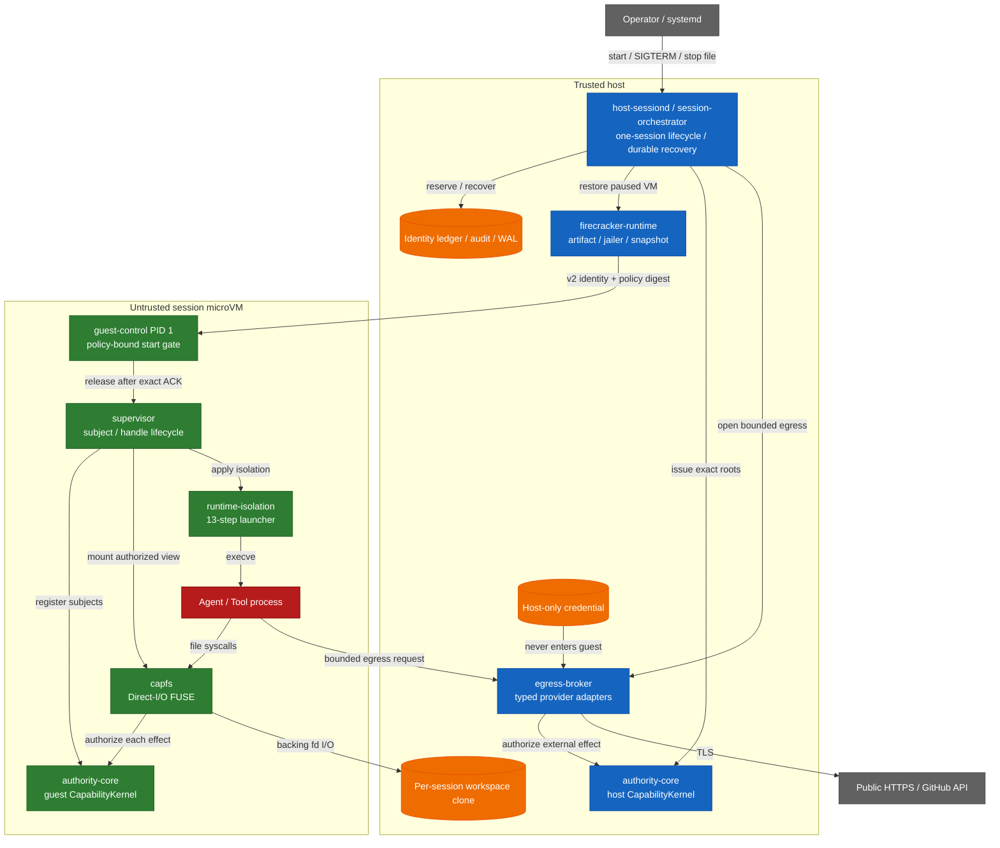

# Capability-based AI Agent Runtime

AI Agent が生成したコードを、明示的な権限・隔離・監査の境界内で実行するための Linux / Firecracker 基盤です。Agent や Tool を信頼せず、ファイル操作と外部通信を副作用が発生する地点で Capability により認可します。

> **重要:** 現在の運用単位は **1 daemon = 1 session = 1 microVM** です。実行・停止・永続的な復旧記録まで実装されていますが、複数 session を受け付ける API、利用者認証、scheduler、HA はこの repository の責務に含みません。

## まず読む

| 目的 | 読む場所 |
|---|---|
| まず local で検証する | [Quick start](#quick-start) |
| 何を守り、どこを信頼するか知る | [Security model](#security-model) |
| 実装済みと未検証の境界を確認する | [現在の到達点](#現在の到達点) |
| `host-sessiond` を配置する | [Deployment guide](deploy/README.md) |
| 設計全体を理解する | [Architecture](docs/design/architecture.md) |
| ADR を読む | [Decision records](docs/decisions/README.md) |
| 文書を横断して探す | [Documentation index](docs/README.md) |

## この基盤が解く問題

一般的な Agent sandbox では、process を隔離しても、workspace、credential、外部 API、副作用の完了と revoke の競合が別々の仕組みに散らばりがちです。この基盤は次の規則を一つの実行経路にまとめます。

- **最小権限:** file、公開 HTTPS、GitHub 操作を closed な型として表し、許可されていない操作を任意文字列へ退避しません。
- **効果地点での認可:** file syscall は CapFS、外部操作は host Egress Broker が、最終的な `CapabilityKernel` 認可を通してから実行します。
- **revoke の線形化:** 認可から効果の commit point まで read guard を保持し、完了した revoke より後の副作用を失効済み Capability だけでは開始できません。
- **guest credential なし:** GitHub token は host にのみ置き、guest へ渡しません。
- **network device なし:** guest に `virtio-net` を付けず、外部通信を bounded `AF_VSOCK` protocol と host Broker に集約します。
- **identity の非再利用:** session、request、workspace、VM、Broker session、subject、Capability の identity を永続 ledger に記録し、restart 後も再利用を拒否します。
- **snapshot と権限の束縛:** snapshot manifest、host grant、guest start acknowledgement を同じ authority policy digest に結び付けます。
- **失敗を成功扱いしない:** commit の成否が確定できない効果、途中まで進んだ shutdown、破損した WAL は fail closed で保持し、同じ identity と stage で復旧します。

## Security model

### Trust boundary

Agent と Tool は untrusted です。host kernel、`host-sessiond`、固定済み helper / VM artifact、各 trust domain の `CapabilityKernel` を trusted computing base として扱います。guest 内の防御だけに依存せず、guest が侵害された場合も host credential と別 session の workspace へ到達させない構成です。

境界を越える経路は次に限定されます。

| 境界 | 許可された経路 | 主な制約 |
|---|---|---|
| Agent → workspace | Direct-I/O FUSE | operation ごとの再認可、path / repository / effect の一致 |
| Agent → guest supervisor | `SOCK_SEQPACKET` | request 4 KiB、closed tag、`SO_PEERCRED` による caller 束縛 |
| guest → host | `AF_VSOCK` frame | payload 1 MiB、canonical CBOR、session / sequence / budget |
| host → microVM | Firecracker API + guest-control API | artifact digest、dm-verity、paused restore、policy-bound v2 ACK |
| host → external provider | typed Broker adapter | public HTTPS / GitHub のみ、redirect・response・deadline 上限 |

生の guest TCP、guest への host filesystem 共有、credential の guest 配布は提供しません。GitHub の `publish-branch` は、expected-old object を含む host-owned plan がなければ実行できません。

revoke の保証は次の範囲です。

> revoke が返った後に commit される副作用は、失効した Capability またはその子孫だけを根拠には実行されない。

revoke より前に commit point を越えた外部効果を巻き戻す保証ではありません。曖昧な完了は durable audit に `CommitUnknown` として残します。詳細は [状態機械と revoke](docs/design/state-and-revocation.md) と [threat model](docs/design/threat-model.md) を参照してください。

## Architecture



startup は `workspace → Broker → VM → Capability → workload` の順に commit します。停止時は `Capability revoke → VM kill → Broker close → workspace isolation` の順で進みます。cleanup が失敗した session は `Stopping` に留まり、成功済み stage を繰り返さず、未完了 stage のみを retry します。

## 現在の到達点

「コードが存在する」「test double で契約を検証した」「実 kernel / VM で動かした」を区別しています。機械可読な正本は [`docs/verification-status.yml`](docs/verification-status.yml) です。

| Scope | 状態 | 証拠 |
|---|---|---|
| Rust workspace | 検証済み | 全 target / feature の test、Clippy、rustdoc、API baseline |
| Authority model | 検証済み | property test、Loom、Lean 4、Rust / Lean 共通 corpus 150件 |
| CapFS | hosted + 実 mount test | `/dev/fuse` がある Linux で17件の FUSE integration test |
| Runtime isolation | 特権 host で検証済み | namespace、cgroup v2、seccomp、Landlock、read-only rootfs、device、fd、capability |
| Firecracker guest path | 実 KVM で検証済み | dm-verity boot、v2 identity gate、cgroup controller、guest→host Broker、isolation 後の Broker channel |
| CI / supply chain | 実装済み | GitHub / GitLab 39 gate parity、audit、deny、SBOM、SAST、secret scan、再現可能 release |
| 外部 provider | 未検証 | repository test は実 DNS / HTTPS / GitHub credential mutation を実行しない |
| production `Runtime::launch` | 実機未検証 | direct-API KVM test は実施済みだが、実 jailer + snapshot create / restore lifecycle は別境界 |
| multi-session control plane | 未実装 | API、認証、scheduler、HA は scope 外 |

> **注意:** 「実 KVM test が通る」ことを VM 隔離全体の証明とは扱いません。crate ごとの仮定と残存境界は `docs/<crate>/verification.md` に明記しています。

## Quick start

### 必要なもの

- Git
- `rustup`
- Rust `1.93.1`（[`rust-toolchain.toml`](rust-toolchain.toml) が自動選択）
- Linux（FUSE、特権 isolation、Firecracker の実機検証を行う場合）

clone 後、hosted test は追加の service や credential なしで実行できます。

```bash
git clone https://github.com/Aqua-218/SecCamp-AIAgent.git
cd SecCamp-AIAgent

cargo test --workspace --all-targets --all-features --locked
scripts/ci/run.sh format
scripts/ci/run.sh check
scripts/ci/run.sh clippy
scripts/ci/run.sh docs
```

`host-sessiond` の CLI 契約を確認する場合:

```bash
cargo run --locked -p session-orchestrator --bin host-sessiond -- --help
```

`host-sessiond` は多数の artifact digest、snapshot、durable path を必須入力とします。placeholder のまま起動できる簡易 mode はありません。本番相当の配置は [Deployment guide](deploy/README.md) に従ってください。

## Development and verification

CI と local は同じ [`scripts/ci/run.sh`](scripts/ci/run.sh) を入口にします。追加 tool は repository 内の `.ci-tools/` へ version / digest 固定で導入されます。

```bash
scripts/ci/install-cargo-tools.sh nextest coverage security public-api
scripts/ci/install-pipeline-tools.sh
scripts/ci/install-lean.sh
```

### Standard gates

```bash
scripts/ci/run.sh format
scripts/ci/run.sh check
scripts/ci/run.sh clippy
scripts/ci/run.sh docs
scripts/ci/run.sh docs-policy

for shard in 1 2 3 4; do
  scripts/ci/run.sh test "$shard"
done

scripts/ci/run.sh doctest
scripts/ci/run.sh loom
scripts/ci/run.sh lean
scripts/ci/run.sh differential
scripts/ci/run.sh coverage
scripts/ci/run.sh audit
scripts/ci/run.sh deny
scripts/ci/run.sh api-surface
```

coverage gate は workspace の line coverage 75% を下限にします。`capfs` の実 mount test は `/dev/fuse` が無い環境では skip されるため、標準 test の green だけで privileged FUSE 境界を検証済みとは判断しません。

### Deep gates

Miri、sanitizer、mutation、fuzz、benchmark の正確な matrix は [`ci/gates.yml`](ci/gates.yml) が管理します。

```bash
scripts/ci/install-cargo-tools.sh miri sanitizers mutation fuzz
scripts/ci/run.sh miri authority-core path::tests
scripts/ci/run.sh sanitizers address egress-protocol
scripts/ci/run.sh mutation 1 authority-core
scripts/ci/run.sh fuzz egress-protocol frame_decode
scripts/ci/run.sh benchmarks
```

### Privileged Linux and real KVM

```bash
# root + delegated cgroup v2 が必要
scripts/ci/run.sh privileged-isolation

# root、/dev/kvm、/dev/vhost-vsock、veritysetup、busybox、mkfs.ext4 が必要
scripts/ci/verify-real-guest-control.sh
```

どちらも前提不足を skip として成功扱いしません。実 KVM script は固定済み Firecracker / guest artifact を検証し、必要な guest kernel を pin 済み source と repository 内 config / patch から build します。

## Running `host-sessiond`

deployable entry point は [`host-sessiond`](crates/session-orchestrator/src/bin/host-sessiond.rs) です。review 済み source revision から exact binary を build します。

```bash
cargo build --release --locked \
  -p session-orchestrator \
  --bin host-sessiond
```

systemd 配置には次を使用します。

| Artifact | 用途 |
|---|---|
| [`deploy/README.md`](deploy/README.md) | account、device access、snapshot、credential、停止・復旧手順 |
| [`deploy/host-sessiond.env.example`](deploy/host-sessiond.env.example) | 全必須変数と安全な既定 profile |
| [`service/host-sessiond.service`](service/host-sessiond.service) | dedicated account、capability / device / namespace 制約 |

example unit は `--egress-authority none` で起動し、credential を読みません。公開 HTTPS または GitHub を有効化するには、profile とその profile 固有の authority を明示的に追加します。GitHub token は systemd encrypted credential `github-token` が優先され、非 systemd 実行に限って `EGRESS_GITHUB_TOKEN` を fallback として使用できます。

daemon は `SIGTERM`、`SIGINT`、または stop file で dependency-order shutdown を開始します。timeout 時は非ゼロで終了し、identity ledger、authority audit、Broker WAL、recovery journal を次回起動のため保持します。readiness と lifecycle は JSON Lines と任意の owner-readable status file に出力されますが、credential、authority body、path、backend error text は記録しません。

## Workspace layout

| Path | Responsibility |
|---|---|
| [`crates/authority-core/`](crates/authority-core/) | typed authority、delegation、revoke、audit、policy digest |
| [`crates/capfs/`](crates/capfs/) | repository preflight、namespace / node table、Direct-I/O FUSE |
| [`crates/egress-protocol/`](crates/egress-protocol/) | bounded frame、canonical CBOR、session / replay / budget |
| [`crates/egress-broker/`](crates/egress-broker/) | public HTTPS / GitHub adapter、DNS / IP policy、durable dispatch |
| [`crates/firecracker-runtime/`](crates/firecracker-runtime/) | artifact pin、dm-verity、jailer、snapshot、guest-control transport |
| [`crates/runtime-isolation/`](crates/runtime-isolation/) | exec 前の13-step Linux isolation transaction |
| [`crates/supervisor/`](crates/supervisor/) | guest subject / handle lifecycle、control socket、CapFS composition |
| [`crates/session-orchestrator/`](crates/session-orchestrator/) | session lifecycle、lease、durable recovery、`host-sessiond` |
| [`lean/`](lean/) | authority / runtime 判定の Lean 4 実装と定理 |
| [`guest/`](guest/) | pin 済み guest kernel config と patch |
| [`ci/`](ci/) | gate manifest、API baseline、benchmark baseline、test fixture |
| [`scripts/ci/`](scripts/ci/) | GitHub / GitLab / local が共有する gate implementation |
| [`docs/`](docs/README.md) | architecture、contract、verification、ADR、用語集 |
| [`deploy/`](deploy/README.md), [`service/`](service/) | one-session owner の配置 artifact |

`authority-core` と `runtime-isolation` は他の workspace crate に依存しない監査境界です。この独立性は [`check-crate-isolation.sh`](scripts/ci/check-crate-isolation.sh) が実 dependency graph に対して検査します。

## CI and release

[`ci/gates.yml`](ci/gates.yml) が pipeline topology の single source of truth です。現在は 39 gate が `implemented`、`planned` は 0 で、GitHub Actions と GitLab CI の parity check が欠落・余分な job・空実装を拒否します。

release 対象は、現在 repository が再現可能性を証明できる `authority-corpus` Linux binary に限定しています。release pipeline は clean tree から archive、AGPL license、build metadata、SPDX SBOM、checksum を生成し、独立した二つの target directory で byte-identical rebuild を要求します。GitHub は OIDC attestation、GitLab は keyless Sigstore bundle を使用し、既存 asset と異なる bytes を上書きしません。

詳細な trigger、runner contract、branch protection、署名、復旧手順は [CI/CD operations](docs/ci-cd.md) を参照してください。

## Documentation

文書入口は [`docs/README.md`](docs/README.md) です。

| Topic | Document |
|---|---|
| 設計原則と component 関係 | [`docs/design/README.md`](docs/design/README.md) |
| system architecture | [`docs/design/architecture.md`](docs/design/architecture.md) |
| capability / isolation / egress threat | [`docs/design/threat-model.md`](docs/design/threat-model.md) |
| 実装・mock・実機証拠の区別 | [`docs/design/verification.md`](docs/design/verification.md) |
| 用語 | [`docs/glossary.md`](docs/glossary.md) |
| 設計判断 | [`docs/decisions/README.md`](docs/decisions/README.md) |
| 文書の追加規約 | [`docs/document-conventions.md`](docs/document-conventions.md) |

文書変更は相対リンク、必須節、Mermaid、verification evidence の整合性を CI で検査します。

```bash
scripts/ci/run.sh docs-policy
```

## License

Copyright © 2026 Aqua-218.

この project は [GNU Affero General Public License v3.0 only](LICENSE)（`AGPL-3.0-only`）で公開されています。利用・改変・再配布、およびネットワーク越しの提供に伴う条件はライセンス本文を確認してください。

## Related

- [Documentation index](docs/README.md)
- [Architecture](docs/design/architecture.md)
- [Threat model](docs/design/threat-model.md)
- [Verification strategy](docs/design/verification.md)
- [Deployment guide](deploy/README.md)
- [CI/CD operations](docs/ci-cd.md)
