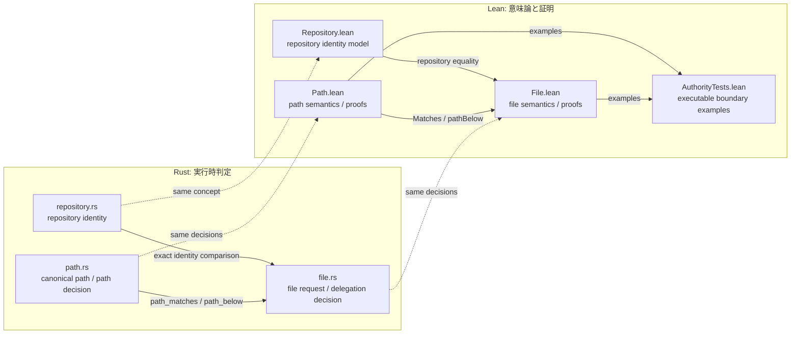
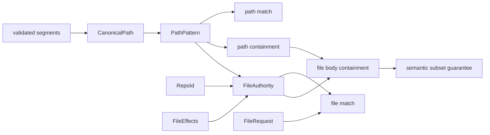

# Authority core 実装ガイド

[ドキュメント一覧](../README.md) / Authority core 実装ガイド

> **対象読者:** Authority core を変更する Rust/Lean 実装者、定理と実装の対応をレビューする人

この文書群は、現在実装されている Authority core について「各ファイルが何を担当するか」だけでなく、「何を証明し、それが実運用で何を防ぐか」まで説明する。設計理由そのものは[Capability モデル](../design/capability-model.md)と[検証戦略](../design/verification.md)を正とする。

## まず何が保証されるのか

現在の中心は、file authority の子が親より強くならないことを確認する純粋な判定である。

```text
同じ repository
∧ 子の effect ⊆ 親の effect
∧ 子の path ⊆ 親の path
```

Lean は、この判定が通った子の request は必ず親にも許可されることと、包含関係を何段つないでも崩れないことを証明する。つまり Lean モデル内では、file authority body の委譲判定が原因で親の設定範囲を越えることはない。

証明に使う集合包含、健全性、完全性、推移律を先に知りたい場合は、[Authority core で使う証明の考え方](proof-concepts.md)を参照する。

## 実装の全体像



Rust は実際の認可経路から呼ぶ純粋な `bool` 判定を担当する。Lean は同じ入力領域を命題として定義し、実行可能な `Bool` 判定が意味論と一致すること、包含判定が権限を増幅しないことを証明する。

## ファイル対応表

| ソース | 主な責務 | 詳細 |
|---|---|---|
| [`crates/authority-core/src/path.rs`](../../crates/authority-core/src/path.rs) | path segment 検証、`CanonicalPath`、`PathPattern`、matching と containment の Rust 判定、unit test | [パスモデル](paths.md) |
| [`lean/Authority/Path.lean`](../../lean/Authority/Path.lean) | path の命題的意味論、実行可能判定、健全性・完全性・推移性の証明 | [パスモデル](paths.md) |
| [`crates/authority-core/src/repository.rs`](../../crates/authority-core/src/repository.rs) | host が割り当てる `RepoId` の Rust newtype | [Repository identity](repository-identities.md) |
| [`lean/Authority/Repository.lean`](../../lean/Authority/Repository.lean) | `RepoId` の Lean モデルと決定可能な等価性 | [Repository identity](repository-identities.md) |
| [`crates/authority-core/src/file.rs`](../../crates/authority-core/src/file.rs) | file effect 集合、request matching、file delegation 判定、unit test | [File authority](file-authorities.md) |
| [`lean/Authority/File.lean`](../../lean/Authority/File.lean) | file authority の意味論、実行可能判定、包含定理 | [File authority](file-authorities.md) |
| [`lean/AuthorityTests.lean`](../../lean/AuthorityTests.lean) | Rust の境界 test と対応する Lean の executable example | [検証とテスト](verification.md) |

Rust の test は各実装ファイル内の `#[cfg(test)]` module にあるため、[検証とテスト](verification.md)でまとめて説明する。

## 判定の積み上げ



`fileMatches` / `file_matches` は1件の request を許可するかを判定する。`fileBodyBelow` / `file_body_below` は子 authority を親から委譲してよいかを判定する。Lean の `fileBodyBelow_sound` は、後者が `true` なら、子が許す全 request を親も許すことを保証する。

## 現在の実装境界

実装済みなのは repository identity、repository-relative path、file effect、file request、file authority body の matching と containment である。Capability 全体の ID、subject、issuer、有効期間、`delegable`、異なる authority body を束ねる tagged union、`WeakerThan` はまだこのファイル群にはない。

Rust と Lean の境界例は現在、両言語の test に手動で対応させている。[実装順序](../design/implementation-plan.md)にある共通 corpus による自動差分テストは未実装である。

## 関連

- [Authority core で使う証明の考え方](proof-concepts.md)
- [パスモデル](paths.md)
- [Repository identity](repository-identities.md)
- [File authority](file-authorities.md)
- [検証とテスト](verification.md)
- [Capability モデル](../design/capability-model.md)
- [検証戦略](../design/verification.md)
