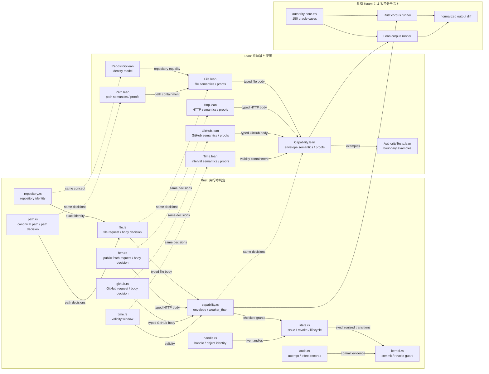
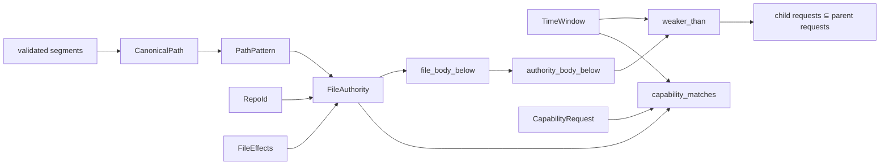

<!-- doc-type: index -->

# Authority core 実装ガイド

[ドキュメント一覧](../README.md) / Authority core 実装ガイド

> **対象読者:** Authority core を変更する Rust/Lean 実装者、定理と実装の対応をレビューする人

この文書群は、現在実装されている Authority core について「各ファイルが何を担当するか」だけでなく、「何を証明し、それが実運用で何を防ぐか」まで説明する。設計理由そのものは[Capability モデル](../design/capability-model.md)と[検証戦略](../design/verification.md)を正とする。

## 現在証明している範囲

現在の中心は、file、公開 HTTP fetch、閉じた GitHub 操作の Capability が、委譲されても親より強くならないことを確認する純粋な判定である。

```text
子の有効期間 ⊆ 親の有効期間
∧ 同じ repository
∧ 子の effect ⊆ 親の effect
∧ 子の path ⊆ 親の path
```

Lean は、この判定が通った子の時刻付き request は必ず親にも許可されることと、包含関係を何段つないでも崩れないことを証明する。非空 authority については逆向きも証明しているため、本当に包含される子を判定が誤って拒否するずれもない。

つまり Lean モデル内では、`weakerThan` が原因で親の期間・repository・effect・path 境界を越えることはなく、何段の委譲でも root の境界を保つ。

証明に使う集合包含、健全性、完全性、推移律を先に知りたい場合は、[Authority core で使う証明の考え方](proof-concepts.md)を参照する。

## 実装の全体像



Rust は実際の認可経路から呼ぶ純粋な `bool` 判定を担当する。Lean は同じ入力領域を命題として定義し、実行可能な `Bool` 判定が意味論と一致すること、包含判定が権限を増幅しないことを証明する。

## ファイル対応表

| ソース | 主な責務 | 詳細 |
|---|---|---|
| [`crates/authority-core/src/path.rs`](../../crates/authority-core/src/path.rs) | path segment 検証、`CanonicalPath`、`PathPattern`、matching と containment の Rust 判定、unit test | [パスモデル](paths.md) |
| [`lean/Authority/Path.lean`](../../lean/Authority/Path.lean) | path の命題的意味論、実行可能判定、健全性・完全性・推移性の証明 | [パスモデル](paths.md) |
| [`crates/authority-core/src/repository.rs`](../../crates/authority-core/src/repository.rs) | host が割り当てる `RepoId` の Rust newtype | [Repository identity](repository-identities.md) |
| [`lean/Authority/Repository.lean`](../../lean/Authority/Repository.lean) | `RepoId` の Lean モデルと決定可能な等価性 | [Repository identity](repository-identities.md) |
| [`crates/authority-core/src/file.rs`](../../crates/authority-core/src/file.rs) | file effect 集合、request matching、file body containment、unit test | [File authority](file-authorities.md) |
| [`lean/Authority/File.lean`](../../lean/Authority/File.lean) | file authority の意味論、実行可能判定、包含定理 | [File authority](file-authorities.md) |
| [`crates/authority-core/src/time.rs`](../../crates/authority-core/src/time.rs) | session-local monotonic time、有効な半開区間、membership と containment | [有効期間](validity-windows.md) |
| [`lean/Authority/Time.lean`](../../lean/Authority/Time.lean) | 時刻窓の集合意味論、端点判定の健全性・完全性・推移性 | [有効期間](validity-windows.md) |
| [`crates/authority-core/src/http.rs`](../../crates/authority-core/src/http.rs) | canonical host / URL path、GET / HEAD、response cap、matching と containment | [HTTP fetch authority](http-fetch-authorities.md) |
| [`lean/Authority/Http.lean`](../../lean/Authority/Http.lean) | HTTP request 集合の意味論、matching / containment の健全性・完全性・推移性 | [HTTP fetch authority](http-fetch-authorities.md) |
| [`crates/authority-core/src/github.rs`](../../crates/authority-core/src/github.rs) | installation / repository、閉じた GitHub 操作、branch pattern、matching と containment | [GitHub authority](github-authorities.md) |
| [`lean/Authority/GitHub.lean`](../../lean/Authority/GitHub.lean) | GitHub request 集合の意味論、matching / containment の健全性・完全性・推移性 | [GitHub authority](github-authorities.md) |
| [`crates/authority-core/src/capability.rs`](../../crates/authority-core/src/capability.rs) | typed ID、metadata、3種の tagged body、時刻付き matching、`weaker_than`、複合effect用の非空 request set | [Capability](capabilities.md) / [Authorization guard](authorization-guard.md) |
| [`lean/Authority/Capability.lean`](../../lean/Authority/Capability.lean) | Capability の集合意味論、matching 同値、`weakerThan` の健全性・完全性・推移性 | [Capability](capabilities.md) |
| [`crates/authority-core/src/state.rs`](../../crates/authority-core/src/state.rs) | subject 登録、静的 envelope、root 発行、保持、逐次 Derive、revoke、epoch、lifecycle、handle registry | [Capability state](capability-state.md) / [Subject lifecycle と open handle](subject-lifecycle-and-handles.md) |
| [`crates/authority-core/tests/capability_state.rs`](../../crates/authority-core/tests/capability_state.rs) | 状態遷移の成功・拒否条件と失敗時の atomicity | [Capability state](capability-state.md) |
| [`crates/authority-core/tests/capability_state_properties.rs`](../../crates/authority-core/tests/capability_state_properties.rs) | 生成した操作列を独立した参照モデルと比較する stateful property test | [Capability state](capability-state.md) |
| [`crates/authority-core/src/handle.rs`](../../crates/authority-core/src/handle.rs) | `HandleId`、`ObjectId`、subject-bound `OpenHandle` | [Subject lifecycle と open handle](subject-lifecycle-and-handles.md) |
| [`crates/authority-core/src/audit.rs`](../../crates/authority-core/src/audit.rs) | attempt journal、terminal outcome、単一/複合requestを含むcommit済み effect snapshot | [Attempt / effect audit](audit-records.md) |
| [`crates/authority-core/src/kernel.rs`](../../crates/authority-core/src/kernel.rs) | shared/exclusive guard、active authority inspection、単一/複合effectの最終認可、同期 transition、audit integration | [Authorization guard](authorization-guard.md) / [Attempt / effect audit](audit-records.md) |
| [`crates/authority-core/tests/authorization_kernel.rs`](../../crates/authority-core/tests/authorization_kernel.rs) | guard 公開 API の成功・拒否・error契約、inspection中のrevoke待機 | [Authorization guard](authorization-guard.md) |
| [`crates/authority-core/tests/authorization_kernel_loom.rs`](../../crates/authority-core/tests/authorization_kernel_loom.rs) | revoke/commit interleaving と unlocked negative control | [Authorization guard](authorization-guard.md) |
| [`crates/authority-core/src/lib.rs`](../../crates/authority-core/src/lib.rs) | Rust module の公開と `unsafe` 禁止 | 各 Rust ページ |
| [`lean/Authority.lean`](../../lean/Authority.lean) | production Lean library の入口 | 各 Lean ページ |
| [`lean/AuthorityTests.lean`](../../lean/AuthorityTests.lean) | 独立した具体的境界を固定する Lean の executable example | [検証とテスト](verification.md) |
| [`tests/fixtures/authority-core.tsv`](../../tests/fixtures/authority-core.tsv) | Rust/Lean 共通の入力、期待値、versioned schema | [検証とテスト](verification.md) |
| [`crates/authority-core/src/bin/authority-corpus.rs`](../../crates/authority-core/src/bin/authority-corpus.rs) | 共通 corpus を Rust の公開 API で評価する runner | [検証とテスト](verification.md) |
| [`lean/AuthorityCorpus.lean`](../../lean/AuthorityCorpus.lean) | 共通 corpus を Lean の production 判定で評価する test driver | [検証とテスト](verification.md) |
| [`scripts/check-authority-corpus.sh`](../../scripts/check-authority-corpus.sh) | 両 runner の正規化済み出力を比較する入口 | [検証とテスト](verification.md) |

Rust の production unit test は各実装ファイル内、公開 API の状態遷移・property・loom test は `tests/`、corpus parser の unit test は runner 内にあるため、[検証とテスト](verification.md)でまとめて説明する。

## 判定の積み上げ



`capability_matches` / `capabilityMatches` は、ある時刻の1件の request を許可するか判定する。`weaker_than` / `weakerThan` は、子 Capability を親から委譲しても authority が広がらないか判定する。Lean の `weakerThan_sound` は、後者が `true` なら、子が許す全時刻付き request を親も許すことを保証する。

## 現在の実装境界

実装済みなのは repository identity、repository-relative path、file effect と request、public HTTP fetch、閉じた GitHub operation、単調時刻の有効期間、typed metadata と3種の Capability、matching、`weakerThan` である。Rust 側にはさらに、subject と静的 envelope の登録、root 発行、保持、逐次 Derive、revoke、祖先失効、`auth_epoch`、subject lifecycle、open-handle registry、attempt/effect audit と、effect commit を revoke と線形化する `CapabilityKernel` がある。

`DurableAuditLog` は write-ahead の `Started`、terminal outcome、commit receipt、checksum、reopen 時の replay/truncation 検査を実装している。残るのは cross-process writer coordination と外部 provider receipt の照合である。Supervisor と Broker の adapter crate も実装済みだが、実 Linux resource、vsock、外部 provider を含む end-to-end は未検証である。Direct-I/O [`capfs` adapter](../capfs/read-only-fuse.md)はglobal namespace registry、Authority handle registry、実backing syscallを接続し、全10 `FileEffect`をFUSEへ対応付けている。実mountではread / write / truncate / metadata / readdir-after-revoke、create / remove / rename transaction、directory stream mutation後のrestartを検査している。全thread scheduleのrename / write競合と、隔離基盤を含むend-to-end検証は別の境界である。

150件の共通 corpus を両言語の production 判定へ流す自動差分テストがある。全10 `FileEffect`に加え、HTTP のmethod / host / path / response cap、GitHub のinstallation / repository / operation / base / head を個別に壊す境界を検査し、その後に出力同士も比較する。ただしこれは選んだ具体例についての回帰検査であり、Rust と Lean が全入力で等しいという証明ではない。

## 関連

- [Authority core で使う証明の考え方](proof-concepts.md)
- [パスモデル](paths.md)
- [Repository identity](repository-identities.md)
- [File authority](file-authorities.md)
- [有効期間](validity-windows.md)
- [Capability](capabilities.md)
- [Capability state](capability-state.md)
- [Authorization guard](authorization-guard.md)
- [Subject lifecycle と open handle](subject-lifecycle-and-handles.md)
- [Attempt / effect audit](audit-records.md)
- [検証とテスト](verification.md)
- [capfs の共有 namespace registry](../capfs/namespace-registry.md)
- [Capability モデル](../design/capability-model.md)
- [検証戦略](../design/verification.md)
