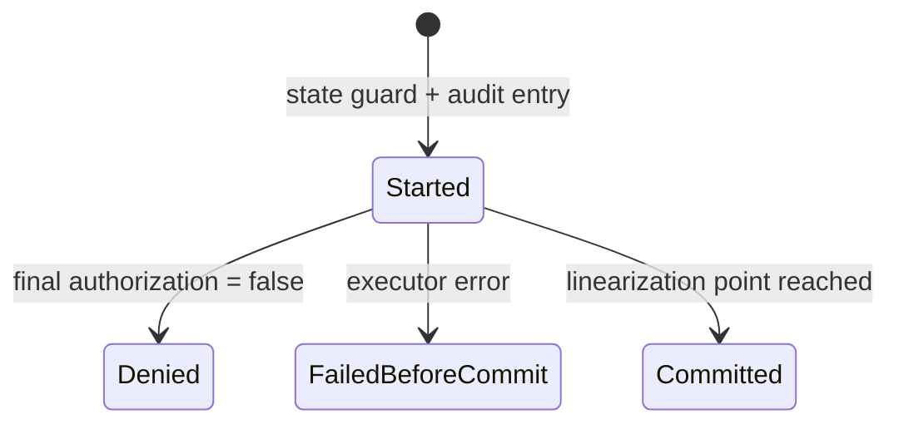

# Attempt / effect audit

[Authority core 実装ガイド](README.md) / Attempt / effect audit

このページは [`crates/authority-core/src/audit.rs`](../../crates/authority-core/src/audit.rs) と [`CapabilityKernel::authorize_and_commit`](../../crates/authority-core/src/kernel.rs) / `authorize_all_and_commit` が、認可の試行と実際に commit した effect をどう区別して記録するか説明する。

## 拒否された request と成立した effect は同じではない

攻撃的な request を受け取った事実は監査に必要だが、拒否した request を「副作用が起きた」と記録してはいけない。逆に、executor が線形化点を越えた effect を attempt log だけに残すと、実際に何が成立したか追えない。

そこで2種類の snapshot を分ける。

| Record | 含まれるもの |
|---|---|
| `AttemptRecord` | final authorization まで到達した全 request |
| `EffectRecord` | executor が線形化点を越えた attempt だけ |

## Attempt の状態

1件の attempt は次のいずれかになる。



| Outcome | Executor | Effect record |
|---|---:|---:|
| `Started` | 完了不明 | なし |
| `Denied` | 呼ばない | なし |
| `FailedBeforeCommit` | 呼んだが線形化点より前に失敗 | なし |
| `Committed` | 線形化点を越えた | あり |

executor が panic した場合、stack unwind により通常の terminal update まで届かないため `Started` が残る。これは成功扱いにせず、「開始記録はあるが完了状態が確定しなかった」attempt として調査対象にできる。

## 何を記録するか

`AttemptRecord` と `EffectRecord` は次を保存する。

- session 内で単調な `AttemptId`。
- trusted transport が決めた caller `SubjectId`。
- caller が提示した `CapId`。
- 時刻とtyped authority requestを含む、1件以上の`CapabilityRequestSet`。1件操作では従来どおり1件だけ、`O_RDWR`やrenameのような複合operationでは必要な全requestを順序どおり持つ。
- final authorization が観測した `AuthorizationEpoch`。
- attempt の場合は outcome。

これにより、「誰が」「どの Capability を使い」「何を」「どの revoke generation で」要求したかを後から対応付けられる。`request()`は既存のsingle-request consumer向けに先頭requestを返し、new codeは`requests()`で全条件を読む。複合operationを先頭pathだけで監査してはいけない。

## Commit 後に log failure を起こさない仕組み

外部 effect が成立した後で `Vec::push` や audit lock 取得に失敗すると、effect は起きたのに `EffectRecord` が残らない。

この実装は executor を呼ぶ前に journal entry を1件作る。caller、Capability、request set、epoch はこの時点で固定し、executor の後では事前作成済み entry の outcome を atomic に1回確定するだけにする。

```text
state shared guard
→ audit entry を Started で作成
→ final authorization
→ executor
→ outcome を Committed にする
→ state shared guard を解放
```

audit lock が poisoned、または `AttemptId` が枯渇して entry を作れない場合、executor を呼ぶ前に `EffectCommitError::Audit` で fail closed にする。

Committed への更新は shared state guard を解放する前に行う。このため revoke が return した時点で、それより前に commit した effect の journal outcome も確定済みである。

## `auth_epoch` と record の関係

effect が先に shared guard を取った場合、その attempt は revoke 前の epoch を記録して commit する。revoke が先なら epoch が増え、その後の attempt は新しい epoch と `Denied` を記録する。

Loom model はこの対応も検査する。

```text
Committed attempt → revoke 前の epoch
Denied attempt    → revoke 後の epoch
```

## Record の順序

`attempt_records` は attempt の開始順、`effect_records` も対応する attempt の開始順で返す。同時実行された effect の syscall-level commit 順を表す wall-clock timestamp や永続 sequence ではない。

外部監査で厳密な commit 順、時刻、耐改ざん性が必要な場合は、Broker や capfs adapter が durable log backend と commit receipt を追加する必要がある。現在の in-memory audit を、そのまま法的・永続的な監査ログとして扱わない。

## どこまで実装済みか

現在実装済みなのは次の範囲である。

- final authorization へ到達した request の append-only identity。
- 1つの外部operationに必要な複数requestの原子的な最終認可と、complete request setの監査記録。
- `Denied`、`FailedBeforeCommit`、`Committed` の区別。
- commit した attempt だけから作る effect snapshot。
- caller、Capability、typed request、`auth_epoch` の保存。
- audit entry を作れない場合の pre-executor fail closed。
- direct revoke / ancestor revoke / 複数 effect の Loom model での record consistency。

次はまだ含まれない。

- disk や外部 log service への永続化。
- hash chain、署名、remote append-only storage による耐改ざん性。
- wall-clock timestamp と複数 process 間の全順序。
- executor が返さず process ごと停止した場合の recovery protocol。
- filesystem や Broker 固有の result metadata、byte count、provider request ID。

## どう検証しているか

`audit.rs` の unit test は、Denied・FailedBeforeCommit・Committed の3件から effect が1件だけ得られることと、Attempt ID exhaustion が record 作成前に失敗することを確認する。

[`crates/authority-core/tests/authorization_kernel.rs`](../../crates/authority-core/tests/authorization_kernel.rs) は production API を通し、3 outcome、request、caller、Capability、epoch、effectとの対応を確認する。

[`crates/authority-core/tests/authorization_kernel_loom.rs`](../../crates/authority-core/tests/authorization_kernel_loom.rs) は、revoke と effect の順序に応じて outcome、effect count、epoch が矛盾しないことを bounded model で検査する。

これらは有限の Rust test と bounded concurrency model であり、audit storage 全体の数学的証明ではない。

## 関連

- [Effect commit と revoke の authorization guard](authorization-guard.md)
- [Subject lifecycle と open handle](subject-lifecycle-and-handles.md)
- [Capability の発行と逐次状態機械](capability-state.md)
- [検証とテスト](verification.md)
- [状態機械と revoke の設計](../design/state-and-revocation.md)
