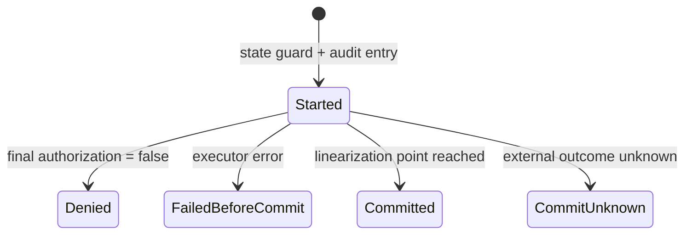

<!-- doc-type: concept -->

# Attempt / effect audit

[Authority core 実装ガイド](README.md) / Attempt / effect audit

> **対象読者:** 認可試行と effect の記録を実装する人、fail closed 境界のレビュー担当者

このページは [`crates/authority-core/src/audit.rs`](../../crates/authority-core/src/audit.rs)、[`crates/authority-core/src/durable_audit.rs`](../../crates/authority-core/src/durable_audit.rs)、および [`CapabilityKernel::authorize_and_execute_classified`](../../crates/authority-core/src/kernel.rs) が、認可の試行と実際に commit した effect をどう区別して記録するか説明する。

## 拒否された request と成立した effect は同じではない

攻撃的な request を受け取った事実は監査に必要だが、拒否した request を「副作用が起きた」と記録してはいけない。逆に、executor が線形化点を越えた effect を attempt log だけに残すと、実際に何が成立したか追えない。

そこで2種類の snapshot を分ける。

| Record | 含まれるもの |
|---|---|
| `AttemptRecord` | final authorization まで到達した全 request |
| `EffectRecord` | executor が線形化点を越えた attempt だけ |

## Attempt の状態

1件の attempt は次のいずれかになる。



| Outcome | Executor | Effect record |
|---|---:|---:|
| `Started` | 完了不明 | なし |
| `Denied` | 呼ばない | なし |
| `FailedBeforeCommit` | 呼んだが線形化点より前に失敗 | なし |
| `Committed` | 線形化点を越えた | あり |
| `CommitUnknown` | 完了状態を決定できず evidence を保存 | なし（reconciliation 待ち） |

executor が panic した場合、stack unwind により通常の terminal update まで届かないため `Started` が残る。これは成功扱いにせず、「開始記録はあるが完了状態が確定しなかった」attempt として調査対象にできる。

## 何を記録するか

`AttemptRecord` と `EffectRecord` は次を保存する。

- session 内で単調な `AttemptId`。
- trusted transport が決めた caller `SubjectId`。
- caller が提示した `CapId`。
- 時刻とtyped authority requestを含む、1件以上の`CapabilityRequestSet`。1件操作では従来どおり1件だけ、`O_RDWR`やrenameのような複合operationでは必要な全requestを順序どおり持つ。
- final authorization が観測した `AuthorizationEpoch`。
- attempt の場合は outcome。

これにより、「誰が」「どの Capability を使い」「何を」「どの revoke generation で」要求したかを後から対応付けられる。`request()`は既存のsingle-request consumer向けに先頭requestを返し、new codeは`requests()`で全条件を読む。複合operationを先頭pathだけで監査してはいけない。

## In-memory journal で Commit 後に log failure を起こさない仕組み

外部 effect が成立した後で `Vec::push` や audit lock 取得に失敗すると、effect は起きたのに `EffectRecord` が残らない。

この実装は executor を呼ぶ前に journal entry を1件作る。caller、Capability、request set、epoch はこの時点で固定し、executor の後では事前作成済み entry の outcome を atomic に1回確定するだけにする。

```text
state shared guard
→ audit entry を Started で作成
→ final authorization
→ executor
→ outcome を Committed にする
→ state shared guard を解放
```

audit lock が poisoned、または `AttemptId` が枯渇して entry を作れない場合、executor を呼ぶ前に `EffectCommitError::Audit` で fail closed にする。

in-memory journal の `Committed` 更新は shared state guard を解放する前に行う。このため revoke が return した時点で、それより前に commit した effect の in-memory outcome も確定済みである。durable backend では、この後に terminal WAL frame の `sync_all` が必要になるため、外部 effect と durable receipt の間には別の crash window がある。

## Durable WAL と commit receipt

`DurableAuditLog` は単一 writer の write-ahead journal である。kernel を
`try_new_with_durable_audit` で構成した場合、attempt ID は reopen 後の最大 ID
の次から継続し、次の順序を守る。

```text
Started frame + sync_all
→ final authorization
→ external executor の linearization point
→ terminal outcome + commit receipt frame + sync_all
```

`authorize_and_execute_classified` の executor が `EffectExecution::Committed { receipt: Some(token), .. }`
を返すと、adapter が返した provider の idempotency / acceptance token を receipt に保存する。
receipt を返さない `Committed` は「executor が成功を返した」ことを表す kernel receipt を保存するが、
外部 provider の受理を証明するものではない。

外部 effect と terminal frame は同一 filesystem transaction ではない。したがって process が
linearization point の後、receipt の `sync_all` の前に停止すると、reopen 後の record は
`Started` のままであり、effect が無かったとも committed だったとも推測しない。receipt の
persist に失敗して executor が成功を返した場合は `CommittedButAudit` となり、caller は
provider の idempotency または reconciliation を使う必要がある。

reopen は magic、version、frame length、checksum、連続 sequence、attempt ごとの一度きりの
terminal 遷移をすべて検査する。途中で切れた frame、checksum mismatch、sequence gap、replay
は拒否し、自動 truncate や「修復して成功」は行わない。checksum は torn write 検出用であり、
署名付き・耐改ざんの監査証跡ではない。

## 既存 journal に新しい capability state を付け直す

crash 後の host は、同じ journal に続きを書く。`try_recover_with_durable_audit` がその入口で、
2 つのことを順に行う。

**1. 宙ぶらりんの attempt を閉じる。** `Started` のまま残った attempt は、effect が起きたとも
起きなかったとも言えない。recovery はそれを `CommitUnknown` として durable に閉じ、evidence に
「unclean shutdown が残した attempt を recovery が閉じた」ことを記録する。閉じ終わるまで
kernel は 1 件も request を受け付けない。journal に「fate が未確定のまま放置された attempt」が
残らないようにするためである。

**2. capability-state instance を分ける。** `CapId` と `SubjectId` が一意なのは 1 つの
`CapabilityState` の中だけである。新しい state は ID を 0 から振り直すので、instance を記録
しないと、同じ journal の `cap-3` が 2 つの別々の capability を指してしまう。attempt payload
version 2 は先頭に instance を持ち、その値は attach 時点の attempt sequence である。sequence
は単調に消費されるので、record を 1 件でも書いた instance が同じ値を再び使うことはない。

## 分からなかったものを、後から確定させる

`EffectExecution::CommitUnknown { evidence }` と recovery が付ける `CommitUnknown` は「起きたかもしれないし起きていないかもしれない」という記録である。放置すると監査証跡に未確定が積み上がるので、provider に問い合わせて確定させる経路がある。

`reconcile_unknown_commits` が未解決の `CommitUnknown` を順に取り出し、`CommitReconciler` へ渡す。実装は provider 境界を持つ adapter が用意する。判定は record 自身から復号した `DurableAttemptMetadata`（caller、`CapId`、typed request、`auth_epoch`）だけで行えるので、別の帳簿と食い違う余地が無い。

**terminal record は書き換えない。** 判定は `RECONCILE` という別の frame として追記する。曖昧だったという事実は実際に起きたことであり、それを消した監査証跡では「この host はいつ何を信じていたか」に答えられない。1 つの attempt に判定は 1 回だけで、2 回目は拒否する。後から読む人がどちらを信じるか選べる状態を作らないためである。

adapter が「まだ分からない」と答えた場合は何も追記しない。推測を記録するより、未確定のままにして後で再度照合するほうが正しい。

**過去の attempt は history であって state ではない。** recovery はそれらを再認可しないし、
capability を復元もしない。復元しようとすれば、既に解放された host resource を指す capability を
作ることになる。host resource の解放は session recovery journal の仕事で、audit journal の
recovery はその後に走る。

## `auth_epoch` と record の関係

effect が先に shared guard を取った場合、その attempt は revoke 前の epoch を記録して commit する。revoke が先なら epoch が増え、その後の attempt は新しい epoch と `Denied` を記録する。

Loom model はこの対応も検査する。

```text
Committed attempt → revoke 前の epoch
Denied attempt    → revoke 後の epoch
```

## Record の順序

`attempt_records` は attempt の開始順、`effect_records` も対応する attempt の開始順で返す。同時実行された effect の syscall-level commit 順を表す wall-clock timestamp や永続 sequence ではない。

外部監査で厳密な wall-clock 時刻、複数 process 間の全順序、耐改ざん性が必要な場合は、
Broker や supervisor が署名・remote append-only storage・provider 固有 metadata を追加する必要がある。
この WAL の FNV checksum を、そのまま法的・耐改ざんの監査署名として扱ってはいけない。

## どこまで実装済みか

現在実装済みなのは次の範囲である。

- final authorization へ到達した request の append-only identity。
- 1つの外部operationに必要な複数requestの原子的な最終認可と、complete request setの監査記録。
- `Denied`、`FailedBeforeCommit`、`Committed` の区別。
- commit した attempt だけから作る effect snapshot。
- caller、Capability、typed request、`auth_epoch` の保存。
- audit entry を作れない場合の pre-executor fail closed。
- durable WAL の reopen、crash window、receipt、truncation、checksum / replay 拒否。
- 別 process からの二重 writer の拒否（実 process を起動して確認）。
- 既存 journal への新しい capability state の attach、宙ぶらりん attempt の `CommitUnknown` 化、capability-state instance の分離。
- direct revoke / ancestor revoke / 複数 effect、open handle、複数 revoke の Loom model での record consistency。

次はまだ含まれない。

- hash chain、署名、remote append-only storage による耐改ざん性。
- wall-clock timestamp と複数 process 間の全順序。
- provider へ実際に問い合わせる adapter。照合の枠組みと記録は実装済みだが、GitHub や公開 HTTPS に問い合わせる `CommitReconciler` の実装は Broker 側の担当で、まだ無い。
- filesystem や Broker 固有の result metadata、byte count、provider request ID。

## どう検証しているか

`audit.rs` の unit test は、Denied・FailedBeforeCommit・Committed の3件から effect が1件だけ得られることと、Attempt ID exhaustion が record 作成前に失敗することを確認する。

[`crates/authority-core/tests/authorization_kernel.rs`](../../crates/authority-core/tests/authorization_kernel.rs) は production API を通し、3 outcome、request、caller、Capability、epoch、effectとの対応を確認する。

[`crates/authority-core/tests/durable_audit.rs`](../../crates/authority-core/tests/durable_audit.rs) は、WAL の reopen、attempt ID 継続、Started の crash window、terminal receipt 失敗時の
`CommittedButAudit` を確認する。`durable_audit.rs` の unit test は poison、truncation、checksum / sequence
replay、receipt grammar の拒否を確認する。

[`crates/authority-core/tests/authorization_kernel_loom.rs`](../../crates/authority-core/tests/authorization_kernel_loom.rs) は、revoke と effect の順序に応じて outcome、effect count、epoch が矛盾しないことを bounded model で検査する。

これらは有限の Rust test と bounded concurrency model であり、audit storage 全体の数学的証明ではない。

## 正確な保証範囲

この module が扱うのは、認可試行と commit 済み effect を別々の record として残すこと、および記録に失敗したときに拒否側へ倒すことだけ。

- record の内容が真実であることは保証しない。呼び出し側が渡した値をそのまま残す。
- 記録が host の外へ届くことは扱わない。durable WAL は local file までで、転送と保管は運用側の責務。
- record から攻撃を検出する仕組みは無い。ここにあるのは材料だけ。
- in-memory journal は process の生存期間しか残らない。restart をまたぐのは durable WAL のほう。
- `auth_epoch` は record の順序付けに使えるが、実時刻ではない。時刻との対応はここでは持たない。
- recovery が付ける `CommitUnknown` は「分からない」という記録であって、effect が無かったことの証明ではない。provider 側の照合は運用側の責務である。
- `try_recover_with_durable_audit` は、その journal を書いた instance が host resource を既に手放していることを前提にする。稼働中の session の journal に付け直すと、2 つの capability state が同じ resource を所有していると信じたまま追記できてしまう。

## 変更時の確認点

- attempt と effect の record を 1 種類に統合しない。拒否された試行と成立した副作用を同じ表に混ぜると、後から区別できない。
- 記録失敗時の挙動を「記録を諦めて続行」に変えない。fail closed はこの module の中心。
- record に field を足すときは、in-memory journal と durable WAL の両方の形式を同時に直す。片方だけだと restart の前後で record の形が変わる。
- commit receipt を返す時点を effect の前に動かさない。commit していない effect の receipt ができる。

## 関連

- [Effect execution と revoke の authorization guard](authorization-guard.md)
- [Subject lifecycle と open handle](subject-lifecycle-and-handles.md)
- [Capability の発行と逐次状態機械](capability-state.md)
- [検証とテスト](verification.md)
- [状態機械と revoke の設計](../design/state-and-revocation.md)
