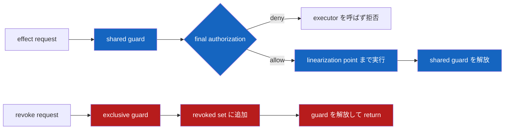
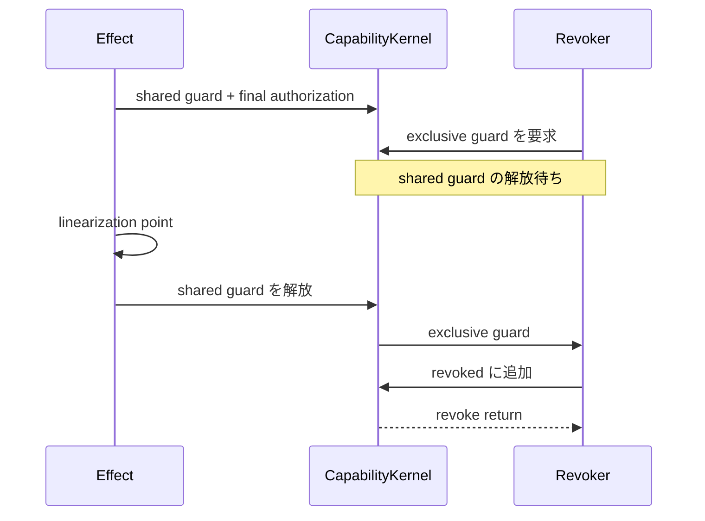

<!-- doc-type: concept -->

# Effect execution と revoke の authorization guard

[Authority core 実装ガイド](README.md) / Authorization guard

> **対象読者:** 認可と effect execution の並行境界を触る実装者、loom test のレビュー担当者

このページは [`crates/authority-core/src/kernel.rs`](../../crates/authority-core/src/kernel.rs) が、Capability の最終認可から外部 effect の線形化点までを revoke とどう競合させるか説明する。Capability の発行・保持・祖先失効は[逐次状態機械](capability-state.md)を参照する。

## 認可と実行を別々にすると何が起きるか

次の順序では、個々の処理が正しくても revoke 完了後に effect が成立する。

```text
effect thread: Capability を確認する → 有効
revoke thread: revoke を記録する → return
effect thread: backing write を発行する
```

これは check と use の間で状態が変わる TOCTOU である。認可時に revoke 集合を正しく確認するだけでは閉じられない。

`CapabilityKernel` は `CapabilityState` 全体を reader-writer lock で保護する。effect は shared read guard、revoke と発行 transition は exclusive write guard を使う。



同時に複数の認可済み effect が走ることは許すが、revoke はそれらが線形化点を越えて shared guard を返すまで待つ。

## 公開型の責務

| 型 | 責務 |
|---|---|
| `CapabilityKernel` | `CapabilityState` を同期境界に入れ、発行 transition、revoke、effect commit を直列化する |
| `CapabilityKernelError` | lock poisoning と逐次状態機械の typed error を区別する |
| `EffectCommitError<E>` | state/audit lock failure、認可拒否、pre-commit 失敗、commit 後の audit failure、完了不明を区別する |
| `EffectExecution<T, E>` | executor が `FailedBeforeCommit`、`Committed`、`CommitUnknown` を明示する |
| `DurableAuditLog` / `CommitReceipt` | Started WAL、terminal receipt、reopen 時の厳密な検証 |
| `CapabilityInspectionError<E>` | effectを起こさないauthority inspectionのinactive、lock、callback errorを区別する |
| `AttemptRecord` / `EffectRecord` | 全 checked request と、commit 済み effect を区別する |

`register_subject`、`issue_root`、`derive`、`revoke` は exclusive guard の内側で既存の逐次 transition を呼ぶ。逐次状態機械の検査条件を複製せず、同期だけを外側に追加している。

## 1件と複数条件の effect をどう扱うか

`authorize_and_execute_classified` は、1件の`CapabilityRequest`を持つ通常の operation 用の入口である。
`READ`、単純な`WRITE`、1 pathの`UNLINK`などはこれでよい。

一方、`O_RDWR`、`O_TRUNC`、`RENAME`、複合`SETATTR`のように、1回の外部操作が複数の権限境界をまたぐことがある。これを`authorize_and_execute_classified`へ順番に渡すと、前半だけがcommit済みと監査される、checksの間にrevokeが完了する、といった中間状態を作ってしまう。

`CapabilityRequestSet`は必ず1件以上の request を持ち、保持する request 数は `MAX_REQUESTS_PER_EFFECT`（現在16）までに制限される。入力 iterator が上限を越えた場合は `is_complete() == false` になり、kernel は audit や executor の前に `NotAuthorized` で拒否する。`CapabilityKernel::authorize_all_and_execute_classified` は、complete な set 全件を次の1回の呼び出しに閉じ込める。

```text
shared guard を取得
→ `Started` audit entry を作成
→ caller / held / ancestor / time / request set全件を最終確認
→ 認可に使った Capability の参照を executor へ渡す
→ executor が `EffectExecution` を返す
→ `Committed` / `FailedBeforeCommit` / `CommitUnknown` を分類して audit を確定
→ shared guard を解放
```

Capability の参照は read guard 内の `CapabilityState` を借用している。この参照を executor 呼び出しへ渡すことで、lock の寿命が認可判定だけで終わらずexecutor完了まで続く。

set内の1件でも認可が失敗した場合、executor は一度も呼ばれず `EffectCommitError::NotAuthorized` を返す。executor が `EffectExecution::FailedBeforeCommit(error)` を返した場合は `EffectCommitError::Effect(error)` となる。executor 前に audit entry を作れない場合は `EffectCommitError::Audit(error)` で fail closed にする。`Committed` 後に terminal receipt を保存できなかった場合は `EffectCommitError::CommittedButAudit { attempt_id, receipt, source }` となる。`CommitUnknown { evidence }` は `EffectCommitError::CommitUnknown { attempt_id, evidence }` として durable に閉じ、evidence の保存にも失敗した場合は `CommitUnknownAndAudit { attempt_id, evidence, source }` になる。いずれも外部 effect の可能性を失敗に偽装せず、provider の reconciliation が必要である。記録の仕組みは[Attempt / effect audit](audit-records.md)を参照する。

現在のsetは1つの`CapId`に対して使う。複数Capabilityを合成して権限を足し合わせない。mountへ固定したCapabilityが、操作に必要な全requestを単独で許可しなければならない。この制限により、どのCapabilityが副作用を許可したかをaudit recordから一意に追える。

### 具体例: `O_RDWR`

```text
CapabilityRequestSet {
  ReadData(workspace, /src/main.rs, now),
  WriteData(workspace, /src/main.rs, now),
}
```

両方が許可されたときだけ、read/write両用のbacking descriptorを開く。recordは2つの独立effectではなく、2つの条件を持つ1つのopen operationとして残る。以後の`READ`と`WRITE`は、それぞれ現在pathに対して改めて単一requestを認可するため、open時の結果を失効後まで使い回さない。

`O_WRONLY | O_TRUNC`は同じ形で`WriteData`と`Truncate`をsetへ入れる。`O_RDWR | O_TRUNC`なら`ReadData`、`WriteData`、`Truncate`の3件になる。全件を満たすCapabilityだけがopenとdescriptor-relative `ftruncate`を同じshared guard内で進められるため、`WriteData`だけを持つCapabilityが長さ変更を副作用として紛れ込ませることはない。

## effectを起こさないauthority inspection

filesystemのpath walkでは、file内容を読む前に「このpathのmetadataを見せてよいか」をCapabilityのpath patternから導く必要がある。この判定を`ReadData`のeffectとして記録すると、実data readが起きていないのにeffect auditが作られる。

`with_active_capability`は、caller binding、held、subject lifecycle、有効期間、祖先revokeを確認し、activeなCapabilityの参照をcallbackへ渡す。callbackがreturnするまで同じshared guardを保持するので、途中でrevokeが完了することはない。ただし外部effect用ではなく、attempt / effect auditも作らない。

```text
with_active_capability: authority metadataからvisibilityを導く
authorize_and_execute_classified: backing read/writeなど外部effectを実行する
EffectExecution::Committed { receipt: Some(..) }: external acceptance tokenをterminal WALへ保存する
```

この2つを混同しないことが契約である。現在のDirect-I/O capfsは、`LOOKUP` / `GETATTR`のvisibilityに前者、`OPEN` / `READ` / `WRITE`の実操作に後者を使う。[Direct-I/O FUSE adapter](../capfs/read-only-fuse.md)

## Executor が守る契約

lock は外部 syscall がどこで成立したかを自動判定できない。`commit_to_linearization` closure は次を守る必要がある。

- backing syscall や Broker acceptance など、操作ごとに定義した線形化点を越えてから成功を返す。
- 線形化点より前の失敗だけを `Err` として返す。
- 処理を別 thread へ投げただけで成功を返さない。
- closure 内から同じ `CapabilityKernel` の `revoke`、`derive`、発行 API を呼ばない。shared guard を持ったまま exclusive guard を要求するとdeadlockし得る。

そのため `authorize_and_execute_classified` / `authorize_all_and_execute_classified` が保証するのは、executor がこの契約に従って `EffectExecution` を返す場合の認可と revoke の順序である。filesystem adapter や Broker adapter が間違った線形化点で return したり、完了不明を `Committed` に分類したりすれば、その外部処理まで自動的に安全にはならない。

## Revoke と effect の2つの順序

### Effect が先に shared guard を取る



effect は revoke より先に成立した操作であり、revoke は巻き戻さない。

### Revoke が先に exclusive guard を取る

revoke が `revoked` へ追加してreturnした後、effect は shared guard を取得する。最終認可が祖先chainのrevokeを検出するため、executorは呼ばれない。

したがって、revoke がreturnした後に、失効したCapabilityだけを根拠とする新しいeffect commitは発生しない。

## Lock failure は fail closed にする

標準 `RwLock` は、exclusive writer がpanicするとpoisonedになる。kernelはpoisonを無視して内部状態を再利用せず、以後のtransitionとeffectをtyped errorで拒否する。reader内のpanicだけでは標準 `RwLock` はpoisonされないが、executorのpanicは通常どおりcallerへ伝播する。[Rust `RwLock` documentation](https://doc.rust-lang.org/std/sync/struct.RwLock.html)（2026-08-11参照）

標準 `RwLock` はreaderとwriterの取得順序やwriter starvationを保証しない。この実装が閉じるのはauthorization safetyであり、revoke latencyの上限ではない。運用で待ち時間上限が必要になった場合は、計測した上でfair lockまたは直列executorを別途評価する。

## Durable journal が検査するもの

WAL は `Started` を外部 effect 前に `sync_all` し、executor 成功後に receipt 付き terminal frame を
`sync_all` する。reopen は途中 frame、checksum mismatch、sequence gap、attempt の二重 finish / replay を
fail closed で拒否する。linearization point と terminal frame の間に原子的な境界はないため、crash 後の
`Started` は「effect 未成立」ではなく「完了不明」である。

## Loom が検査するもの

通常buildでは `std::sync::RwLock` を使う。`RUSTFLAGS='--cfg loom'` を付けたmodel testでは、同じ `CapabilityKernel` のlockだけを `loom::sync::RwLock` へ差し替える。

[`crates/authority-core/tests/authorization_kernel_loom.rs`](../../crates/authority-core/tests/authorization_kernel_loom.rs) には8つの model がある。

| Model | 期待する結果 | 確認すること |
|---|---|---|
| direct revoke / 1 effect | 全 interleaving で pass | executor が走るなら revoke return より前、revoke が先なら認可拒否になる |
| ancestor revoke / descendant effect | 全 interleaving で pass | root revoke が child Capability の effect も同じ順序で止める |
| direct revoke / compound effect | 全 interleaving で pass | request set全件のexecutor処理がguard内で完了するか、executorへ入らずset全体が拒否される |
| ancestor revoke / descendant compound effect | 全 interleaving で pass | root revokeでもcompound effectが部分実行・部分監査されず、全requestが1件のattemptとして残る |
| direct revoke / 2 effects | preemption bound 2 で pass | 両 effect が先、revoke が先、effect が1件ずつ両側になる順序で audit と commit 数が一致する |
| open handle / shutdown | preemption bound 2 で pass | 登録が先なら live handle が Closed を止め、shutdown が先なら登録を拒否する |
| direct + ancestor / 2 revoke | preemption bound 2 で pass | 2つの revoke が各1回だけ epoch を進め、descendant effect と順序付く |
| unlocked negative control | 指定した assertion で panic | 認可直後に guard を解放すると、revoke return 後の commit 順序が実在する |

negative controlは「壊れた実装もtestが緑になる」ことを防ぐ検査である。loomはthread実行順を繰り返し変え、bounded model内の可能な並行実行を探索する。[Loom documentation](https://docs.rs/loom/latest/loom/model/fn.model.html) / [Loom repository and limitations](https://github.com/tokio-rs/loom)（2026-08-11参照）

実行コマンドは次のとおり。

```bash
RUSTFLAGS='--cfg loom' cargo test --package authority-core --test authorization_kernel_loom
RUSTFLAGS='--cfg loom' cargo clippy --package authority-core --test authorization_kernel_loom -- -D warnings
```

## 正確な保証範囲

現在は、単一・compound effectとdirect / ancestor revoke、2 effects、open handle と shutdown、direct + ancestor の複数 revoke を検査する。2 threadのmodelは全interleaving、3 thread以上のmodelは同値なscheduleの爆発を避けるためpreemption bound 2で探索する。各modelはattempt outcomeとeffect countを確認し、単一requestでは`auth_epoch`、compound requestでは監査されたrequest set全件との対応も確認する。

次はまだ含まれない。

- rename、unlink を含む filesystem 固有の競合。
- truncate、create、remove、renameを含むexecutor adapterが、実際のsyscallを正しい線形化点まで実行すること。
- writer fairness、revoke latency、負荷時の性能。
- 4 thread 以上、複数 Capability tree、複数 revoke を組み合わせた model。
- Rust 状態機械や lock 実装全体の数学的証明。

Direct-I/O capfsの`OPEN` / `READ` / `WRITE`については、executorがfd open、`pread`、`pwrite`の完了までreturnしない実装と、実FUSE mount上のread-after-revoke / write-after-revoke testを追加している。これはtruncate、rename、unlinkまで一般化した検証ではない。

loom自身にもC11 memory modelの未対応部分があるため、bounded modelのpassを実システム全体の証明とは扱わない。今回のmodelはatomicだけで認可を組み立てず、reader-writer lockの排他順序を検査対象にしている。

## 変更時の確認点

- read guard を保持する区間を短くしない。commit point より前に手放すと、revoke と effect の順序が入れ替わる。
- executor 契約に「effect を起こさない場合がある」を追加するときは、audit 側が commit されなかったことを記録できるかを確認する。
- lock 取得の失敗を retry に変えない。現在は fail closed で、これが loom の negative control の前提になっている。
- loom の探索対象を増やすときは、positive control（本来通るべき順序が通ること）も同時に足す。negative control だけだと、全部拒否する実装でも通る。
- 認可と effect commit を別の lock に分けない。線形化が壊れる。

## 関連

- [Capability の発行と逐次状態機械](capability-state.md)
- [Subject lifecycle と open handle](subject-lifecycle-and-handles.md)
- [Attempt / effect audit](audit-records.md)
- [検証とテスト](verification.md)
- [状態機械と revoke の設計](../design/state-and-revocation.md)
- [検証戦略](../design/verification.md)
- [実装順序](../design/implementation-plan.md)
