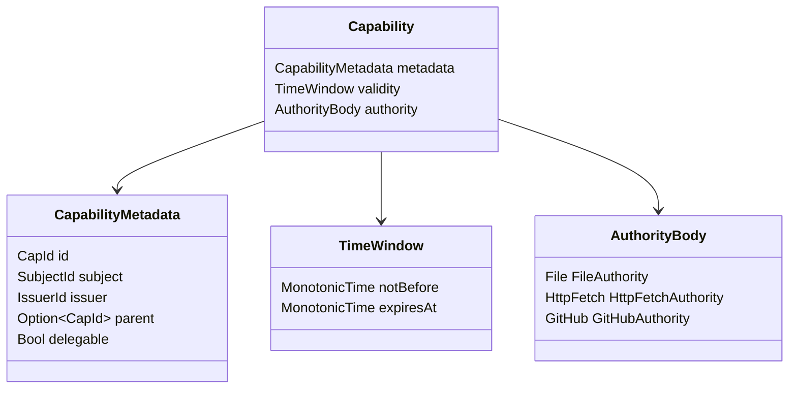
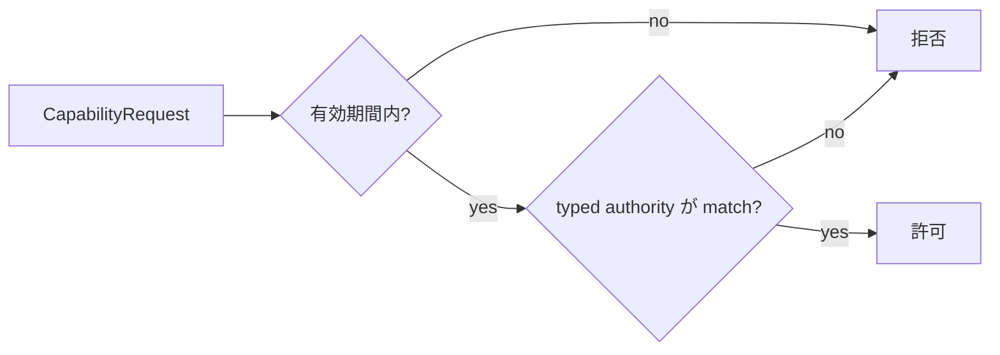
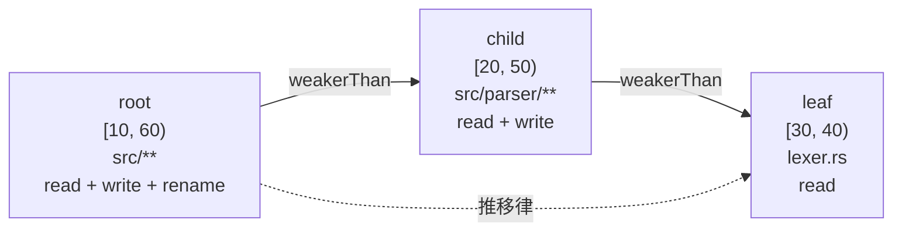

# Capability envelope と委譲証明

[Authority core 実装ガイド](README.md) / Capability

このページは [`crates/authority-core/src/capability.rs`](../../crates/authority-core/src/capability.rs) と [`lean/Authority/Capability.lean`](../../lean/Authority/Capability.lean) が、各 authority family を有効期間や発行情報と結び付け、Capability 全体の包含をどう判定・証明しているかを説明する。

## 権限本体を実際に使える札へまとめる

authority body だけでは「何ができるか」は表せても、「誰へ発行されたか」「いつ使えるか」「どの Capability から派生したか」は表せない。`Capability` はそれらを3つの部分へ分けて持つ。



| 部分 | 担当する問い |
|---|---|
| `CapabilityMetadata` | この札は何者で、誰が持ち、誰が発行し、親は何か、再委譲可能か |
| `TimeWindow` | request 時刻に有効か、子の期間が親からはみ出していないか |
| `AuthorityBody` | どの種類の resource と operation を許可するか |

`CapId`、`SubjectId`、`IssuerId` は別々の型なので、Capability ID を subject 欄へ誤って渡すような取り違えを Rust と Lean の型で防ぐ。文字列の採番・一意性・真正性は host の identity issuer が担当する。

## 型付き authority と request

`AuthorityBody` と `AuthorityRequest` は resource family ごとに対応する variant を持つ。

```text
AuthorityBody    = File(FileAuthority) | HttpFetch(HttpFetchAuthority) | GitHub(GitHubAuthority)
AuthorityRequest = File(FileRequest) | HttpFetch(HttpFetchRequest) | GitHub(GitHubRequest)
```

任意の文字列や汎用 JSON を authority として通す fallback はない。異なる variant の body/request matching と body containment は常に `false` である。新しい provider API を加える場合も、body と request の variant、matching、containment、Lean の意味論を同時に追加する。

`authority_matches` / `authorityMatches` は同じ種類の body と request を対応させる。Lean の `authorityMatches_iff_matches` は、実行可能な `Bool` と `AuthorityBody.Matches` という命題が一致することを証明する。

## 1件の request を許可する条件

`CapabilityRequest` は request 本体と、認可する単調時刻を組にする。

```text
capability.validity contains request.time
∧ capability.authority matches request.authority
```



Rust の `capability_matches` はこの2条件を計算する。Lean の `Capability.Matches` は同じ意味を命題として定義し、`capabilityMatches_iff_matches` が両者の同値を証明する。

ただし、この純粋関数だけでは caller が `metadata.subject` 本人か、Capability を現在保持しているか、revoke 済みでないかは判定しない。それらは request を受け取った状態機械が caller identity と保持状態から確認する。

## 子 Capability が親より弱い条件

`weaker_than` / `weakerThan` は、Capability が表す**時刻付き authority request の集合**だけを比較する。

```text
child.validity ⊆ parent.validity
∧ child.authority ⊆ parent.authority
```

file authority では、展開すると次の5条件になる。

```text
parent.not_before ≤ child.not_before
∧ child.expires_at ≤ parent.expires_at
∧ child.repository = parent.repository
∧ child.effects ⊆ parent.effects
∧ child.path ⊆ parent.path
```

どれか1つでも親を越えれば拒否する。たとえば path と effect を狭めても開始時刻を親より早めれば `false` になる。

## metadata を `weakerThan` に含めない理由

`id`、`subject`、`issuer`、`parent`、`delegable` は重要だが、authority request 集合の大きさではない。

- 正当な child は parent と別の `CapId` を持つ。
- child subject も parent subject と異なり得る。
- `parent` は「どこから派生したか」を状態機械が検証する link である。
- `delegable` は「この Capability から子を発行してよいか」という transition 条件であり、既存 request を許す範囲ではない。

これらを集合包含へ混ぜると、正しい child まで「ID が違うから親以下ではない」と判定してしまう。そこで `weakerThan` は純粋な authority 比較に限定し、`Derive` transition が別に次を確認する。

```text
親を保持している
∧ 親と祖先が有効・未失効
∧ parent metadata が要求された親と一致する
∧ 親が delegable
∧ weakerThan child parent
∧ child subject の静的 envelope 内
```

この分離により、数学的な集合包含と stateful な発行ポリシーを混同せずにレビューできる。

## どんな数学で証明しているのか

### 直積の包含

Capability が許可する request は、時刻集合と typed authority request 集合の組として考えられる。子が親以下になるには両方が部分集合でなければならない。

| 成分 | 下位層の証明 | Capability での使い方 |
|---|---|---|
| 有効期間 | `timeWindowBelow_sound` / `trans` | 子で有効な時刻が親でも有効 |
| authority body | `authorityBodyBelow_sound` / `trans` | 子が許す typed request を親も許可 |
| Capability 全体 | `weakerThan_sound` / `trans` | 2成分を組み合わせた時刻付き request 包含 |

### 健全性: 子だけが許す request は生まれない

`weakerThan_sound` は次を証明する。

```lean
weakerThan child parent = true
→ ∀ request, child.Matches request → parent.Matches request
```

これは特定の path や時刻だけの test ではない。Lean の `CapabilityRequest` として表せる任意の時刻・任意の同型 authority request について、child で許可されるなら parent でも許可される。

### 反射律と推移律: 多重委譲でも root を越えない

`weakerThan_refl` は、Capability が自分自身以下になることを示す。

`weakerThan_trans` は次を示す。

```text
leaf ≤ child
child ≤ root
──────────────
leaf ≤ root
```



何十段の委譲でも各隣接 pair を確認すればよく、末端が root の時刻と authority family ごとの境界を越えないことが推移律から従う。

### 完全性: 本当の包含を誤って拒否しない

child authority が少なくとも1件の request を許す場合、逆向きも証明している。

```text
child の全 request を parent も許可する
∧ child authority が非空
→ weakerThan child parent = true
```

`weakerThan_complete_of_authority_nonempty` と `weakerThan_iff_matches_subset_of_authority_nonempty` により、非空 child では実装判定と意味論的な request 集合包含が一致する。

非空条件が必要なのは、effect が空の file authority はどの request も許さず、repository や path が違っても意味論上は同じ空集合になるためである。安全側の `weakerThan_sound` にはこの条件はなく、空 authority でも常に成立する。

## 何が助かるのか

### 期間と file 権限を別々に確認して終わらせない

Capability 全体の定理があるため、「path は狭いが期限は広い」といった成分間の見落としを1つの `weakerThan` で拒否できる。

### 発行ポリシーとの責務境界が明確になる

`weakerThan` が `delegable` や subject binding を確認しないことを明示している。[逐次状態機械](capability-state.md)は、それらを省略できない独立条件として `Derive` transition で検査する。

### 新しい authority family の追加漏れが見える

typed enum に variant を増やすと、matching と containment の `match` も更新対象になる。Lean 側でも同じ variant と証明が必要なので、汎用 fallback で未定義の権限が紛れ込まない。

## 正確な保証範囲

Lean で実装・証明済みなのは file / HTTP fetch / GitHub variant の Capability envelope、時刻付き matching、純粋な `weakerThan` である。Rust ではこれに加え、逐次 `CapabilityState` が次を実装している。

- Capability ID の一意な採番と再利用防止。
- caller と `SubjectId` の binding、held set、parent link の検証。
- `delegable` を確認して子を発行する `Derive` transition。
- revoke、祖先失効、target subject の静的 envelope。

`CapabilityKernel` はさらに、最終認可から effect の線形化点まで shared guard を保持し、exclusive revoke と同じ順序へ置く。bounded interleaving は[Authorization guard](authorization-guard.md)の loom test で検査する。

Rust state には、`auth_epoch`、subject lifecycle、open-handle registry、attempt/effect audit も実装している。これらは Lean の純粋な `weakerThan` theorem の対象ではなく、Rust transition test と Loom model で別に検査する。

次はまだ含まれない。

- 使用回数、durable audit storage、global namespace registry。
- OS/FUSE operation を正しい `CapabilityRequest` へ変換する adapter。
- HTTP redirect / DNS / response streaming や GitHub API call を実際に強制する Broker adapter。

したがって `weakerThan_sound` は「Capability システム全体が完成した」という定理でも、Rust の状態遷移全体の証明でもない。現在の型付き file request と単調時刻の Lean モデル内で、受理した包含判定が authority を増幅しないという定理である。逐次状態遷移は契約 test と参照モデルを使った property test で別に検査する。

## 定理と実装の対応

| Lean の定義・定理 | 何を保証するか | 対応する Rust |
|---|---|---|
| `authorityMatches_iff_matches` | tagged body の実行判定と意味論が一致 | `authority_matches` |
| `authorityBodyBelow_refl` / `trans` | body containment を多段でつなげられる | `authority_body_below` |
| `authorityBodyBelow_sound` | child body の全 request が parent body に含まれる | `authority_body_below` の安全側仕様 |
| `capabilityMatches_iff_matches` | 時刻付き request 判定と意味論が一致 | `capability_matches` |
| `weakerThan_refl` / `trans` | Capability 包含を多段でつなげられる | `weaker_than` |
| `weakerThan_sound` | child の全時刻付き request が parent に含まれる | `weaker_than` の安全側仕様 |
| `weakerThan_complete_of_authority_nonempty` | 非空 child の本当の包含を誤拒否しない | `weaker_than` の受理側仕様 |
| `weakerThan_iff_matches_subset_of_authority_nonempty` | 非空 child では判定と集合包含が同値 | `weaker_than` 全体の仕様 |

この対応は定義と責務の対応であり、Lean が Rust の machine code を直接検証しているという意味ではない。現在は共通 corpus の Capability case について期待値と両実装の結果を自動比較するが、有限の case から全入力の同値を結論しない。

## 変更時の確認点

- metadata field を増やすときは、それが authority 集合の軸か、state-machine policy かを先に分類する。
- `AuthorityBody` に variant を増やすときは、対応する request、matching、containment、Rust test、Lean example、sound theorem を同時に追加する。
- `weakerThan` の条件を増やしたら `refl` と `trans` が本当に成立する関係か確認する。
- matching に入力軸を増やしたら、`CapabilityRequest` の意味論と `capabilityMatches_iff_matches` に漏れなく反映する。
- 完全性を維持する場合は、authority の非空条件が新しい variant でも十分かを確認する。
- metadata や発行条件を変えたら、`CapabilityState` の transition test と参照モデルを同時に更新する。

## 関連

- [有効期間と時刻窓の包含証明](validity-windows.md)
- [File authority と包含証明](file-authorities.md)
- [HTTP fetch authority](http-fetch-authorities.md)
- [GitHub authority](github-authorities.md)
- [Authority core で使う証明の考え方](proof-concepts.md)
- [検証とテスト](verification.md)
- [Capability モデル](../design/capability-model.md)
- [Capability の発行と逐次状態機械](capability-state.md)
- [Effect commit と revoke の authorization guard](authorization-guard.md)
- [状態機械と revoke](../design/state-and-revocation.md)
