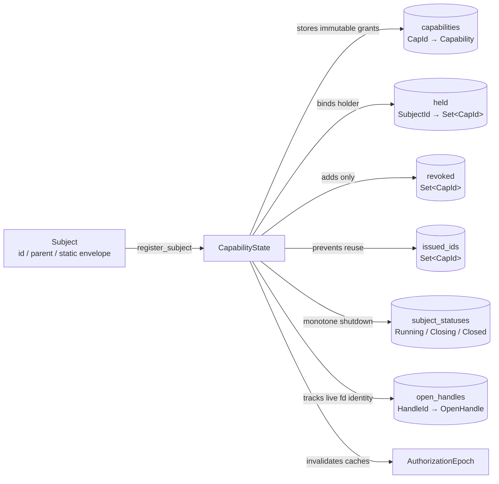
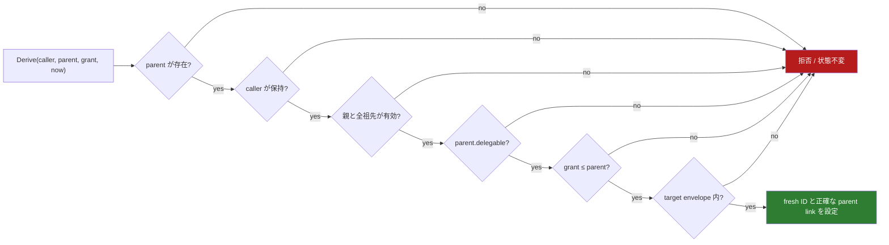

<!-- doc-type: concept -->

# Capability の発行と逐次状態機械

[Authority core 実装ガイド](README.md) / Capability state

> **対象読者:** Capability の発行・保持・revoke を実装する人

このページは [`crates/authority-core/src/state.rs`](../../crates/authority-core/src/state.rs) が、Capability の発行、保持、委譲、失効をどの順序で検査するかを説明する。権限本体の包含と Lean の定理は [Capability envelope と委譲証明](capabilities.md)を参照する。

## 純粋な包含判定だけでは足りない理由

`weaker_than(child, parent)` が確認するのは、child の時刻付き request 集合が parent に含まれるかどうかである。次の問いは状態がなければ答えられない。

- request を送った subject が本当に parent を保持しているか。
- parent が再委譲を許可しているか。
- parent または祖先が revoke 済みではないか。
- child を受け取る subject の静的 envelope に収まるか。
- 新しい Capability ID が過去に使われていないか。

`CapabilityState` は、この5点と `weaker_than` を1つの `Derive` transition にまとめる。

## 状態が持つもの



| 型 | 責務 |
|---|---|
| `StaticAuthorityEnvelope` | subject に後から追加できる時刻・authority の上限 |
| `Subject` | subject ID、既存の親 subject、静的 envelope |
| `CapabilityGrant` | 新しい Capability に求める subject、期間、authority、`delegable` |
| `CapabilityState` | ID 発行、metadata 構築、保持関係、親子 link、revoke 集合 |
| `RevocationStatus` | revoke が新規だったか、すでに revoke 済みだったか |
| `AuthorizationEpoch` | revoke と shutdown による authorization state の単調 version |
| `SubjectStatus` | `Running → Closing → Closed` の一方向 lifecycle |
| `OpenHandle` | live handle の ID、owner subject、namespace object の binding |

`CapabilityGrant` は `id`、`issuer`、`parent` を持たない。これらを外部 request に書かせず、すべての検査が成功した後で state が設定するためである。

現在の ID は `issuer:sequence` というセッション内の単調番号で作る。値を秘密として扱う設計ではない。別 subject が ID を知っても、`held` と `metadata.subject` が一致しなければ使用も委譲もできない。

## Subject の登録

`register_subject` は同じ `SubjectId` の再登録を拒否する。親 subject を持つ場合は、親を先に登録しなければならない。

これにより public API から作られる subject graph は、既存 node にだけ親 link を張る非循環な forest になる。ただし現在の `Derive` は「target subject が caller の子孫か」までは要求しない。委譲先の選択ポリシーは supervisor 側の orchestration として別に決める必要がある。

## Root 発行

`issue_root` は host が最初の Capability を subject へ渡す transition である。

```text
target subject が登録済み
∧ grant.validity ⊆ subject.envelope.validity
∧ grant.authority ⊆ subject.envelope.authority
```

成功すると state が fresh ID と issuer を設定し、`parent = None` の Capability を保存して target subject の `held` に追加する。拒否した場合は ID sequence、`issued_ids`、`held`、`capabilities` のどれも変えない。

## Derive



祖先の有効性は、親 link を root まで辿って各 Capability の半開期間と revoke 集合を確認する。public API では循環を作れないが、内部状態が壊れて循環または存在しない親が現れた場合も fail closed で inactive にする。

成功時にだけ ID を割り当てるため、攻撃的な失敗 request を大量に送っても ID sequence に穴は開かない。成功した child の metadata は次の形になる。

```text
id         = state が新規発行した ID
subject    = grant の登録済み target subject
issuer     = state の session issuer
parent     = 呼び出しで検査した parent ID
delegable  = grant の指定
```

## Authorization

`authorizes(caller, capability_id, request)` は次をすべて満たすときだけ `true` を返す。

```text
Capability が存在する
∧ caller が held に持つ
∧ Capability.metadata.subject = caller
∧ Capability と全祖先が request.time に有効・未失効
∧ capability_matches(Capability, request)
```

未知 ID、別 subject からコピーした ID、期限外、scope 外、直接 revoke、祖先 revoke はすべて `false` になる。caller identity 自体を socket fd などの信頼できる境界から決める処理は、この純粋な state module の外にある。

## Revoke

`revoke` は発行済み ID を `revoked` set に追加し、`auth_epoch` を1増やす。2回目以降も成功するが `AlreadyRevoked` を返し、set から取り除く transition も epoch を余分に進める処理もない。

child 自身を `revoked` に複製して入れる必要はない。`is_effectively_active` と `authorizes` が親 link を root まで辿るため、祖先を1件 revoke すると全子孫が即座に inactive になる。Capability record と held relation は監査可能な履歴として残る。

subject shutdown と open handle の transition は[Subject lifecycle と open handle](subject-lifecycle-and-handles.md)、commit 時の attempt/effect record は[Attempt / effect audit](audit-records.md)で詳しく説明する。

## どんな数学が効いているのか

### 親子 edge の局所検査と推移律

各 Derive は `child ≤ parent` だけを検査する。純粋な `weaker_than` には Lean で推移律が証明されている。

```text
leaf ≤ child
child ≤ root
──────────────
leaf ≤ root
```

したがって、state がすべての親子 edge で包含判定を省略しなければ、何段先の子孫も root の時刻・repository・effect・path を越えない。毎回 leaf と全祖先を authority 比較する必要はない。

### 帰納的不変条件

空の state には不正な Capability がない。root 発行は静的 envelope 内だけ、Derive は既存の安全な state に `child ≤ parent` かつ envelope 内の1件だけを追加する。失敗 transition と revoke は authority を追加しない。

この「初期状態で真で、安全な transition 後も真」という考え方が帰納的不変条件である。ただし、現在 Lean が証明しているのは `weaker_than` の推移性と集合包含であり、Rust の `CapabilityState` transition 全体を定理として証明したわけではない。

## どう検証しているか

[`crates/authority-core/tests/capability_state.rs`](../../crates/authority-core/tests/capability_state.rs) は、11個の契約 test で各成功・拒否 transition と error、失敗時の atomicity、祖先 revoke、Capability/handle ID 非再利用、subject shutdown を確認する。`state.rs` 内には `u64::MAX` の最後の Capability ID と、authorization epoch の wraparound 拒否を確認する2 test がある。

[`crates/authority-core/tests/capability_state_properties.rs`](../../crates/authority-core/tests/capability_state_properties.rs) は、1〜63操作の Derive/revoke 列を1,000 case 生成する。Rust state と独立した小さな参照モデルで各 transition の成否を比較し、毎回すべての発行済み Capability について次を再確認する。

- metadata の subject・parent・`delegable` がモデルと一致する。
- holder だけが ID を使用できる。
- child が直近 parent 以下で、target envelope 内にある。
- revoke と時刻境界を含む祖先 chain の active 判定が一致する。
- 成功した発行だけが連続した fresh ID を得る。

この property test は多くの操作列を探索するが、数学的な全状態証明ではない。失敗時には proptest が短い反例へ shrink する。

## 現在の境界

このページの `CapabilityState` が実装するのは、1 thread 上で順番が確定した subject 登録、root 発行、Derive、保持確認、authorization、revoke と祖先失効、`auth_epoch`、subject lifecycle、open-handle registry である。並行利用では、この state を[Authorization guard](authorization-guard.md)の `CapabilityKernel` に入れる。attempt/effect の durable WAL は `authority-core` の durable audit module が state machine の外側で journalize する。

まだ含まれないものは次のとおり。

- global namespace registry、実 fd、cgroup、mount を片付ける supervisor / capfs orchestration。
- hash chain、署名、remote append-only storage による audit record の耐改ざん性。
- supervisor の socket fd から caller identity を決める adapter。
- HTTP redirect / DNS / response streaming と GitHub API call を実際に強制する Broker adapter。

`CapabilityKernel` は executor closure と revoke の順序を線形化する。ただし closure が実際の filesystem や外部 effect の正しい線形化点まで進んでから return する責任は adapter 側にあり、現在は実 mount や Broker との end-to-end 検証まではない。

## 関連

- [Capability envelope と委譲証明](capabilities.md)
- [検証とテスト](verification.md)
- [Effect commit と revoke の authorization guard](authorization-guard.md)
- [Subject lifecycle と open handle](subject-lifecycle-and-handles.md)
- [Attempt / effect audit](audit-records.md)
- [状態機械と revoke の設計](../design/state-and-revocation.md)
- [Capability モデル](../design/capability-model.md)
- [検証戦略](../design/verification.md)
