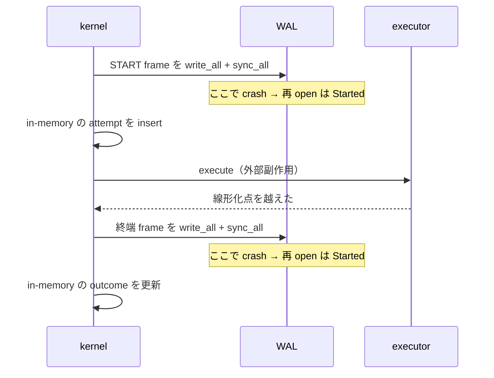

<!-- doc-type: concept -->

# Durable audit journal

[Authority core 実装ガイド](README.md) / Durable audit journal

> **対象読者:** 監査記録を運用する人、crash 後に外部副作用を突き合わせる人

[`durable_audit.rs`](../../crates/authority-core/src/durable_audit.rs) は、外部副作用の前後を disk に残す write-ahead journal である。in-memory の [Attempt / effect audit](audit-records.md) とは別で、restart をまたいで残る。

## crash した瞬間に何が起きたか分からない、を作らない

Broker が GitHub の branch を publish する。その最中に host が落ちる。再起動後、operator が答えたい問いは 1 つ。

**「その publish は実際に起きたのか。」**

答えられないと、reconciliation ができない。もう 1 度実行すれば二重に publish するかもしれないし、しなければ落ちたままかもしれない。

そこで 2 phase にする。

```text
START frame を書いて fsync
  -> executor を呼ぶ（外部副作用がここで起きる）
  -> 終端 frame を書いて fsync
```

crash の位置で、再 open 時に見えるものが変わる。

| crash の位置 | 再 open 時 |
|---|---|
| START の前 | 記録なし。副作用も起きていない |
| START の後、終端の前 | `Started`。**完了したか不明** |
| 終端の後 | `Committed` / `Denied` / `FailedBeforeCommit` |

`Started` は「失敗した」ではなく「分からない」を意味する。**推測で成功にも失敗にもしない。** これが 2 phase にする理由で、1 phase だと crash 時に記録が無いことと副作用が無いことを区別できない。



**disk への sync が in-memory の更新より先にある。** 逆にすると、memory 上は `Committed` で receipt もあるのに、WAL には終端 frame が無い状態ができる。

## 一度だけの遷移

3 つの検査で、記録の書き換えを止める。

| 検査 | 破ると何が起きるか |
|---|---|
| 同じ `AttemptId` を 2 度 start できない | 別の caller / capability / request 集合の 2 つの副作用が 1 つの ID に潰れ、先の START payload が上書きされる |
| 終端遷移は `Started` からのみ、1 回だけ | `Committed` を後から `Denied` に書き換えて、線形化点を越えた証拠を消せる |
| 見たことのない attempt を finish できない | 事前 sync 済みの start が無い `Committed` ができる。認可窓を通っていない副作用の主張になる |

いずれも append 時と、再 open 時の replay の両方で検査する。

## receipt の紐付け

`validate_finish` が 3 つを見る。**lock を取る前、1 byte も書く前。**

- `Started` は終端 outcome として書けない。
- `Committed` は receipt を必須とし、その `attempt_id` が対象と一致すること。
- `Committed` 以外は receipt を持てない。

attempt A の provider token を attempt B の commit の証拠として綴じられると、reconciliation が「実行していない副作用」を受理済みとして扱う。`Denied` が receipt を持てると、拒否した副作用の証拠のように読める。

## frame の形と検査

| 定数 | 値 |
|---|---|
| `MAGIC` | `b"AUTHWAL1"`、**frame ごと** |
| `VERSION` | `1`（u16 LE）、frame ごと |
| `START_KIND` / `FINISH_KIND` | `1` / `2` |
| `HEADER_LEN` | `32` = magic 8 + version 2 + kind 1 + reserved 1 + sequence 8 + attempt_id 8 + payload 長 4 |
| `CHECKSUM_LEN` | `8`（FNV-1a、自身は対象外） |
| `MAX_RECORD_PAYLOAD` | 8 MiB |
| `MAX_JOURNAL_BYTES` | 128 MiB |
| `MAX_COMMIT_RECEIPT_BYTES` | 64 KiB |
| `MAX_COMMIT_UNKNOWN_EVIDENCE_BYTES` | 64 KiB |

magic が file 単位ではなく frame 単位なので、**空 file は妥当な空 journal になる。**

再 open 時の検査は 5 つ。sequence が 0 から連続していること、magic と version と reserved が正しいこと、checksum が一致すること、部分 frame が無いこと、`AttemptId` の重複が無いこと。

sequence の連続検査が無いと、file の中間から frame を丸ごと抜いても journal が開く。egress の `Committed` 終端 frame を、検出されずに消せる。

**部分 frame は hard error で、自動修復も自動切り詰めもしない。** 破損した末尾を黙って落とすと、最後に sync した終端 outcome が消える。attempt が `Started` に戻り、operator は既に commit 済みの副作用を再実行する。

## 書けなくなったら以後全部拒否する

write か fsync が失敗すると `unusable` が立ち、以後の全操作が `JournalUnavailable` を返す。

部分的に書けた frame が既に file にある。その上に妥当な frame を積むと、再 open 時に journal 全体が拒否され、それ以前の正しい履歴まで失われる。

sequence と `AttemptId` の採番は `checked_add` で、溢れたら `SequenceExhausted` を返す。wrap すると既存の identity を再利用し、replay 検査と sequence 検査に自分で引っかかって journal が使えなくなる。

## 何が助かるのか

crash 後に「分からない」を「分からない」として読める。推測した状態が記録に残らないので、reconciliation の出発点が信頼できる。

改竄でない破損は全部検出する。torn write が outcome の 1 byte を反転させても checksum で止まる。

## 正確な保証範囲

- **改竄は検出しない。** FNV-1a は keyed MAC ではない。file に書ける者は frame を作り直せる。comment にもそう書いてある。tamper evidence、署名、遠隔保管は上位 transport の責務。
- `MAX_JOURNAL_BYTES` は `open()` と append の両方で検査する。frame を追加して 128 MiB を超える場合、その frame は書かれずに `JournalFull` になる。稼働中に上限を越えて次の open で初めて拒否される、ということは起きない。
- cross-process の writer 調整はこの module が持つ。`open()` は journal の横に stable な lock file を作り、`flock` で排他を取る。`fork`から`exec`まで一時継承されるCLOEXEC descriptorを実writerと誤認しないよう、既に開いたfileへの`WouldBlock`だけを250ms以内で再試行する。期限後も別 process がwriterなら`Locked`を返し、取得後のpath/inode/owner/mode検査は省略しない。実 process を起動する test で確認している。
- `ATTEMPT_PAYLOAD_VERSION` と START payload は `DurableAttempt::metadata()` で復号できる。復号が扱うのは version 1 と 2 の両方で、version 1 の record は capability-state instance 0 として読む。
- kernel が receipt を持たない成功に付ける token は `b"kernel-executor-returned-success"` という 32 byte の literal。**disk 上では、同じ literal を返す adapter と区別できない。**
- `unusable` は process-local で永続しない。restart で消える。
- in-memory の journal（[Attempt / effect audit](audit-records.md)）とは別物で、両者の整合を取る仕組みはこの module に無い。

## 変更時の確認点

- START の sync を executor 呼び出しの後ろへ動かさない。crash 時に「副作用が起きたのに記録が無い」状態ができる。
- 終端 frame の sync を in-memory 更新の後ろへ動かさない。memory と disk がずれる。
- 部分 frame を自動で切り詰める処理を足さない。commit 済みの副作用が `Started` に戻る。
- `validate_finish` の 3 検査を lock の内側へ移さない。現在は lock を取る前に落ちるので、失敗が journal の状態に影響しない。
- `HEADER_LEN` を変えるときは、inline test が `let sequence_offset = 8 + 2 + 1 + 1;` と layout を hard-code している箇所も直す。
- `MAX_JOURNAL_BYTES` の値や容量エラーの契約を変更する場合は、open 時と append 時の両方、`JournalFull` の fail-closed 挙動、容量境界の test を同時に更新する。
- FNV-1a を MAC に変えるなら、鍵の管理と、既存 journal の互換性を先に決める。

## 関連

- [Attempt / effect audit](audit-records.md)
- [Authorization guard](authorization-guard.md)
- [Capability state](capability-state.md)
- [検証とテスト](verification.md)
- [状態機械と revoke](../design/state-and-revocation.md)
- [用語集](../glossary.md)
