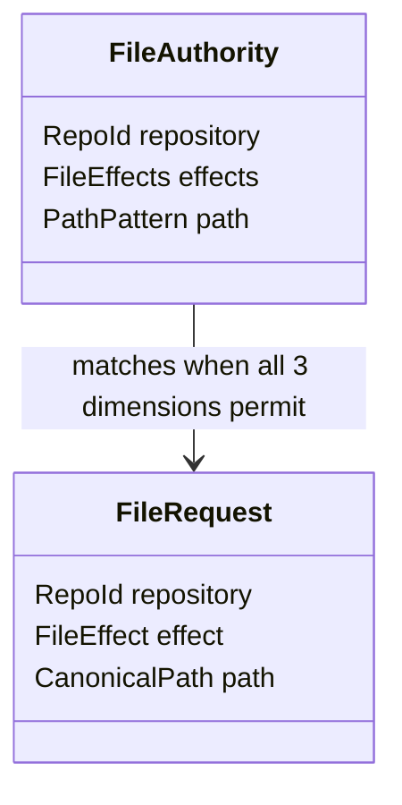
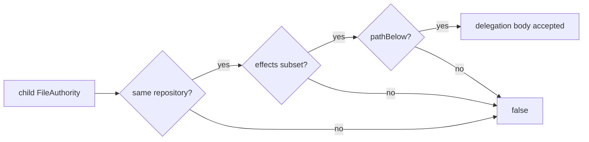
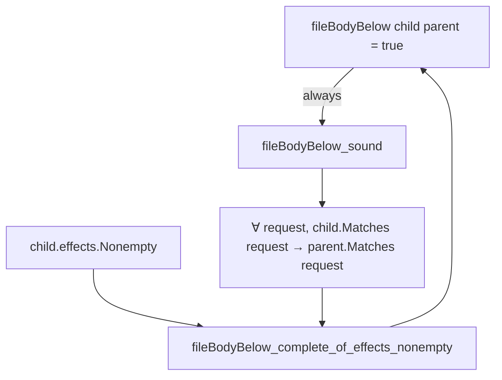

# File authority と包含証明

[Authority core 実装ガイド](README.md) / File authority

> **対象読者:** file effect、file request、authority matching、delegation containment を変更する Rust/Lean 実装者

| 言語 | ソース | 担当 |
|---|---|---|
| Rust | [`crates/authority-core/src/file.rs`](../../crates/authority-core/src/file.rs) | effect 集合、authority/request 型、`file_matches`、`file_body_below`、unit test |
| Lean | [`lean/Authority/File.lean`](../../lean/Authority/File.lean) | request 集合の意味論、実行可能判定との同値、effect/body containment の定理 |

## `FileEffect`

file operation を単一の「write 権限」にまとめず、次の10種類に分ける。

| Rust | Lean | 対象操作 |
|---|---|---|
| `ReadData` | `.readData` | file 内容の読み取り |
| `ListDirectory` | `.listDirectory` | directory entry の列挙 |
| `WriteData` | `.writeData` | 事前 truncate を伴わない内容書き込み |
| `Truncate` | `.truncate` | file size の変更 |
| `CreateFile` | `.createFile` | regular file の作成 |
| `CreateDirectory` | `.createDirectory` | directory の作成 |
| `RemoveFile` | `.removeFile` | regular file の削除 |
| `RemoveDirectory` | `.removeDirectory` | directory の削除 |
| `Rename` | `.rename` | file / directory の rename |
| `SetMetadata` | `.setMetadata` | mode や timestamp など対応 metadata の変更 |

この module は1 request につき1 effect と1 path を判定する。rename の source と destination を両方認可する手順や、FUSE opcode から effect への変換は将来の `capfs` 側の責務であり、現在の Authority core には含まれない。

## `FileEffects` の表現

| 観点 | Rust | Lean |
|---|---|---|
| 内部表現 | private `u16` bitset | `FileEffect → Bool` という membership 関数 |
| 空集合 | `FileEffects::empty` | `FileEffects.empty` |
| singleton | `FileEffects::only` | `FileEffects.only` |
| list から構築 | `FileEffects::from_effects` | `FileEffects.ofList` |
| membership | `contains` | effect に関数適用 |
| subset | `is_subset_of` | `fileEffectsBelow` |

Rust は未定義 bit を外部から構築できない固定幅 bitset にして、認可経路で allocation せず判定する。Lean は集合を membership predicate として表し、private な `allFileEffects` で10 variant を列挙して executable subset 判定を作る。`fileEffectsBelow_iff_subset` はこの列挙判定が pointwise な集合包含と一致することを証明する。

## Authority と request



`FileAuthority` は「どの repository の、どの path 範囲で、どの effect 集合を許すか」を表す。`FileRequest` は「どの repository の、どの1 path に、どの1 effect を要求するか」を表す。

`file_matches` / `fileMatches` が `true` になる条件は次の論理積である。

```text
authority.repository = request.repository
∧ request.effect ∈ authority.effects
∧ authority.path matches request.path
```

Lean の `FileAuthority.Matches` がこの命題的意味論を定義し、`fileMatches_iff_matches` が executable `Bool` 判定との同値を証明する。

## Delegation containment

`file_body_below(child, parent)` / `fileBodyBelow child parent` は、child authority が parent より強くないかを次の3条件で判定する。

```text
child.repository = parent.repository
∧ child.effects ⊆ parent.effects
∧ child.path ⊆ parent.path
```



Rust はこの判定を認可ロジックから呼べる純粋関数として実装する。Lean は同じ構造判定に対して次を証明する。

| 定理 | 保証 |
|---|---|
| `fileEffectsBelow_iff_subset` | executable effect subset と pointwise membership implication が同値 |
| `fileEffectsBelow_refl` | effect subset の反射性 |
| `fileEffectsBelow_trans` | effect subset の推移性 |
| `fileMatches_iff_matches` | executable request matching と `FileAuthority.Matches` が同値 |
| `fileBodyBelow_refl` | file body containment の反射性 |
| `fileBodyBelow_trans` | file body containment の推移性 |
| `fileBodyBelow_sound` | child body が parent 以下なら、child が許す全 request を parent も許す |
| `fileBodyBelow_complete_of_effects_nonempty` | child effect 集合が非空なら、意味論的 request 集合包含から構造判定を復元できる |
| `fileBodyBelow_iff_matches_subset_of_effects_nonempty` | child effect 集合が非空なら、構造判定と意味論的 request 集合包含が同値 |



## 空 effect 集合と完全性

`FileEffects::empty` / `FileEffects.empty` は正当な値で、どの request にも match しない。このとき意味論上の child request 集合は空なので、repository や path が parent と無関係でも空集合は parent の request 集合の部分集合になる。

一方、構造判定 `fileBodyBelow` は effect が空でも repository equality と path containment を要求する。そのため、次の無条件な逆向きは成立しない。

```text
(∀ request, child.Matches request → parent.Matches request)
→ fileBodyBelow child parent = true
```

`File.lean` はこの差を隠さず、`child.effects.Nonempty` を仮定した場合だけ完全性と同値を証明する。安全性に必要な `fileBodyBelow_sound` は effect 集合が空でも常に成立する。

## 変更時の確認点

- `FileEffect` を増減するときは Rust enum、Lean inductive、Lean の `allFileEffects`、両言語の tests、`capfs` の effect 対応表を同時に見直す。
- `FileEffects` の表現を変えても、duplicate を集合として扱い、空集合と subset の境界を維持する。
- matching 条件を増やす場合は `FileAuthority` と `FileRequest` の意味論、Rust 判定、Lean `Matches`、`fileMatches_iff_matches` を同時に変更する。
- containment 条件を増やす場合は Rust 判定だけでなく `refl`、`trans`、`sound` と条件付き completeness の前提がまだ十分かを確認する。

## 関連

- [Authority core 実装ガイド](README.md)
- [Repository identity](repository-identities.md)
- [パスモデル](paths.md)
- [検証とテスト](verification.md)
- [Capability モデル: ファイル権限](../design/capability-model.md#ファイル権限)
- [capfs: 実装する操作](../design/capfs.md#実装する操作)
