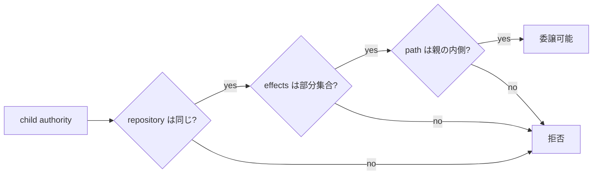
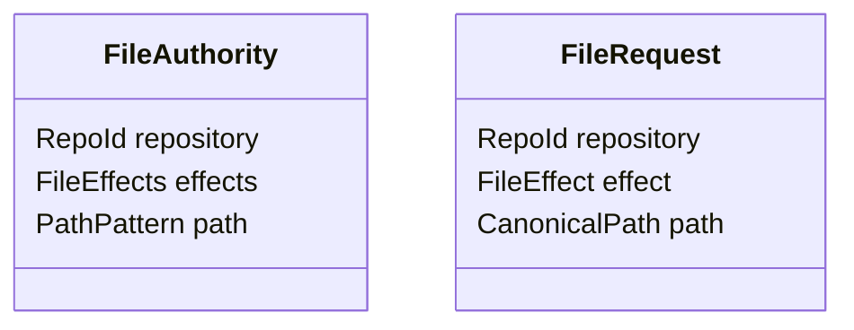
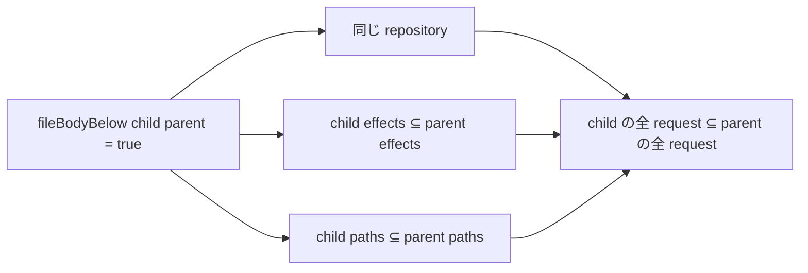
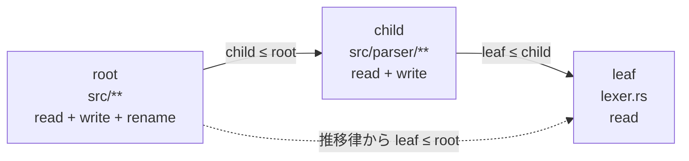

# File authority と包含証明

[Authority core 実装ガイド](README.md) / File authority

このページは [`crates/authority-core/src/file.rs`](../../crates/authority-core/src/file.rs) と [`lean/Authority/File.lean`](../../lean/Authority/File.lean) が、file request の認可と子権限への委譲をどう判定し、何を証明しているかを説明する。

## 委譲で3つの境界を広げない

file authority は、次の3つをひとまとめにした権限である。

```text
どの repository で
× どんな操作を
× どの path 範囲に行ってよいか
```

子へ委譲するときは、3つすべてが親以下でなければならない。

```text
child.repository = parent.repository
∧ child.effects ⊆ parent.effects
∧ child.path ⊆ parent.path
```

Lean の `fileBodyBelow_sound` は、この判定が `true` なら、child が許す全 request を parent も許すことを証明する。つまり Lean モデル内では、委譲判定の誤作動で別 repository、追加の effect、親の外側の path が子へ漏れることはない。

さらに `fileBodyBelow_trans` により、何段階委譲しても最上位の親より強い file authority にはならない。

Rust は同じ3条件を実行可能な純粋関数として実装する。共通 corpus は選んだ file case を両言語へ流し、期待値と判定結果を自動比較する。ただし Lean が Rust バイナリそのものを直接証明しているわけではなく、corpus にない全入力まで同値だとは言わない。

## 何を防ぎたいのか

親が次の権限を持っているとする。

```text
repository = workspace
effects    = { ReadData, WriteData }
path       = Prefix(src)
```

安全な子の例は、操作と path を狭めた次の authority である。

```text
repository = workspace
effects    = { ReadData }
path       = Exact(src/parser/lexer.rs)
```

一方、次のどれか1つでも含む子は拒否しなければならない。

- repository を `other-workspace` へ変える。
- effect に `Rename` を足す。
- path を `Prefix(docs)` や repository root へ広げる。



この3条件を `file_body_below` / `fileBodyBelow` がまとめて判定する。

## 操作を10種類に分ける

単一の「read / write」だけでは、必要以上に強い権限を渡しやすい。たとえば内容を書けることと、file を削除・rename できることは別の効果である。そのため `FileEffect` は次の10種類を個別に持つ。

| Rust | Lean | 許可する効果 |
|---|---|---|
| `ReadData` | `.readData` | file 内容を読む |
| `ListDirectory` | `.listDirectory` | directory entry を列挙する |
| `WriteData` | `.writeData` | 事前 truncate なしで内容を書く |
| `Truncate` | `.truncate` | file size を変える |
| `CreateFile` | `.createFile` | regular file を作る |
| `CreateDirectory` | `.createDirectory` | directory を作る |
| `RemoveFile` | `.removeFile` | regular file を削除する |
| `RemoveDirectory` | `.removeDirectory` | directory を削除する |
| `Rename` | `.rename` | file / directory を rename する |
| `SetMetadata` | `.setMetadata` | 対応する mode や timestamp を変える |

必要な効果だけを集合として渡せるので、`ReadData` だけの子へ `Rename` や `RemoveFile` が暗黙に付くことはない。

この module が判定するのは、1 request につき1 effect と1 path である。rename の移動元と移動先を両方確認する手順や、FUSE operation をどの effect へ変換するかは [`capfs`](../design/capfs.md) の責務である。

## effect 集合をどう表すか

Rust と Lean は、同じ「effect の集合」を目的に合った内部表現で持つ。

| 観点 | Rust | Lean |
|---|---|---|
| 内部表現 | private `u16` bitset | `FileEffect → Bool` という membership 関数 |
| 空集合 | `FileEffects::empty` | `FileEffects.empty` |
| 1 effect | `FileEffects::only` | `FileEffects.only` |
| 複数から構築 | `FileEffects::from_effects` | `FileEffects.ofList` |
| membership | `contains` | effect に関数適用 |
| subset | `is_subset_of` | `fileEffectsBelow` |

Rust は外部から未定義 bit を作れないようにし、allocation なしで membership と subset を計算する。Lean は「各 effect が入っているかを返す関数」として集合を表し、10 variant を `allFileEffects` で列挙して `fileEffectsBelow` を計算する。

Lean の `fileEffectsBelow_iff_subset` は、この有限列挙による `Bool` 判定が、次の数学的な部分集合と一致すると証明する。

```text
すべての effect について、
child に含まれるなら parent にも含まれる
```

```lean
∀ effect, child effect = true → parent effect = true
```

この定理があるため、bit や列挙の実装詳細ではなく「子にだけ存在する追加 effect はない」という意味で後続の証明を組み立てられる。

## 1件の request を許可する条件

`FileAuthority` は許可範囲、`FileRequest` は実行したい1件の操作を表す。



`file_matches` / `fileMatches` が `true` になるのは、3条件がすべて成立するときだけである。

```text
authority.repository = request.repository
∧ request.effect ∈ authority.effects
∧ authority.path matches request.path
```

たとえば `workspace / {ReadData} / Prefix(src)` は、`workspace / ReadData / src/main.rs` を許可する。しかし repository が違う、`WriteData` を要求する、path が `docs/design.md` である、のどれか1つでもあれば拒否する。

Lean では、この仕様を `FileAuthority.Matches` という命題で定義する。実行可能な `fileMatches : Bool` とは `fileMatches_iff_matches` で同値だと証明する。

```text
fileMatches authority request = true
  ↔ authority.Matches request
```

これにより、3条件を計算するコードと、「authority が request を許す」という数学的な意味が一致する。

## 委譲を request 集合の包含として考える

1つの `FileAuthority` は、それに match する `FileRequest` の集合を表すと考えられる。

```text
parent が許可する request の集合
  ⊇ child が許可する request の集合
```

`FileAuthority.Matches` を使うと、「child が parent より強くない」という仕様は次の一文になる。

```lean
∀ request, child.Matches request → parent.Matches request
```

実装で巨大な request 集合を生成する必要はない。`fileBodyBelow` は repository equality、effect subset、path containment の3条件だけを計算する。Lean は、この小さな構造判定が無限にあり得る request 全体の包含を保証することを証明する。

## どんな数学で証明しているのか

### 3軸の成分ごとの包含

file authority は、repository・effect・path の直積のように考えられる。子が親以下であるためには、各成分が対応する規則を満たす必要がある。

| 成分 | 比較する数学的関係 | Lean で使うもの |
|---|---|---|
| repository | 等号 | 等号の反射性・推移性 |
| effects | 集合包含 | `fileEffectsBelow_iff_subset`, `fileEffectsBelow_trans` |
| path | pattern が表す集合の包含 | `pathBelow_sound`, `pathBelow_trans` |

これを[成分ごとの順序](proof-concepts.md#複数条件を部品ごとに証明する)として扱うことで、各部品の証明を組み合わせられる。

### 健全性: 判定が通った子は権限を増やさない

`fileBodyBelow_sound` は、構造判定が `true` のとき、child request 集合が parent request 集合に含まれると証明する。



任意の child request を1件取ると、repository は同じで、要求 effect は parent にも入り、要求 path も parent に match する。したがって、その request は parent にも許可される。

この主張は effect 集合が空でも成立する。`fileBodyBelow = true` を受理した結果として権限が漏れない、という安全側の保証に例外はない。

### 反射律と推移律: 多重委譲でも境界を保つ

`fileBodyBelow_refl` は、同じ authority をそのまま比較すれば `true` になることを示す。

`fileBodyBelow_trans` は次を示す。

```text
leaf ≤ child
child ≤ root
──────────────
leaf ≤ root
```

証明では、repository equality、effect subset、path containment の推移性をそれぞれ使い、最後に3条件を再び組み立てる。



この性質を有限回繰り返せるため、孫・ひ孫と委譲が続いても、末端 authority が最上位の repository・effect・path 境界を越えない。

### 完全性: 正しい包含を誤って拒否しない

逆向きの完全性は、child が少なくとも1つ effect を持つ場合に証明されている。

```text
child が許す全 request を parent も許す
∧ child.effects が空ではない
→ fileBodyBelow child parent = true
```

これが `fileBodyBelow_complete_of_effects_nonempty` である。健全性と合わせた `fileBodyBelow_iff_matches_subset_of_effects_nonempty` により、非空 child では構造判定と request 集合包含がぴったり一致する。

## なぜ空 effect だけ条件が付くのか

effect を1つも許さない child は、どの request にも match しない。意味論上は空集合である。

```text
child.effects = ∅
→ child が許す request = ∅
```

空集合はどの集合の部分集合でもある。そのため、child と parent の repository や path がまったく違っても、「child の全 request を parent も許す」という命題だけは真になる。child が許す request が1件もなく、反例を出せないからである。これは[空虚な真](proof-concepts.md#空集合と何でも正しい命題)と呼ばれる。

一方、構造判定 `fileBodyBelow` は effect が空でも repository equality と path containment を要求する。したがって、空 effect では意味論上の空集合包含と構造判定が一致しない場合がある。

これは安全性の穴ではない。

- `fileBodyBelow = true → request 集合包含` という健全性は常に成立する。
- 逆向きだけが、effect 非空の場合に限られる。
- 空 effect でも repository と path を維持する構造判定は、委譲データの一貫性をより厳しく保つ。

`File.lean` はこの例外を隠さず、定理名と仮定に `effects_nonempty` を明記している。

## 何が助かるのか

### 権限漏えいをレビューしやすい

安全性の中心は `fileBodyBelow_sound` という1本の定理に集約される。委譲判定が通るなら、具体的な request を何件想像しても child だけが許すものは存在しない。

### 操作を増やすバグを防げる

effect は集合包含で比較されるため、親にない `Rename` や `RemoveFile` を子が追加すると判定が失敗する。単一の「write」フラグより、最小権限を細かく表せる。

### 別 repository と path 拡大を同時に閉じられる

repository equality と path containment を同じ body 判定に含めるため、effect だけ正しくても委譲は通らない。3軸のどれか1つでも親を越えれば拒否される。

### 多段委譲を局所的に確認できる

各段で親以下かだけを確認すれば、推移律により末端も root 以下になる。委譲 chain の全組み合わせを毎回手作業で比較する必要がない。

## 正確な保証範囲

このページの証明対象は file authority **body** の repository、effect、path と、1件の `FileRequest` である。これを有効期間や metadata と組み合わせた file-only Capability は[Capability envelope と委譲証明](capabilities.md)で別に扱う。

次はまだ含まれない。

- Capability ID の採番、subject binding、親 ID と `delegable` を検査する発行状態機械。
- revoke や使用回数、状態遷移、並行実行。
- rename の source と destination を2件とも認可する orchestration。
- FUSE operation から正しい `FileEffect` を選ぶ adapter。
- symlink、hard link、inode alias、open handle、rename race。

したがって `fileBodyBelow_sound` は「filesystem システム全体にバグがない」という定理ではない。Lean でモデル化した authority body と request の範囲内で、委譲判定が権限を増幅しないという定理である。

OS・FUSE との接続は [`capfs`](../design/capfs.md)、state と revoke は[状態機械と revoke](../design/state-and-revocation.md)、Rust/Lean の対応確認は[検証とテスト](verification.md)が担当する。

## 定理と実装の対応

| Lean の定義・定理 | 何を保証するか | 対応する Rust |
|---|---|---|
| `fileEffectsBelow_iff_subset` | effect の判定と集合包含が一致する | `FileEffects::is_subset_of` |
| `fileEffectsBelow_refl` | 同じ effect 集合は自分自身以下 | `is_subset_of` の同値入力 |
| `fileEffectsBelow_trans` | effect subset を多段でつなげられる | effect の委譲連鎖 |
| `fileMatches_iff_matches` | request 判定と3条件の意味が一致する | `file_matches` |
| `fileBodyBelow_refl` | authority は自分自身以下 | `file_body_below` の同値入力 |
| `fileBodyBelow_trans` | body の多段包含をつなげられる | `file_body_below` の委譲連鎖 |
| `fileBodyBelow_sound` | 判定が通れば child request はすべて parent request | `file_body_below` の安全側の仕様 |
| `fileBodyBelow_complete_of_effects_nonempty` | 非空 child の本当の包含を誤拒否しない | `file_body_below` の受理側の仕様 |
| `fileBodyBelow_iff_matches_subset_of_effects_nonempty` | 非空 child では判定と集合包含が同値 | `file_body_below` 全体の仕様 |

この表は概念と責務の対応であり、Lean 定理が Rust の machine code を直接証明しているという意味ではない。

## 変更時の確認点

- `FileEffect` を増減するときは Rust enum、Lean inductive、Lean の `allFileEffects`、両言語の tests、`capfs` の対応表を同時に見直す。
- `FileEffects` の表現を変えても、duplicate を集合として扱い、空集合と subset の境界を維持する。
- matching 条件を増やす場合は `FileAuthority` と `FileRequest` の意味論、Rust 判定、Lean `Matches`、`fileMatches_iff_matches` を同時に変更する。
- containment 条件を増やす場合は Rust 判定だけでなく `refl`、`trans`、`sound` と条件付き completeness の前提がまだ十分かを確認する。
- 「安全のための追加条件」を構造判定へ入れると、空集合のように意味論上の集合包含との完全性が変わる可能性がある。

## 関連

- [Authority core で使う証明の考え方](proof-concepts.md)
- [Authority core 実装ガイド](README.md)
- [Repository identity](repository-identities.md)
- [パスモデル](paths.md)
- [検証とテスト](verification.md)
- [Capability envelope と委譲証明](capabilities.md)
- [Capability モデル: ファイル権限](../design/capability-model.md#ファイル権限)
- [capfs: 実装する操作](../design/capfs.md#実装する操作)
