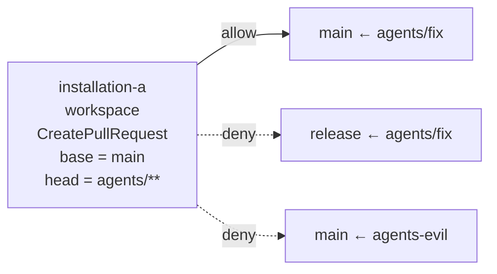

<!-- doc-type: concept -->

# GitHub authority

[Authority core 実装ガイド](README.md) / GitHub authority

> **対象読者:** GitHub 操作の認可を触る実装者、Broker との責務境界のレビュー担当者

このページは [`crates/authority-core/src/github.rs`](../../crates/authority-core/src/github.rs) と [`lean/Authority/GitHub.lean`](../../lean/Authority/GitHub.lean) が、認証付き GitHub 操作を任意 HTTP から切り離して表す方法を説明する。

GitHub token を持つ broker に自由な URL、method、header を渡せると、Capability を通していても token の権限全体を使えてしまう。そこで authority が表せる操作は、今は `PublishBranch` と `CreatePullRequest` の2つだけに閉じている。

```text
GitHubAuthority {
  installation: InstallationId
  repository: RepoId
  operations: { PublishBranch, CreatePullRequest } の部分集合
  base: BranchPattern
  head: BranchPattern
}
```

## base と head を分ける理由

pull request は「どの base branch に」「どの head branch から」作るかの組で意味が変わる。`main` への pull request は許しても、release branch への変更は許したくない場合がある。したがって base と head は1つの曖昧な branch scope にまとめず、それぞれ exact または segment-aware prefix で判定する。

`Prefix(agents)` は `agents/fix` を許すが、`agents-evil` は許さない。slash 区切りの component 列で比較するためである。Rust の `BranchName::new` と Lean の `BranchName.ofSegments` は、`refs/`、先頭 `-`、`..`、末尾 `.`、reflog syntax、`.lock` suffix、control character など Git ref として曖昧または危険な shorthand を同じ入口規則で拒否する。



## 委譲の条件

`github_body_below` / `gitHubBodyBelow` は、installation と repository の完全一致に加え、operation 集合・base pattern・head pattern のすべてが親以下かを確認する。

```text
child.installation = parent.installation
∧ child.repository = parent.repository
∧ child.operations ⊆ parent.operations
∧ child.base ⊆ parent.base
∧ child.head ⊆ parent.head
```

これにより、子は `CreatePullRequest` だけに狭めたり、`agents/fix` だけに狭めたりできる。一方、別 installation、別 repository、`PublishBranch` の追加、base/head の拡大は拒否される。

Lean の `gitHubMatches_iff_matches` と `gitHubBodyBelow_sound` は、判定が受理した child の全 GitHub request が親にも含まれることを示す。operation 集合が非空なら completeness もある。多段委譲では推移律により、末端の branch/operation が root の境界を越えない。

## Broker との接続

この型は token や REST endpoint を保持しない。Broker が `PublishBranch` / `CreatePullRequest` ごとに専用 request builder を持ち、installation と repository から正しい credential を選び、authority にない API call を作れないようにする。

branch publish の expected-old-object check、repository ownership、GitHub API response の検証、rate limit、durable audit は Broker の実装対象である。authority-core はその前段で「どの名前付き副作用を、どの installation/repository/branch 組へ出してよいか」だけを決める。

## 関連

- [Capability envelope と委譲証明](capabilities.md)
- [HTTP fetch authority](http-fetch-authorities.md)
- [Capability モデル](../design/capability-model.md)
- [検証とテスト](verification.md)
