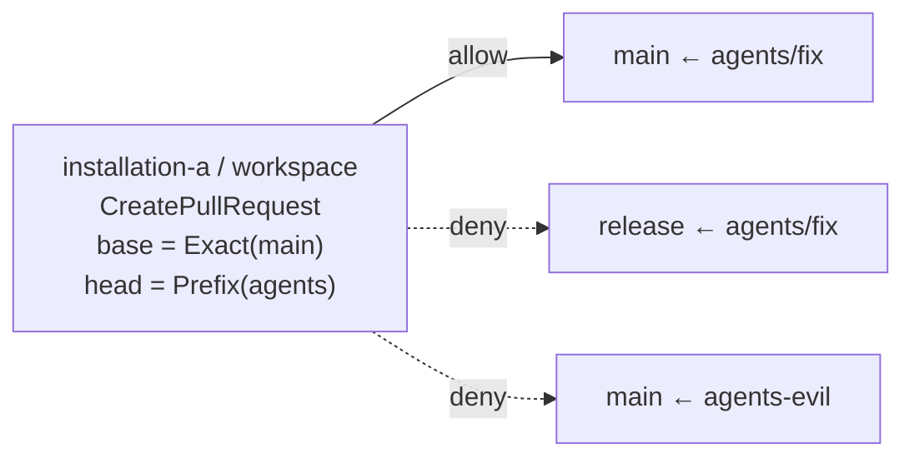

<!-- doc-type: concept -->

# GitHub authority

[Authority core 実装ガイド](README.md) / GitHub authority

> **対象読者:** GitHub 操作の認可を触る実装者、Broker との責務境界のレビュー担当者

[`crates/authority-core/src/github.rs`](../../crates/authority-core/src/github.rs) と [`lean/Authority/GitHub.lean`](../../lean/Authority/GitHub.lean) は、認証付き GitHub 操作を任意 HTTP から切り離して表す。

## 何を防ぎたいのか

GitHub token を持つ broker に自由な URL・method・header を渡せると、Capability を通していても token の権限全体を使えることになる。`GET /repos/{owner}/{repo}` を許すつもりの authority が、URL を変えるだけで `DELETE /repos/{owner}/{repo}` になる。

だから authority が表せるのは、名前を付けた 2 操作だけ。

```text
GitHubAuthority {
  installation: InstallationId
  repository: RepoId
  operations: { PublishBranch, CreatePullRequest } の部分集合
  base: BranchPattern
  head: BranchPattern
}
```

`GitHubOperation` は `u8` の bitset で 2 bit だけを使う。`DeleteRepository` を表す値が型に存在しないので、operation 集合をどう広げてもそこには到達できない。新しい操作を許すには enum に variant を足し、Broker に対応する request builder を書き、Lean 側の定義と corpus を更新する必要がある。1 箇所を書き換えて済む変更にはしていない。

## base と head を分ける

pull request は「どの base へ」「どの head から」の組で意味が変わる。`main` への pull request は許しても、release branch への変更は許したくない場合がある。base と head を 1 つの branch scope にまとめず、それぞれ独立に判定する。



`Prefix(agents)` は `agents/fix` を許し、`agents-evil` を許さない。slash 区切りの component 列で比較するからで、文字列の前方一致ではない。[HTTP fetch authority](http-fetch-authorities.md) の URL path、[パスモデル](paths.md) の file path と同じ扱い方をしている。

## branch 名を Git の曖昧な shorthand から守る

`BranchName::new` と Lean の `BranchName.ofSegments` は同じ入口規則を持つ。拒否理由は 12 種類で、うち 5 つは segment の位置を持つ。

| 拒否理由 | 何を防ぐか |
|---|---|
| `Empty` | 空の branch 名 |
| `LeadingOrTrailingSeparator` | `/` 始まり・終わり。segment 列が空要素を持つ |
| `FullyQualifiedReference` | `refs/` 名前空間。`refs/heads/main` と `main` が別物として扱われる |
| `LeadingDash` | `-` 始まり。CLI に渡したときに option として解釈される |
| `ReservedAt` | `@` 単体。Git では `HEAD` の別名 |
| `TrailingDot` | `.` 終わり |
| `DoubleDot` | `..` を含む。Git の range 構文 |
| `ReflogSyntax` | `@{` を含む。`main@{1}` のような reflog 参照 |
| `EmptySegment { index }` | 重複 slash |
| `SegmentLeadingDot { index }` | segment が `.` 始まり |
| `SegmentTrailingDot { index }` | segment が `.` 終わり |
| `SegmentLockSuffix { index }` | segment が `.lock` 終わり。Git の lock file と衝突する |
| `ForbiddenCharacter { index }` | Git が ref 名に許さない文字 |

`refs/` の拒否が効く場面が分かりにくいので補足する。`Exact(main)` の authority を持つ subject が `refs/heads/main` を要求したとき、文字列としては別物なので判定は拒否になる。しかし Git 側では同じ ref を指す。逆向きに、`Prefix(refs)` のような authority を書けてしまうと、`refs/tags/...` まで含む広い権限になる。名前空間を含む綴りを型の入口で落として、authority が扱うのは常に短い branch 名だけにしている。

`-` 始まりの拒否は、Broker が branch 名を外部 command の引数に渡す場合を想定している。現在の実装は API 経由なので直接は効かないが、authority の値としては閉じておく。

## 委譲の条件

`github_body_below` / `gitHubBodyBelow` が 5 条件を同時に確認する。

```text
child.installation = parent.installation
∧ child.repository = parent.repository
∧ child.operations ⊆ parent.operations
∧ child.base ⊆ parent.base
∧ child.head ⊆ parent.head
```

子は `CreatePullRequest` だけに狭めたり、head を `agents/fix` だけに狭めたりできる。別 installation、別 repository、`PublishBranch` の追加、base / head の拡大は拒否される。

installation と repository はどちらも完全一致。`InstallationId` を階層的に扱わないのは、GitHub の installation が organization をまたぐ場合があり、包含関係を authority の側で推測できないから。

Lean の `gitHubMatches_iff_matches` と `gitHubBodyBelow_sound` は、判定が受理した child の全 request が親にも含まれることを示す。operation 集合が非空なら完全性もある。多段委譲では推移律により、末端の branch と operation が root の境界を越えない。

## Broker との責務境界

この型は token も REST endpoint も保持しない。[Host Egress Broker](../egress-broker/github.md) が operation ごとに専用の request builder を持ち、installation と repository から credential を選ぶ。authority に無い API call を組み立てる経路が Broker 側に存在しないことが、実運用上の境界になる。

Broker が別に持つもの。

- `PublishBranch` の expected-old-object 検査と `force: false` での更新。
- repository の実在確認と ownership。
- GitHub API 応答の検証、rate limit、durable audit。
- credential の解決。guest には opaque handle しか返さない。

authority-core が決めるのは「どの名前付き副作用を、どの installation / repository / branch 組へ出してよいか」だけ。

## 何が助かるのか

token の権限全体ではなく、2 操作分の権限だけを委譲できる。subject が持っているのが `CreatePullRequest` だけなら、branch を消す経路は存在しない。

branch 名の検査が型の入口にあるので、Broker 側は受け取った `BranchName` をそのまま使える。Git の曖昧な綴りを毎回考えなくてよい。

operation を増やす変更が、Rust・Lean・Broker・corpus の 4 箇所に同時に現れる。1 箇所で静かに広がらない。

## 正確な保証範囲

判定の対象は、型付きの installation / repository / operation / base / head の 5 軸だけ。

- GitHub API そのものは扱わない。endpoint、認証、応答の解釈はすべて Broker。
- repository が実在するか、installation がその repository に access できるかは確認していない。`RepoId` は identity であって存在証明ではない。
- branch が実在するかも確認していない。`Exact(main)` の authority は、`main` が無い repository でも構造上は有効。
- `PublishBranch` の安全性は expected-old-object 検査に依存する。その検査は Broker 側にあり、この module の定理には含まれない。
- token が漏れないことは保証していない。credential の扱いは Broker の責務。
- GitHub 側の権限がこの authority より狭い場合、操作は API で失敗する。authority が許すことと GitHub が許すことは別。

## 変更時の確認点

- `GitHubOperation` に variant を足すときは、Rust enum、`mask()`、Lean の inductive、Lean の全 operation 列挙、共通 corpus、Broker の request builder を同時に直す。**Broker 側を忘れても Rust は compile が通る**ので、authority だけ広がって実装が無い状態になりうる。
- `mask()` は `1_u8 << (self as u8)` なので、variant が 8 個を超えると桁溢れする。9 個目を足すときは bitset の型を広げる。
- branch 名の拒否理由を減らすときは、その綴りが Git 側でどう解釈されるかを確認する。特に `refs/` と `..` は、authority の比較と Git の解釈がずれる原因になる。
- `BranchPattern` の比較を segment 単位から文字列に変えない。`agents` が `agents-evil` を含むようになる。
- installation と repository の比較を階層的にしない。GitHub 側の所属関係を推測することになる。

## 関連

- [Capability envelope と委譲証明](capabilities.md)
- [HTTP fetch authority](http-fetch-authorities.md)
- [Repository identity](repository-identities.md)
- [パスモデル](paths.md)
- [検証とテスト](verification.md)
- [GitHub 型付き adapter](../egress-broker/github.md)
- [Capability モデル](../design/capability-model.md)
- [用語集](../glossary.md)
