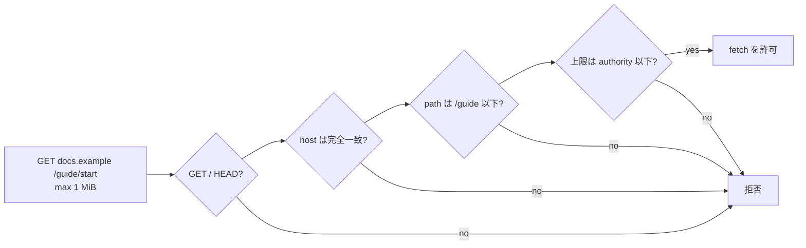

<!-- doc-type: concept -->

# HTTP fetch authority

[Authority core 実装ガイド](README.md) / HTTP fetch authority

> **対象読者:** 公開 HTTPS 取得の認可を触る実装者、Broker との責務境界のレビュー担当者

[`crates/authority-core/src/http.rs`](../../crates/authority-core/src/http.rs) と [`lean/Authority/Http.lean`](../../lean/Authority/Http.lean) は、公開 HTTP 取得を file 権限とは別の authority として表す。

「URL を 1 本渡せばよい」ではない。host、method、path、読み取れる応答量のどれか 1 つが広がれば、別の外部資源または過大なデータへ到達できる。この 4 軸を 1 つの `HttpFetchAuthority` に閉じ込める。

```text
HttpFetchAuthority {
  methods: { GET, HEAD } の部分集合
  host: CanonicalHost
  path: Exact(path) または Prefix(path)
  max_response_bytes: u64
}
```

request も同じ 4 軸を持つ。認可が通るのは、method が集合に含まれ、host が完全一致し、URL path が pattern に一致し、request の byte 上限が authority の上限以下であるときだけ。



## 何を防ぎたいのか

3 つある。

**別の host へ到達する。** host は完全一致でしか比較しない。`docs.example` の authority で `api.example` を取れない。sub-domain も別扱いで、`docs.example` は `internal.docs.example` を含まない。DNS の階層構造を authority の階層と混同すると、`example` の authority が全 sub-domain を含むことになる。

**IP literal で name 解決を迂回する。** `CanonicalHost::new` は `canonical.parse::<IpAddr>().is_ok()` で IP literal を拒否する。これを許すと `169.254.169.254` を host に持つ authority を書けてしまい、cloud metadata endpoint への到達が Capability として正当化される。DNS 応答側の検査は Broker が持つが（[公開 HTTPS policy](../egress-broker/network-policy.md)）、authority の型でも閉じている。

**path prefix を文字列として誤読する。** `Prefix(/guide)` は `/guide/start` を含み、`/guide-old` を含まない。文字列の `starts_with` なら後者も通る。`CanonicalUrlPath` は segment の列を保持し、比較も segment 単位で行う。

percent encoding を decode せずに拒否しているのも同じ理由。`/guide/%2e%2e/admin` を decode すれば `/admin` になるが、decode 前は `/guide` 以下に見える。decode するかしないかで判定が変わる値は、authority に入れない。

## host の受け付け条件

`CanonicalHost::new` は ASCII DNS host を小文字化し、末尾の root dot を除去したうえで検査する。

| 拒否理由 | 条件 |
|---|---|
| `NonAscii` | 非 ASCII を含む |
| `Empty` | root dot 除去後が空 |
| `TooLong` | 253 文字超 |
| `IpAddressLiteral` | `IpAddr` として parse できる |
| `EmptyLabel` | label が空（`a..b` など） |
| `LabelTooLong` | label が 63 文字超 |
| `LabelEdgeHyphen` | label が `-` で始まる、または終わる |
| `InvalidLabelCharacter` | label に ASCII 英数字と `-` 以外がある |

port、userinfo、scheme は host として受け付けない。国際化 domain は境界側で ASCII A-label に変換してから渡す。ここで punycode 変換を行わないのは、変換の実装差で同じ入力が別の host になる余地を消すため。

エラーは理由と label の位置を持つ。どの label が問題かが分かるので、設定を直すときに全体を疑わなくてよい。

## URL path の受け付け条件

`CanonicalUrlPath::new` は origin-form の `/` 始まりだけを受け取る。`/` 自身は root として特別扱い。

| 拒否理由 | 条件 |
|---|---|
| `MissingLeadingSlash` | `/` で始まらない |
| `TrailingSlash` | 非 root が `/` で終わる |
| `NonAscii` | 非 ASCII を含む |
| `EmptySegment` | 重複 slash |
| `CurrentDirectory` | segment が `.` |
| `ParentDirectory` | segment が `..` |
| `ContainsBackslash` | segment に `\` |
| `ContainsPercentEncoding` | segment に `%` |
| `ContainsQueryDelimiter` | segment に `?` |
| `ContainsFragmentDelimiter` | segment に `#` |
| `ContainsControlCharacter` | segment に ASCII 制御文字 |
| `ContainsInvalidCharacter` | RFC 3986 の `pchar` 以外 |

query と fragment を segment 内で拒否しているので、`HttpFetchRequest` に query が混入する経路が無い。query を扱う必要が出た場合は、`?` を通す変更ではなく、query を独立した軸として authority に足す設計になる。

`\` の拒否は、`\` を `/` として扱う実装が存在するため。segment の中に入れておくと、解釈次第で階層が変わる。

## 委譲で許されるのは縮小だけ

`http_fetch_body_below` / `httpFetchBodyBelow` が 4 条件を同時に確認する。

```text
child.methods ⊆ parent.methods
∧ child.host = parent.host
∧ child.path ⊆ parent.path
∧ child.max_response_bytes ≤ parent.max_response_bytes
```

親が `GET|HEAD docs.example /guide/** 4 MiB` のとき、`GET docs.example /guide/start 1 MiB` は渡せる。`api.example` への変更、`/` への拡大、`HEAD` の追加、上限 8 MiB への引き上げはいずれも拒否される。

`HttpFetchMethods` は `u8` の bitset で、`GET` と `HEAD` の 2 bit だけを使う。`POST` を表す値が型に存在しないので、method 集合の拡大でそれが混入することはない。[File authority](file-authorities.md) の `FileEffects` と同じ形。

Lean は `httpFetchMatches_iff_matches`、containment の反射律・推移律・健全性を証明する。child の method 集合が非空なら完全性もある。空集合で完全性が条件付きになる理由は [File authority](file-authorities.md#なぜ空-effect-だけ条件が付くのか)と同じ。

## Broker が引き続き担当すること

この authority は純粋な認可モデルであって、network client ではない。[Host Egress Broker](../egress-broker/README.md) が別に実装する。

- HTTPS と許可 port を固定し、redirect のたびに URL を再正規化・再認可する。
- DNS 解決結果から private / loopback / link-local / metadata address を除外し、接続直前にも再確認する。
- `max_response_bytes` を header の宣言ではなく、実際に body を読む途中で強制する。
- scheme、query、fragment、header、body、credential を `HttpFetchRequest` へ混入させない。

この型が「任意 URL への socket を許す入口」にならないのは、Broker がこの型から外れた自由な HTTP request を受け取る API を持たないから。型の閉じ方だけでは足りず、Broker 側の API 設計と合わせて初めて境界になる。

## 何が助かるのか

authority を読めば、その権限で到達できる範囲が 4 行で分かる。URL 文字列を眺めて「これはどこまで行けるのか」を推測しなくてよい。

正規化を型の入口に置いたので、比較する側は正規化の有無を気にしなくてよい。`CanonicalHost` を持っている時点で小文字化と root dot 除去は済んでいる。

拒否理由が enum になっているため、設定ミスの原因が文字列ではなく型で返る。

## 正確な保証範囲

証明と検査の対象は、正規化済みの型に対する 4 軸の判定だけ。

- URL parser を証明していない。文字列から `CanonicalHost` と `CanonicalUrlPath` を作る境界は Rust の検査に依存し、Lean はその後の値を扱う。
- redirect、DNS 解決、TLS、接続先の選択はこの module の対象外。すべて Broker の責務。
- `max_response_bytes` は数値の比較しかしていない。実際に読んだ byte 数を止めるのは Broker。
- 国際化 domain の変換は対象外。A-label に変換済みの値だけを受け取る。
- host の完全一致は「同じ文字列なら同じ資源」を仮定している。CDN や virtual host で同じ名前が別の内容を返す場合は区別できない。
- 同じ authority で時間を置いて 2 回取得したときに同じ内容が返ることは保証しない。この module は権限の範囲だけを扱う。

## 変更時の確認点

- `HttpFetchMethod` を増やすときは Rust enum、`mask()`、Lean の対応する定義、共通 corpus を同時に直す。副作用のある method（`POST` 等）を足す場合は、それが本当にこの authority family に属するのかを先に検討する。GitHub 操作は [GitHub authority](github-authorities.md) として分けてある。
- host の検査を緩めるときは、緩めた先で IP literal と metadata endpoint に到達できないかを確認する。`IpAddressLiteral` の拒否は Broker 側の IP policy と二重になっているが、片方だけに寄せない。
- percent encoding を許す変更は、decode の有無で containment 判定が変わることを意味する。許すなら、authority 側と request 側で同じ decode を通す設計にする。
- `Prefix` の比較を segment 単位から文字列に変えない。`/guide` が `/guide-old` を含むようになる。
- 拒否理由を増やすときは `Display` と、その理由を返す検査の両方を足す。理由だけ足しても返されない。

## 関連

- [Capability envelope と委譲証明](capabilities.md)
- [GitHub authority](github-authorities.md)
- [File authority](file-authorities.md)
- [パスモデル](paths.md)
- [検証とテスト](verification.md)
- [公開 HTTPS policy](../egress-broker/network-policy.md)
- [Capability モデル](../design/capability-model.md)
- [ネットワークと外部副作用の設計](../design/network-egress.md)
- [用語集](../glossary.md)
