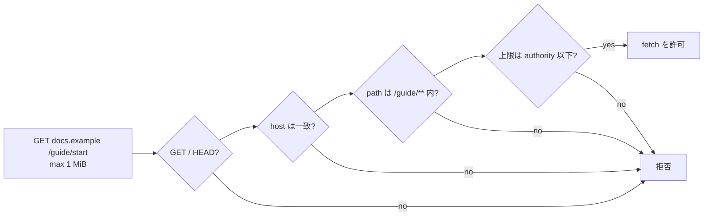

# HTTP fetch authority

[Authority core 実装ガイド](README.md) / HTTP fetch authority

このページは [`crates/authority-core/src/http.rs`](../../crates/authority-core/src/http.rs) と [`lean/Authority/Http.lean`](../../lean/Authority/Http.lean) が、公開 HTTP 取得を file 権限とは別の authority としてどう表すかを説明する。

HTTP 取得は「URL を渡せばよい」ではない。host、method、path、読み取れる応答量のどれかが広がれば、別の外部資源または過大なデータを取得できる。そのためこの4軸を一つの `HttpFetchAuthority` に閉じ込める。

```text
HttpFetchAuthority {
  methods: { GET, HEAD } の部分集合
  host: CanonicalHost
  path: Exact(path) または Prefix(path)
  max_response_bytes: u64
}
```

request 側も同じ4軸を持つ。認可は、method が集合に含まれ、host が完全一致し、URL path が pattern に一致し、request の byte 上限が authority の上限以下である場合だけ通る。



## 正規化済みの値だけを比較する

Rust の `CanonicalHost::new` は ASCII DNS host を小文字化し、末尾の root dot を除去する。port、userinfo、IP literal、空 label、非 ASCII input は authority の host として受け付けない。国際化 domain は境界側で ASCII A-label にしてから渡す。

`CanonicalUrlPath::new` は origin-form の `/` 始まり path だけを受け取り、dot segment、重複 slash、末尾 slash、percent encoding、query、fragment、backslash を拒否する。`Prefix(/guide)` は `/guide/start` を含むが `/guide-old` は含まない。文字列 prefix ではなく segment の列で比較するからである。Lean の corpus 入口も `CanonicalHost.ofString` を通し、Rust と同じ ASCII lowercase、末尾 root dot 除去、DNS label、IP literal の境界を適用する。

Lean の `CanonicalHost` と `CanonicalUrlPath` は、HTTP boundary がこの正規化を済ませた後に authority 判定へ渡す値を表す。Lean が証明する包含はこの型付き・正規化済みの領域についてのものであり、URL parser、redirect、DNS 解決そのものを証明するものではない。

## 委譲で許されるのは縮小だけ

`http_fetch_body_below` / `httpFetchBodyBelow` は次を同時に確認する。

```text
child.methods ⊆ parent.methods
∧ child.host = parent.host
∧ child.path ⊆ parent.path
∧ child.max_response_bytes ≤ parent.max_response_bytes
```

たとえば親が `GET|HEAD docs.example /guide/** 4 MiB` なら、子へ `GET docs.example /guide/start 1 MiB` を渡せる。一方、`api.example` への変更、`/` への path 拡大、`HEAD` の追加、byte 上限を 8 MiB に増やすことはすべて拒否される。

Lean は matching の `httpFetchMatches_iff_matches`、containment の反射律・推移律・健全性を証明している。child method 集合が非空なら completeness もある。つまりモデル内では、判定が通った HTTP child が親にない method、host、path、応答上限の request を新たに許すことはない。

## Broker が引き続き担当すること

この authority は純粋な認可モデルであり、network client ではない。Host Egress Broker は少なくとも次を実装する必要がある。

- HTTPS と許可 port を固定し、redirect のたびに URL を再正規化・再認可する。
- DNS 解決結果を private / loopback / link-local / metadata address から除外し、接続直前にも re-check する。
- `max_response_bytes` を request header だけでなく、実際に body を読む途中でも上限として強制する。
- scheme、query、fragment、header、body、credential を `HttpFetchRequest` へ混入させない。

したがって、この型が「任意 URL への socket を許す」入口になることはない。Broker がこの型から外れた自由な HTTP request を受け取る API を持たないことが、実運用の境界になる。

## 関連

- [Capability envelope と委譲証明](capabilities.md)
- [GitHub authority](github-authorities.md)
- [Capability モデル](../design/capability-model.md)
- [検証とテスト](verification.md)
