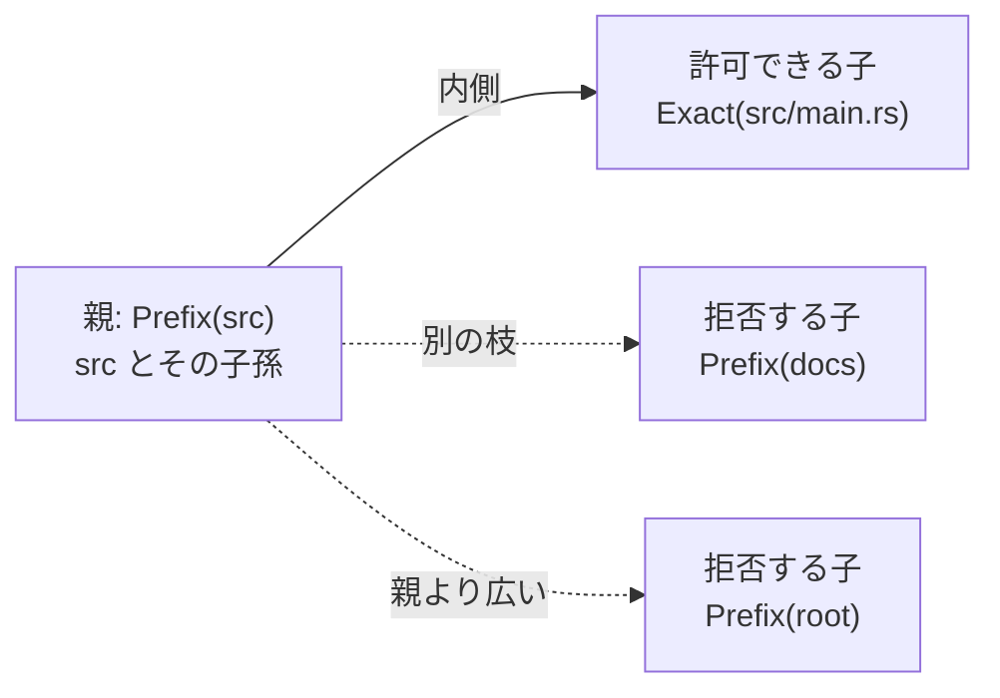
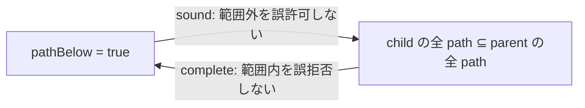

# パスモデルと包含証明

[Authority core 実装ガイド](README.md) / パスモデル

このページは [`crates/authority-core/src/path.rs`](../../crates/authority-core/src/path.rs) と [`lean/Authority/Path.lean`](../../lean/Authority/Path.lean) が、パスによる権限漏えいをどう防ぎ、その判定が仕様どおりであることをどう証明しているかを説明する。

## 30秒で分かる要点

この2ファイルが扱う問題は、大きく2つある。

1. `..`、NUL、wildcard などを使った曖昧・危険な path を権限判定へ入れない。
2. 親が `src/` だけを許しているのに、子が `docs/` や repository 全体を見られるような委譲を通さない。

Lean 側では、包含判定について次の両方向を証明している。

```text
pathBelow child parent = true
  ↔ child が選ぶ全 path を parent も選ぶ
```

したがって Lean モデル内では、`pathBelow` が誤って範囲外の委譲を許可することも、本当に範囲内の委譲を誤って拒否することもない。さらに推移律があるため、何段委譲しても最上位の親が定めた path 境界を越えない。

Rust はこれと対になる型と判定を実装し、実際の認可経路で使えるようにしている。ただし、Rust と Lean の実装が自動的に同一だと証明済みなわけではない。現在は対応する実装と両言語の境界 test で確認しており、共通 corpus による自動差分テストはまだない。

## 何を防ぎたいのか

パスを生の文字列として比較すると、同じ場所を別の書き方で表したり、構文を途中で解釈し直したりする余地が生まれる。

```text
src/../docs/secret.md
src/./main.rs
src/*.rs
"src\0/secret"
```

Authority core は、こうした入力を正規化して受け入れるのではなく、権限判定用の path として構築できないようにする。受理する path は repository root からの segment 列だけで表し、segment の解釈を一意にする。

もう1つの問題は委譲による範囲拡大である。



`pathBelow` は、child の指定文字列が parent から始まるかだけでなく、`Exact` と `Prefix` が実際に選ぶ path の範囲まで考えて判定する。

## 不正な path を型の入口で止める

両言語の `CanonicalPath` は、path を `/` 区切りの文字列ではなく、repository-relative な segment 列として持つ。空の列は repository root である。

構築時に次の segment を拒否する。

| 拒否する segment | 防ぎたい曖昧さ・危険 |
|---|---|
| 空文字列 | 空要素による表現の揺れ |
| `.` | 現在 directory という別表現 |
| `..` | 親 directory への脱出表現 |
| `/` を含む | 1 segment の中へ階層を埋め込むこと |
| NUL を含む | 下位 API で文字列が途中までと解釈されること |
| `*` を含む | literal と wildcard の解釈混在 |

Lean の型は次のように、値と証明を一緒に持つ。

```lean
structure CanonicalPath where
  segments : List String
  isValid : segments.all isValidPathSegment = true
```

`isValid` はコメントや実行時フラグではなく、その値を構築するために必要な証拠である。したがって Lean の通常の構築方法では、不正 segment を含む `CanonicalPath` は存在させられない。これは[証明をデータに埋め込む](proof-concepts.md#証明をデータに埋め込む)考え方である。

Rust では同じ境界を、private な `segments` field と検証を行う `CanonicalPath::new` で守る。失敗時は、最初の不正 segment の位置と理由を `InvalidPathSegment` として返す。

| Rust | Lean | 役割 |
|---|---|---|
| `CanonicalPath::root` | `CanonicalPath.root` | repository root を作る |
| `CanonicalPath::new` | `CanonicalPath.ofSegments` | 検証に成功した場合だけ path を作る |
| `as_segments` | `segments` | 検証済み segment を読む |
| ― | `CanonicalPath.append` | 検証済み path 同士を証明を保ったまま連結する |

## `Exact` と `Prefix` は何を意味するか

`PathPattern` は2種類に限定している。

| pattern | 選ぶ path の集合 |
|---|---|
| `Exact(path)` / `.exact path` | segment 列が等しい1 path だけ |
| `Prefix(path)` / `.prefix path` | 指定 path 自身と、その全子孫 |

たとえば次のようになる。

```text
Exact(src/main.rs)
  → src/main.rs だけ

Prefix(src/parser)
  → src/parser
  → src/parser/lexer.rs
  → src/parser/nested/mod.rs
  → ...
```

Lean では、この「選ぶ」という数学的な意味を `PathPattern.Matches` という命題で定義する。別に、実際に計算できる `pathMatches : Bool` を実装し、`pathMatches_iff_matches` で両者が一致すると証明する。

```text
pathMatches pattern path = true
  ↔ pattern.Matches path
```

これにより、プログラムの `true` / `false` と、仕様上「この path が許可範囲に入る」という意味がずれない。

## 子が親の範囲内かをどう決めるか

`path_below` / `pathBelow` は「child が選ぶ path の集合が、parent が選ぶ集合の部分集合か」を判定する。

| child | parent | `true` になる条件 | 理由 |
|---|---|---|---|
| `Exact(c)` | `Exact(p)` | `c = p` | どちらも1 path だけ選ぶ |
| `Exact(c)` | `Prefix(p)` | `p` が `c` の prefix | child の1 path が親の subtree 内にある |
| `Prefix(c)` | `Prefix(p)` | `p` が `c` の prefix | child subtree 全体が親 subtree 内にある |
| `Prefix(c)` | `Exact(p)` | 常に `false` | child は子孫も選ぶが、parent は1 path しか選ばない |

最後の行は、`c` と `p` が同じ path でも `false` になる。たとえば `Prefix(src)` は `src/main.rs` も選ぶが、`Exact(src)` は選ばないためである。

## どんな数学で証明しているのか

### 集合包含

各 pattern を「match する canonical path の集合」と見なし、次の命題を仕様にする。

```text
すべての path について、
child が match するなら parent も match する
```

Lean では次の形で表す。

```lean
∀ path, child.Matches path → parent.Matches path
```

巨大な path 集合を列挙するのではなく、「任意の path が child に入るなら parent にも入る」と表すことで、長さに上限のないすべての canonical path を対象にできる。

### 健全性と完全性

`Path.lean` は構造的な `Bool` 判定と集合包含の両方向を証明する。



- `pathBelow_sound` は、判定が通ったのに child が親の外へ出る反例はない、と示す。
- `pathBelow_complete` は、本当に全 path が親の内側なのに判定だけが失敗する反例はない、と示す。
- `pathBelow_iff_matches_subset` は、その2つを合わせて判定と仕様が同値だと示す。

健全性と完全性の一般的な意味は[証明の考え方](proof-concepts.md#健全性と完全性)を参照する。

### 反射律と推移律

`pathBelow_refl` は、どの pattern も自分自身以下であることを示す。

`pathBelow_trans` は、次の連鎖を1段へまとめられることを示す。

```text
first ≤ second
second ≤ third
──────────────
first ≤ third
```

たとえば `Exact(src/parser/lexer.rs) ≤ Prefix(src/parser)` かつ `Prefix(src/parser) ≤ Prefix(src)` なら、末端の exact path も `Prefix(src)` の内側である。推移律を有限回繰り返せるため、孫・ひ孫と委譲が続いても、一番上の親が設定した path 境界を越えない。

### 反例を実際に作る

完全性証明で特に重要なのが `Prefix(child)` と `Exact(parent)` の組み合わせである。これが集合包含になることはないと示すため、`Path.lean` は child path に有効な `"_"` segment を追加した strict descendant を作る。

```text
child = Prefix(src)
witness = src/_
```

`src/_` は child prefix に match する。しかし1 path しか選ばない `Exact(parent)` で、`src` と `src/_` の両方を覆うことはできない。この具体的な反例を witness として使い、「たぶん無理」ではなく論理的な矛盾まで示す。

## 何が助かるのか

### 権限漏えいを防ぐ側

Lean モデル内では `pathBelow = true` になった委譲について、child が選ぶ path は必ず parent の範囲内にある。`src/` の権限から `docs/` や root 全体へ広がる委譲を、包含判定が誤って通すことはない。

### 正しい委譲を使える側

完全性があるため、仕様上は親の内側にある child を、判定表の case 漏れなどで誤って拒否することもない。安全性だけでなく、実装が仕様どおりに使えることも証明対象になっている。

### 多重委譲をレビューする側

推移律により、委譲段数ごとに path 集合を展開して確認する必要がない。隣り合う各段の包含判定が通っていれば、末端も最上位の親以下だと導ける。

## 正確な保証範囲

ここで「起こらない」と言えるのは、Lean の `CanonicalPath`、`PathPattern`、`Matches` が表すモデルと前提の範囲内である。

このファイルは次を証明していない。

- symlink や hard link によって、別名から同じ inode へ到達できないこと。
- rename と open handle の競合中も、現在の object path を正しく認可できること。
- OS の path resolution や FUSE 実装がこの canonical path と一致すること。
- Rust の `path_below` と Lean の `pathBelow` が将来の全変更後も自動的に一致すること。

最初の3点は [`capfs`](../design/capfs.md) と統合・並行性テストの責務である。最後の点は、[検証とテスト](verification.md)に記載した共通 corpus の差分テストで埋める予定である。

また、segment validation は現在列挙した6規則を保証するものであり、あらゆる OS や filesystem の path 表現を一般に正規化する定理ではない。

## 定理と実装の対応

| Lean の定義・定理 | 何を保証するか | 対応する Rust |
|---|---|---|
| `isValidPathSegment`, `CanonicalPath.isValid` | Lean の canonical path は全 segment が規則を満たす | `validate_segment`, private `CanonicalPath.segments` |
| `pathMatches_iff_matches` | matching 判定と命題的意味が一致する | `path_matches` |
| `pathBelow_refl` | 自分自身への包含判定が通る | `path_below` の同値入力 |
| `pathBelow_trans` | 多段の包含をつなげられる | `path_below` の委譲連鎖 |
| `pathBelow_sound` | `true` なら権限範囲を増幅しない | `path_below` の安全側の意味 |
| `pathBelow_complete` | 本当の包含を誤って拒否しない | `path_below` の受理側の意味 |
| `pathBelow_iff_matches_subset` | 判定と集合包含がちょうど同じ | `path_below` 全体の仕様 |

この表の「対応する Rust」は、概念と実装責務の対応を示す。Lean 定理が Rust バイナリそのものを直接証明しているという意味ではない。

## 変更時の確認点

- segment の検証規則を変える場合は Rust の `validate_segment`、Lean の `isValidPathSegment`、両言語の境界 test、本文の拒否条件を同時に変更する。
- `PathPattern` の variant を増やす場合は `path_matches` / `pathMatches` と `path_below` / `pathBelow` の全組み合わせ、および `refl`、`trans`、`sound`、`complete` を見直す。
- `CanonicalPath.append` や `strictSuffix` を変える場合は、`pathBelow_complete` が strict descendant を正しく構築できることを確認する。
- 実行可能判定だけを変更せず、Lean の `Matches` との同値定理まで通す。

## 関連

- [Authority core で使う証明の考え方](proof-concepts.md)
- [Authority core 実装ガイド](README.md)
- [File authority](file-authorities.md)
- [検証とテスト](verification.md)
- [Capability モデル: パスの表し方](../design/capability-model.md#パスの表し方)
- [capfs](../design/capfs.md)
