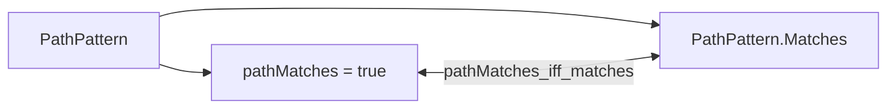
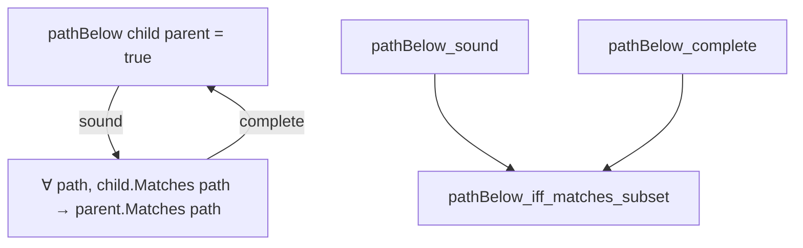

# パスモデルと包含証明

[Authority core 実装ガイド](README.md) / パスモデル

> **対象読者:** `CanonicalPath`、`PathPattern`、path matching・containment を変更する Rust/Lean 実装者

| 言語 | ソース | 担当 |
|---|---|---|
| Rust | [`crates/authority-core/src/path.rs`](../../crates/authority-core/src/path.rs) | 入力検証、実行時表現、`path_matches`、`path_below`、structured error、unit test |
| Lean | [`lean/Authority/Path.lean`](../../lean/Authority/Path.lean) | 検証済み表現、`Matches` の意味論、実行可能判定、包含定理 |

## `CanonicalPath` の責務

両実装とも path を repository-relative な segment 列として保持する。空の segment 列は repository root を表す。以下の segment は構築時に拒否する。

| 拒否条件 | Rust | Lean |
|---|---|---|
| 空文字列 | `InvalidPathSegmentReason::Empty` | `isValidPathSegment = false` |
| `.` | `CurrentDirectory` | `false` |
| `..` | `ParentDirectory` | `false` |
| `/` を含む | `ContainsSeparator` | `false` |
| NUL を含む | `ContainsNul` | `false` |
| `*` を含む | `ContainsWildcard` | `false` |

Rust の `CanonicalPath::new` は、最初に不正だった segment の index と理由を `InvalidPathSegment` で返す。内部の `segments` は private であり、検証を通さずに値を作れない。`root`、`as_segments`、`is_root` は構築済み path の参照 API である。

Lean の `CanonicalPath` は `segments` に加え、全 segment が `isValidPathSegment` を満たす証拠 `isValid` を保持する。`CanonicalPath.ofSegments` は有効な場合だけ `some CanonicalPath` を返す。`CanonicalPath.append` は2つの検証済み path を連結し、証明を保った新しい path を作る。`append` は `pathBelow_complete` の反例 witness 構築にも使う。

## `PathPattern` と matching

`PathPattern` は次の2種類だけを持つ。

| pattern | 選択する path |
|---|---|
| `Exact(path)` / `.exact path` | segment 列が完全に等しい1 path |
| `Prefix(path)` / `.prefix path` | 指定 path 自身と、その全子孫 |

Rust の `path_matches` と Lean の `pathMatches` は同じ判定を行う。Lean は別に `PathPattern.Matches` という `Prop` の意味論を持ち、`pathMatches_iff_matches` で実行可能な `Bool` 判定との一致を証明する。

## `path_below` / `pathBelow`

containment 判定は「child pattern が選ぶ全 path を parent pattern も選ぶか」を構造的に判定する。

| child | parent | `true` になる条件 |
|---|---|---|
| Exact | Exact | canonical path が等しい |
| Exact | Prefix | parent path が child path の prefix |
| Prefix | Exact | 常に `false` |
| Prefix | Prefix | parent path が child path の prefix |

`Prefix(child)` を `Exact(parent)` 以下にできないのは、prefix が child path 自身だけでなく任意の子孫も選ぶためである。たとえ `child` と `parent` の segment が同じでも、Exact はその子孫を選ばない。

## `lean/Authority/Path.lean` が証明すること

| 定理 | 保証 |
|---|---|
| `pathMatches_iff_matches` | `pathMatches = true` と `PathPattern.Matches` が同値 |
| `pathBelow_refl` | すべての pattern は自分自身以下 |
| `pathBelow_trans` | `first ≤ second` かつ `second ≤ third` なら `first ≤ third` |
| `pathBelow_sound` | `pathBelow child parent = true` なら、child が match する全 path に parent も match |
| `pathBelow_complete` | 意味論的な集合包含が成り立つなら `pathBelow = true` |
| `pathBelow_iff_matches_subset` | 実行可能判定と意味論的な path 集合包含が同値 |

完全性証明の難しい case は `Prefix child` と `Exact parent` である。`Path.lean` は private な `strictSuffix = ["_"]` を child path に追加し、child prefix には match するが同じ Exact では同時に覆えない strict descendant を作って矛盾を得る。この witness により、単なる境界例ではなく全 canonical path に対する完全性を証明している。

## 変更時の確認点

- segment の検証規則を変える場合は Rust の `validate_segment`、Lean の `isValidPathSegment`、両言語の境界 test を同時に変更する。
- `PathPattern` の variant を増やす場合は `path_matches` / `pathMatches` と `path_below` / `pathBelow` の全組み合わせ、および `refl`、`trans`、`sound`、`complete` を見直す。
- `CanonicalPath.append` や `strictSuffix` を変える場合は、`pathBelow_complete` が strict descendant を正しく構築できることを確認する。
- 実行可能判定だけを変更せず、Lean の `Matches` との同値定理まで通す。

## 関連

- [Authority core 実装ガイド](README.md)
- [File authority](file-authorities.md)
- [検証とテスト](verification.md)
- [Capability モデル: パスの表し方](../design/capability-model.md#パスの表し方)
