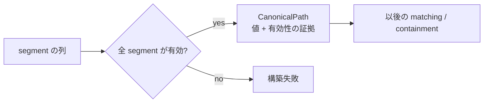
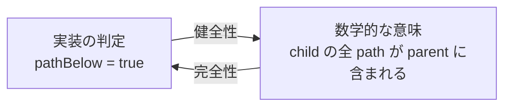
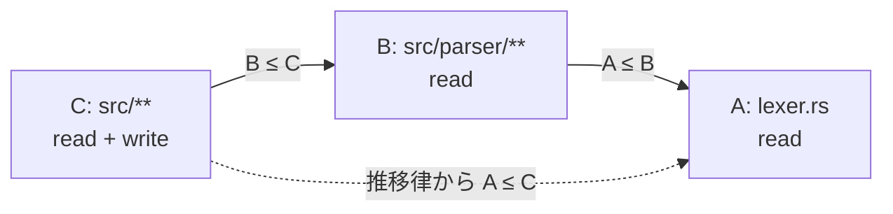

# Authority core で使う証明の考え方

[Authority core 実装ガイド](README.md) / 証明の考え方

このページは Lean の構文解説ではなく、`Path.lean` と `File.lean` が何を根拠に安全性を示しているかを、実装の言葉に置き換えて説明する。

## 証明の中心は集合包含

Authority core は、権限を「許可される request の集合」として考える。子の集合が親の集合にすべて収まっていれば、子へ委譲しても権限は増えない。

```text
子が許す request の集合 ⊆ 親が許す request の集合
```

Lean では、この集合としての意味と、プログラムが実際に返す `Bool` 判定を別々に定義する。そのうえで両者が一致することを証明する。

- **健全性（soundness）**: 判定が `true` なのに、実は親の範囲外だった、を起こさない。
- **完全性（completeness）**: 本当に親の範囲内なのに、判定が誤って `false` になる、を起こさない。
- **同値（if and only if）**: 健全性と完全性の両方が成り立ち、判定と意味がぴったり一致する。
- **推移律（transitivity）**: `A ≤ B` かつ `B ≤ C` なら `A ≤ C`。何段委譲しても最上位の範囲を越えない。

これらは「実装に絶対バグがない」という一般的な主張ではない。Lean で定義したモデルと、そのモデル内の判定について、すべての型付き入力で性質が成り立つという主張である。Rust 実装との対応は共通 corpus で選んだ境界例について自動照合するが、有限の例から全入力の同値を証明するものではない。

## 証明をデータに埋め込む

通常の path を単なる `List String` として持つと、あとから使うたびに「この path は安全か」を確認しなければならない。`CanonicalPath` は、segment 本体と検証済みである証拠を一緒に持つ。

```lean
structure CanonicalPath where
  segments : List String
  isValid : segments.all isValidPathSegment = true
```

これは「値を作る条件を型に含める」という考え方で、依存型や refinement type に近い使い方である。



何が助かるかというと、証明や後段の処理が「不正 path が混ざっているかもしれない」という場合分けを毎回背負わなくてよい。不正な segment を持つ `CanonicalPath` は、Lean の通常の構築方法では証拠を埋められないため作れない。

ただし、ここで証明している有効性は `isValidPathSegment` に書かれた規則だけである。symlink、hard link、OS 上の別名、rename 競合などは path 文字列の型だけでは扱えず、後段の `capfs` が担当する。

## 権限を「許可されるものの集合」として読む

`PathPattern.Matches pattern path` は、「この pattern がこの path を選ぶ」という命題である。したがって pattern は、match する canonical path の集合として読める。

```text
Exact(["src", "main.rs"])
  = { src/main.rs }

Prefix(["src"])
  = { src, src/main.rs, src/parser/lexer.rs, ... }
```

同様に `FileAuthority.Matches authority request` は、その authority が許可する file request の集合を定める。request には repository、effect、path の3要素がある。

このように、データが表すものを数学的な集合として定義する方法を、ここでは**集合意味論**と呼ぶ。実際に巨大な集合をメモリへ作るわけではない。「ある要素が集合に入る条件」を `Matches` という命題で表している。

集合で考える利点は、委譲の安全性を次の一文にできることにある。

```text
child が許可するすべての要素を parent も許可する
```

これは集合の包含 `child ⊆ parent` そのものである。

## `Bool` の判定と `Prop` の意味を分ける

実行時には、認可結果を有限時間で `true` / `false` にする関数が必要になる。一方、証明では「すべての path について」のような数学的な主張を扱いたい。

そこで Lean 側では2層に分ける。

| 層 | 例 | 役割 |
|---|---|---|
| 実行可能な判定 | `pathBelow child parent : Bool` | プログラムとして計算できる |
| 数学的な意味 | `∀ path, child.Matches path → parent.Matches path` | 本当に集合包含かを表す |

`pathBelow_iff_matches_subset` のような `_iff_` 定理は、この2層を橋渡しする。



この分離により、「関数が `true` を返した」という事実だけで終わらず、その `true` がセキュリティ上何を意味するかまで確認できる。

## 健全性と完全性

### 健全性: 誤って許可しない

健全性は次の向きである。

```text
判定が true → 意味論上も本当に包含されている
```

`pathBelow_sound` や `fileBodyBelow_sound` がこれを証明する。委譲判定が通った子について、子が許可する request は必ず親も許可する。そのため、Lean モデル内では判定の誤りによる権限増幅がない。

セキュリティでは、まずこの向きが重要である。`true` を返した結果として境界外を許すのが、権限漏えいにつながるからである。

### 完全性: 正しいものを誤って拒否しない

完全性は逆向きである。

```text
意味論上、本当に包含されている → 判定も true
```

`pathBelow_complete` がこれを証明する。実際には安全な委譲を、判定ロジックの漏れで拒否することがない。これは可用性や、仕様どおりに使えることの保証になる。

### 同値: 判定と仕様がずれていない

健全性と完全性を合わせると、次の同値になる。

```text
判定が true ↔ 意味論上の集合包含
```

パスでは `pathBelow_iff_matches_subset` が無条件に成立する。file authority 全体では、子の effect 集合が空でない場合に `fileBodyBelow_iff_matches_subset_of_effects_nonempty` が成立する。なぜ条件が付くかは[空集合と「何でも正しい」命題](#空集合と何でも正しい命題)で説明する。

## 反射律と推移律

### 反射律: 自分自身以下である

反射律は `A ≤ A` である。権限を変更せずに同じ内容を渡す場合まで拒否しない、という最小限の一貫性を表す。

### 推移律: 多重委譲を1本につなげる

推移律は次の性質である。

```text
A ≤ B かつ B ≤ C なら A ≤ C
```

たとえば、次の3段階を考える。

```text
C: src/** を read + write
B: src/parser/** を read
A: src/parser/lexer.rs を read
```

`A ≤ B` と `B ≤ C` から `A ≤ C` が導ける。これを繰り返せば、有限の何段階の委譲でも、末端の権限が最上位の親を越えないことが分かる。



反射律と推移律を持つ関係は、数学では preorder（前順序）と呼ばれる。現在の証明で重要なのは名称ではなく、「そのまま渡す場合」と「何段つないだ場合」の両方で包含関係が壊れないことである。

## 複数条件を部品ごとに証明する

file authority の包含は、次の3条件の論理積である。

```text
repository が等しい
∧ effect 集合が部分集合
∧ path pattern が包含される
```

これは、複数の軸をそれぞれ比較する**成分ごとの順序**として読める。`File.lean` は、repository には等号の推移性、effect には集合包含の推移性、path には `pathBelow_trans` を使い、最後に3つを組み合わせて `fileBodyBelow_trans` を証明する。

何が助かるかというと、path の証明を file authority で最初からやり直す必要がない。各部品の保証を再利用でき、effect や path の変更がどの定理に影響するかも追いやすい。

## 場合分けと反例の witness

`PathPattern` は `Exact` と `Prefix` の2種類なので、包含判定の証明は4通りを調べられる。

| child | parent | 包含に必要なこと |
|---|---|---|
| `Exact(c)` | `Exact(p)` | `c = p` |
| `Exact(c)` | `Prefix(p)` | `p` が `c` の prefix |
| `Prefix(c)` | `Prefix(p)` | `p` が `c` の prefix |
| `Prefix(c)` | `Exact(p)` | 常に不成立 |

最後の行では、`Prefix(c)` が `c` 自身だけでなく子孫も選ぶのに、`Exact(p)` は1 path しか選ばない。`Path.lean` の完全性証明は、`c` の末尾に有効な `"_"` segment を足した strict descendant を実際に作る。この path は child prefix には含まれるが、同じ exact path には含まれない。

「必ず失敗するはず」と直感で済ませず、失敗を示す具体例を構築する方法を **witness（証人）を与える**という。この witness があるため、`Prefix` を `Exact` 以下と誤判定する余地を完全性の証明で閉じられる。

## 空集合と「何でも正しい」命題

effect を1つも持たない file authority は、どの request にも match しない。つまり意味論上は空集合である。

空集合について、次の主張は常に真になる。

```text
すべての「child が許可する request」について、parent も許可する
```

そもそも child が許可する request が1件もなく、反例を選べないためである。これを**空虚な真（vacuous truth）**という。

一方、構造上の `fileBodyBelow` は effect が空でも、repository の一致と path の包含を要求する。そのため、空 effect の child では次の2つが一致しない場合がある。

- 意味論: 空集合なので、どの parent の request 集合にも含まれる。
- 構造判定: repository や path が違えば `false` にする。

この差があるため、file authority の完全性と同値には `child.effects.Nonempty` という前提が付く。健全性にはこの前提は不要で、空 effect でも「`true` なら権限を増幅しない」は常に成立する。

## 証明から言えること、まだ言えないこと

| 言えること | 条件・範囲 |
|---|---|
| 不正 segment を持つ Lean の `CanonicalPath` を通常の方法で構築できない | `isValidPathSegment` が定義する規則の範囲 |
| path の `Bool` 包含判定と集合意味論が一致する | Lean の `PathPattern` モデル内 |
| file body 判定が通れば、子の全 request は親にも許可される | Lean の repository・effect・path モデル内 |
| 多段の file body 委譲でも最上位の包含境界を越えない | 各段で `fileBodyBelow = true` が成り立つ有限の連鎖 |
| 時刻窓の端点判定と時刻集合の包含が一致する | 同じ session-local clock の単調 tick モデル内 |
| `weakerThan` が通れば、子の全時刻付き request は親にも許可される | file / HTTP fetch / GitHub の `AuthorityBody` と `CapabilityRequest` のモデル内 |
| 多段の Capability 委譲でも root の期間・file 境界を越えない | 各段で `weakerThan = true` が成り立つ有限の連鎖 |

一方、次はこの証明だけでは言えない。

- Rust 実装が Lean と全入力で一致すること。現在の共通 corpus は150件の具体例を自動比較する回帰 test であり、任意の入力に対する同値証明ではない。
- symlink、hard link、rename、open handle、OS path 解決が安全であること。これは `capfs` と統合・並行性テストの範囲である。
- Capability の subject binding、保持、発行、祖先失効、revoke を含む Rust 状態機械全体の安全性が、数学的に証明済みであるとは言えない。逐次 transition は参照モデルとの property test、単一・compound effect と 1 revoke の競合は loom で検査するが、Lean の定理でも実システム全体の証明でもない。
- Lean の外にあるコンパイラ、OS、ホストの identity 発行規則まで正しいこと。

したがって、「数学的に不可能」と表現するときは、**Lean で定義したモデルと前提の範囲内で**という条件を付けるのが正確である。

## 関連

- [Authority core 実装ガイド](README.md)
- [パスモデル](paths.md)
- [File authority](file-authorities.md)
- [有効期間](validity-windows.md)
- [Capability](capabilities.md)
- [Capability state](capability-state.md)
- [Authorization guard](authorization-guard.md)
- [検証とテスト](verification.md)
- [設計上の検証戦略](../design/verification.md)
