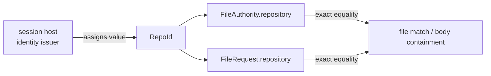

# Repository identity

[Authority core 実装ガイド](README.md) / Repository identity

> **対象読者:** repository の識別境界や `RepoId` を利用する authority 型を変更する実装者

| 言語 | ソース | 担当 |
|---|---|---|
| Rust | [`crates/authority-core/src/repository.rs`](../../crates/authority-core/src/repository.rs) | opaque な `RepoId` newtype、文字列表現への read-only access |
| Lean | [`lean/Authority/Repository.lean`](../../lean/Authority/Repository.lean) | `RepoId` の形式モデル、決定可能な等価性 |

## この型が表すもの

`RepoId` は repository 名や filesystem path ではなく、session host が割り当てる identity である。この module は値の構文を解釈・正規化せず、authority 判定では完全一致だけに使う。

この分離により、同じ path pattern と effect 集合を持つ authority でも、`RepoId` が異なれば別 repository の権限として拒否できる。repository identity の発行規則とライフサイクルは、この型の外側にある host/state-machine の責務である。

## Rust 実装

`RepoId(String)` の内部 field は private である。

| API | 役割 |
|---|---|
| `RepoId::new` | host-assigned value から identity を作る |
| `RepoId::as_str` | 保持した値を `&str` として参照する |
| `Display` | identity を文字列表現として出力する |
| `Debug` / `Clone` | 診断用表現と owned value の複製を提供する |
| `Eq` / `Ord` / `Hash` | exact comparison、ordered collection、hash collection で使えるようにする |

入力 validation は行わない。空文字列を含む値の許可・拒否は現在の `RepoId` の契約には含まれていないため、呼び出し側が host の identity 発行規則を守る必要がある。

## Lean 実装

`RepoId` は `value : String` を持つ structure で、`BEq` と `DecidableEq` を derive する。`File.lean` は `decide (child.repository = parent.repository)` の形で実行可能な exact equality を得る。

Rust と異なり Lean の field は直接参照できるが、証明上の意味は同じである。`RepoId` 自体には path や repository 内容の意味論を持たせず、同じ identity かどうかだけを扱う。

## 利用箇所

`file_matches` / `fileMatches` は authority と request の repository equality を確認する。`file_body_below` / `fileBodyBelow` は child と parent の equality を確認する。どちらも prefix、alias、文字列の大小変換は行わない。

## 変更時の確認点

- identity の validation を追加する場合は Rust と Lean の構築可能な値の集合を揃える。
- `RepoId` の equality semantics を変える場合は request matching と body containment の両方に影響する。
- repository name や path の正規化を `RepoId` に混ぜない。repository 内 path は [`CanonicalPath`](paths.md) が担当する。

## 関連

- [Authority core 実装ガイド](README.md)
- [パスモデル](paths.md)
- [File authority](file-authorities.md)
- [Capability モデル: ID、時間、回数](../design/capability-model.md#id時間回数)
