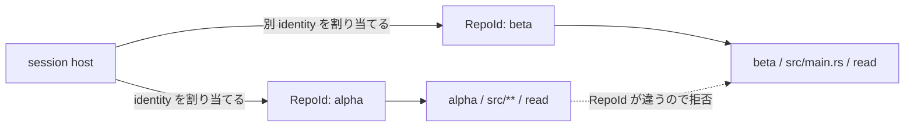

# Repository identity

[Authority core 実装ガイド](README.md) / Repository identity

このページは [`crates/authority-core/src/repository.rs`](../../crates/authority-core/src/repository.rs) と [`lean/Authority/Repository.lean`](../../lean/Authority/Repository.lean) が、repository の境界をどう表しているかを説明する。

## Repository を名前ではなく identity で分ける

`RepoId` は repository 名でも filesystem path でもない。session host が「これはこの repository である」と割り当てる、不透明な identity である。

Authority core は identity を解釈せず、完全一致だけで比較する。

```text
repo-A の src/main.rs
≠ repo-B の src/main.rs
```

path と effect が同じでも、`RepoId` が違えば別 repository の request として拒否される。これにより、ある repository 向けの権限が、同じ directory 構造を持つ別 repository に流用されることを防ぐ。

このファイル自体が identity の一意性や再利用禁止を証明しているわけではない。正しい ID を発行し、session を越えて再利用しない責任は host の identity issuer と workspace mapping にある。現在の `CapabilityState` は、すでに割り当てられた `RepoId` が subject の静的 envelope と親 Capability の内側かだけを検査する。

## 何を防ぎたいのか

file authority を effect と path だけで表すと、次の2つは区別できない。

```text
project-alpha / src/main.rs / read
project-beta  / src/main.rs / read
```

どちらも path は `src/main.rs`、effect は `ReadData` である。しかし別 repository の内容なので、同じ権限として扱ってはいけない。

そこで file request と file authority の両方に `RepoId` を持たせる。



repository 名や checkout 先の文字列を比較するのではなく、host が発行した identity を比較するため、名前の別名、path の偶然の一致、directory 構造の一致を権限の同一性と取り違えない。

## なぜ「不透明」にするのか

`RepoId` の値に、prefix や path のような意味を持たせないためである。

たとえば identity が文字列として `team/project` と `team/project-fork` であっても、前者を後者の親として扱わない。大文字小文字の変換、prefix 比較、alias 解決もしない。

```text
同じ値   → 同じ repository identity
違う値   → 別 repository identity
```

この単純な境界にすると、「似た名前だから同じ権限でよい」という意図しない規則が authority 判定へ入り込まない。

Rust の `RepoId(String)` は内部 field を private にし、利用側には `RepoId::new` と read-only な `as_str` を提供する。Lean の `RepoId` は `value : String` を持つ小さな形式モデルで、`DecidableEq` により等しいかを計算できる。

## どんな数学を使っているのか

ここで使うのは、特殊な repository 理論ではなく**等号**である。

等号には、file authority の証明で必要になる次の基本性質がある。

- 反射性: `A = A`
- 対称性: `A = B` なら `B = A`
- 推移性: `A = B` かつ `B = C` なら `A = C`

file authority の多段委譲では、次のように推移性を使う。

```text
leaf.repository = child.repository
child.repository = root.repository
────────────────────────────────────
leaf.repository = root.repository
```

この結果を effect 集合の包含と path の包含の推移律に組み合わせることで、`fileBodyBelow_trans` が成り立つ。

また、Lean の `DecidableEq` は「等しいかどうかを判定できる」という性質である。数学的な等号を `fileMatches` や `fileBodyBelow` の `Bool` 計算に使える形へ落とし込む。

専用の `repositoryBelow` のような関係を新しく作らないのは、repository 間の包含や親子関係を現在のモデルが認めていないからである。同じ repository か、そうでないかだけを扱う。

## 何が助かるのか

### 別 repository への権限流用を止める

`fileMatches` / `file_matches` は、authority と request の `RepoId` が一致しなければ、effect と path が許可範囲でも `false` になる。

### 委譲時に対象 repository を変えさせない

`fileBodyBelow` / `file_body_below` は、child と parent の `RepoId` の一致を必須にする。子権限を作る途中で、より価値の高い別 repository へ対象を差し替えることを許さない。

### path の責務を小さく保つ

`CanonicalPath` は「1 repository の中のどこか」だけを表せばよい。どの repository かは `RepoId` が担当する。この分離により、path containment の証明へ repository の名前解決や checkout 先を混ぜずに済む。

## Rust と Lean の担当

| 言語 | 実装 | 担当 |
|---|---|---|
| Rust | `RepoId(String)` | 実行時の不透明な newtype、exact equality、表示・collection 用 trait |
| Lean | `structure RepoId` | file authority 証明で使う identity モデル、決定可能な等価性 |

Rust の主な API と trait は次のとおりである。

| API / trait | 役割 |
|---|---|
| `RepoId::new` | host が割り当てた値から identity を作る |
| `RepoId::as_str` | 保持した値を read-only に参照する |
| `Display` | identity を表示する |
| `Eq` / `Hash` | exact comparison と hash collection で使う |
| `Ord` | ordered collection で使う |

Lean 側では `BEq` と `DecidableEq` を derive し、`File.lean` が次の比較に利用する。

```lean
decide (authority.repository = request.repository)
decide (child.repository = parent.repository)
```

## 正確な保証範囲

`RepoId` の exact equality が安全に働くには、host が異なる repository へ異なる値を発行する必要がある。現在の2ファイルは、受け取った値を比較するだけで、次を保証しない。

- ID が全 session・全 host で一意であること。
- snapshot restore 後に古い ID を再利用しないこと。
- 空文字列など、host-assigned value の構文が妥当であること。
- その ID が実際にどの checkout や backing storage を指すか。
- request を出した subject が、その `RepoId` を保持してよいこと。

これらは identity issuer、Capability state、workspace mapping の責務である。現在の `RepoId` は入力 validation を行わないため、空文字列を含む値の許可・拒否も契約に含まれていない。

また、Lean の `RepoId` field は直接参照でき、Rust の field は private という表現上の違いがある。概念は対応しているが、Lean の型が Rust newtype のカプセル化を直接証明しているわけではない。

## 変更時の確認点

- identity の validation を追加する場合は、Rust と Lean で構築できる値の集合を揃える。
- equality semantics を変える場合は、request matching と body containment の両方、および `fileBodyBelow_trans` の前提を見直す。
- repository name や filesystem path の正規化を `RepoId` に混ぜない。repository 内 path は [`CanonicalPath`](paths.md) が担当する。
- identity に階層関係を導入する場合は exact equality の小変更ではなく、authority semantics 自体の変更として設計し直す。

## 関連

- [Authority core で使う証明の考え方](proof-concepts.md)
- [Authority core 実装ガイド](README.md)
- [パスモデル](paths.md)
- [File authority](file-authorities.md)
- [Capability モデル: ID、時間、回数](../design/capability-model.md#id時間回数)
- [Capability state](capability-state.md)
- [状態機械と revoke](../design/state-and-revocation.md)
