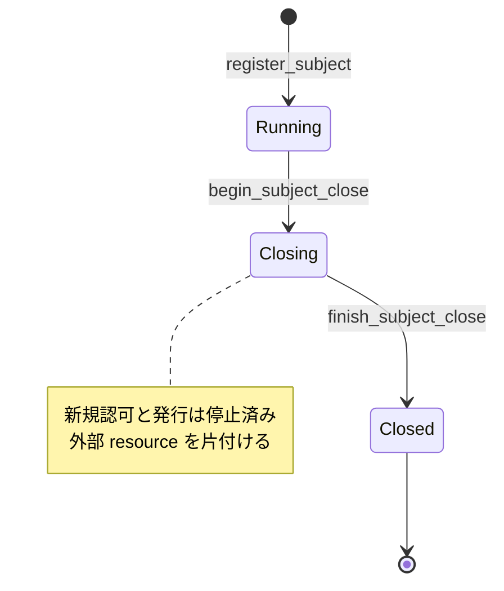

<!-- doc-type: concept -->

# Subject lifecycle と open handle

[Authority core 実装ガイド](README.md) / Subject lifecycle と open handle

> **対象読者:** subject の shutdown と open handle を触る実装者

このページは [`crates/authority-core/src/state.rs`](../../crates/authority-core/src/state.rs) の subject lifecycle と、[`crates/authority-core/src/handle.rs`](../../crates/authority-core/src/handle.rs) の open-handle model を説明する。Capability の発行規則は[逐次状態機械](capability-state.md)、effect と shutdown の同期は[Authorization guard](authorization-guard.md)を参照する。

## Subject を削除するだけでは足りない

実行中の subject には、保持中の Capability、派生済みの子 Capability、open handle、コンテナや mount などの外部 resource がある。subject record を一度に削除すると、どの resource を閉じるべきか分からなくなり、進行中の effect と shutdown の順序も曖昧になる。

そこで subject は次の一方向の状態を持つ。



`Creating` は channel、mount、静的 envelope を準備する supervisor 側の状態である。Authority core には、初期化が完了した subject だけを `register_subject` で `Running` として公開する。

## Shutdown 開始時に何が起きるか

`begin_subject_close` は authorization guard の exclusive access 内で次をまとめて行う。

```text
Running であることを確認
→ 次の auth_epoch を予約
→ subject が保持する全 Capability を revoke
→ status を Closing に変更
→ auth_epoch を更新
```

exclusive access は、すでに認可されて線形化点へ進んでいる effect の shared guard が終わるまで待つ。そのため `begin_subject_close` が return した後、新しい effect は subject status または revoke 済み ancestor によって拒否される。

同じ subject に2回 shutdown を要求しても、2回目は `AlreadyClosing` または `AlreadyClosed` となる。epoch を余分に進めたり、Closed から Running へ戻したりしない。

## `auth_epoch` は何を助けるか

`AuthorizationEpoch` は authorization state の単調な version である。新しい revoke または Running→Closing で1増え、同じ revoke の再実行では増えない。

`capfs` が認可結果を内部 cache する場合、cache key にこの epoch を含める。revoke 後に epoch が変われば、古い allow decision を現在のものとして再利用できない。

```text
cache key = request + CapId + auth_epoch + namespace_generation
```

epoch は `u64::MAX` から0へ戻らない。次の値を作れなければ transition 全体を `AuthorizationEpochExhausted` で拒否し、古い cache key と衝突しないよう fail closed にする。

## Open handle が記録するもの

`OpenHandle` は次の3つだけを結び付ける。

| Field | 意味 |
|---|---|
| `HandleId` | trusted filesystem adapter が割り当てた session-local identity |
| `SubjectId` | handle を所有する認証済み subject |
| `ObjectId` | VM 共通 namespace registry 上の object |

open 時に使った Capability や canonical path は保存しない。同じ fd の read / write ごとに、`ObjectId` の現在 path を引き直して Capability を再確認するためである。rename 後も open 時点の古い path authority を使い続けない。

## Handle ID を再利用しない理由

close 済み `HandleId` を別 object に再利用すると、遅れて届いた stale request が新しい handle の操作として解釈され得る。

`CapabilityState` は live handle の map とは別に、過去に発行した全 `HandleId` を保持する。

```text
open_handles          : 現在 live な HandleId → OpenHandle
issued_handle_owners  : 過去の HandleId → 最初に発行された SubjectId
```

`close_handle` は、認証済み caller が最初に登録された owner と一致するときだけ live map から削除する。他 subject の handle は閉じられず、close 後にも owner を残すため、別 subject から届いた stale close も拒否できる。正しい owner による2回目の close は `AlreadyClosed` になるが、同じ ID を再登録する操作は `HandleIdAlreadyIssued` で拒否される。

## Object ごとの count が何を助けるか

`object_open_handle_count` は同じ namespace object を参照する live handle 数を返す。`capfs` の namespace registry は、この情報を subtree 単位の count へ集約して利用する。

- open handle がある object の unlink を `EBUSY` にする。
- open handle を含む subtree の rename を `EBUSY` にする。
- subject teardown 時に、閉じ忘れた handle がないか確認する。

Authority core の `finish_subject_close` は、その subject に live handle が1件でもあれば `SubjectHasOpenHandles` で拒否する。外部 fd を閉じる前に subject record だけ Closed へ進めないためである。

## どこまで実装済みか

現在実装済みなのは、lifecycle transition、held Capability の shutdown revoke、epoch 更新、typed handle identity、subject/object binding、live count、close の冪等性、ID 非再利用、Closed 前の live-handle 検査である。

Authority core 内で残るのは adapter 側の接続である。kernel の Loom model は open-handle 登録と
shutdown の順序、および child effect と direct / ancestor の複数 revoke を検査する。

次は adapter 側に残る。

- backing `open` の成功と `register_open_handle` を失敗処理込みで接続すること。登録が拒否された場合は、adapter が開いた fd を必ず閉じる。
- FUSE request の `fh` を trusted `HandleId` へ変換し、request payload の subject identity を信用しないこと。
- 実装済みの[global namespace registry](../capfs/namespace-registry.md)と Authority core の handle 登録・close を、失敗処理込みで同じ adapter transition へ接続すること。
- cgroup stop、fd close、unmount を実行してから `finish_subject_close` を呼ぶ supervisor orchestration。
- open handle、rename、unlink、revoke を組み合わせた capfs の Loom・実 mount test。

したがって、現在の model は stale handle ID の再束縛、Authority core 内の不正 transition、登録と
shutdown の競合を防ぐが、OS fd や FUSE lifecycle との接続まで完成したという意味ではない。

## どう検証しているか

[`crates/authority-core/tests/capability_state.rs`](../../crates/authority-core/tests/capability_state.rs) は、shutdown の単調性、descendant invalidation、epoch の冪等性、handle ID 非再利用、object count、live handle が Closed を止めることを確認する。

[`crates/authority-core/tests/authorization_kernel.rs`](../../crates/authority-core/tests/authorization_kernel.rs) は、synchronized shutdown が後続 executor を呼ばないことと、kernel 経由の handle 登録・close・count を確認する。

これらは Rust transition の具体的な契約 test であり、subject lifecycle 全状態の数学的証明や OS adapter の end-to-end test ではない。

## 関連

- [Capability の発行と逐次状態機械](capability-state.md)
- [Effect commit と revoke の authorization guard](authorization-guard.md)
- [Attempt / effect audit](audit-records.md)
- [状態機械と revoke の設計](../design/state-and-revocation.md)
- [capfs](../design/capfs.md)
- [検証とテスト](verification.md)
