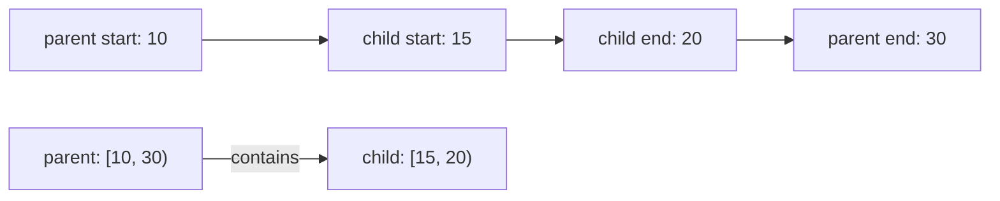

# 有効期間と時刻窓の包含証明

[Authority core 実装ガイド](README.md) / 有効期間

このページは [`crates/authority-core/src/time.rs`](../../crates/authority-core/src/time.rs) と [`lean/Authority/Time.lean`](../../lean/Authority/Time.lean) が、Capability の有効期間をどう表し、子の期間が親からはみ出さないことをどう証明しているかを説明する。

## 期限の境界を1つの型に閉じ込める

Capability の時刻窓は、開始を含み終了を含まない半開区間である。

```text
[not_before, expires_at)
```

たとえば `[10, 20)` は tick 10 と 19 を含むが、20 は含まない。`expires_at` になった瞬間から無効なので、「期限ちょうどを許可する実装」と「拒否する実装」が混在しない。

Rust の `TimeWindow::new` と Lean の `TimeWindow.ofBounds` は、次の条件を満たす場合だけ値を作る。

```text
not_before < expires_at
```

開始と終了が同じ空区間や、終了が開始より前の逆転区間は構築時に拒否する。Lean の `TimeWindow` は `isValid` という証明を構造体に持つため、証明内では「この窓は本当に非空か」を毎回仮定し直す必要がない。

| 概念 | Rust | Lean |
|---|---|---|
| 単調時刻 | `MonotonicTime(u64)` | `MonotonicTime.ticks : Nat` |
| 有効な時刻窓 | private field を `TimeWindow::new` 経由で構築 | `isValid : notBefore.ticks < expiresAt.ticks` を持つ構造体 |
| 無効な境界 | `InvalidTimeWindow` | `TimeWindow.ofBounds = none` |
| 時刻が窓内か | `TimeWindow::contains` | `timeMatches` / `TimeWindow.Contains` |
| 子の窓が親の内側か | `TimeWindow::is_subset_of` | `timeWindowBelow` |

Rust は実行環境の幅に合わせて `u64` を使い、Lean は大小関係の意味を `Nat` 上で証明する。現在の判定は加減算をせず比較だけを行うため、Rust の全 `u64` 値は Lean のモデルへそのまま対応する。

## 子の期間を狭める条件

子の時刻窓が親以下である条件は、2つの端点比較だけで書ける。

```text
parent.not_before ≤ child.not_before
∧ child.expires_at ≤ parent.expires_at
```



開始を早めたり終了を遅らせたりすると、親が無効な時刻に子だけが有効になる。そのため `[9, 20)` と `[15, 31)` はどちらも `[10, 30)` 以下ではない。開始または終了を親と同じにすることは許される。

## どんな数学で証明しているのか

### 区間を時刻の集合として考える

`TimeWindow.Contains` は、時刻窓を「その窓に含まれる tick の集合」として意味付けする。

```lean
window.notBefore.ticks ≤ time.ticks ∧
  time.ticks < window.expiresAt.ticks
```

`TimeWindow.IsSubsetOf child parent` は、child に含まれる任意の時刻が parent にも含まれるという集合包含である。

```lean
∀ time, child.Contains time → parent.Contains time
```

実装は全 tick を列挙せず、端点を2回比較するだけでよい。Lean は、この小さな計算と全 tick に対する意味が一致することを証明する。

### 健全性と完全性

`timeWindowBelow_sound` は次を保証する。

```text
timeWindowBelow child parent = true
→ child に含まれる全時刻が parent にも含まれる
```

これにより、包含判定が `true` になったのに、親が期限切れまたは開始前で子だけ有効になる時刻は存在しない。

`timeWindowBelow_complete` は逆向きを保証する。

```text
child に含まれる全時刻が parent にも含まれる
→ timeWindowBelow child parent = true
```

両方をまとめた `timeWindowBelow_iff_subset` により、端点判定と時刻集合の包含は必要十分条件になる。Lean モデル内では、期間外を誤って許可する false allow だけでなく、本当に内側の期間を誤って拒否する false deny もこの判定にはない。

### 反射律と推移律

`timeWindowBelow_refl` は、どの有効な窓も自分自身以下であることを示す。

`timeWindowBelow_trans` は、次の包含をつなげられることを示す。

```text
leaf window ⊆ child window
child window ⊆ root window
──────────────────────────
leaf window ⊆ root window
```

委譲が何段続いても、各段で時刻窓を狭めていれば、末端の有効期間は最上位の期間を越えない。

## 何が助かるのか

### 期限切れ境界の解釈が揃う

認可側は常に半開区間として判定する。開始 tick は許可し、終了 tick は拒否するため、呼び出し元ごとに `<=` と `<` を選び直す必要がない。

### 不正な Capability を早い段階で拒否できる

空または逆転した有効期間を通常の constructor から作れない。後続の matching と委譲証明は、有効な窓だけを対象にできる。

### 多段委譲の期限を局所比較できる

各 child と直近 parent の端点だけを確認すればよい。推移律により、leaf と root を毎回特別な規則で比較しなくても root の期限境界を保てる。

## 正確な保証範囲

`MonotonicTime` は、同じ VM セッション内で同じ clock origin と tick 単位を使う値として扱う。Authority core は wall clock への変換、現在時刻の取得、VM 再起動を跨ぐ値の移送を行わない。

したがって、ホストには次の責務が残る。

- 比較する値を同じ session-local monotonic clock から供給する。
- request の実行直前に現在時刻を取得して認可へ渡す。
- VM セッションを跨いで Capability や tick を再利用しない。
- revoke と effect commit の競合を[状態機械](../design/state-and-revocation.md)の lock で処理する。

この証明は clock source や scheduler の実装を証明するものではない。与えられた単調 tick と有効な `TimeWindow` に対する membership と containment の正しさを証明する。

## 変更時の確認点

- 境界を半開区間から変える場合は、Rust の `contains`、Lean の `Contains`、端点包含、全境界 example を同時に変更する。
- `MonotonicTime` に session identity や clock kind を加える場合は、比較可能性の条件を Rust と Lean の型へ同時に反映する。
- 時刻に加減算を導入する場合は、Rust の `u64` overflow と Lean の `Nat` の差を別途モデル化する。
- containment を変更したら `refl`、`trans`、`sound`、`complete`、`iff` がすべて通ることを確認する。

## 関連

- [Capability envelope と委譲証明](capabilities.md)
- [Authority core で使う証明の考え方](proof-concepts.md)
- [検証とテスト](verification.md)
- [Capability モデル: ID、時間、回数](../design/capability-model.md#id時間回数)
- [状態機械と revoke](../design/state-and-revocation.md)
