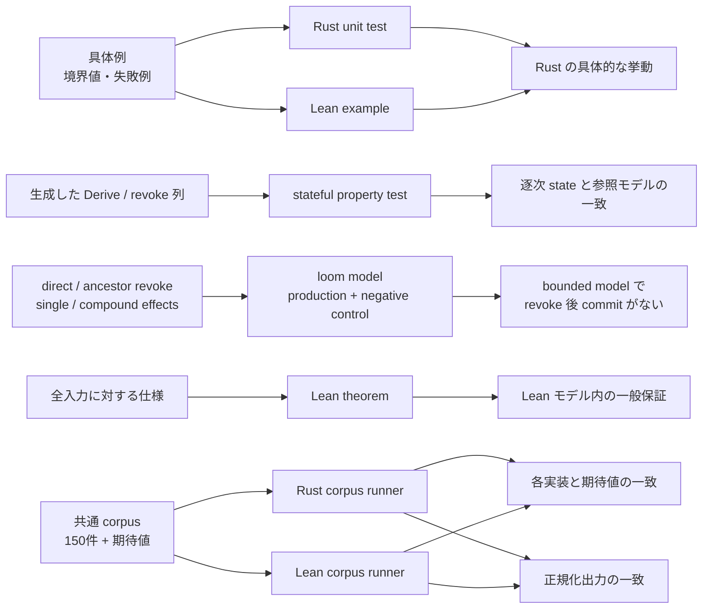

<!-- doc-type: verification -->

# Authority core の検証とテスト

[Authority core 実装ガイド](README.md) / 検証とテスト

> **対象読者:** Authority core の実装者、レビュー担当者、共通 corpus を更新する人

このページは、Rust の unit・状態遷移・property test、loom model、Lean executable example、Lean theorem、共通 corpus の差分テストがそれぞれ何を確認し、組み合わせると何が分かるかを説明する。プロジェクト全体の検証方針は[検証戦略](../design/verification.md)を参照する。

## local test で確認したこと

詳細は下の節ごとに書く。全体像は次のとおり。

| 対象 | 検証手段 | どこまで |
|---|---|---|
| path、file、有効期間、Capability、HTTP、GitHub の判定 | Rust unit test + Lean example + 共通 corpus | 実装済み。3 者が同じ境界入力を通る |
| 委譲判定の健全性・完全性・反射律・推移律 | Lean theorem | 実装済み。Lean モデル内の全型付き入力 |
| 逐次 Capability state の遷移 | Rust transition test + stateful property test | 実装済み。生成した操作列で参照モデルと一致 |
| effect commit と revoke の順序 | loom model（production と negative control） | 実装済み。bounded interleaving |
| Rust と Lean の判定一致 | 共通 corpus 150 件の差分テスト | 実装済み。corpus に含まれる入力のみ |

「実装済み」は各手段が答える問いに答えたという意味で、手段ごとに保証範囲が違う。次の節でその差を書く。

## 検証方法ごとの役割

Authority core では、1つの手段ですべてを保証しようとせず、違う問いに違う検証を当てる。

| 検証 | 答える問い |
|---|---|
| Rust unit / transition test | 実際の Rust API は、この具体的な入力と操作順で期待どおり動くか |
| Stateful property test | 生成した多数の操作列で production state と参照モデルが一致するか |
| Loom model | 小さく切った並行処理で、許される全 interleaving が不変条件を守るか |
| Lean executable example | Lean の `Bool` 判定は、この具体的な境界入力で期待どおりか |
| Lean theorem | Lean モデルのすべての型付き入力で、一般的な性質が成り立つか |
| 共通 corpus の差分テスト | 同じ入力に対して Rust と Lean が同じ結果を返すか |

unit test、Lean example・theorem、共通 corpus は file / HTTP fetch / GitHub の authority family に実装済みである。逐次 Capability state には Rust の transition test と stateful property test があり、effect commit と revoke の同期境界には loom model がある。ただし、具体例・生成列・bounded interleaving を実行する検査と、全入力を扱う Lean theorem では保証範囲が異なる。



証明が test の代わりになるわけでも、test が証明の代わりになるわけでもない。両者は失敗の種類が違う。

## Test と証明は何が違うのか

### Test は、選んだ具体例を確認する

たとえば次の case を test できる。

```text
Prefix(src) は src/main.rs に match する
Prefix(src) は docs/design.md に match しない
Prefix(src) は Exact(src) 以下ではない
```

test は、実際の関数を動かし、API の接続、error の内容、内部表現、境界例を確認するのが得意である。ただし100個の case が通っても、101個目に反例がないとは論理的には言えない。

### 定理は、任意の入力を1つ取って証明する

`pathBelow_sound` は特定の `src` や `docs` だけを扱わない。

```lean
∀ path, child.Matches path → parent.Matches path
```

任意の `child`、`parent` と任意の canonical `path` について証明するため、segment の個数や名前ごとに test case を列挙する必要がない。

これが「すべての入力で成り立つ」の意味である。ただし対象は Lean の型で表せる入力と、Lean に書かれた意味論の範囲に限られる。OS の symlink や Rust の machine code が自動的に証明対象へ入るわけではない。

### 差分テストは、2実装の対応を確認する

Lean theorem が `pathBelow` の性質を証明しても、Rust の `path_below` に同じ変更が入っているとは限らない。両言語で同じ入力を読み、結果を比較する差分テストがこの隙間を埋める。

[`tests/fixtures/authority-core.tsv`](../../tests/fixtures/authority-core.tsv) は、判定種別、case 名、期待する `Bool`、判定に必要な入力を持つ versioned TSV である。現在は path、time、file、HTTP、GitHub、各 family の Capability を18種類の判定で150件検査する。

Rust と Lean の runner は同じ fixture を別々に parse し、それぞれ production 判定を呼ぶ。各 runner は自分の結果が期待値と違えば失敗し、成功時だけ `case名<TAB>実結果` を出力する。[`scripts/check-authority-corpus.sh`](../../scripts/check-authority-corpus.sh) はその正規化出力も比較する。このため、両実装が同じ誤答を返した場合も、両出力が食い違った場合も検出できる。

ただし差分テストは150件の具体例に対する回帰検査である。corpus にない任意の入力について Rust と Lean の一致を証明するものではない。

## 「権限漏えいしない」と何を根拠に言えるのか

path containment では、Lean が次の両方向を証明する。

```text
判定が true → 本当に集合包含である       soundness
本当に集合包含 → 判定も true             completeness
```

したがって Lean の path モデル内では、包含判定が原因の次の2種類のずれを排除できる。

- false allow: 親の外側なのに `true` となり、権限が漏れる。
- false deny: 親の内側なのに `false` となり、正しい委譲が動かない。

file body containment では、false allow を防ぐ `fileBodyBelow_sound` は無条件に成立する。false deny まで排除する完全性は、child の effect 集合が非空の場合に成立する。空 effect では request 集合が空になり、構造判定との意味に差が出るためである。

時刻窓では `timeWindowBelow_iff_subset` により、端点判定と全 tick の集合包含が無条件に一致する。Capability 全体では `weakerThan_sound` が無条件に false allow を防ぎ、authority body が非空なら `weakerThan_iff_matches_subset_of_authority_nonempty` により false deny も排除する。

この主張を「数学的に0%」と言い換えるなら、正確には次のようになる。

> Lean で定義したモデルと前提の範囲内では、その性質に反する型付き入力は存在しない。

実環境全体のバグ発生確率を数値として測定した主張ではない。どこまでがモデル内かは[証明の考え方: 言えること、まだ言えないこと](proof-concepts.md#正確な保証範囲)を参照する。

## Rust test は何を確認するか

純粋関数の unit test は対象実装と同じファイルの `#[cfg(test)] mod tests` に置く。公開 API をまたぐ状態遷移 test、property test、loom model は `crates/authority-core/tests/` に置く。

| ソース | test 数 | 主な確認内容 |
|---|---:|---|
| [`repository.rs`](../../crates/authority-core/src/repository.rs) | 1 | host-assigned value の保持、`as_str`、`Display` |
| [`path.rs`](../../crates/authority-core/src/path.rs) | 11 | valid/root path、child append、6種類の invalid segment、最初の error、tree relationship、rebase、Exact/Prefix matching、containment matrix、推移性 |
| [`file.rs`](../../crates/authority-core/src/file.rs) | 5 | effect membership と duplicate、空/同値/拡大 subset、request matching の3軸、body containment の3軸、推移性 |
| [`time.rs`](../../crates/authority-core/src/time.rs) | 4 | 正常/空/逆転区間、半開境界、時刻窓 subset、推移性 |
| [`http.rs`](../../crates/authority-core/src/http.rs) | 9 | canonical host / URL path、method set、matching、containment、空集合、`u64::MAX` の全軸 |
| [`github.rs`](../../crates/authority-core/src/github.rs) | 8 | branch validation、operation set、matching、containment、空集合の全軸 |
| [`capability.rs`](../../crates/authority-core/src/capability.rs) | 7 | typed metadata、時刻付き matching、同型 dispatch、cross-family deny、縮小と拡大拒否、推移性 |
| [`state.rs`](../../crates/authority-core/src/state.rs) | 2 | `u64::MAX` の最後の Capability ID、authorization epoch の wraparound 拒否 |
| [`handle.rs`](../../crates/authority-core/src/handle.rs) | 1 | typed handle / subject / object identity の保持 |
| [`audit.rs`](../../crates/authority-core/src/audit.rs) | 2 | attempt outcome と effect filtering、Attempt ID exhaustion |
| [`kernel.rs`](../../crates/authority-core/src/kernel.rs) | 1 | exclusive writer の panic 後に poisoned state を再利用せず fail closed にする |
| [`authority-corpus.rs`](../../crates/authority-core/src/bin/authority-corpus.rs) | 7 | header/schema、未知の判定、必須 field、u64 上限、期待値不一致、case 名重複の拒否 |
| [`capability_state.rs`](../../crates/authority-core/tests/capability_state.rs) | 12 | 発行・Derive・revoke、HTTP/GitHub lifecycle、atomicity、subject lifecycle、handle ID 非再利用 |
| [`capability_state_properties.rs`](../../crates/authority-core/tests/capability_state_properties.rs) | 1 | 1〜63操作の Derive/revoke 列を1,000 case 生成し、参照モデルと各 transition を比較 |
| [`authorization_kernel.rs`](../../crates/authority-core/tests/authorization_kernel.rs) | 11 | synchronized API、active inspection、inspection中のrevoke待機、最終認可、lifecycle、handle、audit、祖先 revoke |
| [`authorization_kernel_loom.rs`](../../crates/authority-core/tests/authorization_kernel_loom.rs) | 6 | direct / ancestor revokeの単一・compound effect、2 effects、audit consistency、negative control |

Authority core packageではproduction moduleの51 test、corpus runnerの7 test、公開APIの状態遷移test 12件、authorization guardのcontract test 11件、property test 1件の合計82 testを実行する。capfs packageはmodule testとnamespace / node / preflight / 実mount integration testを合わせて107 testを実行する。egress-protocol packageはframe、replay envelope、session budget、closed operation union、canonical CBOR schema、authority request conversion の18 testを実行する。現在のworkspace全体では合計207 testを`cargo test --workspace`で実行する。property testは内部で1,000本の操作列を生成する。これとは別に、runnerは共有fixtureの150件を実行時に評価する。

loom の6件は `cfg(loom)` 専用なので、通常の `cargo test --workspace` では実行されない。専用コマンドでは production と同じ `CapabilityKernel` の同期 primitive を loom 版に差し替え、direct / ancestor revokeの単一・compound effectと、2 effects の bounded model を探索する。compound modelはexecutorの全段階実行または未実行、attempt / effectがrequest set全体を持つことまで確認する。negative control は意図どおり反例を発見して panic することを `#[should_panic]` で成功条件にしている。

ここで特に test が助けるのは、Lean の抽象モデルに出にくい Rust 固有の部分である。

- `CanonicalPath::new` が正しい structured error と index を返す。
- private field と constructor を通した実際の API が使える。
- `u16` bitset が duplicate を無視し、期待どおり membership を返す。
- Rust の enum variant と match 分岐が concrete boundary で正しく接続される。
- `TimeWindow::new` が不正な端点を structured error として拒否する。
- typed metadata の getter と全 tagged Capability envelope が実際の公開 API で接続される。
- 失敗 transition が ID sequence や held/capability map を途中まで変更しない。
- 別 subject にコピーした ID、revoke 済み祖先、静的 envelope 外の grant が拒否される。
- subject shutdown、stale handle ID、audit outcome が実際の transition と一致する。

test helper の `path` は `CanonicalPath::new(...).expect(...)` を通し、fixture 自体も検証済み path から作る。

## `AuthorityTests.lean` は何を確認するか

[`lean/AuthorityTests.lean`](../../lean/AuthorityTests.lean) は production theorem を置くファイルではない。Rust test と対応する値を作り、Lean の実行可能な `Bool` 判定を51個の `example` で評価する。

| 対象 | 具体的に確認する境界 |
|---|---|
| `CanonicalPath.ofSegments` | root、valid nested path、空・`.`・`..`・separator・NUL・wildcard の拒否 |
| `pathBelow` | Exact/Exact、Exact/Prefix、Prefix/Prefix、Prefix/Exact、root、非包含、具体的な推移 chain |
| `FileEffects` / `fileEffectsBelow` | duplicate、membership、空集合、反射、subset、effect escalation |
| `fileMatches` | allow、effect 不一致、repository 不一致、path 不一致 |
| `fileBodyBelow` | 反射、effect escalation、repository 不一致、path 拡大、具体的な推移 chain |
| `TimeWindow` / `timeWindowBelow` | 正常/空/逆転区間、半開境界、期間拡大の拒否、具体的な推移 chain |
| `httpFetchMatches` / `httpFetchBodyBelow` | method / host / URL path / byte cap の matching と containment |
| `gitHubMatches` / `gitHubBodyBelow` | installation / repository / operation / base/head branch の matching と containment |
| `capabilityMatches` / `weakerThan` | 時刻と body の積、反射、期間拡大の拒否、逆向き包含、具体的な多段委譲、cross-family deny |

多くの example は `by decide` で閉じる。Lean が命題を計算し、その結果が真である proof term を kernel が検査する。

fixture の `CanonicalPath` も `isValid := by decide` で構築する。そのため、test 用 path が validation invariant を満たすこと自体が type checking の条件になる。

Lean example が役立つ点は、定理だけでは見えにくい「この具体例はどちらになるか」を読みやすく固定できることである。たとえば root prefix や `Prefix` 対 `Exact` の向きを、仕様例として残せる。

## `AuthorityCorpus.lean` は何を確認するか

[`lean/AuthorityCorpus.lean`](../../lean/AuthorityCorpus.lean) は共有 fixture の parser と Lean runner を担当する。Rust と同じ schema を独立に解釈し、production の `pathMatches`、`timeWindowBelow`、`fileMatches`、`weakerThan` などを呼ぶ。

parser 自体についても6個の executable example があり、header 欠落、未知の判定種別、必須 field 欠落、`u64` を越える tick、期待値不一致、case 名重複を拒否する。Lean の `Nat` は `u64` より広いため、tick 上限を runner で明示的に揃えている。

`lake test` は `AuthorityTests` を import したこの runner を test driver として構築し、標準の共有 fixture 150件を評価する。そのため、独立した51個の境界 example と、共通入力による両実装の比較を併用できる。

## Production theorem は何を確認するか

production theorem は [`lean/Authority/Path.lean`](../../lean/Authority/Path.lean)、[`lean/Authority/File.lean`](../../lean/Authority/File.lean)、[`lean/Authority/Http.lean`](../../lean/Authority/Http.lean)、[`lean/Authority/GitHub.lean`](../../lean/Authority/GitHub.lean)、[`lean/Authority/Time.lean`](../../lean/Authority/Time.lean)、[`lean/Authority/Capability.lean`](../../lean/Authority/Capability.lean) に置く。

| 対象 | 証明する一般性質 | 実務上の意味 |
|---|---|---|
| path matching | `pathMatches_iff_matches` | `Bool` の結果と path 選択の意味が一致する |
| path containment | `refl`, `trans`, `sound`, `complete`, `iff` | 多段委譲でも path を広げず、安全な包含を誤拒否しない |
| effect containment | `iff_subset`, `refl`, `trans` | 子にだけ追加 effect がなく、多段でも部分集合を保つ |
| file matching | `fileMatches_iff_matches` | repository・effect・path の3条件と `Bool` が一致する |
| file body containment | `refl`, `trans`, `sound` | 多段委譲でも child request は必ず root request の内側にある |
| file body completeness | effect 非空条件付き `complete`, `iff` | 非空 child では本当の包含を誤拒否しない |
| HTTP matching / containment | `httpFetchMatches_iff_matches`、`refl`、`trans`、`sound`、method 非空条件付き `complete` | method・host・path・response cap を拡大しない |
| GitHub matching / containment | `gitHubMatches_iff_matches`、`refl`、`trans`、`sound`、operation 非空条件付き `complete` | installation・repository・operation・base/head を拡大しない |
| time matching | `timeMatches_iff_contains` | 半開区間の membership と `Bool` が一致する |
| time containment | `refl`, `trans`, `sound`, `complete`, `iff` | 多段でも期限を広げず、端点判定と時刻集合包含が一致する |
| typed body matching / containment | matching `iff`、containment の `refl`, `trans`, `sound`、非空 body 条件付き `complete` / `iff` | tagged body の同型分岐だけを許し、異型は拒否する |
| Capability matching | `capabilityMatches_iff_matches` | 時刻と typed request の2条件が `Bool` と一致する |
| Capability containment | `weakerThan_refl`, `trans`, `sound` | 多段でも root の全時刻付き request 集合を越えない |
| Capability completeness | authority 非空条件付き `complete`, `iff` | 非空 child では本当の包含を誤拒否しない |

theorem を production 定義の隣に置くことで、判定を変更して証明が壊れた場合に build で分かる。具体例だけでなく、意味論との橋渡しまで変更対象になる。

## 検証を組み合わせると何が分かるか

| 確認したいこと | Rust test | Lean example | Lean theorem | 共通 corpus | 現状 |
|---|---:|---:|---:|---:|---|
| Rust API の具体的挙動 | ✓ |  |  | ✓ | 確認済み |
| Lean 判定の具体的挙動 |  | ✓ |  | ✓ | 確認済み |
| Lean モデルの全入力での性質 |  |  | ✓ |  | 証明済み |
| 共有した150入力で両言語が期待値どおりか |  |  |  | ✓ | 自動比較済み |
| 生成した逐次操作列で state と参照モデルが一致するか | ✓ |  |  |  | 1,000 case 検査済み |
| 全入力で Rust と Lean が同値か |  |  |  |  | 未証明 |
| direct / ancestor revoke と 1 effect の全 bounded interleaving | ✓ |  |  |  | production model と negative control を loom で検査済み |
| 2 effects / 1 revoke の preemption-bound model | ✓ |  |  |  | bound 2 で主要な3順序と audit consistency を検査済み |
| OS/FUSE を含む end-to-end 認可 | ✓ |  |  |  | lookup/open/read/write/size変更/readdir/releaseとread/write/truncate/readdir-after-revokeをcapfsで検査済み |

Lean theorem は Lean モデル内の全入力を扱い、共通 corpus は両言語の有限の具体例を扱う。どちらか一方から「Rust と Lean は全入力で同値」とは結論しない。OS/FUSE との接続は `capfs` の統合・攻撃テストで別に閉じる。

## 実行コマンド

repository root から Rust を検証する。

```bash
cargo fmt --all --check
cargo check --workspace
cargo test --workspace
cargo clippy --workspace --all-targets -- -D warnings
RUSTDOCFLAGS='-D warnings' cargo doc --workspace --no-deps
RUSTFLAGS='--cfg loom' cargo test --package authority-core --test authorization_kernel_loom
RUSTFLAGS='--cfg loom' cargo clippy --package authority-core --test authorization_kernel_loom -- -D warnings
```

`lean/` から Lean を検証する。

```bash
lake build
lake check-test
lake test
```

repository root から両実装の共通 corpus を比較する。

```bash
scripts/check-authority-corpus.sh
```

[`lean/lakefile.toml`](../../lean/lakefile.toml) は `authority_corpus` executable を `testDriver` に設定する。この executable は `AuthorityTests` を import するため、`lake check-test` では51個と parser 6個の executable example が一緒に型検査される。`lake test` はそれに加えて標準の共有 fixture 150件を実行する。

## 未検証の境界

現在の共通 corpus は、次の境界を同じ fixture から両言語へ流す。

- canonical path の受理・拒否と invalid segment class。
- `Exact` / `Prefix` matching の結果。
- `pathBelow` の4組み合わせと root 境界。
- effect subset、file matching、file body containment の3軸。
- 時刻窓の構築、半開 membership、端点 containment。
- Capability matching と、期間・body を1軸ずつ壊した `weakerThan`。
- HTTP の method / host / URL path / response cap と GitHub の installation / repository / operation / base/head branch。
- positive case と、各条件を1つだけ壊した negative case。

これにより、Lean theorem が証明するモデルと Rust 実装の間にある「同じ定義を実装しているはず」という確認の一部を、自動回帰 test にしている。

残る限界は、corpus が有限であることと、schema v1 が variant ごとの専用 row を追加する形で拡張されていることである。新しい authority variant を追加するときは、両 runner、typed dispatch、corpus、Lean theorem を同じ変更で拡張する。既存 row の field order を壊す変更では header の version を上げる。

なお、共通corpus自体はrevokeを検証しない。逐次revokeと祖先失効はstateful test、単一・compound effectとdirect / ancestor revokeの同期境界はloomで検査している。現在のloom modelはopen handle、rename、unlink、複数revoke、4 thread以上を含まない。Direct-I/O filesystem adapterは実mountでread / write / truncate / metadata / readdir-after-revokeに加え、create / remove / renameとdirectory stream restartを検査する。変更系operationとrevokeを同時に競合させる統合・攻撃testは今後の境界である。

## 変更時の確認点

- production の判定を変えたら、Rust unit test と Lean example に加え、共通 corpus へ同じ positive / negative boundary を追加する。
- Lean の意味論を変えたら、executable decision との `_iff_` theorem を先に通し、その上で containment theorem を確認する。
- `sorry`、独自 `axiom`、`admit` を production proof に入れない。
- test が通っても、sound theorem の request 型に新しい入力軸が反映されているかを確認する。
- test 数、example 数、corpus の case 数が変わったら、このページの集計を更新する。
- corpus の field を増減するときは両 runner を同時に変更し、互換性が壊れる場合は header の version を上げる。
- state transition を変えたら、公開 API の契約 test と独立した参照モデルを同時に更新し、失敗時の atomicity も確認する。
- authorization guard や revoke の同期を変えたら、通常の contract test と loom の production / negative-control model を両方実行する。

## 関連

- [Authority core で使う証明の考え方](proof-concepts.md)
- [Authority core 実装ガイド](README.md)
- [パスモデル](paths.md)
- [File authority](file-authorities.md)
- [有効期間](validity-windows.md)
- [Capability](capabilities.md)
- [Capability state](capability-state.md)
- [Authorization guard](authorization-guard.md)
- [Subject lifecycle と open handle](subject-lifecycle-and-handles.md)
- [Attempt / effect audit](audit-records.md)
- [検証戦略](../design/verification.md)
- [実装順序](../design/implementation-plan.md)
- [capfs](../design/capfs.md)
