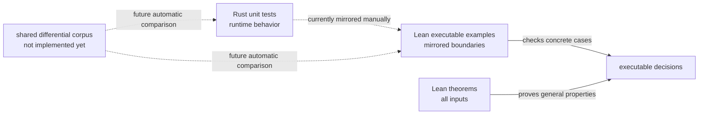

# Authority core の検証とテスト

[Authority core 実装ガイド](README.md) / 検証とテスト

> **対象読者:** Rust と Lean の判定一致、Lean 定理、境界 test をレビュー・変更する実装者

このページは、実装ファイル内の Rust unit test と `lean/AuthorityTests.lean` の責務を説明する。プロジェクト全体でどの検証手法をどこに使うかは[検証戦略](../design/verification.md)を参照する。

## 検証レイヤー



Rust unit test は実装された API の具体的な入出力を確認する。Lean の `example ... := by decide` は対応する具体例を kernel で評価する。Lean の theorem は concrete example を超え、すべての型付き入力について反射性、推移性、健全性、必要な完全性を証明する。

## Rust test の配置と責務

Rust test は対象実装と同じファイルの `#[cfg(test)] mod tests` に置く。

| ソース | test 数 | 主な確認内容 |
|---|---:|---|
| [`crates/authority-core/src/repository.rs`](../../crates/authority-core/src/repository.rs) | 1 | opaque host value の保持、`as_str`、`Display` |
| [`crates/authority-core/src/path.rs`](../../crates/authority-core/src/path.rs) | 8 | valid/root path、6種類の invalid segment、最初の error、Exact/Prefix matching、containment matrix、推移性 |
| [`crates/authority-core/src/file.rs`](../../crates/authority-core/src/file.rs) | 5 | effect membership と duplicate、空/同値/拡大 subset、request matching の3軸、body containment の3軸、推移性 |

合計14 test が `cargo test --workspace` で実行される。test helper の `path` は、fixture 自体が valid segment だけを使っていることを `CanonicalPath::new(...).expect(...)` で明示する。

## `lean/AuthorityTests.lean` の責務

`lean/AuthorityTests.lean` は production theorem を定義する場所ではない。Rust test と対応する canonical value を作り、実行可能な `Bool` 判定が境界で同じ結果を返すことを28個の `example` で確認する。

| 対象 | Lean で確認する境界 |
|---|---|
| `CanonicalPath.ofSegments` | root、valid nested path、空・`.`・`..`・separator・NUL・wildcard の拒否 |
| `pathBelow` | Exact/Exact、Exact/Prefix、Prefix/Prefix、Prefix/Exact、root、非包含、推移性 |
| `FileEffects` / `fileEffectsBelow` | duplicate、membership、空集合、反射、subset、effect escalation |
| `fileMatches` | allow、effect 不一致、repository 不一致、path 不一致 |
| `fileBodyBelow` | 反射、effect escalation、repository 不一致、path 拡大、推移性 |

Lean fixture は `CanonicalPath.isValid` を `by decide` で構築する。これにより test path が validation invariant を満たすことも type checking の一部になる。

## Test と theorem の役割分担

| 性質 | Rust test | Lean example | Lean theorem |
|---|---:|---:|---:|
| concrete path validation boundary | ✓ | ✓ | validation proof fieldで不正値を排除 |
| concrete path matching result | ✓ | 間接的に利用 | `pathMatches_iff_matches` |
| path containment の反射性・推移性 | concrete chain | concrete chain | `pathBelow_refl`, `pathBelow_trans` |
| path containment の意味論的一致 | concrete matrix | concrete matrix | `pathBelow_sound`, `pathBelow_complete`, `pathBelow_iff_matches_subset` |
| effect subset | concrete sets | concrete sets | `fileEffectsBelow_iff_subset`, `refl`, `trans` |
| file matching の意味論的一致 | concrete requests | concrete requests | `fileMatches_iff_matches` |
| body containment の安全性 | concrete authorities | concrete authorities | `fileBodyBelow_sound` |
| body containment の完全性 | test 対象外 | test 対象外 | effect 非空条件付きの `complete` / `iff` |

## 実行コマンド

repository root から Rust を検証する。

```bash
cargo fmt --all --check
cargo check --workspace
cargo test --workspace
cargo clippy --workspace --all-targets -- -D warnings
RUSTDOCFLAGS='-D warnings' cargo doc --workspace --no-deps
```

`lean/` から Lean を検証する。

```bash
lake build
lake check-test
lake test
```

`lakefile.toml` は `AuthorityTests` を `testDriver` に設定している。`lake build` は production library を構築し、`lake check-test` / `lake test` は executable example を含む test target を検査する。

## 現在の限界

Rust test と Lean example は同じ境界を意図しているが、入力を別々のソースに手書きしている。そのため片方だけの追加・変更を tooling が自動検出する仕組みはまだない。

[実装順序](../design/implementation-plan.md)が要求する共通 corpus の parser・runner・差分比較は未実装である。現時点では、変更時にこのページの対応表と両言語の test を人間が照合する必要がある。

## 変更時の確認点

- production の判定を変えたら、Rust unit test と Lean example の両方に同じ positive/negative boundary を追加する。
- Lean の意味論を変えたら executable decision との `_iff_` theorem を先に通し、その上で containment theorem を確認する。
- `sorry`、独自 `axiom`、`admit` を production proof に入れない。
- test が通っても sound theorem が対象にしていない新しい入力軸がないか確認する。
- 共通 corpus を導入した後は、この文書の「手動対応」という記述と実行コマンドを更新する。

## 関連

- [Authority core 実装ガイド](README.md)
- [パスモデル](paths.md)
- [File authority](file-authorities.md)
- [検証戦略](../design/verification.md)
- [実装順序](../design/implementation-plan.md)
