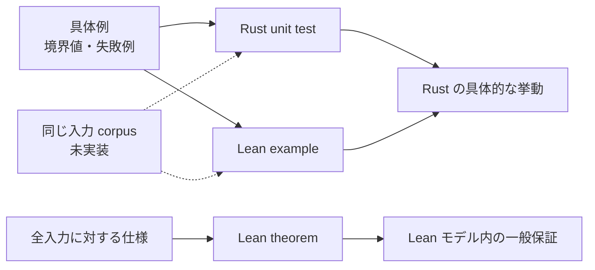

# Authority core の検証とテスト

[Authority core 実装ガイド](README.md) / 検証とテスト

このページは、Rust unit test、Lean executable example、Lean theorem がそれぞれ何を確認し、組み合わせると何が分かるかを説明する。プロジェクト全体の検証方針は[検証戦略](../design/verification.md)を参照する。

## 検証方法ごとの役割

Authority core では、1つの手段ですべてを保証しようとせず、違う問いに違う検証を当てる。

| 検証 | 答える問い |
|---|---|
| Rust unit test | 実際の Rust API は、この具体的な入力で期待どおり動くか |
| Lean executable example | Lean の `Bool` 判定は、この具体的な境界入力で期待どおりか |
| Lean theorem | Lean モデルのすべての型付き入力で、一般的な性質が成り立つか |
| 共通 corpus の差分テスト | 同じ入力に対して Rust と Lean が同じ結果を返すか |

最初の3つは実装済みである。最後の共通 corpus はまだ未実装で、現在は Rust test と Lean example を人間が対応させている。



証明が test の代わりになるわけでも、test が証明の代わりになるわけでもない。両者は失敗の種類が違う。

## Test と証明は何が違うのか

### Test は、選んだ具体例を確認する

たとえば次の case を test できる。

```text
Prefix(src) は src/main.rs に match する
Prefix(src) は docs/design.md に match しない
Prefix(src) は Exact(src) 以下ではない
```

test は、実際の関数を動かし、API の接続、error の内容、内部表現、境界例を確認するのが得意である。ただし100個の case が通っても、101個目に反例がないとは論理的には言えない。

### 定理は、任意の入力を1つ取って証明する

`pathBelow_sound` は特定の `src` や `docs` だけを扱わない。

```lean
∀ path, child.Matches path → parent.Matches path
```

任意の `child`、`parent` と任意の canonical `path` について証明するため、segment の個数や名前ごとに test case を列挙する必要がない。

これが「すべての入力で成り立つ」の意味である。ただし対象は Lean の型で表せる入力と、Lean に書かれた意味論の範囲に限られる。OS の symlink や Rust の machine code が自動的に証明対象へ入るわけではない。

### 差分テストは、2実装の対応を確認する

Lean theorem が `pathBelow` の性質を証明しても、Rust の `path_below` に同じ変更が入っているとは限らない。両言語で同じ入力を読み、結果を比較する差分テストがこの隙間を埋める。

現在は同じ境界を Rust と Lean に別々に手書きしているため、片方だけ変更しても tooling は自動検出しない。これは現在の検証で最も明確な残課題である。

## 「権限漏えいしない」と何を根拠に言えるのか

path containment では、Lean が次の両方向を証明する。

```text
判定が true → 本当に集合包含である       soundness
本当に集合包含 → 判定も true             completeness
```

したがって Lean の path モデル内では、包含判定が原因の次の2種類のずれを排除できる。

- false allow: 親の外側なのに `true` となり、権限が漏れる。
- false deny: 親の内側なのに `false` となり、正しい委譲が動かない。

file body containment では、false allow を防ぐ `fileBodyBelow_sound` は無条件に成立する。false deny まで排除する完全性は、child の effect 集合が非空の場合に成立する。空 effect では request 集合が空になり、構造判定との意味に差が出るためである。

この主張を「数学的に0%」と言い換えるなら、正確には次のようになる。

> Lean で定義したモデルと前提の範囲内では、その性質に反する型付き入力は存在しない。

実環境全体のバグ発生確率を数値として測定した主張ではない。どこまでがモデル内かは[証明の考え方: 言えること、まだ言えないこと](proof-concepts.md#証明から言えることまだ言えないこと)を参照する。

## Rust unit test は何を確認するか

Rust test は対象実装と同じファイルの `#[cfg(test)] mod tests` に置く。

| ソース | test 数 | 主な確認内容 |
|---|---:|---|
| [`repository.rs`](../../crates/authority-core/src/repository.rs) | 1 | host-assigned value の保持、`as_str`、`Display` |
| [`path.rs`](../../crates/authority-core/src/path.rs) | 8 | valid/root path、6種類の invalid segment、最初の error、Exact/Prefix matching、containment matrix、推移性 |
| [`file.rs`](../../crates/authority-core/src/file.rs) | 5 | effect membership と duplicate、空/同値/拡大 subset、request matching の3軸、body containment の3軸、推移性 |

合計14 test を `cargo test --workspace` で実行する。

ここで特に test が助けるのは、Lean の抽象モデルに出にくい Rust 固有の部分である。

- `CanonicalPath::new` が正しい structured error と index を返す。
- private field と constructor を通した実際の API が使える。
- `u16` bitset が duplicate を無視し、期待どおり membership を返す。
- Rust の enum variant と match 分岐が concrete boundary で正しく接続される。

test helper の `path` は `CanonicalPath::new(...).expect(...)` を通し、fixture 自体も検証済み path から作る。

## `AuthorityTests.lean` は何を確認するか

[`lean/AuthorityTests.lean`](../../lean/AuthorityTests.lean) は production theorem を置くファイルではない。Rust test と対応する値を作り、Lean の実行可能な `Bool` 判定を28個の `example` で評価する。

| 対象 | 具体的に確認する境界 |
|---|---|
| `CanonicalPath.ofSegments` | root、valid nested path、空・`.`・`..`・separator・NUL・wildcard の拒否 |
| `pathBelow` | Exact/Exact、Exact/Prefix、Prefix/Prefix、Prefix/Exact、root、非包含、具体的な推移 chain |
| `FileEffects` / `fileEffectsBelow` | duplicate、membership、空集合、反射、subset、effect escalation |
| `fileMatches` | allow、effect 不一致、repository 不一致、path 不一致 |
| `fileBodyBelow` | 反射、effect escalation、repository 不一致、path 拡大、具体的な推移 chain |

多くの example は `by decide` で閉じる。Lean が命題を計算し、その結果が真である proof term を kernel が検査する。

fixture の `CanonicalPath` も `isValid := by decide` で構築する。そのため、test 用 path が validation invariant を満たすこと自体が type checking の条件になる。

Lean example が役立つ点は、定理だけでは見えにくい「この具体例はどちらになるか」を読みやすく固定できることである。たとえば root prefix や `Prefix` 対 `Exact` の向きを、仕様例として残せる。

## Production theorem は何を確認するか

production theorem は [`lean/Authority/Path.lean`](../../lean/Authority/Path.lean) と [`lean/Authority/File.lean`](../../lean/Authority/File.lean) に置く。

| 対象 | 証明する一般性質 | 実務上の意味 |
|---|---|---|
| path matching | `pathMatches_iff_matches` | `Bool` の結果と path 選択の意味が一致する |
| path containment | `refl`, `trans`, `sound`, `complete`, `iff` | 多段委譲でも path を広げず、安全な包含を誤拒否しない |
| effect containment | `iff_subset`, `refl`, `trans` | 子にだけ追加 effect がなく、多段でも部分集合を保つ |
| file matching | `fileMatches_iff_matches` | repository・effect・path の3条件と `Bool` が一致する |
| file body containment | `refl`, `trans`, `sound` | 多段委譲でも child request は必ず root request の内側にある |
| file body completeness | effect 非空条件付き `complete`, `iff` | 非空 child では本当の包含を誤拒否しない |

theorem を production 定義の隣に置くことで、判定を変更して証明が壊れた場合に build で分かる。具体例だけでなく、意味論との橋渡しまで変更対象になる。

## 3つを組み合わせると何が分かるか

| 確認したいこと | Rust test | Lean example | Lean theorem | 現状 |
|---|---:|---:|---:|---|
| Rust API の具体的挙動 | ✓ |  |  | 確認済み |
| Lean 判定の具体的挙動 |  | ✓ |  | 確認済み |
| Lean モデルの全入力での性質 |  |  | ✓ | 証明済み |
| 両言語の手書き境界が同じ意図か | ✓ | ✓ |  | 人間がレビュー |
| 同一入力で Rust と Lean が常に同じ結果か |  |  |  | 共通 corpus 未実装 |
| OS/FUSE を含む end-to-end 認可 |  |  |  | Authority core の外 |

この表の最後の2行を、既存の proof だけで「済んでいる」と解釈してはいけない。設計上は、共通 corpus の差分テストと `capfs` の統合・攻撃テストで別に閉じる。

## 実行コマンド

repository root から Rust を検証する。

```bash
cargo fmt --all --check
cargo check --workspace
cargo test --workspace
cargo clippy --workspace --all-targets -- -D warnings
RUSTDOCFLAGS='-D warnings' cargo doc --workspace --no-deps
```

`lean/` から Lean を検証する。

```bash
lake build
lake check-test
lake test
```

[`lean/lakefile.toml`](../../lean/lakefile.toml) は `AuthorityTests` を `testDriver` に設定している。`lake build` は production library を構築し、`lake check-test` / `lake test` は executable example を含む test target を検査する。

## 現在の限界と次に埋めるもの

現在の最大の対応ギャップは、Rust test と Lean example の入力が別々のファイルに手書きされていることである。

次に共通 corpus を導入するときは、少なくとも次を同じ fixture から両言語へ流す。

- canonical path の受理・拒否と invalid segment class。
- `Exact` / `Prefix` matching の結果。
- `pathBelow` の4組み合わせと root 境界。
- effect subset、file matching、file body containment の3軸。
- positive case と、各条件を1つだけ壊した negative case。

これにより、Lean theorem が証明するモデルと Rust 実装の間にある「同じ定義を実装しているはず」という手動確認を、自動回帰 test へ変えられる。

なお、共通 corpus でも filesystem race や revoke は検証できない。それらは stateful test、loom、実 mount の統合・攻撃テストという別レイヤーを使う。

## 変更時の確認点

- production の判定を変えたら、Rust unit test と Lean example の両方へ同じ positive / negative boundary を追加する。
- Lean の意味論を変えたら、executable decision との `_iff_` theorem を先に通し、その上で containment theorem を確認する。
- `sorry`、独自 `axiom`、`admit` を production proof に入れない。
- test が通っても、sound theorem の request 型に新しい入力軸が反映されているかを確認する。
- test 数や example 数が変わったら、このページの集計を更新する。
- 共通 corpus を導入した後は、「手動対応」「未実装」という記述と実行コマンドを更新する。

## 関連

- [Authority core で使う証明の考え方](proof-concepts.md)
- [Authority core 実装ガイド](README.md)
- [パスモデル](paths.md)
- [File authority](file-authorities.md)
- [検証戦略](../design/verification.md)
- [実装順序](../design/implementation-plan.md)
- [capfs](../design/capfs.md)
