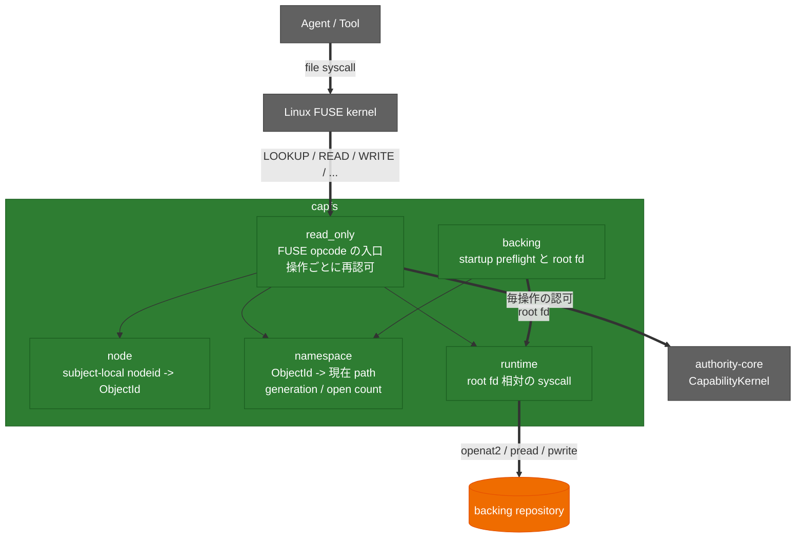

<!-- doc-type: index -->

# capfs 実装ガイド

[ドキュメント一覧](../README.md) / capfs 実装ガイド

> **対象読者:** capfs を触る実装者、並行境界のレビュー担当者

この文書群は、`capfs` が filesystem operation を Capability 判定へ接続するための実装を説明する。設計上の判断は[capfs 設計](../design/capfs.md)を正とする。

| 文書 | 対象 | 内容 |
|---|---|---|
| [Backing repository の事前検証](backing-preflight.md) | [`crates/capfs/src/backing.rs`](../../crates/capfs/src/backing.rs) | root fd、object種別とlink検査、resource bound、manifestの原子的なstartup import |
| [共有 namespace registry](namespace-registry.md) | [`crates/capfs/src/namespace.rs`](../../crates/capfs/src/namespace.rs) | `ObjectId`割り当て、現在path、generation、open count、namespace変更の原子性 |
| [mount ごとの node table](node-tables.md) | [`crates/capfs/src/node.rs`](../../crates/capfs/src/node.rs) | subject-local `nodeid -> ObjectId`、LOOKUP / FORGET参照数、nodeid非再利用 |
| [backing への実 I/O](runtime-backing-io.md) | [`crates/capfs/src/runtime.rs`](../../crates/capfs/src/runtime.rs) | root fd 相対の解決、毎回の kind / mount / 名前数の検査、create と rename と link の原子性 |
| [Direct-I/O FUSE adapter](read-only-fuse.md) | [`crates/capfs/src/read_only.rs`](../../crates/capfs/src/read_only.rs)、[`runtime.rs`](../../crates/capfs/src/runtime.rs) | metadata visibility、fd-relative I/O、file / directory handle lifecycle、全file mutationのtransaction、毎READ / WRITE / SETATTR / READDIRの再認可、実mount test |
| [overhead ベンチマーク](overhead-benchmark.md) | [`crates/capfs/benches/capfs_overhead.rs`](../../crates/capfs/benches/capfs_overhead.rs) | native / 認可なしFUSE / capfs / 認可判定単体の4層比較、対照条件、`cargo bench`の実行方法 |
| [検証対応表](verification.md) | — | 実 filesystem / 実 mount で見た範囲と、VM 内で未検証の範囲 |

現在は、workspaceの検査、`RepoId`とroot directory fd・namespaceのbinding、初期manifestの原子的なregistry import、VM共通namespace registry、subject-local node tableに加え、Direct-I/O FUSE adapterまで実装している。`LOOKUP`、`GETATTR`、`FORGET`、`OPEN`、`READ`、`WRITE`、`SETATTR`、`CREATE`、`MKDIR`、`UNLINK`、`RMDIR`、`RENAME`、`RELEASE`、`OPENDIR`、`READDIR`、`RELEASEDIR`、`READLINK`、`SYMLINK`、`LINK`がroot fd、namespace、node table、Capability kernelへ接続されている。symlinkはregistryがtargetを所有し、repository外へ解決される本文をkernelへ渡さない。hard linkを持つinodeは、その全ての名前に対して認可される。`O_TRUNC`と`SETATTR(size)`は`Truncate`を、modeまたはatime/mtimeだけの`SETATTR`は`SetMetadata`を独立して要求する。`CREATE`は`CreateFile`と返却handleのaccess effectを複合認可し、`MKDIR`、`UNLINK`、`RMDIR`、`RENAME`も対応するfile effectを現在pathで認可する。実mount上では、revoke後の既存file descriptorからのread / write / size変更 / mode変更、既存directory streamからの次のlisting、既存parent directory fdに対する`mkdirat`を拒否する。create、remove、renameがdirectory streamの途中で成功した場合は、古いcookieを使わず`EAGAIN`で再開を要求する。

## crate の構造

`capfs` は guest の中で動き、FUSE operation を Capability 判定へ接続する。

`ro` が認可の入口、`rt` が唯一 syscall を呼ぶ層。`ns` は VM 共通、`node` は subject ごと。この 2 段で kernel が保持する `nodeid` と VM 全体の identity を分離している。

## 関連

- [capfs 設計](../design/capfs.md)
- [Subject lifecycle と open handle](../authority-core/subject-lifecycle-and-handles.md)
- [検証戦略](../design/verification.md)
