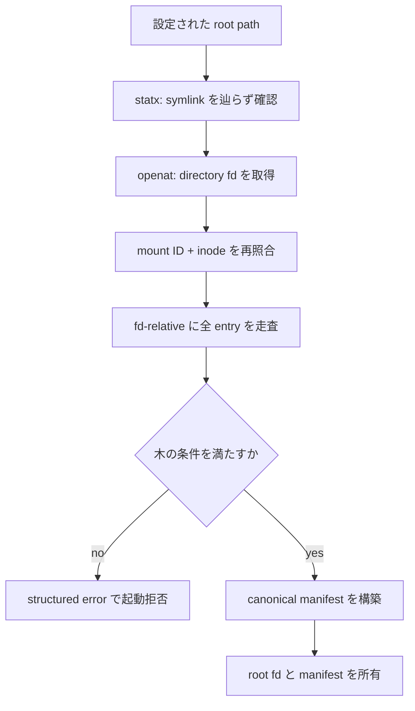
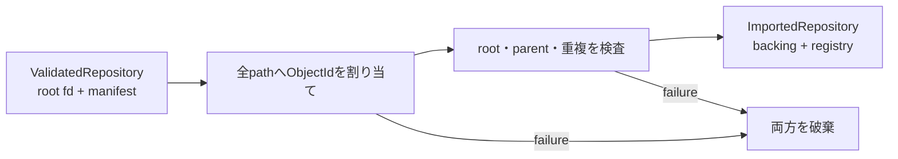

<!-- doc-type: concept -->

# Backing repository の事前検証

[capfs 実装ガイド](README.md) / Backing repository の事前検証

> **対象読者:** startup 検査を触る実装者、mount / inode identity のレビュー担当者

このページは [`crates/capfs/src/backing.rs`](../../crates/capfs/src/backing.rs) が起動時に何を拒否し、それが path-based authority を実 filesystem へ接続するうえでどう役立つかを説明する。

## なぜ文字列の正規化だけでは足りないのか

`CanonicalPath` は `..`、separator、NUL、wildcard などを segment に入れない。したがって、文字列として `src` から `docs` へ脱出する path は作れない。

しかし filesystem は、文字列に現れない別名を持てる。

```text
/src/config -> /secrets/config        symlink
/src/a と /docs/b が同じ inode       hard link
/vendor が別 filesystem              bind mount / nested mount
```

この状態では、canonical path が1つでも、その path が指す実 object は木構造にならない。`src` に対する権限だけを確認しても、OS の解決結果が別の場所や別名の inode なら、証明した path containment と実 I/O が対応しなくなる。

`capfs` は repository を「directory、regular file、symlink だけからなり、別名の集合が完全に repository 内に閉じている木」に制限する。条件を満たさない repository は mount 前に拒否する。

- **symlink** は受理するが、target を registry が所有する。相対 path で、`..` が先頭の連続部分にのみ現れ、link の位置から解決した先が repository 内に収まるものだけを受理する。
- **hard link** は受理するが、inode の名前が**全て** repository 内にあることを要求する。外の名前は `capfs` が認可を検査できず、内側の名前を全部消してもデータがその名前で生き残るためである。外に名前がある inode の扱いは policy で選ぶ（既定は実体化）。
- **device、FIFO、socket、nested mount** は受理しない。

## `ValidatedRepository::open` が行うこと

処理は [`ValidatedRepository::open`](../../crates/capfs/src/backing.rs) から始まる。



root は最終 component の symlink を辿らず開く。確認前の `statx`、開いた fd 自身、`canonicalize` 後の対象が同じ `(mount ID, inode)` であることも照合する。途中で root path が別 object へ差し替えられた場合は `RootChangedDuringOpen` になる。

走査は current working directory から path を組み立て直さず、開いた directory fd から相対的に進む。子 directory は `openat2` と次の解決条件で開く。

- `RESOLVE_BENEATH`: 開いた親 directory より上へ出ない。
- `RESOLVE_NO_SYMLINKS`: path 解決中に symlink を辿らない。
- `RESOLVE_NO_MAGICLINKS`: `/proc` 型の magic link を辿らない。
- `RESOLVE_NO_XDEV`: 別 mount へ越境しない。

directory を開く前後でも `(mount ID, inode)` を比較する。entry 名を検査した直後に別 directory へ置換された場合、その fd を正しい child として採用しない。

## 受理する木の条件

事前検証が成功するには、次をすべて満たす必要がある。

- root は directory である。
- 全 entry 名は UTF-8 で、`CanonicalPath` の segment 規則を満たす。
- object は directory、regular file、symlink のいずれかである。
- FIFO、socket、character device、block device、未知の object type がない。
- symlink の target は UTF-8 で、受理する文法を満たし、その link の位置から repository 内へ解決される。
- 各 inode の link count が、repository 内で見つかったその inode の名前の数と一致する。
- 全 entry の mount ID が root の mount ID と同じである。
- entry 数と segment depth が呼び出し側の上限内である。

成功すると、root を含む全 object が canonical path 順に並んだ manifest になる。走査順は filesystem の `readdir` 順に依存しないため、この manifest を namespace registry の初期値へ変換するときも決定的に処理できる。

entry 数と深さには [`PreflightLimits`](../../crates/capfs/src/backing.rs) を必須にしている。攻撃者が巨大な directory tree を渡しても、manifest 用 memory や走査時間を無制限には使わせない。走査自体も再帰関数ではなく fd の work list を使うため、深い木で process stack を消費しない。

## repository の外に名前がある inode をどうするか

外に名前がある inode は、repository が inode の**部分的な view** でしかないことを意味する。内側の名前への write は `capfs` が検査できない authority の下にある file を書き換え、内側の名前を全部消してもデータは外の名前で生き残る。この状態のまま mount することはできない。

`ExternalAliasPolicy` で2つから選ぶ。

| policy | 何をするか |
|---|---|
| `Materialize`（既定） | 内容を repository 内の新しい inode へ複製し、repository 側の名前をその複製へ移す。外の名前は元の inode を持ったまま一切触らない |
| `Reject` | repository 全体を拒否する。startup が backing tree へ一切書いてはならない場合に使う |

既定を実体化にしているのは、stray な hard link が1本あるだけで workspace ごと使えなくなり、手で直す以外の道がなくなるためである。

実体化の規則は次のとおりである。

- repository 内で互いに alias だった名前は、複製の alias として残る。切るのは **境界をまたぐ関係だけ**である。
- 置き換えは一時名の上に作り、`renameat` で名前へ移す。repository の名前が一瞬でも消えることはない。
- mode と timestamp は複製へ引き継ぐ。owner は引き継がない。別 uid を復元するには `CAP_CHOWN` が要り、preflight にそれを要求しないためである。
- 複製する総 byte 数に上限がある（既定 64 MiB）。敵対的な tree が startup を無制限の copy に変えられない。上限を超えれば `MaterializationBudgetExceeded` で止まり、tree は元のままである。
- 実体化した名前は `ValidatedRepository::materialized_aliases` で返る。**backing tree を書き換えたのだから、呼び出し側は記録すべきである。**

実体化した後は tree を**もう一度 scan する**。inode と link count が動いているため、違反を見つけた時点の manifest はもう正しくない。修復 pass は1回だけで、2回目の scan でまだ外部 alias が見つかれば拒否する。scan と競合して alias を作り続ける相手を、loop で修復し続けることはしない。

## Manifest を一度に registry へ取り込む

[`ImportedRepository::open`](../../crates/capfs/src/backing.rs) は事前検証とstartup importを1つの入口にする。preflightが成功した後、manifest全件からnamespace registryを構築し、完成後にだけ`ImportedRepository`を返す。



`ObjectId`はmanifestのpath順にregistryが割り当て、path文字列そのものからは作らない。このためrename後も同じobject identityを使える。初期registry全体がgeneration 0であり、entryごとに途中のgenerationを外から観測することはできない。

`ImportedRepository::open`はhostが割り当てた`RepoId`も受け取る。`ImportedRepository`がidentity、backing root、registryを同時に所有するため、adapterはあるrepository向けCapabilityを別repositoryのroot fdやnamespaceへ接続できない。mountを増やすときはこの値を`clone`する。cloneは新しいscanや別registryを作らず、同じroot fd ownerと同じ`NamespaceRegistry`を参照する。

```text
ImportedRepository.clone()
  ├─ same RepoId
  ├─ same validated backing root fd owner
  └─ same namespace registry
```

したがってsubjectごとのFUSE mountはnode table、local handle table、固定authorityだけを別に持ち、rename・create・open countなどのVM共通状態は必ず1つになる。`into_parts`もownershipを複製せず、この共有ownerへの参照をadapterへ移す。adapterはconstructor内で`MountAuthority`の`RepoId`とのexact equalityを確認する。

## 何が数学的に扱いやすくなるのか

namespace registry は canonical path と `ObjectId` の対応を不変条件にしている。hard link があると2つの path が同じ inode を指すので、対応は 1 対 1 ではなく **多対 1** になる。preflight が保証するのは、その「多」の側が repository 内で閉じていることである。

```text
canonical path の集合 ──n:1──> namespace object ──1:1──> backing inode
                              （n = inode の link count）
```

この等式が成り立つからこそ、`capfs` は inode の**全ての**名前を列挙でき、その全てに対して Capability を確認できる（[ADR 0017](../decisions/0017-authorize-an-aliased-inode-on-every-name.md)）。名前を1つでも見落とせば、その名前経由の権限は検査されない。Lean が証明した path containment 自体が OS の inode を証明するわけではない。事前検証は、Lean の文字列・木モデルを Linux の backing tree へ対応させるための実装上の前提を検査している。

root や child directory の再照合には、time-of-check to time-of-use race に対する object identity の考え方を使う。path 文字列が同じかではなく、検査した object と開いた object の `(mount ID, inode)` が同じかを確認する。fd を取得した後は、root path が rename されても fd 自体は同じ directory を指し続ける。

## 失敗時は何も import しない

検査中に1件でも違反が見つかると `ValidatedRepository` は返らない。途中まで作った manifest を公開しないため、「安全だった entry だけで不完全な namespace を開始する」という状態も作らない。

主な error は原因を区別している。

| error | 意味 |
|---|---|
| `RootNotDirectory` | 設定された root が directory ではない |
| `RootChangedDuringOpen` | root の検査対象と開いた fd が一致しない |
| `EntryChangedDuringScan` | child directory の検査対象と開いた fd が一致しない |
| `NonUtf8Name` / `InvalidCanonicalPath` | Authority の canonical path 型へ変換できない |
| `UnsupportedObject` | device、FIFO、socket などがある |
| `ExternalHardLink` | inode の名前が repository の外にもある（`Reject` policy、または修復後も解消しない場合） |
| `MaterializationBudgetExceeded` | 外部 alias を切るための複製が copy 予算を超える |
| `UnsupportedSymlinkTarget` | symlink の target が受理する文法を満たさない |
| `EscapingSymlinkTarget` | symlink が repository の外へ解決される |
| `NonUtf8SymlinkTarget` | symlink の target が UTF-8 ではない |
| `NestedMount` | root と異なる mount へ入った |
| `RequiredMetadataUnavailable` | 安全性に必要な `statx` field を kernel が返さない |
| `EntryLimitExceeded` / `DepthLimitExceeded` | 呼び出し側が設定した resource bound を越えた |

必要な kernel metadata が欠けた場合も推測で続行せず、repository 全体を拒否する。

高水準の`ImportedRepository::open`は、これらを`RepositoryStartupError::Preflight`、registry構築の失敗を`RepositoryStartupError::Namespace`として区別する。どちらでも`ImportedRepository`は返らない。

## どう検証しているか

[`crates/capfs/tests/repository_preflight.rs`](../../crates/capfs/tests/repository_preflight.rs) は実 directory、file、symlink、hard link、Unix socket、非 UTF-8 名を作り、公開 API を通して次を確認する。

- 木から path 順の manifest が得られ、root fd が返却後も有効である。
- regular file を root にできない。
- root が symlink なら拒否する。
- repository 内で完結する symlink は target ごと import し、絶対 target と root の外へ出る target は拒否する。
- 名前が全て repository 内にある hard link は同じ inode 番号で group 化する。
- 外に名前がある inode を既定 policy が実体化し、repository 側の名前が新しい inode を共有し、外の名前は元の inode と内容を保つ。
- `Reject` policy では repository ごと拒否し、error に repository 内の名前を全件載せる。
- copy 予算を超える実体化を拒否し、tree を元のまま残す。
- special file、非 UTF-8 名、canonical 規則違反を拒否する。
- entry 数と深さの上限を越えた木を拒否する。
- host-assigned `RepoId`、backing root、manifest由来registryを同じownerへ取り込む。
- 同じ`ImportedRepository`をcloneした複数mountが、同じroot fdを保持し、片方のopen countをもう片方から観測・closeできる。
- manifest全件を同じregistryへ取り込み、path順にstableな`ObjectId`を割り当てる。
- preflight失敗時に部分的なnamespace所有型を返さない。

module 内の test は mount ID の相違と、Linux が返し得る全 unsupported object kind の分類を直接検査する。実 nested mount の作成には mount namespace の権限が要るため、通常の unit test では metadata 判定までを固定している。実 mount を使った越境 test は FUSE 統合 test の段階で追加する。

## 正確な保証範囲

`ValidatedRepository` は filesystem を凍結する仕組みではない。root fd は root path の差し替えから参照を守るが、別 process が child entry や file 内容を変更することまでは止めない。

supervisor は、事前検証を始める前から `capfs` の稼働終了まで、workload や他の非信頼 process が backing tree を直接変更できない配置にする必要がある。検証後の create、remove、rename は namespace registry と同じ transaction に置き、通常の read / write も root fd から `openat2` で解決する。

現在は、[`runtime.rs`](../../crates/capfs/src/runtime.rs)と[`read_only.rs`](../../crates/capfs/src/read_only.rs)がroot fdからのruntime metadata、open、read、positioned write、metadata mutation、exclusive create、remove、no-replace renameをFUSE opcodeとCapability guardへ接続している。createはlive parent directory fdから`openat2(O_EXCL)`または`mkdirat`を行い、`fchmod`と`statx`の再検証が終わるまでnamespaceを公開しない。removeはlive parent fdから検証済みchildへ`unlinkat`し、renameは両parentとsubtree全objectを検証してから`renameat2(RENAME_NOREPLACE)`を実行する。modeとatime/mtimeは検証済みmetadata fdへ`fchmod`または`futimens`する。read / write / mutationごとにadapterが現在pathを再認可し、runtimeはそのguardの内側でのみfd-relative I/Oを行う。実装内容は[Direct-I/O FUSE adapter](read-only-fuse.md)を参照する。

まだ実装していないのは、実 FUSE mount 上のrename / write競合、mount越境、敵対的なbacking差し替えtestである。加えて、supervisorがbacking treeを非信頼processから隔離する実行基盤なしに、host上の任意のprocessをこのFUSE adapterだけで止めることはできない。

したがってfile operationは起動時検査から実I/Oまで接続されたが、「全 workload syscall が認可を通る」隔離境界はruntime-isolationを含めて完成する。

## 変更時の確認点

- `openat2` の resolve flag を減らさない。`RESOLVE_NO_SYMLINKS` を外すと、registry を迂回する symlink が backing path の解決に混ざる。4 つは独立に別の脱出経路を塞いでいる。
- 受理する object 種別を増やすときは、その種別が作る別名を registry が全て列挙できることを確認する。[共有 namespace registry](namespace-registry.md) の認可は「object の全ての名前」に対して行われるので、列挙から漏れた名前は検査されない。
- entry 名の検査と fd の取得の間に `(mount ID, inode)` を再照合する手順を省かない。省いても正常系は通るので、test を書かないと気付けない。
- entry 数と深さの上限を変えるときは、manifest が占める memory と startup 時間の両方を見る。上限は片方だけを守っているのではない。
- 検査を通った後に backing tree を他 process が書き換えられない配置は、supervisor 側の前提である。ここを緩めるなら、[Direct-I/O FUSE adapter](read-only-fuse.md) の毎操作再認可だけでは足りない。

## 関連

- [共有 namespace registry](namespace-registry.md)
- [capfs 設計](../design/capfs.md)
- [パスモデル](../authority-core/paths.md)
- [検証戦略](../design/verification.md)
