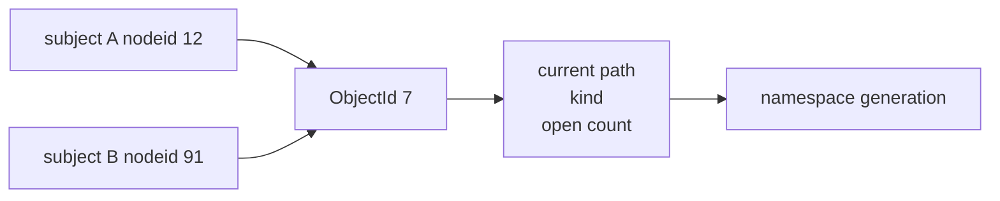
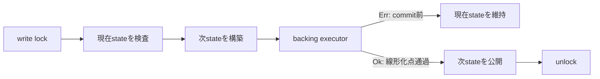

<!-- doc-type: concept -->

# 共有 namespace registry

[capfs 実装ガイド](README.md) / 共有 namespace registry

> **対象読者:** namespace registry を触る実装者、rename 競合のレビュー担当者

このページは [`crates/capfs/src/namespace.rs`](../../crates/capfs/src/namespace.rs) が何を守り、それが rename、revoke、open handle の競合を閉じるうえでどう役立つかを説明する。

## なぜ `ObjectId -> path` を共有するのか

FUSE の `nodeid` や open 済み fd を path そのものとして扱うと、rename 後にも古い path で認可できてしまう。

```text
open 時:  ObjectId 7 = /src/parser.rs
rename:   /src/parser.rs -> /docs/parser.rs
write 時: 古い /src/parser.rs の権限を再利用すると境界を越え得る
```

そこで `OpenHandle` は path を保存せず `ObjectId` だけを持つ。read / write のたびにVM共通 registryから現在 pathを取り出し、そのpathでCapabilityを確認する。

subjectごとのmountが別々の`nodeid`を持っていても、同じbacking objectなら同じ`ObjectId`へ到達する。あるmountからrenameした結果を、他のmountも同じregistry経由で見ることになる。



## Registry が持つ状態

```text
objects     : ObjectId -> NamespaceObject
paths       : CanonicalPath -> ObjectId
next_object_sequence : 次に割り当てる単調な ObjectId sequence
generation  : namespace変更ごとに増える単調なversion
```

`NamespaceObject` は自分を指す `CanonicalPath` の**集合**、directory / regular file / symlink の種別、symlinkならtarget、live handle数を持つ。deviceなどは型に入れていない。

path集合は最小のpath（`primary_path`）と残りのalias listに分けて持つ。「生きているobjectは必ず名前を1つ以上持つ」がこれで型の性質になり、registryが覚える規則ではなくなる。**認可は`paths()`の全要素に対して行う。`primary_path`は backing I/O と診断のためのものであり、認可に使ってはならない**（[ADR 0017](../decisions/0017-authorize-an-aliased-inode-on-every-name.md)）。

`objects` と `paths` は同じ関係を逆向きに引くindexである。生きているpathにはobjectがちょうど1つあり、生きているobjectには**1つ以上**のpathがある。複数になるのはhard linkを持つregular fileとsymlinkだけで、directoryは常に1つである。

この対応があることで、次を拒否できる。

- 同じpathへ2つのobjectを登録する。
- remove 済み object の `ObjectId` を新しい object に再利用する。
- 存在しないdirectoryやregular fileの下へchildを作る。
- repository rootをrename / removeする。
- directoryを自分自身のsubtreeへ移してcycleを作る。

## 初期 manifest と `ObjectId` をどう対応させるのか

[`ImportedRepository`](../../crates/capfs/src/backing.rs) は、事前検証済み manifest と backing root fd を受け取り、完全な registry を構築してから両方を1つの共有所有型として返す。途中の entry だけが登録された registry は外へ出ない。subject mountを増やすときはこの値をcloneし、cloneごとにregistryを作り直さない。

manifest は canonical path 順なので、root を `object-0`、以後を `object-1`、`object-2` と単調に割り当てる。これは永続 ID ではなくVM session内だけの identity である。同じ repositoryでも別sessionでは対応が変わってよく、外部入力がIDを指定することはできない。

```text
/                  -> object-0
/README.md         -> object-1
/src               -> object-2
/src/lib.rs        -> object-3
```

IDにpathを埋め込まないため、`/src/lib.rs` がrenameされても `ObjectId` は変わらない。runtime createでもregistryが次のsequenceを割り当てる。executorがcommit前に失敗したIDは発行されず、removeまで成功したIDはsequenceを巻き戻さないため再利用されない。`u64::MAX`を割り当てた後は`ObjectIdExhausted`としてfail closedになる。

backing root fdとregistryを同じ`ImportedRepository`が所有するのは、別repositoryから作ったregistryを誤って別fdへ接続する事故を型の境界で減らすためである。clone後も2つは同じ共有ownerを指すため、mount Aとmount Bが異なるcurrent pathやopen countを持つことはない。

## Generation は何に使うのか

startup import全体はworkloadへ公開される前の初期snapshotなのでgeneration 0になる。公開後のcreate、remove、renameは成功ごとに1ずつ進む。open / closeではpath対応が変わらないため増えない。

```text
authorization cache key
= request + CapId + auth_epoch + namespace_generation
```

revokeは`auth_epoch`を変え、renameは`namespace_generation`を変える。両方をcache keyへ含めれば、「Capabilityは同じだがpathが移動した」「pathは同じだがCapabilityが失効した」という2種類のstale allowを区別できる。

generationはwraparoundしない。`u64::MAX`の次が必要になった時点でbacking executorを呼ばず、`NamespaceGenerationExhausted`としてfail closedにする。

`OPENDIR`はこのgenerationをdirectory handleへ記録する。後続の`READDIR`は`with_directory_children_at_generation`で、generation比較とchild列挙を同じread lock内で行う。値が変わっていればclosureを呼ばず`DirectoryGenerationChanged`を返し、FUSE adapterは`EAGAIN`へ写像する。古いcookieを新しい一覧へ当てないためのrestart contractであり、callerは新しいdirectory handleを開いてoffset 0から再開する。

## Backing操作とregistry更新の順序

create、remove、renameは、registryだけ先に変更してもbacking syscallだけ先に実行しても安全ではない。片方が失敗すると、認可に使うpathと実filesystemが食い違うためである。

`create_object`、`remove_object`、`rename_subtree`はnamespace write lock内で次の順序を作る。



executorが`Err`を返してよいのは、backing operationの線形化点をまだ越えていない場合だけである。syscallが成立した後に`Err`を返すadapterは、registryをrollbackしてbackingだけ変更した状態を作るため契約違反になる。

executorがpanicした場合はwriter lockがpoisonされる。その後のlookupを含む全操作を`LockPoisoned`で拒否し、不一致かもしれないnamespaceを使い続けない。

この形は「操作がlock区間のどこか1点で一度に起きたように順序付けられる」という線形化可能性を実装上の契約にしている。ただしRust testで具体的な遷移とlock挙動を確認している段階であり、registry全体をLeanで証明したという意味ではない。

## Open handle が rename と remove を止める

`open_object`はbacking open executorとopen countの増加を同じwrite lockへ置く。`close_object`も同様にcountを減らす。executorが失敗した場合はcountを元へ戻す。

renameはsource subtree内を調べ、1件でもlive handleがあればexecutorを呼ばず`OpenHandleInSubtree`で拒否する。removeも対象にlive handleがあれば拒否し、directoryにchildが残っていれば`DirectoryNotEmpty`で拒否する。

これにより、rename / unlink後にpathを失ったinodeをopen fdだけで使い続ける状態を作らない。POSIX互換性より「live objectは必ずcanonical pathを持つ」という認可上の単純さを優先している。

名前が2つ以上あるobjectから1つを消す場合は、inodeが名前を失わないのでこの制限は掛からない。open handleがあっても消せる。最後の名前を消すときだけ`EBUSY`になる。

Direct-I/O FUSE adapterは、fileとdirectoryのopen時にnamespace open countとAuthority coreのsubject-boundな`OpenHandle` recordを同じobjectへ登録する。片方の登録や認可に失敗すればcountをrollbackし、releaseでは両方を閉じる。adapterはlocal handle table、namespace、Capability kernelの順にlockを取得し、全経路で順序を統一している。既存fileへのread / write / metadata変更、`CREATE` / `MKDIR`、`UNLINK` / `RMDIR`、no-replace `RENAME`はこの境界に載っている。

## 通常のread / listingでpathを固定する

`object_snapshot`は観測用のcopyなので、認可には使わない。snapshotを取得してからwriteするまでにrenameされる可能性があるためである。

実際のoperationは`with_object`へclosureを渡す。registryはread lockを保持したまま、現在pathの取得、Capability判定、backing I/Oの線形化点までclosureを実行する。renameのwrite lockはclosureが返るまで待つ。

```text
namespace read lock
  -> ObjectIdから現在pathを取得
  -> CapabilityKernel::authorize_and_commit
  -> backing read/writeの線形化点
unlock
```

executorから同じregistryへ再入するとdeadlockし得るため禁止している。lock順は常に`namespace -> Capability kernel`であり、逆順の経路をadapterへ作らない。

directory listingでは`with_directory_children_at_generation`を使う。対象directory、親、direct childとopen時に捕捉したgenerationを同一read guardで照合し、childをcanonical name順へ並べたままexecutorへ渡す。FUSE adapterはこのguard中に`ListDirectory`を再認可し、各childのvisibilityを判定する。したがってrenameで名前や親が変わる途中の一覧を返さず、nested descendantをdirect childとして混ぜることもない。create / remove / renameでgenerationが変わったstreamは`EAGAIN`となり、古いindex cookieを解釈しない。

`create_child`はparentの`ObjectId`とchild nameを受け取り、writer lockを取った後の現在parent pathからchildをstageする。呼出し側がlockの外で`parent.path().child(name)`を作るAPIにはしていないので、親がrenameされた直後に古いpathを認可する経路を型上作れない。`create_open_child`は同じ操作に加えて、publishされるchildのopen countを最初から1にする。FUSE `CREATE`はここでAuthority handle、backing fd、local handleを同時に作るため、成功replyより前にchildをremoveできる空白区間がない。executorが失敗すれば、path、ID、open countのどれも公開されない。

削除には`remove_child`を使う。親identityとchild nameをwriter lock内で解決し、live parentとchildをexecutorへ渡すため、親を別directoryへrenameした後に古い名前でchildを消すことはない。childまたはdirectory subtreeにopen handleがあればexecutorは呼ばれず、emptyでないdirectoryも同様に止まる。backing `unlinkat`が成功したときだけ`path -> ObjectId`対応を外し、generationを進める。

renameには`rename_child`を使う。source parent / nameとdestination parent / nameの両方をwriter lock内で現在pathへ変換し、`RenamePlan`へ全subtreeの`ObjectId`、source、destination、kindを詰める。runtimeはこのplanを使って全source objectを再検証する。adapterは全source / destinationに`Rename`を要求するので、directory rootだけの権限で権限外のdescendantを移動することはできない。

## どう検証しているか

[`crates/capfs/tests/namespace_registry.rs`](../../crates/capfs/tests/namespace_registry.rs) は公開APIを通して次を確認する。

- pathの重複、missing parent、file parentの拒否とregistry内でのID割り当て。
- create / remove / rename executor失敗時にstateとgenerationが変わらないこと。
- create失敗ではstaged IDが未発行のままで、remove後は発行済みIDを再利用しないこと。
- child creationがwriter lock内の現在parent pathを使い、`CREATE`用の初期open count 1をclose前のremoveから守ること。
- child removalとrenameが両parentの現在pathを使い、rename planがobject kindを保つこと。
- subtree renameが全descendant pathを同じsuffixのまま移すこと。
- `link_child`がregular fileとsymlinkに名前を足し、directoryには足せないこと。
- 名前を1つ消してもobjectが生き、最後の名前を消したときだけretireされること。
- subtree renameがsubtree内のpathだけを動かし、外にあるaliasを同じobjectに残すこと。
- repository外へ解決されるsymlinkをexecutor呼び出し前に拒否すること。
- no-replace、root変更、source subtree内へのrenameの拒否。
- open handleがrename / removeを止め、open / close失敗時にcountがrollbackされること。
- read operationが終わるまで並行renameのwrite lockが進まないこと。
- direct childだけをcanonical name順に列挙し、listing operationが終わるまで並行renameが進まないこと。
- stale generationのlistingではexecutorが呼ばれず、callerがstreamをrestartしなければならないこと。

module内のtestはgeneration、open count、Object ID sequenceの上限、manifest rootとparent関係、writer panic後のfail closedを確認する。namespace registryについてcontract test 15件とmodule test 5件を実行する。

capfs package全体では、backing、runtime、node table、Direct-I/O FUSEを含めて、共有importのcontract testも実行する。

ここではRust APIの具体的な境界に加え、`crates/capfs/tests/concurrency.rs` のbounded
concurrency contractで、write中のrevoke、open / close、rename、unlinkを同時に走らせる。
writeが先に線形化した場合はrevokeのreturnより前に完了し、revokeが先に線形化した場合は
open・rename・unlinkのbacking executorへ入らないことを確認する。open count、authority
handle count、namespace path、committed effect数も各roundで突き合わせる。

これは実FUSE kernelの全request lifecycleをモデル化するものではない。実FUSE mountでは
read / readdir後のrevokeを検査し、実kernelが送る複数thread request、mount中の敵対的な
backing差し替え、実syscallを含むrename / writeの物理的な競合は、実行環境依存の統合境界
として別に扱う。

## 正確な保証範囲

- modeとtimestampを同時に求めるmetadata requestの原子性契約。
- durable stateやsupervisor再起動後の復元。

したがって、initial file modelのread / write / truncate / metadata、create、remove、renameとdirectory streamはこのregistryを通る。残る複合metadataの原子性とdurable stateは、別途明示的な意味論を追加してから接続する。

## 変更時の確認点

- backing 操作と registry 更新の順序を入れ替えない。順序が逆になると、registry が指す path に実体が無い時間帯、あるいはその逆ができる。
- generation を進める箇所を増やすときは、その generation を key に含めている cache を全部洗う。片方だけ増えると、古い mapping を新しい generation で有効と見なす経路ができる。
- `ObjectId` を path から導出しない。rename で identity が変わり、open handle の binding が切れる。
- open count の増減を lock の外に出さない。rename / remove の可否判定と count の観測が別の時点になる。
- lock 契約を変えるときは、[mount ごとの node table](node-tables.md) 側の呼び出し順も同時に見る。registry は node table から呼ばれる前提で lock の粒度を決めている。

## 関連

- [capfs 設計](../design/capfs.md)
- [Backing repository の事前検証](backing-preflight.md)
- [Subject lifecycle と open handle](../authority-core/subject-lifecycle-and-handles.md)
- [Authorization guard](../authority-core/authorization-guard.md)
- [検証戦略](../design/verification.md)
