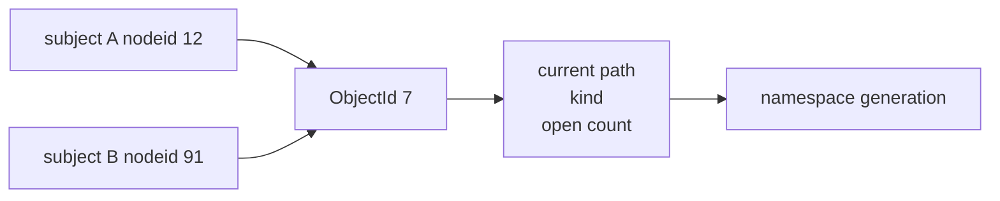
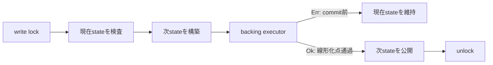

# 共有 namespace registry

[capfs 実装ガイド](README.md) / 共有 namespace registry

このページは [`crates/capfs/src/namespace.rs`](../../crates/capfs/src/namespace.rs) が何を守り、それが rename、revoke、open handle の競合を閉じるうえでどう役立つかを説明する。

## なぜ `ObjectId -> path` を共有するのか

FUSE の `nodeid` や open 済み fd を path そのものとして扱うと、rename 後にも古い path で認可できてしまう。

```text
open 時:  ObjectId 7 = /src/parser.rs
rename:   /src/parser.rs -> /docs/parser.rs
write 時: 古い /src/parser.rs の権限を再利用すると境界を越え得る
```

そこで `OpenHandle` は path を保存せず `ObjectId` だけを持つ。read / write のたびにVM共通 registryから現在 pathを取り出し、そのpathでCapabilityを確認する。

subjectごとのmountが別々の`nodeid`を持っていても、同じbacking objectなら同じ`ObjectId`へ到達する。あるmountからrenameした結果を、他のmountも同じregistry経由で見ることになる。



## Registry が持つ状態

```text
objects     : ObjectId -> NamespaceObject
paths       : CanonicalPath -> ObjectId
next_object_sequence : 次に割り当てる単調な ObjectId sequence
generation  : namespace変更ごとに増える単調なversion
```

`NamespaceObject` は現在の `CanonicalPath`、directory / regular file の種別、live handle数を持つ。初期実装ではsymlink、hard link、deviceなどを型に入れていない。

`objects` と `paths` は同じ関係を逆向きに引くindexである。生きているobjectにはpathがちょうど1つあり、生きているpathにもobjectがちょうど1つある。数学的には、live objectとlive pathの間の一対一対応を維持している。

この対応があることで、次を拒否できる。

- 同じpathへ2つのobjectを登録する。
- remove 済み object の `ObjectId` を新しい object に再利用する。
- 存在しないdirectoryやregular fileの下へchildを作る。
- repository rootをrename / removeする。
- directoryを自分自身のsubtreeへ移してcycleを作る。

## 初期 manifest と `ObjectId` をどう対応させるのか

[`ImportedRepository`](../../crates/capfs/src/backing.rs) は、事前検証済み manifest と backing root fd を受け取り、完全な registry を構築してから両方を1つの所有型として返す。途中の entry だけが登録された registry は外へ出ない。

manifest は canonical path 順なので、root を `object-0`、以後を `object-1`、`object-2` と単調に割り当てる。これは永続 ID ではなくVM session内だけの identity である。同じ repositoryでも別sessionでは対応が変わってよく、外部入力がIDを指定することはできない。

```text
/                  -> object-0
/README.md         -> object-1
/src               -> object-2
/src/lib.rs        -> object-3
```

IDにpathを埋め込まないため、`/src/lib.rs` がrenameされても `ObjectId` は変わらない。runtime createでもregistryが次のsequenceを割り当てる。executorがcommit前に失敗したIDは発行されず、removeまで成功したIDはsequenceを巻き戻さないため再利用されない。`u64::MAX`を割り当てた後は`ObjectIdExhausted`としてfail closedになる。

backing root fdとregistryを同じ`ImportedRepository`が所有するのは、別repositoryから作ったregistryを誤って別fdへ接続する事故を型の境界で減らすためである。

## Generation は何に使うのか

startup import全体はworkloadへ公開される前の初期snapshotなのでgeneration 0になる。公開後のcreate、remove、renameは成功ごとに1ずつ進む。open / closeではpath対応が変わらないため増えない。

```text
authorization cache key
= request + CapId + auth_epoch + namespace_generation
```

revokeは`auth_epoch`を変え、renameは`namespace_generation`を変える。両方をcache keyへ含めれば、「Capabilityは同じだがpathが移動した」「pathは同じだがCapabilityが失効した」という2種類のstale allowを区別できる。

generationはwraparoundしない。`u64::MAX`の次が必要になった時点でbacking executorを呼ばず、`NamespaceGenerationExhausted`としてfail closedにする。

## Backing操作とregistry更新の順序

create、remove、renameは、registryだけ先に変更してもbacking syscallだけ先に実行しても安全ではない。片方が失敗すると、認可に使うpathと実filesystemが食い違うためである。

`create_object`、`remove_object`、`rename_subtree`はnamespace write lock内で次の順序を作る。



executorが`Err`を返してよいのは、backing operationの線形化点をまだ越えていない場合だけである。syscallが成立した後に`Err`を返すadapterは、registryをrollbackしてbackingだけ変更した状態を作るため契約違反になる。

executorがpanicした場合はwriter lockがpoisonされる。その後のlookupを含む全操作を`LockPoisoned`で拒否し、不一致かもしれないnamespaceを使い続けない。

この形は「操作がlock区間のどこか1点で一度に起きたように順序付けられる」という線形化可能性を実装上の契約にしている。ただしRust testで具体的な遷移とlock挙動を確認している段階であり、registry全体をLeanで証明したという意味ではない。

## Open handle が rename と remove を止める

`open_object`はbacking open executorとopen countの増加を同じwrite lockへ置く。`close_object`も同様にcountを減らす。executorが失敗した場合はcountを元へ戻す。

renameはsource subtree内を調べ、1件でもlive handleがあればexecutorを呼ばず`OpenHandleInSubtree`で拒否する。removeも対象にlive handleがあれば拒否し、directoryにchildが残っていれば`DirectoryNotEmpty`で拒否する。

これにより初期実装では、rename / unlink後にpathを失ったinodeをopen fdだけで使い続ける状態を作らない。POSIX互換性より「live objectは必ず1つのcanonical pathを持つ」という認可上の単純さを優先している。

Authority coreにもsubject-boundな`OpenHandle` recordがある。現時点では両者を同じtransactionで更新するfilesystem adapterは未実装である。adapterは必ずnamespace lockを先、Capability kernelのguardを後に取得し、全経路でlock順を統一する必要がある。

## 通常のread / writeでpathを固定する

`object_snapshot`は観測用のcopyなので、認可には使わない。snapshotを取得してからwriteするまでにrenameされる可能性があるためである。

実際のoperationは`with_object`へclosureを渡す。registryはread lockを保持したまま、現在pathの取得、Capability判定、backing I/Oの線形化点までclosureを実行する。renameのwrite lockはclosureが返るまで待つ。

```text
namespace read lock
  -> ObjectIdから現在pathを取得
  -> CapabilityKernel::authorize_and_commit
  -> backing read/writeの線形化点
unlock
```

executorから同じregistryへ再入するとdeadlockし得るため禁止している。lock順は常に`namespace -> Capability kernel`であり、逆順の経路をadapterへ作らない。

## どう検証しているか

[`crates/capfs/tests/namespace_registry.rs`](../../crates/capfs/tests/namespace_registry.rs) は公開APIを通して次を確認する。

- pathの重複、missing parent、file parentの拒否とregistry内でのID割り当て。
- create / remove / rename executor失敗時にstateとgenerationが変わらないこと。
- create失敗ではstaged IDが未発行のままで、remove後は発行済みIDを再利用しないこと。
- subtree renameが全descendant pathを同じsuffixのまま移すこと。
- no-replace、root変更、source subtree内へのrenameの拒否。
- open handleがrename / removeを止め、open / close失敗時にcountがrollbackされること。
- read operationが終わるまで並行renameのwrite lockが進まないこと。

module内のtestはgeneration、open count、Object ID sequenceの上限、manifest rootとparent関係、writer panic後のfail closedを確認する。namespace registryについて合計11件を実行する。

capfs package 全体では、これに[backing repository の事前検証とstartup import](backing-preflight.md)11件を加えた22件を実行する。

ここで確認できるのはRust APIの具体的な境界と1つのthread競合である。rename、open、close、revokeを組み合わせた全bounded interleavingのLoom modelと、実FUSE mount上の攻撃testは次段階に残る。

## 現在含まないもの

- FUSE mountとopcode dispatch。
- runtime backing operationの`openat2` / `renameat2` syscall。
- Authority coreのhandle registryとopen countを一体でcommitするadapter。
- `nodeid -> ObjectId`のsubject-local mappingとnodeid非再利用。
- durable stateやsupervisor再起動後の復元。

したがって、namespace registryの不変条件は実装済みだが、workloadのsyscallが必ずこのregistryを通る隔離境界はまだ完成していない。

## 関連

- [capfs 設計](../design/capfs.md)
- [Backing repository の事前検証](backing-preflight.md)
- [Subject lifecycle と open handle](../authority-core/subject-lifecycle-and-handles.md)
- [Authorization guard](../authority-core/authorization-guard.md)
- [検証戦略](../design/verification.md)
