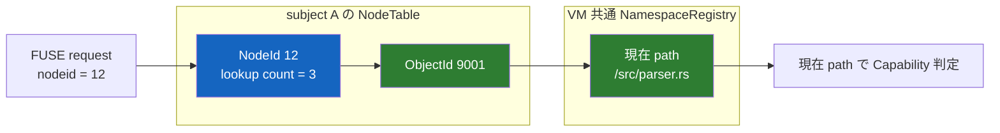

# mount ごとの node table

[ドキュメント一覧](../README.md) / [capfs 実装ガイド](README.md) / mount ごとの node table

対象ファイルは [`crates/capfs/src/node.rs`](../../crates/capfs/src/node.rs) である。

FUSE kernel はファイルを path ではなく `nodeid` という整数で参照する。しかし、この整数をそのまま VM 全体のファイル ID にすると、別 subject の mount から届いた番号を取り違えたり、削除済みの番号を別ファイルへ再割り当てして、遅れて届いた request が違うファイルを指したりする。

このファイルは、各 subject の mount が持つ `nodeid -> ObjectId` の対応を管理する。path は保存しない。rename 後の認可では、ここで得た `ObjectId` を[共有 namespace registry](namespace-registry.md)へ渡し、その時点の canonical path を取り直す。



## 何を防いでいるか

### 古い nodeid が別のファイルへ化けない

通常の node は `2, 3, 4, ...` と単調に割り当てる。kernel がその node に対する全 lookup reference を `FORGET` すると、対応は live table から外れる。ただし採番位置は巻き戻さない。

たとえば `nodeid 12 -> ObjectId A` を忘れた後、`ObjectId A` をもう一度 lookup しても、別の object を lookup しても、`12` は二度と返さない。したがって、遅れて届いた `nodeid 12` は `UnknownNode` になり、新しい object へ誤接続されない。

### 別 mount の同じ数字を同じ node だと思わない

nodeid の意味は mount の内側だけで完結する。同じ `nodeid 2` があっても、次の2つは別の identity である。

```text
(subject A の mount, nodeid 2)
(subject B の mount, nodeid 2)
```

`NodeTable` 自体が所有 subject を保持し、FUSE adapter は mount ごとに1つの table を所有する。VM 共通の identity が必要になった地点でだけ、両者を `ObjectId` に変換する。

### FORGET の数え間違いで live node を落とさない

FUSE の `LOOKUP` reply には kernel 側の参照が1つ増えたという意味がある。同じ object を複数回 lookup した場合、同じ nodeid を返しながら `lookup_count` を増やす。`FORGET(nlookup)` で count を減らし、ちょうど0になるときだけ対応を外す。

現在値より大きい `nlookup` は、count を0へ丸めず `ForgetCountExceedsLookupCount` で拒否する。加算の `u64` overflow、nodeid sequence の枯渇、内部 index の不一致も同様に fail closed になる。

root は Linux FUSE が定める `nodeid 1` に固定する。root mapping は mount が生きている間ずっと必要なので、通常 node の lookup / forget lifecycle には入れない。

## 使っている考え方

### live な間は1対1にする

ある mount `m` の live node 対応を、部分関数として次のように考える。

```text
N_m : NodeId ⇀ ObjectId
```

`nodes` は左から右、`objects` は右から左の index であり、live entry について互いに逆になるよう同じ write lock 内で更新する。これにより、1つの live object に2つの nodeid が同時に付いたり、1つの nodeid が2つの object を指したりしない。

これは全 mount を通した1対1対応ではない。mount が違えば同じ数値を使えるため、実際の identity は `(mount, NodeId)` の組である。一方、`ObjectId` は VM 共通なので、複数 mount が同じ backing object を共有できる。

### 採番を単調にする

次に割り当てる値を `next` とすると、新しい node を出すたびに次の関係を保つ。

```text
issued nodeid < next nodeid
retired nodeid < next nodeid
```

`next` を減らさないため、一度発行した集合と将来発行する集合は交わらない。これは確率的に衝突を避ける UUID ではなく、1 mount session 内の順序そのものによる非再利用である。`u64::MAX` を発行した後は wrap せず、次の割り当てを `NodeIdExhausted` にする。

### 参照数の遷移を部分関数にする

通常 node の lookup count を `c > 0` とする。許可する遷移は次だけである。

```text
LOOKUP(k = 1):       c -> c + 1      ただし overflow しない
FORGET(0 < k < c):   c -> c - k
FORGET(k = c):       live entry を削除
FORGET(k > c):       遷移しない
```

不正入力を適当な値へ補正せず、「その状態遷移は定義されていない」として拒否する。これが過剰 FORGET を受けても table が元の状態を保つ理由である。

## API と担当範囲

| API | 担当すること |
|---|---|
| `NodeTable::new` | subject と root `ObjectId` を1つの mount tableへ固定する |
| `remember_lookup` | 成功した LOOKUP 1件を数え、live node の再利用または新規 node の単調割り当てを行う |
| `resolve` | request の nodeid を `ObjectId` へ変換する |
| `node_for_object` | READDIR用にlive nodeがあれば返す。lookup referenceは増やさない |
| `forget` | 非0の `nlookup` を原子的に反映し、最後の参照なら live mapping を外す |
| `binding` / `node_count` | test・診断用の point-in-time snapshot を返す |

`remember_lookup` は名前解決も Capability 判定も行わない。adapter は namespace registry の read guard 内で path と object を確定し、その guard を保持したまま `remember_lookup` を呼ぶ必要がある。そうしなければ、名前を確認してから node を公開するまでの間に rename / remove が割り込める。

lock を保持した writer が panic した場合は table を回復したものとして扱わない。その後の resolve、lookup、forget を `LockPoisoned` で拒否し、壊れているかもしれない forward / reverse index を使い続けない。

## 何をテストしているか

[`crates/capfs/tests/node_table.rs`](../../crates/capfs/tests/node_table.rs) は公開 API を通して次を確認する。

- root が `nodeid 1` と root object に固定され、forget できない。
- 同一 object の反復 lookup が同じ live node を返し、参照数を増やす。
- `node_for_object`がlive nodeだけを参照数を変えずに返す。
- 最終 FORGET 後の stale node が拒否され、再 lookup では別番号になる。
- 過剰 FORGET が参照数と対応を変えない。
- 2 subject の table で同じ数値を独立して解決できる。
- 32 thread の同時 lookup が1つの node に収束し、32件すべてを数える。

module test は nodeid と lookup count の `u64` 最終値、次の操作での枯渇拒否、writer panic 後の lock poison を直接検査する。

memory内のnode identityと参照数は、現在[Direct-I/O FUSE adapter](read-only-fuse.md)の`LOOKUP`、`GETATTR`、`FORGET`、`READDIR`へ接続されている。namespace lookup中にnodeを公開し、`ObjectId`の現在pathに対するCapability判定とfd-relative backing I/Oまで同じoperationへつないだ。

basic `READDIR`はlookup済みobjectのlive nodeだけをinode hintとして使い、未lookupのentryには0を返す。directory reply自体はlookup referenceを発生させないため、`remember_lookup`を呼んで架空の参照数を増やさない。実mount testはlookup、read-after-revoke、readdir-after-revokeを通すが、kernelが送るFORGETの全順序やmount teardown時の参照状態まではまだ固定していない。変更系opcodeと複数thread sessionも後続である。

## 関連

- [共有 namespace registry](namespace-registry.md)
- [capfs 設計](../design/capfs.md)
- [検証戦略](../design/verification.md)
