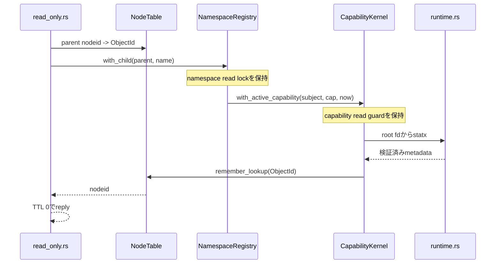
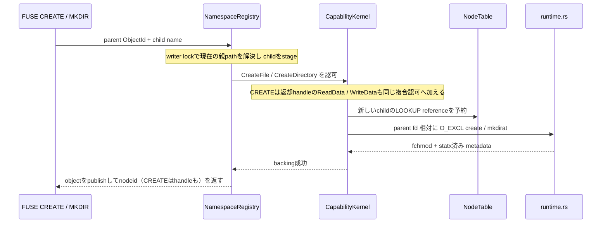
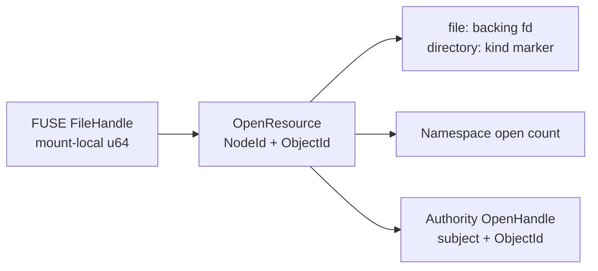

# Direct-I/O FUSE adapter

[ドキュメント一覧](../README.md) / [capfs 実装ガイド](README.md) / Direct-I/O FUSE adapter

このページは、[`crates/capfs/src/read_only.rs`](../../crates/capfs/src/read_only.rs) と [`crates/capfs/src/runtime.rs`](../../crates/capfs/src/runtime.rs) が、Linuxから届くfilesystem requestをどのようにCapability判定と安全なbacking I/Oへ接続しているかを説明する。公開APIは[`capfs::filesystem`](../../crates/capfs/src/lib.rs)であり、実装file名の`read_only.rs`は初期sliceからの移行互換として残している。

## 何ができるようになったのか

AgentはFUSE mountに対して通常の`open`、`read`、`write`、`create`、`mkdir`、directory listingを使える。adapterはmountに固定されたsubject、Capability ID、repository IDをrequest payloadから受け取らず、trusted runtimeが構築した`MountAuthority`から使う。`ImportedRepository`もstartup時にhost-assigned `RepoId`を保持し、constructorは両者が一致しない組合せを`RepositoryMismatch`で拒否する。

実装済みのoperationは次である。

| FUSE operation | 現在の処理 |
|---|---|
| `LOOKUP` | parent nodeとchild名を共有namespaceで解決し、見えてよいobjectだけnode tableへ登録する |
| `GETATTR` | nodeまたはopen handleからobjectを得て、現在のCapabilityでmetadataを見せてよいか確認する |
| `FORGET` | mount-local lookup countを減らし、0になったnodeをretireする |
| `OPEN` | access modeを確認する。`O_RDONLY`は`ReadData`、`O_WRONLY`は`WriteData`、`O_RDWR`は両方を1つの複合認可として確認する。writable openの`O_TRUNC`にはさらに`Truncate`を同じ認可へ加えてからhandleを登録する |
| `READ` | open時の判断を使い回さず、現在pathと現在時刻でもう一度`ReadData`を確認して`pread`する |
| `WRITE` | open時の判断を使い回さず、現在pathと現在時刻でもう一度`WriteData`を確認して`pwrite`する |
| `SETATTR` | size は`Truncate`、ordinary modeまたはatime/mtimeは`SetMetadata`を現在pathで認可する。owner、flag、作成時刻などは拒否し、異なる種類の変更を1 requestに混ぜない |
| `CREATE` | namespace transaction内で現在のparent pathからchildをstageし、`CreateFile`と返却handleの`ReadData` / `WriteData`を複合認可してから no-replace 作成する |
| `MKDIR` | namespace transaction内で現在のparent pathからchildをstageし、`CreateDirectory`を認可してから no-replace 作成する |
| `UNLINK` | namespace transaction内で現在のparent pathからchildを解決し、closed regular fileに対する`RemoveFile`を認可してから`unlinkat`する |
| `RMDIR` | namespace transaction内で現在のparent pathからchildを解決し、empty closed directoryに対する`RemoveDirectory`を認可してから`unlinkat(REMOVEDIR)`する |
| `RENAME` | source / destination parentから現在の両pathを解決し、subtreeの全objectについて移動元・移動先の`Rename`を複合認可してから no-replace renameする |
| `RELEASE` | namespace側とAuthority側のhandleを同じobjectについて閉じ、backing fdを破棄する |
| `OPENDIR` | read-only access mode、directory種別、現在pathの`ListDirectory`を確認してhandleを登録する |
| `READDIR` | 現在pathの`ListDirectory`を再確認し、見えてよいdirect childだけを返す |
| `RELEASEDIR` | namespace側とAuthority側のdirectory handleを閉じる |

`O_TRUNC`は`O_WRONLY`または`O_RDWR`と組み合わせたときだけ受け付ける。`O_WRONLY | O_TRUNC`には`WriteData`と`Truncate`、`O_RDWR | O_TRUNC`には`ReadData`、`WriteData`、`Truncate`の全てが必要である。`O_RDONLY | O_TRUNC`は拒否する。FUSE `CREATE`内の`O_CREAT` / `O_EXCL`は受け付けるが、namespaceが「まだ存在しない」と確定してから`O_EXCL`で作るので、同requestの`O_TRUNC`は既存長を変更せず`Truncate`を追加要求しない。FUSE `RENAME`はempty flagまたは`RENAME_NOREPLACE`だけを受け付け、adapterはどちらの場合もno-replaceとして実行する。`O_APPEND`、`O_TMPFILE`、`SYMLINK`、`LINK`、`MKNOD`はまだ受け付けない。

## metadataはどこまで見せるのか

Capabilityが`/src/private`を許可しているとき、rootと`/src`を完全に隠すと、Linuxは許可対象までpath walkできない。一方、同じ階層の`/docs`まで見せる必要はない。

そこでmetadata visibilityを次の集合にする。

```text
Visible(Capability) = 許可patternが選ぶpath ∪ そのpathへ至る祖先directory
```

たとえば`Prefix(/src/private)`なら、`/`、`/src`、`/src/private`以下は見える。`/src/public`や`/docs`は`ENOENT`になる。`Exact(/src/private/key.txt)`なら、そのfileと祖先だけが見える。

これはdata readの認可ではない。metadata visibilityはactiveなCapabilityのauthorityを検査するだけで、外部effectのaudit recordを作らない。`OPEN`、`READ`、`WRITE`、`SETATTR`は別に対応するeffectを要求し、通常のattempt / effect auditへ記録する。

同様に、祖先directoryがmetadataとして見えることは`ListDirectory`の許可を意味しない。`READDIR`はdirectory自身の現在pathがCapabilityのpath patternに一致する場合だけ成功する。そのうえで各childを`Visible(Capability)`へ通す。たとえば`Prefix(/src/private)`なら`/src/private`以下を列挙できるが、祖先`/`や`/src`の一覧を取得して兄弟名を見ることはできない。`Exact(/src/private)`でdirectory自身だけを許可した場合、一覧は`.`と`..`だけになり、child名は漏れない。

## 1回のREADDIR中に一覧が入れ替わらない理由

`NamespaceRegistry::with_directory_children_at_generation`は、対象directory、親、direct childの集合とcaptured generationを1つのread guard内で解決する。childはbacking filesystemの列挙順や`ObjectId`の発行順ではなく、canonical name順へ並べる。そのguardを保持したまま`ListDirectory`を再認可し、entry visibilityを判定して応答用bufferを確定する。並行create、remove、renameのwrite lockはここへ割り込めない。

FUSEのoffsetはbyte位置ではなくopaque cookieである。adapterは`.`を1、`..`を2、以後の可視entryを3、4、…と割り当て、kernelが返したcookieから次のentryを再開する。現在の可視一覧の範囲外にあるoffsetは`EINVAL`で拒否する。1回のreply bufferへ収まらなければ、kernelは最後に受け取ったcookieで次の`READDIR`を送る。そのrequestでもCapabilityを再確認するため、途中でrevokeが完了していれば残りの名前を返さない。

directory handleはopen時の`namespace_generation`も保持する。次の`READDIR`ではgeneration比較とchild列挙を同じread guard内で行うため、create、remove、renameが一度でもcommitされていればexecutorへ入らず`EAGAIN`になる。callerはそのdirectory streamのcookieを捨て、offset 0から新しいhandleを開き直す。全directoryを保守的に無効化する契約なので、別directoryの変更でもrestartは必要だが、古いindexを別のchild集合へ適用して重複・skipすることはない。

通常の`READDIR` replyは`LOOKUP` referenceを増やさない。すでにlookup済みのobjectには現在のmount-local nodeidをinode hintとして返し、まだlookupされていないentryには0を返す。名前の利用時にはkernelが改めて`LOOKUP`を送り、その時点でだけlookup countを増やす。これにより、kernelが所有していない参照をadapter側だけで作ってnodeを永久に残すことを避ける。

## LOOKUPでobjectが入れ替わらない理由

名前解決は次の順で行う。



parentのdirectory確認、child pathの作成、`path -> ObjectId`解決、Capability visibility、backing metadata取得、node公開までnamespace read lockを外さない。並行renameはwrite lockを必要とするため、この途中へ割り込めない。

Capability側もactive確認からmetadata取得までshared guardを保持する。revokeが先に完了していればvisibilityは失敗し、inspectionが先に始まっていればrevokeはそのinspectionが終わるまで待つ。この順序により、「失効済みCapabilityを確認したことにして後からmetadataを返す」という中間状態を作らない。

この性質は並行処理でいう線形化可能性を使っている。各操作が一瞬で起きたように並べられる境界をlockで作り、revoke、rename、lookupのどれが先だったかを曖昧にしない。

## CREATE と MKDIR が古い親pathを使わない理由

作成requestは「親nodeをlookupした時点のpath」からchild pathを作らない。もしその間に親directoryがrenameされると、古い場所を認可して新しい場所へ書く、または逆の不一致が起こるためである。

`NamespaceRegistry::create_child` と `create_open_child` は writer lockを取った後で親の`ObjectId`を現在のrecordへ解決し、そこでchild pathを組み立てる。adapterはその同じtransaction内でCapability判定とbacking syscallを実行し、成功したときだけ新しいobjectをpublishする。



`CREATE`は返却するopen handleのため、namespace recordを初めからopen count 1でstageし、Authority `OpenHandle`、local FUSE handle、writable backing fdを同じtransactionに入れる。`CreateFile`だけでは`O_WRONLY` handleを得られず、`WriteData`も必要である。`O_RDWR`なら`ReadData`と`WriteData`の両方が必要になる。`MKDIR`はhandleを返さないので、`CreateDirectory`だけを要求する。

backing側はroot fdからparent directoryを再検証して`openat2(... O_CREAT | O_EXCL | O_NOFOLLOW)`または`mkdirat`を実行する。指定modeからset-ID / sticky bitを落とし、FUSE requestのumaskを適用した値を`fchmod`で設定する。作成後のmetadata検証または権限設定に失敗したときは、parent fdからentryを削除してからnamespace transactionを失敗させる。削除にも失敗した場合はwriter lockをpoisonし、untrackedなbacking entryがあり得る状態でmountを継続しない。

## UNLINK、RMDIR、RENAMEが別のobjectを操作しない理由

削除とrenameも、FUSE requestを受けた時点でpath snapshotを取り、それを後で使う方式にはしない。`remove_child` と `rename_child` はwriter lock内でparent `ObjectId`を現在のdirectory recordへ解決し、その名前からsource / destinationを作る。したがって、親directoryが先にrenameされていれば新しい場所だけを認可・操作し、親が同時に移動する中で別のobjectを消すことはない。

`UNLINK`は`RemoveFile`、`RMDIR`は`RemoveDirectory`をchild自身のpathへ要求する。targetまたはそのsubtreeにopen handleがあればnamespaceが`EBUSY`で止め、directoryにchildが残っていれば`ENOTEMPTY`で止める。backing側はlive parent fdから対象を`statx`再検証し、regular fileには`unlinkat`、directoryには`unlinkat(REMOVEDIR)`を最後のfallible stepとして使う。成功後に失敗を返してnamespaceだけをrollbackする経路を作らない。

`RENAME`はsource rootの権限だけでは足りない。directoryを移すと、配下のfileも全て別pathへ移るためである。namespaceが作る`RenamePlan`にはsubtree全objectのsource、destination、kindが入り、adapterは各objectについて次の2 requestを1つの`CapabilityRequestSet`へ入れる。

```text
Rename(source object A)      Rename(destination object A)
Rename(source descendant B) Rename(destination descendant B)
...
```

一つでも拒否されればbacking syscallは発行されず、監査はdenyを1 attemptとして残す。全て許可された場合だけ、runtimeはsource / destination parentとplan中の全objectをfd-relativeに検証して`renameat2(RENAME_NOREPLACE)`を実行する。これが成功した瞬間にnamespaceの新pathとgenerationがpublishされる。destinationが既に存在すると`EEXIST`、open subtreeは`EBUSY`である。削除済みobjectに残るmount-local nodeidはnamespaceを解決できず`ENOENT`となり、kernelの`FORGET`で通常どおりretireされる。

## OPEN / OPENDIRからRELEASE / RELEASEDIRまで何を対応させるのか

1回の成功した`OPEN`または`OPENDIR`は、local handle、namespace open count、Authority `OpenHandle`を同じobjectへ結び付ける。file handleだけはさらにbacking fdを持つ。



FUSE handleの数値はmount内で単調に割り当て、失敗したopenの番号も再利用しない。Authority側の`HandleId`には`MountInstanceId`を含めるため、同じCapability kernelを共有するmount同士でhandle identityを混ぜない。runtimeは同じkernelを共有するmountへ異なる`MountInstanceId`を割り当てる必要がある。

openに失敗した場合、namespace open countをrollbackし、すでに作ったAuthority handleも閉じる。`RELEASE` / `RELEASEDIR`ではAuthority handleを閉じられた場合だけnamespace countを減らし、その後にlocal handleと、fileならbacking fdを捨てる。file handleを`READDIR`へ渡す、directory handleを`READ`へ渡す、nodeとhandleの組を取り違える、といったrequestは`EBADF`になる。途中の不整合を成功として補正せず、mountを`EIO`側へ倒す。

lockを複数使うoperationは次の順序に統一している。

```text
local handle table -> namespace registry -> Capability kernel
```

逆順に取り直すcallbackを作らないことで、open、read、release、将来のrenameが互いに待つ循環を避ける。

## revoke後のread、write、directory listingを止める仕組み

open handleは「このfileを一度は開けた」というresource recordであり、永続的な認可結果ではない。`READ`と`WRITE`ごとに次をやり直す。

```text
FileHandle
  -> ObjectId
  -> namespace上の現在CanonicalPath
  -> ReadData または WriteData(subject, repository, current path, now)
  -> backing fdへのpread または pwrite
```

Capability kernelは最終認可から`pread`が終わるまでshared guardを保持する。revokeはexclusive guardなので、結果は次のどちらかになる。

```text
READ / WRITEが先: authorize -> pread / pwrite完了 -> revoke完了
revokeが先: revoke完了 -> authorization denied -> backing I/Oを発行しない
```

さらに`OPEN` replyへ`FOPEN_DIRECT_IO`を付け、entry/attribute TTLを0にする。Linux page cacheだけでreadが完了するとadapterへrequestが戻らず再認可できないため、direct I/Oはrevokeの意味を実syscallまで届けるために必要である。

`O_RDWR`はopen時に`ReadData`と`WriteData`の両方を同じshared guardで確認する。`O_TRUNC`があれば`Truncate`も同じrequest setへ加える。Capability kernelの複合認可は、これらを片方ずつ監査・commitするのではなく、全requestを1つのattempt/effect recordとして残す。open後の個々のread/writeは再び単独で認可するため、open時のallowがrevoke後のI/Oを許可し続けることはない。

sizeだけの`SETATTR`は`Truncate`を現在pathに対して単独で認可する。writable file handleが渡されればそのfdへ`ftruncate`し、handleがなければ同じroot fd検証を通した一時的なwrite fdを開く。いずれも認可shared guardとnamespace read guardを保持したまま長さ変更と返却metadataの取得まで進める。readonly handle、別nodeのhandle、directory handleは`EBADF`で拒否する。

modeだけの`SETATTR`、またはatime/mtimeだけの`SETATTR`は`SetMetadata`を現在pathへ単独で要求する。modeはowner / group / otherの通常permission bitsだけを取り、set-IDとsticky bitsを落として`fchmod`する。timestamp requestはatimeとmtimeを片方または両方指定でき、`Now`とexact timeを`futimens`一回へ渡す。指定されない一方は`UTIME_OMIT`なので変化しない。いずれもroot fd相対に開いたdescriptorのkind、mount ID、regular fileのlink countを先に再検証する。

Linuxにはmodeとtimestampを同時に原子的に書く単一syscallがない。そのためsizeとmetadata、modeとtimestamp、またはsetterを含まない`SETATTR`はbackingへ届く前に`EPERM`で拒否する。metadata syscallが成功した後のattribute reply取得は別の観測であり、その失敗を「effectがcommitしなかった」と監査しない。

directory streamもopen時の判断を再利用しない。`READDIR`ごとにhandleから`ObjectId`を得て、現在pathの`ListDirectory`を確認する。entry bufferが小さく複数requestへ分かれた場合、revoke後の次requestは`EACCES`となる。

## backing pathをどう開くのか

`runtime.rs`は絶対pathやprocessのcurrent directoryから対象を開かない。preflightで保持したrepository root fdを起点に、`CanonicalPath`を`openat2`へ渡す。

```text
RESOLVE_BENEATH
RESOLVE_NO_MAGICLINKS
RESOLVE_NO_SYMLINKS
RESOLVE_NO_XDEV
```

metadata用fd、read用fd、write用fdを開いた後、そのfd自身へ`statx(AT_EMPTY_PATH)`を行う。namespaceが記録したdirectory / regular fileの種別、rootと同じmount ID、regular fileのlink count 1を再確認する。通常のwrite用fdは`O_RDWR | O_CLOEXEC | O_NOFOLLOW`だけで開き、append、create、truncateは指定しない。`O_TRUNC`と`SETATTR(size)`は、この検証済みfdへ`ftruncate`し、`SETATTR(mode/time)`はmetadata fdへ`fchmod`または`futimens`するため、pathをもう一度解決しない。

`CREATE`だけは、上位のnamespace transactionが未占有childをstageした後に、検証済みparent fdへ`O_CREAT | O_EXCL | O_NOFOLLOW`を加える。`MKDIR`も同じparent fdへ`mkdirat`を使う。どちらも`fchmod`とfd自身の`statx`検証を通るまでnamespaceへ公開しない。preflight後にsymlinkやhard linkへ差し替えられていれば、既存対象を読まず/書かず、作成ならentryをrollbackして`EIO`にする。

`UNLINK` / `RMDIR`はlive parent fdから対象を`O_PATH | O_NOFOLLOW`で開いてkind、mount ID、regular fileのlink countを検証してから、同じparent fdへ`unlinkat`する。`RENAME`はsource / destination parent fdとplan内の全source objectを先に検証し、`renameat2(RENAME_NOREPLACE)`を最後のfallible stepにする。最後のsyscallが成功した後にはerrorを返す検証を置かないため、backingだけrenameされたのにnamespaceを旧pathへ戻す状態を作らない。

root fdがあるだけでbacking tree全体が凍結されるわけではない。別processが通常fileの内容を直接変更することは防げないため、supervisorがbacking treeを非信頼processから隠す前提は残る。

## fail closedの返し方

FUSE境界では内部構造を細かく漏らさず、失敗の種類を次のようにまとめる。

| 状況 | errno |
|---|---|
| 権限外path、stale node、invalid child名 | `ENOENT` |
| `OPEN` / `CREATE` / `MKDIR` / `UNLINK` / `RMDIR` / `RENAME` / `READ` / `WRITE` / `SETATTR` / `OPENDIR` / `READDIR`の最終認可失敗 | `EACCES` |
| `O_APPEND`、`O_TMPFILE`、`O_RDONLY | O_TRUNC`、unsupported rename flag、unsupported / mixed `SETATTR`、cached write | `EPERM` |
| 既に存在するchild | `EEXIST` |
| directoryをregular fileとしてopen | `EISDIR` |
| regular fileをdirectoryとしてopen、fileをparentにしたcreate | `ENOTDIR` |
| open handleを持つtarget / subtree | `EBUSY` |
| childを持つdirectoryの`RMDIR` | `ENOTEMPTY` |
| unknown / mismatched file handle、`SETATTR(size)`のreadonly / directory handle | `EBADF` |
| open後にnamespaceが変化したdirectory stream | `EAGAIN` |
| oversized read / write、壊れたflag、現在の一覧範囲外のdirectory offset | `EINVAL` |
| lock poison、registry不整合、backing差し替え | `EIO` |

`FORGET`にはreplyがない。zero count、rootへの通常FORGET、過剰count、未知nodeのようなprotocol/state不整合を観測した場合はmountをfatal状態にし、以後のoperationを`EIO`で拒否する。

## どう検証しているか

`read_only.rs`のmodule testは、許可範囲と祖先だけのlookup、backingとCapabilityのrepository identity不一致、namespaceとAuthority両方のfile / directory handle count、位置指定read / write、`O_WRONLY`がreadを得ないこと、`O_RDWR`の両effect要求、`O_TRUNC`の複合認可、size変更の`Truncate`再認可、mode / timestampの`SetMetadata`再認可とspecial mode bit除去、`CREATE`に必要な`CreateFile`とhandle effect、`MKDIR`に必要な`CreateDirectory`、creation umask、`UNLINK`の`RemoveFile`とopen handle排他、`RMDIR`の`RemoveDirectory`、subtree全pathの`RENAME`複合認可とaudit、occupied childとnon-directory parent、generation付きdirectory cookie、exact patternによるchild filter、revoke後の既存handle read / write / truncate / metadata / readdir拒否、releaseによるcleanup、malformed FORGET後のfail closedを直接確認する。

[`crates/capfs/tests/read_only_fuse.rs`](../../crates/capfs/tests/read_only_fuse.rs) は実際にLinux FUSEへmountする。`allowed.txt`を開いて読んだ後にCapabilityをrevokeし、同じOS file descriptorで再度readして`PermissionDenied`になることを確認する。write testは`O_TRUNC` openでfileを空にし、writeを成功させた後にCapabilityをrevokeする。同じdescriptorからの次のwriteと`set_len`はともに`PermissionDenied`になり、backingの長さも変わらない。metadata testは同じdescriptorで`chmod`してordinary modeだけが反映されること、revoke後の次の`chmod`は`PermissionDenied`でbackingを変えないことを確認する。create testは`MKDIR`、writable `CREATE`、返却handleからのwriteを実mountで通し、parent directory fdを保持したままrevoke後に`mkdirat`すると、targetのlookup自体が`NotFound`となり削除に届かないことを確認する。mutation testはno-replace `RENAME`、`UNLINK`、`RMDIR`を実mountで通し、revoke後に同じparent fdからの`unlinkat`がtarget lookupで`NotFound`となることを確認する。同じmount上の権限外 siblingも`NotFound`になる。directory testでは、祖先directoryのlisting拒否、許可prefixのcanonical-name順 listingを確認する。さらに40 byteの`getdents` bufferで応答を1 entryずつに分け、1回目の`READDIR`後にrevokeして、同じdirectory fdからの2回目が`PermissionDenied`になること、同様に1回目の後で`CREATE`したstreamは2回目で`EAGAIN`になることを確認する。

実mount testは`/dev/fuse`が存在しない環境だけskipする。deviceが存在するのにmount設定や権限が壊れている場合はtest failureとして扱う。

まだ検査していないのは、実kernelが送るFORGETの全lifecycle、mount中の敵対的backing差し替え、rename / writeとの競合、複数thread FUSE sessionである。

## 現在対象外のoperation

`SYMLINK`、`LINK`、`MKNOD`、xattr、ioctl、fallocate、copy-rangeは初期link-free filesystem modelの外なので`EPERM`のままである。metadataではowner / group、BSD flag、creation / status-change / backup timeと、modeとtimestampを同時に変えるatomic requestをまだ表現しない。後者を追加するには、Linuxの複数syscallをまたぐ部分成功の意味論を先に定義する必要がある。

## 関連

- [Backing repository の事前検証](backing-preflight.md)
- [共有 namespace registry](namespace-registry.md)
- [mount ごとの node table](node-tables.md)
- [Authorization guard](../authority-core/authorization-guard.md)
- [capfs 設計](../design/capfs.md)
