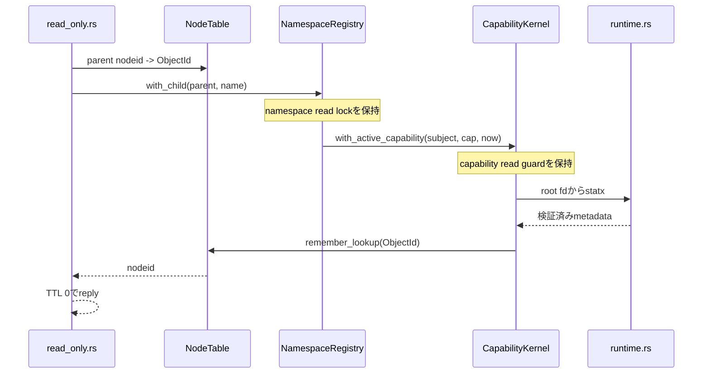
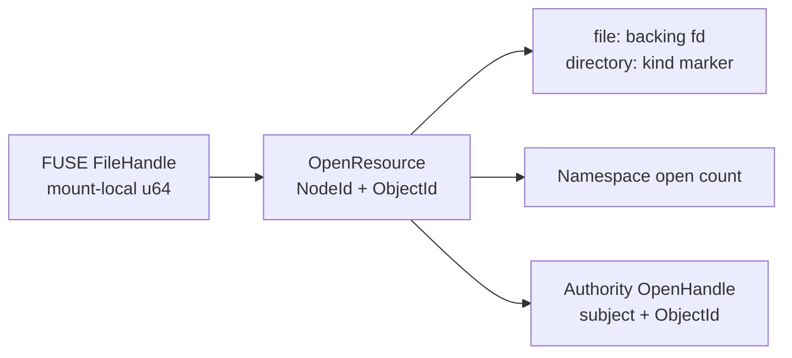

# read-only FUSE adapter

[ドキュメント一覧](../README.md) / [capfs 実装ガイド](README.md) / read-only FUSE adapter

このページは、[`crates/capfs/src/read_only.rs`](../../crates/capfs/src/read_only.rs) と [`crates/capfs/src/runtime.rs`](../../crates/capfs/src/runtime.rs) が、Linuxから届くfilesystem requestをどのようにCapability判定と安全なbacking I/Oへ接続しているかを説明する。

## 何ができるようになったのか

AgentはFUSE mountに対して通常の`open`、`read`、directory listingを使える。adapterはmountに固定されたsubject、Capability ID、repository IDをrequest payloadから受け取らず、trusted runtimeが構築した`MountAuthority`から使う。`ImportedRepository`もstartup時にhost-assigned `RepoId`を保持し、constructorは両者が一致しない組合せを`RepositoryMismatch`で拒否する。

実装済みのoperationは次である。

| FUSE operation | 現在の処理 |
|---|---|
| `LOOKUP` | parent nodeとchild名を共有namespaceで解決し、見えてよいobjectだけnode tableへ登録する |
| `GETATTR` | nodeまたはopen handleからobjectを得て、現在のCapabilityでmetadataを見せてよいか確認する |
| `FORGET` | mount-local lookup countを減らし、0になったnodeをretireする |
| `OPEN` | read-only flag、現在pathの`ReadData`、backing objectを確認してhandleを登録する |
| `READ` | open時の判断を使い回さず、現在pathと現在時刻でもう一度`ReadData`を確認して`pread`する |
| `RELEASE` | namespace側とAuthority側のhandleを同じobjectについて閉じ、backing fdを破棄する |
| `OPENDIR` | read-only flag、directory種別、現在pathの`ListDirectory`を確認してhandleを登録する |
| `READDIR` | 現在pathの`ListDirectory`を再確認し、見えてよいdirect childだけを返す |
| `RELEASEDIR` | namespace側とAuthority側のdirectory handleを閉じる |

変更系operationはまだ実装していない。read-only範囲では、path walk、file read、directory listingを通常のLinux APIで行える。

## metadataはどこまで見せるのか

Capabilityが`/src/private`を許可しているとき、rootと`/src`を完全に隠すと、Linuxは許可対象までpath walkできない。一方、同じ階層の`/docs`まで見せる必要はない。

そこでmetadata visibilityを次の集合にする。

```text
Visible(Capability) = 許可patternが選ぶpath ∪ そのpathへ至る祖先directory
```

たとえば`Prefix(/src/private)`なら、`/`、`/src`、`/src/private`以下は見える。`/src/public`や`/docs`は`ENOENT`になる。`Exact(/src/private/key.txt)`なら、そのfileと祖先だけが見える。

これはdata readの認可ではない。metadata visibilityはactiveなCapabilityのauthorityを検査するだけで、外部effectのaudit recordを作らない。`OPEN`と`READ`は別に`ReadData`を要求し、通常のattempt / effect auditへ記録する。

同様に、祖先directoryがmetadataとして見えることは`ListDirectory`の許可を意味しない。`READDIR`はdirectory自身の現在pathがCapabilityのpath patternに一致する場合だけ成功する。そのうえで各childを`Visible(Capability)`へ通す。たとえば`Prefix(/src/private)`なら`/src/private`以下を列挙できるが、祖先`/`や`/src`の一覧を取得して兄弟名を見ることはできない。`Exact(/src/private)`でdirectory自身だけを許可した場合、一覧は`.`と`..`だけになり、child名は漏れない。

## 1回のREADDIR中に一覧が入れ替わらない理由

`NamespaceRegistry::with_directory_children`は、対象directory、親、direct childの集合を1つのread guard内で解決する。childはbacking filesystemの列挙順や`ObjectId`の発行順ではなく、canonical name順へ並べる。そのguardを保持したまま`ListDirectory`を再認可し、entry visibilityを判定して応答用bufferを確定する。並行create、remove、renameのwrite lockはここへ割り込めない。

FUSEのoffsetはbyte位置ではなくopaque cookieである。adapterは`.`を1、`..`を2、以後の可視entryを3、4、…と割り当て、kernelが返したcookieから次のentryを再開する。現在の可視一覧の範囲外にあるoffsetは`EINVAL`で拒否する。1回のreply bufferへ収まらなければ、kernelは最後に受け取ったcookieで次の`READDIR`を送る。そのrequestでもCapabilityを再確認するため、途中でrevokeが完了していれば残りの名前を返さない。

guardが固定するのは1 request内のviewである。将来、共有registryの変更系operationを別mountへ接続したあと、複数の`READDIR` requestの間にcreate、remove、renameが成功すると、index型cookieではentryの重複やskipが起こり得る。この場合にも各requestは現在pathでvisibilityを再確認するため権限外名は返さないが、変更中directoryに対する安定したPOSIX streamはまだ保証しない。変更系operationを追加する段階でgeneration付きcursorまたはhandle snapshotの契約を決める。

通常の`READDIR` replyは`LOOKUP` referenceを増やさない。すでにlookup済みのobjectには現在のmount-local nodeidをinode hintとして返し、まだlookupされていないentryには0を返す。名前の利用時にはkernelが改めて`LOOKUP`を送り、その時点でだけlookup countを増やす。これにより、kernelが所有していない参照をadapter側だけで作ってnodeを永久に残すことを避ける。

## LOOKUPでobjectが入れ替わらない理由

名前解決は次の順で行う。



parentのdirectory確認、child pathの作成、`path -> ObjectId`解決、Capability visibility、backing metadata取得、node公開までnamespace read lockを外さない。並行renameはwrite lockを必要とするため、この途中へ割り込めない。

Capability側もactive確認からmetadata取得までshared guardを保持する。revokeが先に完了していればvisibilityは失敗し、inspectionが先に始まっていればrevokeはそのinspectionが終わるまで待つ。この順序により、「失効済みCapabilityを確認したことにして後からmetadataを返す」という中間状態を作らない。

この性質は並行処理でいう線形化可能性を使っている。各操作が一瞬で起きたように並べられる境界をlockで作り、revoke、rename、lookupのどれが先だったかを曖昧にしない。

## OPEN / OPENDIRからRELEASE / RELEASEDIRまで何を対応させるのか

1回の成功した`OPEN`または`OPENDIR`は、local handle、namespace open count、Authority `OpenHandle`を同じobjectへ結び付ける。file handleだけはさらにbacking fdを持つ。



FUSE handleの数値はmount内で単調に割り当て、失敗したopenの番号も再利用しない。Authority側の`HandleId`には`MountInstanceId`を含めるため、同じCapability kernelを共有するmount同士でhandle identityを混ぜない。runtimeは同じkernelを共有するmountへ異なる`MountInstanceId`を割り当てる必要がある。

openに失敗した場合、namespace open countをrollbackし、すでに作ったAuthority handleも閉じる。`RELEASE` / `RELEASEDIR`ではAuthority handleを閉じられた場合だけnamespace countを減らし、その後にlocal handleと、fileならbacking fdを捨てる。file handleを`READDIR`へ渡す、directory handleを`READ`へ渡す、nodeとhandleの組を取り違える、といったrequestは`EBADF`になる。途中の不整合を成功として補正せず、mountを`EIO`側へ倒す。

lockを複数使うoperationは次の順序に統一している。

```text
local handle table -> namespace registry -> Capability kernel
```

逆順に取り直すcallbackを作らないことで、open、read、release、将来のrenameが互いに待つ循環を避ける。

## revoke後のreadとdirectory listingを止める仕組み

open handleは「このfileを一度は開けた」というresource recordであり、永続的な認可結果ではない。`READ`ごとに次をやり直す。

```text
FileHandle
  -> ObjectId
  -> namespace上の現在CanonicalPath
  -> ReadData(subject, repository, current path, now)
  -> backing fdへのpread
```

Capability kernelは最終認可から`pread`が終わるまでshared guardを保持する。revokeはexclusive guardなので、結果は次のどちらかになる。

```text
READが先:   authorize -> pread完了 -> revoke完了
revokeが先: revoke完了 -> authorization denied -> preadしない
```

さらに`OPEN` replyへ`FOPEN_DIRECT_IO`を付け、entry/attribute TTLを0にする。Linux page cacheだけでreadが完了するとadapterへrequestが戻らず再認可できないため、direct I/Oはrevokeの意味を実syscallまで届けるために必要である。

directory streamもopen時の判断を再利用しない。`READDIR`ごとにhandleから`ObjectId`を得て、現在pathの`ListDirectory`を確認する。entry bufferが小さく複数requestへ分かれた場合、revoke後の次requestは`EACCES`となる。

## backing pathをどう開くのか

`runtime.rs`は絶対pathやprocessのcurrent directoryから対象を開かない。preflightで保持したrepository root fdを起点に、`CanonicalPath`を`openat2`へ渡す。

```text
RESOLVE_BENEATH
RESOLVE_NO_MAGICLINKS
RESOLVE_NO_SYMLINKS
RESOLVE_NO_XDEV
```

metadata用fdまたはread用fdを開いた後、そのfd自身へ`statx(AT_EMPTY_PATH)`を行う。namespaceが記録したdirectory / regular fileの種別、rootと同じmount ID、regular fileのlink count 1を再確認する。preflight後にsymlinkやhard linkへ差し替えられていれば、対象を読まず`EIO`にする。

root fdがあるだけでbacking tree全体が凍結されるわけではない。別processが通常fileの内容を直接変更することは防げないため、supervisorがbacking treeを非信頼processから隠す前提は残る。

## fail closedの返し方

FUSE境界では内部構造を細かく漏らさず、失敗の種類を次のようにまとめる。

| 状況 | errno |
|---|---|
| 権限外path、stale node、invalid child名 | `ENOENT` |
| `OPEN` / `READ` / `OPENDIR` / `READDIR`の最終認可失敗 | `EACCES` |
| write access、truncate、append、create intent | `EROFS` |
| directoryをregular fileとしてopen | `EISDIR` |
| regular fileをdirectoryとしてopen | `ENOTDIR` |
| unknown / mismatched file handle | `EBADF` |
| oversized read、壊れたflag、現在の一覧範囲外のdirectory offset | `EINVAL` |
| lock poison、registry不整合、backing差し替え | `EIO` |

`FORGET`にはreplyがない。zero count、rootへの通常FORGET、過剰count、未知nodeのようなprotocol/state不整合を観測した場合はmountをfatal状態にし、以後のoperationを`EIO`で拒否する。

## どう検証しているか

`read_only.rs`のmodule testは、許可範囲と祖先だけのlookup、backingとCapabilityのrepository identity不一致、write intent拒否、namespaceとAuthority両方のfile / directory handle count、位置指定read、directory offset cookie、exact patternによるchild filter、revoke後の既存handle read / readdir拒否、releaseによるcleanup、malformed FORGET後のfail closedを直接確認する。

[`crates/capfs/tests/read_only_fuse.rs`](../../crates/capfs/tests/read_only_fuse.rs) は実際にLinux FUSEへmountする。`allowed.txt`を開いて読んだ後にCapabilityをrevokeし、同じOS file descriptorで再度readして`PermissionDenied`になることを確認する。同じmount上の権限外 siblingは`NotFound`になる。directory testでは、祖先directoryのlisting拒否、許可prefixのcanonical-name順 listingを確認する。さらに40 byteの`getdents` bufferで応答を1 entryずつに分け、1回目の`READDIR`後にrevokeして、同じdirectory fdからの2回目が`PermissionDenied`になることを確認する。

実mount testは`/dev/fuse`が存在しない環境だけskipする。deviceが存在するのにmount設定や権限が壊れている場合はtest failureとして扱う。

まだ検査していないのは、実kernelが送るFORGETの全lifecycle、directory変更中のoffset cookie挙動、mount中の敵対的backing差し替え、rename / writeとの競合、複数thread FUSE sessionである。

## 次に実装するもの

次は`WRITE`を追加し、open済みfile descriptorでも各requestの現在pathへ`WriteData`を再認可する。その後に`CREATE`、`MKDIR`、`UNLINK`、`RMDIR`、no-replace `RENAME`を追加し、open handleとrevokeを含む競合testへ進む。

## 関連

- [Backing repository の事前検証](backing-preflight.md)
- [共有 namespace registry](namespace-registry.md)
- [mount ごとの node table](node-tables.md)
- [Authorization guard](../authority-core/authorization-guard.md)
- [capfs 設計](../design/capfs.md)
