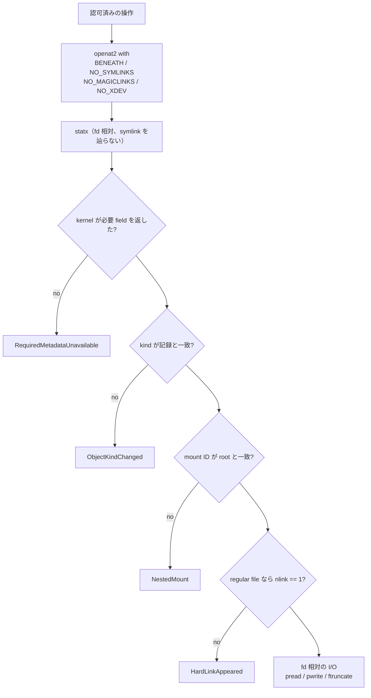

<!-- doc-type: concept -->

# backing への実 I/O

[capfs 実装ガイド](README.md) / backing への実 I/O

> **対象読者:** capfs の syscall 境界を触る実装者、TOCTOU をレビューする人

[`runtime.rs`](../../crates/capfs/src/runtime.rs) は、認可を通った操作を実際の backing tree へ落とす層である。read、positioned write、truncate、create、remove、rename、chmod、utimens のすべてが、`ValidatedRepository` の root fd から fd 相対に走る。

**絶対 path で開かない。process の cwd も umask も見ない。symlink を作らないし辿らない。** 認可そのものは [Direct-I/O FUSE adapter](read-only-fuse.md) が持ち、path と identity の記帳は [共有 namespace registry](namespace-registry.md) が持つ。

## 起動時検査だけでは足りない

[Backing repository の事前検証](backing-preflight.md)は、起動時点の tree を確認する。しかしそれは起動時点の話である。

```text
preflight: <repo>/notes.txt は regular file、nlink == 1
   ...
実行中: 誰かが notes.txt を /etc/shadow への symlink に差し替える
   ↓
File capability（repo=workspace, path=Prefix(/scoped), ReadData）で
/etc/shadow が読める
```

だから runtime 側でも毎回検査する。preflight と runtime は二重ではなく、守る時点が違う。

## 解決を root fd の内側に閉じる

```rust
const RESOLVE_WITHIN_ROOT: ResolveFlags = ResolveFlags::BENEATH
    .union(ResolveFlags::NO_MAGICLINKS)
    .union(ResolveFlags::NO_SYMLINKS)
    .union(ResolveFlags::NO_XDEV);
```

全 `openat2` がこの flag で走る。7 箇所ある。

| flag | 塞ぐ経路 |
|---|---|
| `BENEATH` | root fd より上へ出る |
| `NO_SYMLINKS` | symlink を辿る |
| `NO_MAGICLINKS` | `/proc/*/fd/N` 経由で別の fd を掴む |
| `NO_XDEV` | 別 mount へ越境する |

## fd を使う前に 4 つ検査する

`validate_runtime_metadata_for` が、fd を使う前と mutation の前に走る。

| 検査 | 破ると何が起きるか |
|---|---|
| 実体の kind が namespace の記録と一致 | FIFO / socket / device node が `RegularFile` として提供される。read が character device に当たる、write が pipe で block する。`unlinkat` と `rmdir` の flag 選択も古い kind から取られる |
| `stx_mnt_id` が preflight 時の root と一致 | preflight 後に repository 内へ mount されたもの（`/home` の bind、tmpfs、overlay）が、manifest に無いのに File authority で読み書きできる |
| regular file の `stx_nlink == 1` | path scope が inode scope でなくなる。認可外の path（あるいは同 filesystem の repository 外）に hard link を作れば、`/scoped/x` への `WriteData` が `/hidden/y` を書き換える。`/scoped/x` を消してもデータは攻撃者の名前で生き残る |
| kernel が必要な field を実際に返した | `STATX_MNT_ID` を埋めない kernel / filesystem では `stx_mnt_id` が 0 になり、mount 比較が「未設定同士の比較」になる。`stx_nlink` も同じ。**検査が空虚に通る** |

最後の 1 つが重要で、`REQUIRED_METADATA` に `BASIC_STATS | MNT_ID` を要求し、揃っていなければ `RequiredMetadataUnavailable` で落ちる。fail closed。

`statx` は `EMPTY_PATH | NO_AUTOMOUNT | SYMLINK_NOFOLLOW` で呼ぶ。末尾 symlink を辿らず、autofs を起こさない。

`NO_XDEV` は path 解決を守るが、root fd に対する `statx` の経路は守らない。だから mount ID の明示検査が要る。



## 一度検証したら fd だけを使う

`read_at` は `pread`、`write_at` は `pwrite`、`truncate_to` は `ftruncate`。**どれも path を再解決しない。**

再解決すると、検査で閉じた TOCTOU の窓が毎回開き直す。認可と I/O の間に entry を差し替えられれば、write が別の実体へ向く。

副次的に、open した FUSE handle が rename 後に保持するのは名前ではなく descriptor になる。これが [ADR 0005](../decisions/0005-separate-object-identity-from-path.md) の identity 分離と噛み合う。

## open flag に含めないもの

runtime の file open は `RDONLY` か `RDWR` だけで、`O_CREAT`、`O_APPEND`、`O_TRUNC` を持たない。

`O_TRUNC` を付けると、`ReadData` の認可で内容が消える。adapter は `Truncate` を独立の effect として別に認可している（[ADR 0002](../decisions/0002-split-file-permissions-into-ten-effects.md)）ので、open に混ぜると粒度が潰れる。

`O_APPEND` を付けると `pwrite` の offset が無意味になり、認可した範囲の外へ書ける。

全 `openat2` に `CLOEXEC` が付く。付けないと、supervisor や orchestrator が capfs process から fork した子が repository root の live fd を継承する。**その fd からの `openat` は capability 検査を通らない。**

## create は既存を絶対に採らない

file は `CREATE | EXCL | NOFOLLOW`、directory は `mkdirat`（`EEXIST`）。

既存 entry を採ると、out-of-band に置かれた file や repository 外を指す symlink が、新規作成された object として新しい `ObjectId` を得る。namespace は import していない file を所有し、後で unlink することになる。

作成後の mode は 2 段階。`0o600` / `0o700` で作り、`fchmod` で `requested_mode & !request_umask & 0o777` を当てる。

**mode を `openat2` / `mkdirat` に直接渡さない。** 渡すと capfs daemon 自身の umask が guest から見える permission を黙って狭める。`& 0o777` を落とすと guest が setuid file を作れる。

`SetMetadata` でも set-ID と sticky は書かない。`MetadataPermissions::from_requested_mode` が `& 0o777` する。sandbox 内の agent が `chmod 04755` できると、その backing tree を後で nosuid でない場所（host の build step、image への copy）で実行したときに、file 所有者の uid で走る。

## rename の plan を再導出する

`renameat2` は plan が何と言おうと subtree を丸ごと原子的に動かす。plan の per-object path 書き換えがその動きと食い違うと、namespace が「disk 上の object を指さない path」を公開する。後の認可が path P で別の inode に到達する。

だから `validate_rename_plan` は plan を信用せず、独立に再導出する。

- destination が source の中（`is_at_or_below`）でないこと。中だと subtree が root から切り離される。
- 移動対象が空でないこと。
- identity と path に重複が無いこと。
- 各 destination が `source.rebase(plan.source, plan.destination)` と一致すること。
- root の移動がちょうど 1 回であること。
- 移動する各子孫の親が、plan 内に directory として存在すること。

`renameat_with(..., RenameFlags::NOREPLACE)` を使う。plain な `renameat` だと destination にあるものを unlink する。namespace がまだ追跡している object でも、追跡外の file でも、`Rename` effect だけで消せてしまう。

## 変更する syscall を最後に置く

`unlinkat`、`renameat_with`、`fchmod`、`futimens` は、それぞれの method の**最後の fallible な式**になっている。

namespace registry は executor が `Ok` を返したときだけ commit する。syscall の後に失敗しうる処理（返信用 attribute の取得など）を置くと、commit 済みの backing 変更が namespace の rollback を引き起こす。**disk 上では消えた／rename されたのに、registry と node table と audit record は古い tree を記述する。**

## create 失敗時は panic する

作成した entry が検証に失敗した場合、error を返す前に `unlinkat` で消す。**消すのに失敗したら `panic!` する。**

namespace transaction は executor の error で rollback する。entry が残ったまま error を返すと、追跡外の file / directory が repository に残る。capfs が認可することも列挙することもない名前で、次の exclusive create と衝突する。

panic は registry の writer closure の内側で起きるので `RwLock` が poison し、以後の namespace 呼び出しが `LockPoisoned` を返す。**fail closed として意図された挙動。**

## 何が助かるのか

TOCTOU の検討が `validate_runtime_metadata_for` の 4 検査に集約されている。「認可と I/O の間に何ができるか」を考えるとき、この関数と `RESOLVE_WITHIN_ROOT` を見ればよい。

fd 相対に統一されているので、rename と競合する経路が構造的に無い。path を持ち回る変数が存在しない。

## 正確な保証範囲

- Linux 専用。`#[cfg(target_os = "linux")]` で、`openat2` と `statx` の `MNT_ID` に依存する。
- `RuntimeBackingError` は adapter でほぼ全部 `AdapterError::Internal`（EIO）に潰れる。guest からは失敗の理由が区別できない。
- 検査は「認可の直前」と「syscall の直前」の 2 点で行うが、その間の窓は原理的に残る。窓を閉じているのは fd 相対 I/O のほうで、metadata 検査は入口を絞っているだけ。
- `MNT_ID` を返さない kernel では起動できない。fail closed だが、対応 kernel の下限がこの検査で決まる。
- 実 FUSE mount 上の変更系操作と revoke を同時に競合させる統合 test は無い。
- panic による lock poisoning は fail closed だが、その後 process を再起動する以外に復旧手段が無い。

## 変更時の確認点

- `RESOLVE_WITHIN_ROOT` から flag を削らない。4 つはそれぞれ別の脱出経路を塞ぐ。
- `REQUIRED_METADATA` を緩めない。field が無い状態で検査が空虚に通る。
- I/O を fd 相対から path 再解決に変えない。TOCTOU の窓が毎回開く。
- open flag に `O_TRUNC` / `O_APPEND` / `O_CREAT` を足さない。effect の粒度が潰れる。
- 変更する syscall の後ろに fallible な処理を足さない。`Err` が「backing 未変更」を意味しなくなり、namespace の rollback と disk の状態がずれる。
- `RenameFlags::NOREPLACE` を外さない。`Rename` effect だけでデータを破壊できる。
- 作成後の rollback を `panic!` から `Err` に変えるなら、追跡外 entry が残ることを namespace 側でどう扱うかを先に決める。
- mode の適用を `fchmod` から open flag に移さない。daemon の umask が漏れる。

## 関連

- [capfs 実装ガイド](README.md)
- [Backing repository の事前検証](backing-preflight.md)
- [共有 namespace registry](namespace-registry.md)
- [Direct-I/O FUSE adapter](read-only-fuse.md)
- [0002](../decisions/0002-split-file-permissions-into-ten-effects.md)
- [0005](../decisions/0005-separate-object-identity-from-path.md)
- [0007](../decisions/0007-use-direct-io-so-revocation-cannot-be-bypassed.md)
- [capfs 設計](../design/capfs.md)
- [用語集](../glossary.md)
