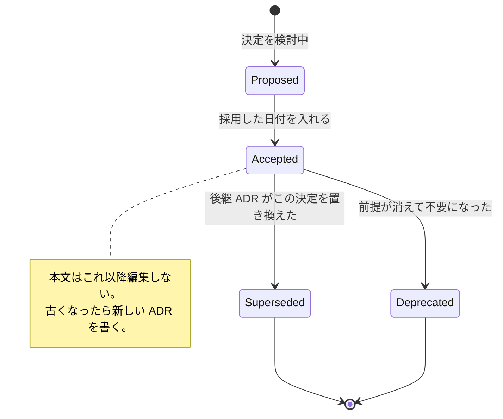

<!-- doc-type: index -->

# 決定記録

[ドキュメント一覧](../README.md) / 決定記録

> **対象読者:** 設計判断の前提を再検討する人、新しい境界を設計する人、設計レビュー担当者

この文書群は、この repository の設計判断を 1 決定 1 ファイルで記録する。形式は [MADR](https://adr.github.io/madr/) に従い、採用した案だけでなく**却下した案とその理由**を残す。決定記録を導入した理由そのものは [0000](0000-record-architecture-decisions.md) にある。

実装が現在どうなっているかは各 crate の文書、なぜその構造にしたかは決定記録が正である。両者が食い違って見える場合、実装が変わって ADR が `Superseded` にされていない可能性を先に疑う。

## 記録の状態

ADR は追記のみで、内容を書き換えない。覆すときは新しい記録を書いて元の `Status` を変える。

## 運用

| 項目 | 規約 |
|---|---|
| ファイル名 | `NNNN-<英小文字とハイフンの slug>.md` |
| 連番 | 追記のみ。欠番を埋めない。削除しない |
| 骨格 | [`docs/templates/decision.md`](../templates/decision.md) をコピーする |
| Status | `Proposed` → `Accepted (YYYY-MM-DD)`。覆るときは `Superseded by` と後継 ADR へのリンク |
| 改訂 | 内容は書き換えない。新しい ADR を書いて元の Status を変える |
| 必須節 | `Status` / `背景と課題` / `検討した選択肢` / `決定` / `結果` / `関連` |

`検討した選択肢` に選択肢が 1 つしかない ADR は書かない。実際に他の案が無かった場合、それは決定ではなく制約であり、該当する実装ページの `正確な保証範囲` に書く。

## 決定一覧

| ADR | 決定 | Status |
|---|---|---|
| [0000](0000-record-architecture-decisions.md) | 設計判断を MADR 形式の決定記録として残す | Accepted |
| [0001](0001-limit-path-patterns-to-exact-and-prefix.md) | `PathPattern` を `Exact` と `Prefix` の 2 種類に限定する | Accepted |
| [0002](0002-split-file-permissions-into-ten-effects.md) | file の権限を 10 種の `FileEffect` に分割する | Accepted |
| [0003](0003-require-repository-and-path-match-for-empty-effects.md) | 空 effect の子にも repository と path の一致を要求する | Accepted |
| [0004](0004-implement-authorization-twice-and-compare-with-a-corpus.md) | 認可判定を Rust と Lean で二重に実装し、共通 corpus で突き合わせる | Accepted |
| [0005](0005-separate-object-identity-from-path.md) | object の identity を path から分離し `ObjectId` で持つ | Accepted |
| [0006](0006-never-reuse-object-node-and-capability-ids.md) | `ObjectId`、`nodeid`、capability ID を再利用しない | Accepted |
| [0007](0007-use-direct-io-so-revocation-cannot-be-bypassed.md) | FUSE adapter を Direct-I/O にし、page cache に revoke を迂回させない | Accepted |
| [0008](0008-expose-only-typed-closed-operations-from-the-broker.md) | Broker は型付きの閉じた操作だけを公開する | Accepted |
| [0009](0009-reject-the-whole-dns-answer-on-any-non-public-address.md) | DNS 応答に非 public address が 1 つでもあれば応答全体を拒否する | Accepted |
| [0010](0010-re-resolve-and-re-authorize-on-every-redirect.md) | redirect のたびに DNS を再解決し、同じ authority で再認可する | Accepted |
| [0011](0011-require-an-expected-old-object-plan-for-publish-branch.md) | `PublishBranch` に expected-old object の plan を必須とする | Accepted |
| [0012](0012-check-frame-length-before-allocating-the-payload.md) | frame 長を payload 確保の前に検査する | Accepted |
| [0013](0013-resolve-caller-identity-from-the-connection.md) | caller identity を受理済み connection から解決する | Accepted |
| [0014](0014-keep-the-workspace-when-vm-kill-fails.md) | VM kill が失敗した場合に workspace isolation を実行しない | Accepted |
| [0015](0015-persist-the-identity-ledger-across-restarts.md) | identity ledger を永続化し、restart をまたいで非再利用にする | Accepted |
| [0016](0016-terminate-the-child-after-an-unrollbackable-isolation-failure.md) | rollback 不可能な isolation step の失敗後は child を終了させる | Accepted |
| [0017](0017-authorize-an-aliased-inode-on-every-name.md) | alias を持つ inode は全ての名前で認可する | Accepted |

## 遡及分について

0001 から 0016 は、決定当時の議論記録が無いため、実装・コメント・既存文書から再構成したものである。**採用しなかった案は、当時実際に検討されたものとは限らない。** 実装の形が排除している設計を、その理由とともに書き起こしてある。

これから新しく決める分は `Proposed` から始め、採用日を入れて `Accepted` にする。

## 関連

- [文書規約](../document-conventions.md)
- [設計書](../design/README.md)
- [ドキュメント一覧](../README.md)
- [用語集](../glossary.md)
