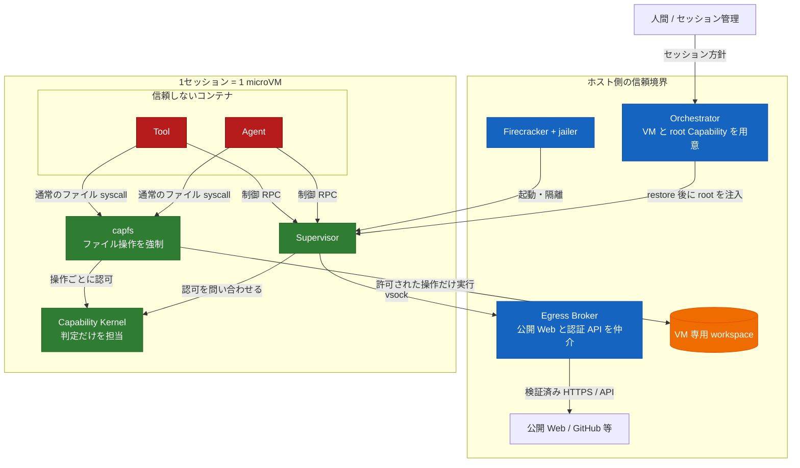
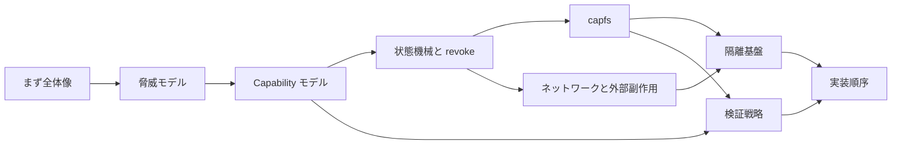

<!-- doc-type: index -->

# Capability-based Agent 実行基盤

[ドキュメント一覧](../README.md) / 設計書

> **対象読者:** 設計者、実装者、セキュリティレビュー担当者

Agent にコードを書かせるだけなら、それほど難しくない。難しいのは、生成されたコードを本当に動かし、ファイルを書き換え、外部サービスまで操作させるところにある。

この基盤では、Agent と Tool を最初から信用しない。何をしてよいかは Capability で明示し、実際の副作用が起きる場所で強制する。

この文書は設計の入口であり、実装の完了判定ではない。Cycle 2 の各 crate については、コードが存在すること、mock/contract test が通ること、実機・外部サービス境界を実行したことを分けて記録する。

## 何を守るのか

守りたい境界は3段ある。

1. Agent 同士は subject と Capability で分ける。
2. guest 内の仕組みが破られても、被害をその VM の workspace と session envelope に留める。
3. GitHub などの認証情報は guest に入れず、ホスト側だけで扱う。

## この設計で選んだ形

- ファイル操作は、subject ごとの `capfs` を必ず通す。
- `OPEN` 時だけでなく、実際の `READ` / `WRITE` ごとに権限を見直す。
- Agent / Tool に生のネットワークは渡さない。
- 公開 Web は GitHub に限定せず、Host Egress Broker 経由で取得できる。
- 認証付き操作は、`CreatePullRequest` のような型付き API に限定する。
- 相互不信のセッションを同じ VM に入れない。

## 文書の読み方

| 文書 | そこで決めること |
|---|---|
| [全体アーキテクチャ](architecture.md) | 8 crate がどこで動き、どの線がまだコードでないか |
| [脅威モデル](threat-model.md) | 誰を信用し、どこまで守るか |
| [Capability モデル](capability-model.md) | 権限をどう表し、どう狭めるか |
| [状態機械と revoke](state-and-revocation.md) | 副作用と失効をどう競合させるか |
| [capfs](capfs.md) | ファイル操作をどこで止めるか |
| [隔離基盤](runtime-isolation.md) | VM、namespace、Landlock、seccomp の分担 |
| [ネットワークと外部副作用](network-egress.md) | 公開 Web と認証 API をどう分けるか |
| [検証戦略](verification.md) | 何を証明し、何をテストするか |
| [実装順序](implementation-plan.md) | どこから作れば手戻りが少ないか |

## Cycle 2 の実装状況

| 境界 | 実装済み | mock/contract 検証済み | 実機・外部統合の状態 |
|---|---|---|---|
| Authority core と audit | typed authority、状態遷移、`auth_epoch`、in-memory audit、`DurableAuditLog` の WAL/receipt | Rust/Lean 共通 corpus、property test、loom、durable audit contract test | 複数 process の journal owner 調整、実 provider との receipt reconciliation は未検証 |
| capfs | preflight、namespace/node table、link を含む Direct-I/O FUSE adapter | module/contract test と環境依存の実 mount test | 全 interleaving の loom、敵対的 backing 差し替え、隔離層との end-to-end は未検証 |
| `egress-broker` | bounded transport、typed dispatch、DNS/IP policy、公開 HTTPS、型付き GitHub adapter | fake resolver/connector/provider による module test | 実 `AF_VSOCK`、外部 DNS/HTTPS/GitHub API、guest-to-host は未検証 |
| `runtime-isolation` | policy validation、`LinuxBackend`、13 段階の ordered apply/rollback | mock backend test、host capability detection | privileged isolation apply、workload 実行中の escape test は未検証 |
| `firecracker-runtime` | artifact pin、dm-verity/jailer/API 順序、workspace、snapshot/restore、identity/workload gate | fake boundary test、local Unix socket HTTP exchange、opt-in KVM test | 実 Firecracker + dm-verity + guest `AF_VSOCK` identity gate は確認。jailer / snapshot restore は未検証 |
| `supervisor` | connection-to-subject binding、bounded wire protocol、subject/handle lifecycle | `CapabilityKernel` + `FakeResources` による test | Linux namespace/cgroup/mount、実 socket、guest supervisor は未検証 |
| `session-orchestrator` | durable 128-bit identity ledger、lease binding、Authority/Broker/Firecracker/workspace production adapter | mock state-machine test、test-double 境界までの production adapter composition | 実 command/filesystem/vsock、guest capfs/isolation、実 VM は未検証 |

この表の「実装済み」は、該当 crate の API と実装が repository にあることを意味する。「mock/contract 検証済み」は、特権 kernel、外部 network、provider、実 VM を通っていない test の結果である。

## Cycle 2 の実装文書

| 文書 | 役割 |
|---|---|
| [Host Egress Broker](../egress-broker/README.md) | host egress の transport、公開 HTTPS、GitHub typed adapter、検証境界 |
| [Firecracker runtime](../firecracker-runtime/README.md) | VM launch、artifact、dm-verity、snapshot、identity gate、未検証範囲 |
| [Supervisor adapter](../supervisor/README.md) | connection identity、wire protocol、subject lifecycle、handle 境界 |
| [Session orchestrator](../session-orchestrator/README.md) | session resource の順序、lease binding、rollback/stop 契約 |

## revoke の約束

> revoke が返った後に commit される副作用は、失効した Capability やその子孫だけを根拠には実行されない。

逆に、revoke より先に線形化点を越えた操作は巻き戻さない。この線引きを曖昧にしないことが、状態機械の中心になる。

## 関連

- [全体アーキテクチャ](architecture.md)
- [脅威モデル](threat-model.md)
- [Capability モデル](capability-model.md)
- [状態機械と revoke](state-and-revocation.md)
- [Cycle 2 実装状況](#cycle-2-の実装状況)
- [Cycle 2 実装順序](implementation-plan.md)
- [Cycle 2 検証戦略](verification.md)
