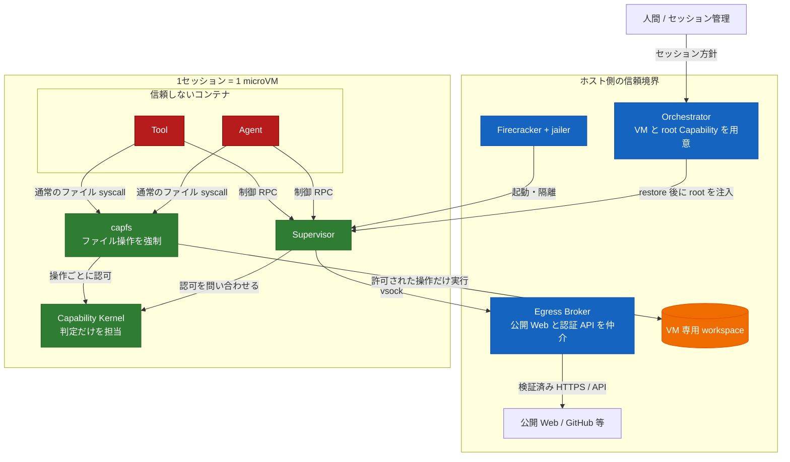
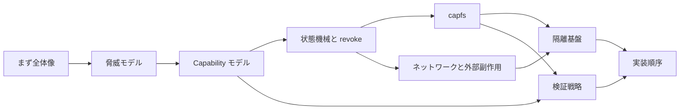

# Capability-based Agent 実行基盤

Agent にコードを書かせるだけなら、それほど難しくない。難しいのは、生成されたコードを本当に動かし、ファイルを書き換え、外部サービスまで操作させるところにある。

この基盤では、Agent と Tool を最初から信用しない。何をしてよいかは Capability で明示し、実際の副作用が起きる場所で強制する。

## 何を守るのか

守りたい境界は3段ある。

1. Agent 同士は subject と Capability で分ける。
2. guest 内の仕組みが破られても、被害をその VM の workspace と session envelope に留める。
3. GitHub などの認証情報は guest に入れず、ホスト側だけで扱う。

## この設計で選んだ形

- ファイル操作は、subject ごとの `capfs` を必ず通す。
- `OPEN` 時だけでなく、実際の `READ` / `WRITE` ごとに権限を見直す。
- Agent / Tool に生のネットワークは渡さない。
- 公開 Web は GitHub に限定せず、Host Egress Broker 経由で取得できる。
- 認証付き操作は、`CreatePullRequest` のような型付き API に限定する。
- 相互不信のセッションを同じ VM に入れない。

## 文書の読み方

| 文書 | そこで決めること |
|---|---|
| [脅威モデル](threat-model.md) | 誰を信用し、どこまで守るか |
| [Capability モデル](capability-model.md) | 権限をどう表し、どう狭めるか |
| [状態機械と revoke](state-and-revocation.md) | 副作用と失効をどう競合させるか |
| [capfs](capfs.md) | ファイル操作をどこで止めるか |
| [隔離基盤](runtime-isolation.md) | VM、namespace、Landlock、seccomp の分担 |
| [ネットワークと外部副作用](network-egress.md) | 公開 Web と認証 API をどう分けるか |
| [検証戦略](verification.md) | 何を証明し、何をテストするか |
| [実装順序](implementation-plan.md) | どこから作れば手戻りが少ないか |

## revoke の約束

> revoke が返った後に commit される副作用は、失効した Capability やその子孫だけを根拠には実行されない。

逆に、revoke より先に線形化点を越えた操作は巻き戻さない。この線引きを曖昧にしないことが、状態機械の中心になる。

## 関連文書

- [脅威モデル](threat-model.md)
- [Capability モデル](capability-model.md)
- [状態機械と revoke](state-and-revocation.md)
