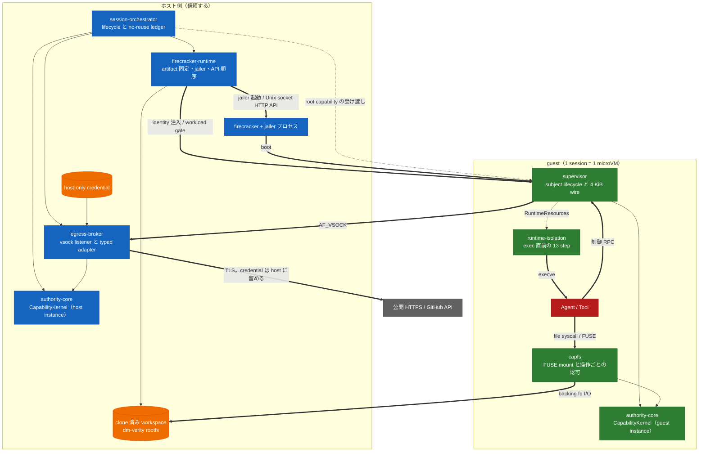
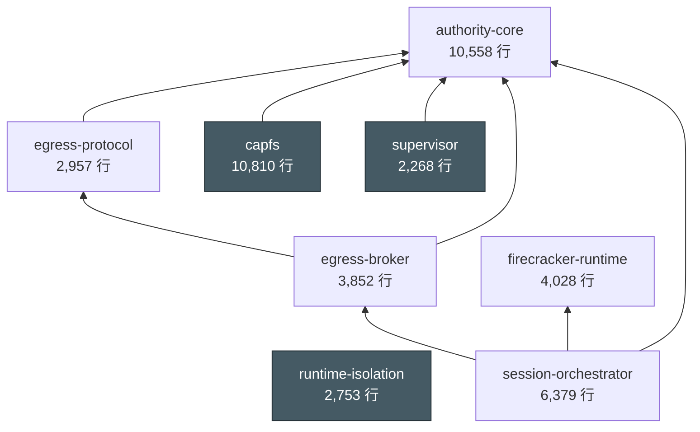
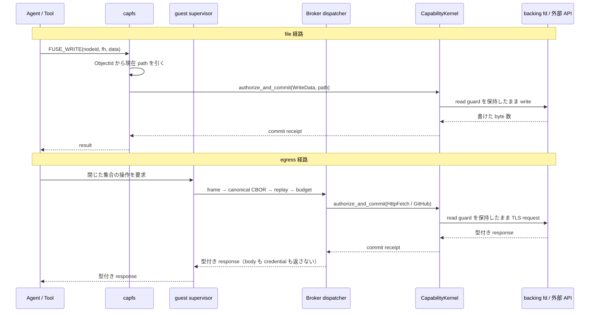

<!-- doc-type: design -->

# 全体アーキテクチャ

[設計書一覧](README.md) / 全体アーキテクチャ

> **対象読者:** crate をまたぐ変更を設計する人、統合順序と未接続の境界をレビューする人、この repository に初めて入る実装者

crate ごとの文書は、その境界の内側を詳しく書いている。足りないのは、8 つの crate が実行時にどう並び、どの線が本物のコードで、どの線がまだ図の中にしか無いかを一度に見られる場所である。

個別ページと食い違ったら、個別ページのほうを正とする。ここは配置図であって仕様ではない。

## 実行時の配置



線の太さと種類に意味を持たせてある。

| 線 | 意味 |
|---|---|
| 細い実線 | 同一プロセス内の関数呼び出し。型で繋がっている |
| 太い実線 | プロセスや VM をまたぐ。syscall、socket、HTTP のいずれか |
| 点線 | 設計上は必要だが、まだ繋ぐコードが無い。詳細は[まだコードになっていない線](#まだコードになっていない線) |

## 境界を越える手段は 5 種類しかない

太い線はこの 5 つに限る。ここに無い経路（生の TCP socket、guest から host への任意 file 共有、credential の guest 配布）は作らない。

| 越える境界 | 手段 | 上限 | 誰が検査するか |
|---|---|---|---|
| Agent → 自分の workspace | FUSE operation | なし（操作ごとに認可） | [capfs](../capfs/read-only-fuse.md) が毎 `READ` / `WRITE` / `SETATTR` / `READDIR` で kernel を引く |
| Agent → subject 制御 | supervisor の bounded envelope | 4 KiB、version 1、tag は `CloseSubject` と `CloseHandle` の 2 つ | [supervisor](../supervisor/README.md)。wire 上の `claimed_subject` は認可に使わない |
| guest → host egress | `AF_VSOCK` の length-prefixed frame | 4 bytes prefix、payload 1 MiB | [transport 契約](../egress-broker/transport.md) が長さを確保前に検査する |
| host → VM | Firecracker API と guest control API | — | [firecracker-runtime](../firecracker-runtime/launch-sequence.md)。`network_devices` が空でなければ artifact を読む前に拒否 |
| host → 外部 | Broker の型付き adapter | response 32 MiB、redirect 5 hop、connect 10 秒 / 全体 60 秒 | [公開 HTTPS policy](../egress-broker/network-policy.md) と [GitHub adapter](../egress-broker/github.md) |

guest に `virtio-net` は付かない。外へ出る経路が vsock 1 本しかないので、egress の検査点は Broker に集約される。

## crate 依存は実行時の形と一致しない

配置図は host と guest に分かれているが、[`Cargo.toml`](../../Cargo.toml) の依存グラフはもっと単純で、`authority-core` を底とする木になっている。



灰色の 3 つは、どの crate からも依存されていない。`firecracker-runtime` と `runtime-isolation` は `authority-core` すら参照せず、前者は `rustix` と `sha2`、後者は `libc` だけで立っている。

host daemon は無く、guest の CapabilityKernel / capfs / supervisor / runtime-isolation を一つの session として組み立てる init も無い。[`guest-control-init`](../../crates/firecracker-runtime/src/bin/guest-control-init.rs) は例外で、実 VM 内の identity/workload gate 専用 PID 1 である。任意 command、credential、authority body を host から受け取らないため、配置図の guest supervisor の代替ではない。

これは書き忘れではなく順序の結果で、[実装順序](implementation-plan.md)が「Authority core と capfs をホスト上で確定してから統合する」という並びを選んでいる。ただし、そのぶん「crate 単体の test が通ること」と「システムが動くこと」の距離は、依存グラフを見ただけでは分からない。

## 副作用は 1 つの API に集まる

file を書く経路と外部へ出る経路は、途中はまったく別物だが、最後は同じ [`CapabilityKernel::authorize_and_commit`](../../crates/authority-core/src/kernel.rs) に入る。この関数を呼ぶのは 3 箇所しかない。

| 呼ぶ側 | 何を commit するか |
|---|---|
| [`capfs/src/read_only.rs`](../../crates/capfs/src/read_only.rs) | FUSE operation。backing への実 I/O が commit point |
| [`egress-broker/src/dispatch.rs`](../../crates/egress-broker/src/dispatch.rs) | 型付き adapter の呼び出し。HTTPS request か GitHub 操作 |
| [`session-orchestrator/src/authority_backend.rs`](../../crates/session-orchestrator/src/authority_backend.rs) | root capability の発行と revoke |



要点は guard の保持区間が揃っていること。認可してから効果が確定するまで Capability の read guard を離さないので、その間に走った revoke は待たされる。[revoke の約束](README.md#revoke-の約束)が経路によらず成立するのは、この 1 箇所に集めているからで、4 番目の呼び出し側を足すときは同じ規則を守らせる必要がある。詳細は [Authorization guard](../authority-core/authorization-guard.md)。

## Capability Kernel は今いくつあるのか

配置図に `CapabilityKernel` を 2 つ描いたのは、現在のコードがそう読めるからである。`capfs` は `Arc<CapabilityKernel>` を受け取り、Broker の `CapabilityExecutor` も `CapabilityKernel` の impl で、どちらも同一プロセス内の instance を前提にしている。capfs は guest で、Broker は host で動く。同じ instance にはなりようがない。

一方 `authority_core::state` の revoke と `auth_epoch` は、1 つの `CapabilityState` を直列化することで成り立っている。instance が 2 つあるなら、guest 側 revoke が host 側 Broker の判定へどう伝わるかを決めなければならない。今のところ、その経路はコードにも文書にも無い。

取りうる形は 2 つある。root を guest 側 kernel だけに置いて Broker には guest が毎回 capability を提示する形と、host 側を正として guest 側を cache 扱いにし `auth_epoch` で無効化する形。後者は cache を持つ実装が epoch を key に含めるという[用語集](../glossary.md)の規約と噛み合う。どちらを採るかは ADR で決める話で、ここで決めない。

## session の時間軸

startup は 4 つの state machine が噛み合って進む。orchestrator が commit 順を決め、他の 3 つはそれぞれの内側を持つ。

| orchestrator `LifecycleState` | firecracker `RuntimeState` | そこで確定すること |
|---|---|---|
| `Ready` | `New` | 7 つの 128-bit identity を ledger へ append。`sync_data` まで終わるまで backend を呼ばない |
| `WorkspaceCloned` | — | capfs の backing になる tree を clone。symlink と hard link は許さない |
| `BrokerEstablished` | — | 新しい `BrokerSessionId`、sequence は 0 から、replay guard も作り直す |
| `VmStarted` | `RestoredStopped` → `IdentityRegenerated` | pre-session snapshot を restore し、128-bit の identity を 5 つ作り直す |
| `RootCapabilityInjected` | `IdentityInjected` | `/actions/inject-identity` が 5 つの ID の hex を渡す。host 側では subject 登録と root 発行 |
| `WorkloadReleased` | `Running` | 13 step の isolation receipt が揃ってから `execve` |
| `Running` | `Running` | 定常 |

**session は VM の起動ではなく restore から始まる。** `launch` が返すのは `WorkloadStopped` で、そこから `Running` へ抜ける遷移は `RuntimeState` に無い。`launch` の 5 本の PUT と `InstanceStart` は、snapshot 元になる VM を 1 つ作るための経路であって、session ごとに通る道ではない。session を増やすときに毎回払うのは restore と identity 再生成のコストになる。

`RuntimeState::Running` も「VM が動いている」ではなく「workload の実行が明示的に許可された」を指す。VM 自体は restore の時点で立っている。state 名を条件に何かを判断するコードを書く前に、[snapshot と identity gate](../firecracker-runtime/snapshot-and-identity.md)を読む。

restore 元に session-scoped identity が残っていれば、backend を呼ぶ前に startup 自体を拒否する。snapshot を取れるのも `WorkloadStopped` の VM だけなので、snapshot に「workload が走った後の memory」が入ることはない。

停止は逆順で、どこが失敗しても後段を諦めない。ただし 1 箇所だけ例外がある。

```text
root capability revoke
  -> Firecracker VM kill
  -> Broker close
  -> workspace isolation
  -> Closed

VM kill が失敗したときだけ workspace isolation を実行しない。
生きた VM が掴んだままの tree を、別 session へ配り直さないため。
```

guest 側では supervisor が subject ごとに同じ形の取引を持つ。`SetupStep` の 6 段（cgroup 作成 → capfs mount → control fd → subject 登録 → handle 登録 → workload 起動）を通し、shutdown では `begin_subject_close` と `finish_subject_close` の間に外部 resource の解放を挟む。exec 直前の 13 step はさらにその内側にある入れ子で、[13 step の固定順序と rollback](../runtime-isolation/apply-order.md)のとおり大半が kernel 上で戻せない。

## identity はどこで翻訳されるか

orchestrator が割り当てる 7 種の 128-bit identity は、境界を越えるたびに相手側の型へ写される。同じ概念に別の型が付くので、対応表を持っておくと追いやすい。

| `IdentityKind` | 渡る先 | 相手側の型 | 翻訳する場所 |
|---|---|---|---|
| `Session` | 全 lease | `SessionId` | orchestrator 内で完結 |
| `Workspace` | workspace adapter | `WorkspaceId` | `firecracker_workspace.rs` |
| `BrokerSession` | Broker | `egress_protocol::session::BrokerSessionId` | `egress_backend.rs`。bytes をそのまま渡す |
| `Request` | Broker の最初の control request | `BrokerRequestId` | `egress_backend.rs` |
| `Vm` | Firecracker | `VmId`、guest control API では hex 文字列 | `firecracker_backend.rs` |
| `Subject` | Authority | `authority_core::capability::SubjectId` | [`authority_backend.rs`](../../crates/session-orchestrator/src/authority_backend.rs) が hex 文字列へ変換 |
| `Capability` | Authority | `CapId` | 同上 |

orchestrator の `SubjectId` と `authority_core` の `SubjectId` は名前が同じで別の型である。adapter がこの写像を持ち、別 session の capability が lease を満たせないようにする。ただし[契約](../session-orchestrator/contracts.md)が明記しているとおり、これは検出であって防止ではない。lease を正しい identity で作る責任は backend 側に残る。

## まだコードになっていない線

配置図の点線と、太線のうち実機で動かしていないものを一覧にする。「実装済み」と「実機で確認済み」を混同しないための表なので、繋いだら行を消す。

| 線 | 現状 | 繋ぐのに要るもの |
|---|---|---|
| supervisor → runtime-isolation | `RuntimeResources` の実装が無い。`supervisor` の依存に `runtime-isolation` が入っていない | 13 step を呼ぶ backend 実装と、child process 側で `apply` を開始する起動経路 |
| orchestrator → capfs | [契約](../session-orchestrator/contracts.md)が `ImportedRepository::open` → `CapabilityFilesystem::new` → `spawn_mount` の順序を書いているが、`session-orchestrator` の依存に `capfs` が無い | workspace adapter の実装。ただし mount するのは guest 側なので、host adapter が直接呼ぶ形でよいかは未決 |
| root capability の受け渡し | `/actions/inject-identity` が送るのは 5 つの ID の hex だけで、authority body は含まれない | guest supervisor の trusted control channel と、その上の型 |
| guest 側 kernel の生成 | identity/workload gate 用の `guest-control-init` はあるが、`Arc<CapabilityKernel>` を作って capfs と supervisor へ配る主体は無い | authority policy を受け取る trusted guest init と、その上の型 |
| host の vsock listener | [`server.rs`](../../crates/egress-broker/src/server.rs) に `serve_expected_peer` があり、accept から dispatch までは実装済み。ただし test は `Cursor` 上で、実 `AF_VSOCK` の bind / accept は一度も通っていない | 実 VM と実 vsock を伴う統合 test |
| Firecracker の実起動 | [`real_guest_control`](../../crates/firecracker-runtime/tests/real_guest_control.rs) が実 Firecracker、dm-verity rootfs、guest `AF_VSOCK` control を通す | `Runtime::launch` 経由の実 jailer、workspace drive、snapshot restore |

`authority-core` と `capfs` の内側は、この表とは検証の水準が違う。前者は Rust と Lean の 150 件共通 corpus と loom、後者は `/dev/fuse` がある環境での実 mount test まで通っている。crate ごとの正確な線引きは各 [検証対応表](verification.md)を見る。

## どの箱がどの文書か

| 配置図の箱 | crate | 入口の文書 |
|---|---|---|
| CapabilityKernel | `authority-core` | [Authority core 実装ガイド](../authority-core/README.md) |
| capfs mount | `capfs` | [capfs 実装ガイド](../capfs/README.md) |
| vsock listener と typed adapter | `egress-broker` / `egress-protocol` | [Host Egress Broker](../egress-broker/README.md)、[Broker session envelope](../egress-protocol/session-envelopes.md) |
| firecracker + jailer | `firecracker-runtime` | [Firecracker runtime](../firecracker-runtime/README.md) |
| exec 直前の 13 step | `runtime-isolation` | [runtime-isolation](../runtime-isolation/README.md) |
| subject lifecycle と 4 KiB wire | `supervisor` | [Supervisor adapter](../supervisor/README.md) |
| lifecycle と no-reuse ledger | `session-orchestrator` | [Session orchestrator](../session-orchestrator/README.md) |

## 関連

- [設計書一覧](README.md)
- [脅威モデル](threat-model.md)
- [Capability モデル](capability-model.md)
- [状態機械と revoke](state-and-revocation.md)
- [ネットワークと外部副作用](network-egress.md)
- [隔離基盤](runtime-isolation.md)
- [capfs](capfs.md)
- [実装順序](implementation-plan.md)
- [検証戦略](verification.md)
- [用語集](../glossary.md)
- [決定記録](../decisions/README.md)
