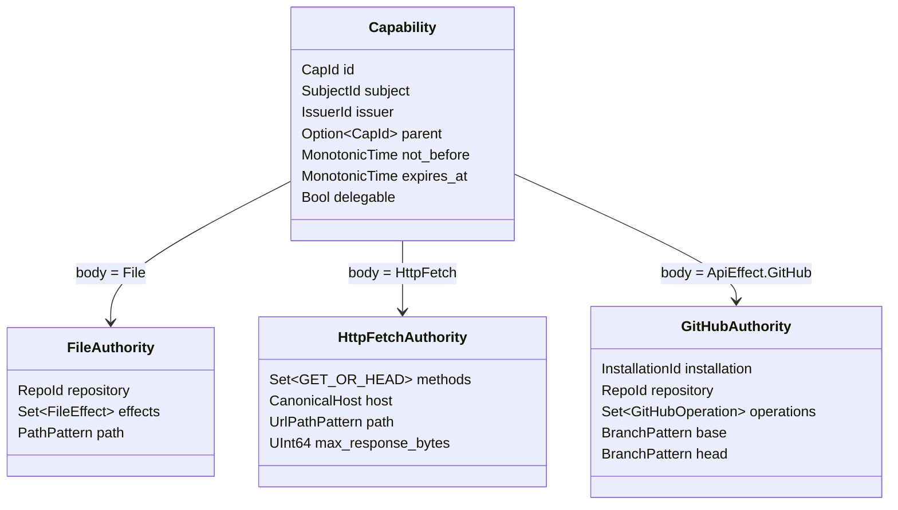
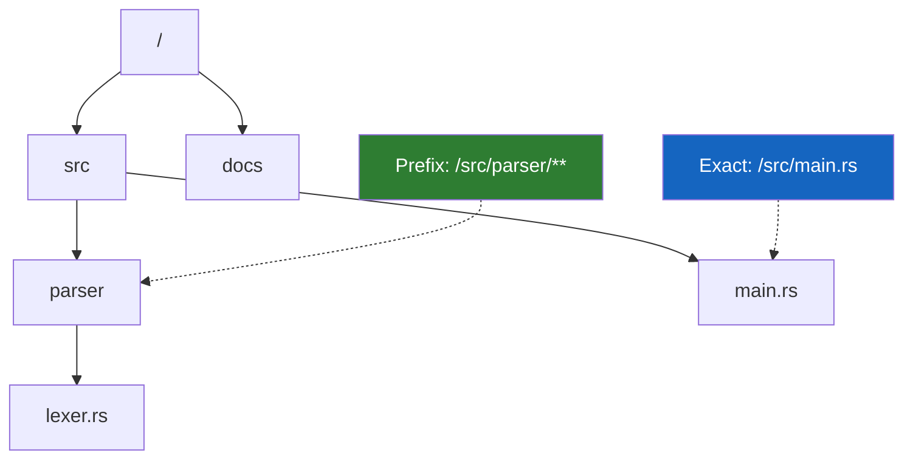
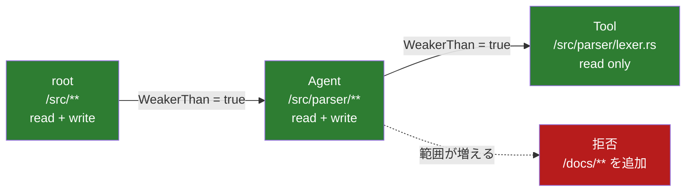

<!-- doc-type: design -->

# Capability モデル

[設計書一覧](README.md) / Capability モデル

> **対象読者:** 設計者、Authority core 実装者、権限境界のレビュー担当者

Capability は「この subject が、何に、どんな操作をしてよいか」を表す札である。札の中身は発行後に書き換えない。権限を狭めたいときは、親より弱い子を新しく発行する。

## まず型を分ける

ファイル権限、公開 Web 取得、認証付き API は、似ているようで対象も制約も違う。1個の汎用 struct に押し込まず、最初から別の型として持つ。



この形なら、`PullRequestCreate` に `FileScope` を付けるような壊れた Capability は型の段階で作れない。

認証付きサービスを増やすときは、Authority 型、request 型、包含判定、Broker adapter、Lean モデルをセットで追加する。認証 header を付けた任意 HTTP request を通す逃げ道は作らない。

## ファイル権限

```text
FileEffect :=
  ReadData | ListDirectory | WriteData | Truncate
  | CreateFile | CreateDirectory
  | RemoveFile | RemoveDirectory | Rename | SetMetadata
```

create で見るのは親 directory ではなく、これから作る子のパス。rename は移動元と移動先の両方を見る。単に「書き込み可能」という一語でまとめない。

## パスの表し方

パターンは完全一致か、末尾まで含む prefix の2種類に絞る。



- `Exact(["src", "main.rs"])` は1ファイルだけ。
- `Prefix(["src", "parser"])` は directory 自身と全子孫。
- `Prefix([])` は repository 全体。
- 空、`.`、`..`、`/`、NUL、`*` を含む segment は構築できない。

許可範囲まで辿るための祖先 directory は見えるようにする。ただし、兄弟 entry やファイル内容まで見せる理由にはしない。

## 委譲は必ず弱くする



共通条件は、子の有効期間が親の期間内に収まること。そのうえで型ごとに次を比べる。

| 型 | 親以下であるための条件 |
|---|---|
| File | repository が同じ。effects は部分集合。path は親の内側 |
| HttpFetch | method は部分集合。host は同じ。path と最大応答サイズは親以下 |
| GitHub | installation と repository が同じ。operation、base、head は親以下 |
| 異なる型 | 比較不能なので false |

Lean で示したい中心定理はこれだけでよい。

```text
WeakerThan(child, parent)
  -> Authority(child) subset_of Authority(parent)
```

Authority には repository、host、操作、時刻を含める。`delegable` は Authority ではなく、子を発行できるかどうかの条件に置く。

## ID、時間、回数

- ID はセッション中に再利用しない。
- root は snapshot restore 後にホストが発行する。
- 有効期間は restore 後の `CLOCK_BOOTTIME` を基準にする。
- Capability は VM 再起動を跨いで持ち越さない。
- 使用回数や累積 byte 数は別の消費予算にする。子を複数作って回数を水増しできるため、Authority の集合包含には混ぜない。

## 関連

- [状態機械と revoke](state-and-revocation.md)
- [capfs](capfs.md)
- [検証戦略](verification.md)
