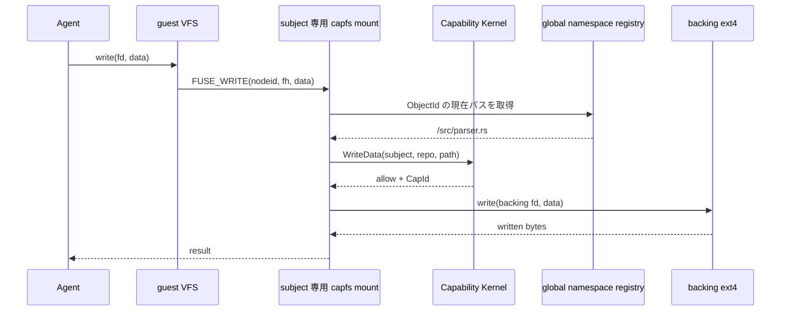
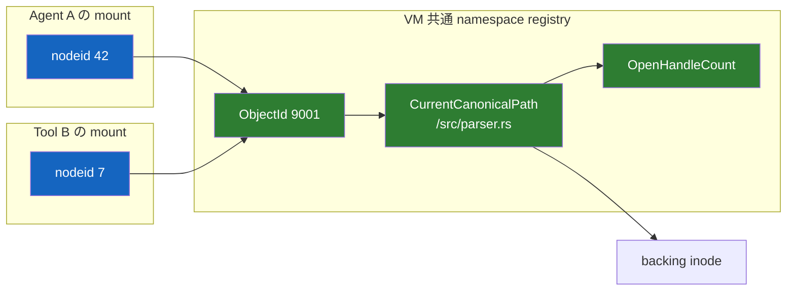
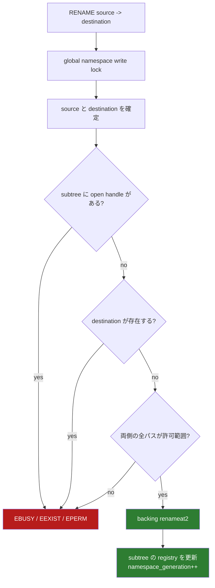

# capfs

[設計書一覧](README.md) / capfs

`capfs` を挟む理由は、Agent に専用のファイル API を覚えさせるためではない。Agent には普通に `open`、`read`、`write` させつつ、最後の実行地点で Capability を強制するためである。

## ファイル操作の流れ



subject ごとに FUSE mount は分けるが、実ファイルと namespace の状態は VM 内で共有する。

## nodeid はパスではない

rename がある以上、`nodeid -> path` を不変にすると古いパスで認可して新しい場所へ書けてしまう。そこで `nodeid` は object を指し、現在パスは共有 registry から毎回引く。



`ObjectId` と mount 内の `nodeid` は再利用しない。

## 現在の実装位置

[`crates/capfs/src/backing.rs`](../../crates/capfs/src/backing.rs) に起動時の backing repository 検査、[`crates/capfs/src/namespace.rs`](../../crates/capfs/src/namespace.rs) にVM共通の link-free namespace registry、[`crates/capfs/src/node.rs`](../../crates/capfs/src/node.rs) にsubject mountごとのnode table、[`crates/capfs/src/runtime.rs`](../../crates/capfs/src/runtime.rs)と[`crates/capfs/src/read_only.rs`](../../crates/capfs/src/read_only.rs)にDirect-I/O FUSE adapterを実装している。

- root を symlink follow なしで開き、mount ID と inode の再照合後に directory fd を保持する。
- `statx` と `openat2` による fd-relative scan で symlink、hard link、special file、nested mount を拒否する。
- UTF-8・canonical segment、entry 数、depth を検査し、path 順の初期 manifest を作る。
- manifest全件へpath非依存の`ObjectId`を割り当て、root fdと完成したregistryを`ImportedRepository`で一緒に所有する。cloneしたmountは同じshared stateを参照する。
- host-assigned `RepoId`も`ImportedRepository`へ束ね、mount authorityとidentityが違うbacking接続をconstructorで拒否する。

- `ObjectId -> NamespaceObject` と `CanonicalPath -> ObjectId` を同じ lock 内で管理する。
- create、remove、subtree rename が成功したときだけ `namespace_generation` を進める。
- `ObjectId` は remove 後も再利用せず、rename 先は no-replace とする。
- subtree に open handle が1件でもあれば rename / remove executor を呼ばない。
- read / write adapter が現在 path 取得から backing I/O まで保持できる read-guard 付き closure API を持つ。
- backing executor 失敗では registry state を公開せず、writer panic 後は lock poison により fail closed にする。

- Linux FUSE の root nodeを`nodeid 1`へ固定し、通常nodeをmount内で単調に割り当てる。
- 同一objectのLOOKUP参照数を数え、最終FORGET後はmappingを外すがnodeidは再利用しない。
- stale node、過剰FORGET、counter / sequence枯渇、lock poison、index不一致をfail closedで拒否する。
- nodeidはsubject mount内だけのidentityとし、VM共通のpath解決には`ObjectId`を使う。

- `LOOKUP`と`GETATTR`はCapabilityの許可範囲またはその祖先だけをzero TTLで公開する。
- `OPEN`はaccess modeを`ReadData` / `WriteData`の単一または複合認可へ変換する。writableな`O_TRUNC`には`Truncate`も同じ複合認可へ加える。`SETATTR`のsizeは`Truncate`、ordinary modeまたはatime/mtimeは`SetMetadata`を現在pathで再認可する。`CREATE`は`CreateFile`と返却handleのaccess effectを複合認可し、`MKDIR`は`CreateDirectory`を認可してから現在のparent pathの直下へno-replace作成する。`UNLINK`、`RMDIR`、`RENAME`も現在のchild / subtree全pathに対応effectを要求する。毎回の`READ` / `WRITE`はnamespace上の現在pathに対して対応effectを再認可する。
- regular fileは`FOPEN_DIRECT_IO`で開き、revoke後のreadがpage cacheを迂回しないようにする。
- runtime metadata/open/read/writeはroot fdから`openat2`で解決し、symlink、mount越境、hard linkの出現をfail closedで拒否する。
- FUSE handle、namespace open count、Authority open handleを同じ`ObjectId`へ結び、`RELEASE`で一緒に閉じる。

詳しい API と保証範囲は[Backing repository の事前検証](../capfs/backing-preflight.md)、[共有 namespace registry](../capfs/namespace-registry.md)、[mount ごとの node table](../capfs/node-tables.md)、[Direct-I/O FUSE adapter](../capfs/read-only-fuse.md)を参照する。initial link-free file modelの全10 `FileEffect`はFUSE operationへ接続済みである。directory streamはopen時のgenerationを保持し、途中でnamespaceが変われば`EAGAIN`を返してcookieの再利用を止める。

namespace writer lockとCapability kernelのshared / exclusive guardを組み合わせたbounded
競合契約を[`crates/capfs/tests/concurrency.rs`](../../crates/capfs/tests/concurrency.rs)で
実行する。write中のrevoke、open / close、rename、unlinkを32 round走らせ、writeのcommitが
revoke returnを越えないこと、revoke後のmutationがbacking executorへ入らないこと、open
count・authority handle・namespace pathのrollback / publishとcommitted effect数が一致することを確認する。
これはinitial link-free modelのunit境界を閉じる検査であり、実FUSE kernelの複数thread
requestや敵対的backing差し替えを仮定しない。

## 初期実装は workspace を木に限定する

最初の `capfs` は、path-based authority と相性が悪い alias を扱わない。これは初期実装の安全境界であり、symlink を恒久的に非対応とする決定ではない。

- 起動前に symlink、hard link、device、FIFO、socket、workspace 内 mount を拒否する。
- `SYMLINK`、`LINK`、`MKNOD`、`O_TMPFILE` は `EPERM`。
- link を実体へ置換しない。対象 repository 自体を非対応として返す。
- 生きている object は必ず1つの canonical path を持つ。

この段階では、link を含まない repository に対象を絞って namespace registry、rename、revoke の競合を先に閉じる。link 解決を同時に導入して、認可失敗と namespace resolver の不具合を混ぜないためである。

## symlink は後続機能として追加する

Git は symlink を mode `120000` の tree entry として表現し、blob の内容に link target を保持する。[Git fast-import documentation](https://git-scm.com/docs/git-fast-import)

一般的な Git repository を扱うには symlink 対応が必要になるため、初期 `capfs` の完成後に次の規則で追加する。

- symlink は backing filesystem の alias として直接辿らず、namespace registry 上の link node と target として保持する。
- file operation は symlink の見かけ上の path ではなく、解決後の `CanonicalPath` に対して認可する。
- link 解決、現在 path の確定、Capability 判定、backing I/O の開始を同じ namespace lock の範囲で行う。
- repository root の外へ出る target と absolute target は `EXDEV`、cycle と40回を超える解決は `ELOOP` で拒否する。
- backing I/O の `RESOLVE_NO_SYMLINKS` と `RESOLVE_NO_MAGICLINKS` は、registry を迂回する symlink が存在しないことを強制する防御層として残す。
- `SYMLINK` operation による新規作成は、作成先と target の認可 semantics を追加するまで `EPERM` のままとする。

symlink 対応の完了条件は次のとおりである。

- repository 内で完結する symlink を通した read / write が、解決後の target path の権限で判定される。
- 許可範囲内の link から許可範囲外の target へ到達する操作が拒否される。
- dangling link は `ENOENT`、cycle と40回を超える link chain は `ELOOP` で終了し、backing object へ到達しない。
- symlink の rename と revoke が競合しても、古い解決結果による commit が成立しない。

## hard link は別の拡張として扱う

symlink は link node と target object を分けられるが、hard link は1つの inode に複数の canonical path を与える。これは「生きている object は必ず1つの canonical path を持つ」という初期 invariant を直接壊す。

そのため、runtime の `LINK` は symlink 対応後も自動的には有効化しない。hard link を扱う場合は、次のどちらかを明示的に選ぶ。

- import 時に各 path を別 inode へコピーし、hard-link 関係を解消した専用 workspace を作る。
- namespace registry を複数 path 対応へ拡張し、どの alias から変更しても他の alias 側の権限を侵害しない認可規則を追加する。

後者は path containment だけでは証明できない。alias 集合と mutation の意味論、rename / unlink / revoke との競合モデルを追加してから採用する。

## rename をどう閉じるか



unlink も open handle が残っている間は `EBUSY` にする。多少 POSIX 互換性を落としてでも、「パスを失ったまま生きる inode」を作らない方を選ぶ。

## revoke を page cache に抜かせない

regular file の `OPEN` は `FOPEN_DIRECT_IO` を返す。`FUSE_WRITEBACK_CACHE` と shared writable `mmap` は使わない。

cached FUSE read は page cache だけで完了する場合があり、それでは revoke 後の read を止められない。direct I/O にすることで、read / write の両方を毎回 `capfs` まで戻す。[Linux FUSE I/O modes](https://docs.kernel.org/filesystems/fuse/fuse-io.html)

```text
entry_timeout    = 0
attr_timeout     = 0
negative_timeout = 0
```

内部キャッシュは使ってよい。ただし key に `auth_epoch` と `namespace_generation` を含め、Capability の期限を越えて再利用しない。

## 実装する操作

| FUSE operation | 判断 |
|---|---|
| `LOOKUP`, `GETATTR` | 許可範囲またはその祖先だけ見せる。その他は `ENOENT` |
| `READDIR` | `ListDirectory` を確認し、見えてよい entry だけ返す。open後のnamespace変更時は `EAGAIN` でstream再開を要求する |
| `OPEN` | access mode を確認。`O_TRUNC` は open 前に別途認可 |
| `READ`, `WRITE` | object の現在パスに対して毎回再認可 |
| `CREATE`, `MKDIR` | これから作る子パスを認可 |
| `UNLINK`, `RMDIR` | 対象を認可。open 中なら拒否 |
| `RENAME` | source / destination を認可し、VM 共通 lock で更新 |
| `SETATTR` | size は `Truncate`、ordinary mode または atime/mtime は `SetMetadata`。owner・flag・複合metadata変更は拒否 |
| symlink / hard link、device、xattr、ioctl、fallocate、copy-range | 初期実装では `EPERM` |
| 未実装 opcode | backing に触れず fail closed |

backing ext4 は supervisor の mount namespace にしか置かない。操作は事前に開いた directory fd から始め、`openat2` の `RESOLVE_BENEATH`、`RESOLVE_NO_SYMLINKS`、`RESOLVE_NO_MAGICLINKS`、`RESOLVE_NO_XDEV` を使う。[openat2(2)](https://man7.org/linux/man-pages/man2/openat2.2.html)

## 壊れたとき

`capfs` が停止したら要求は `EIO` になる。Agent / Tool に backing への別経路はない。supervisor が停止した場合は VM セッションごと捨て、Capability を workspace から復元しない。

## 関連文書

- [状態機械と revoke](state-and-revocation.md)
- [隔離基盤](runtime-isolation.md)
- [検証戦略](verification.md)
- [実装順序](implementation-plan.md)
