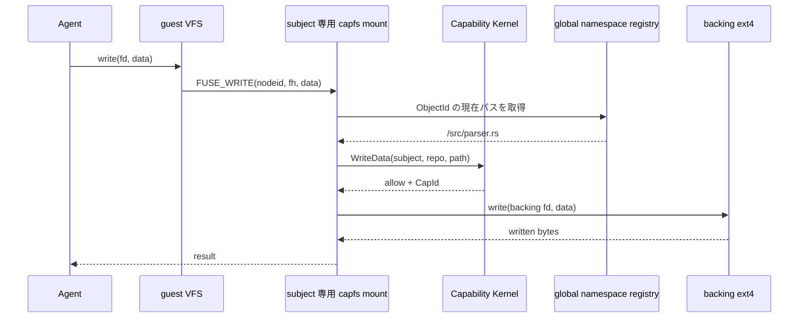
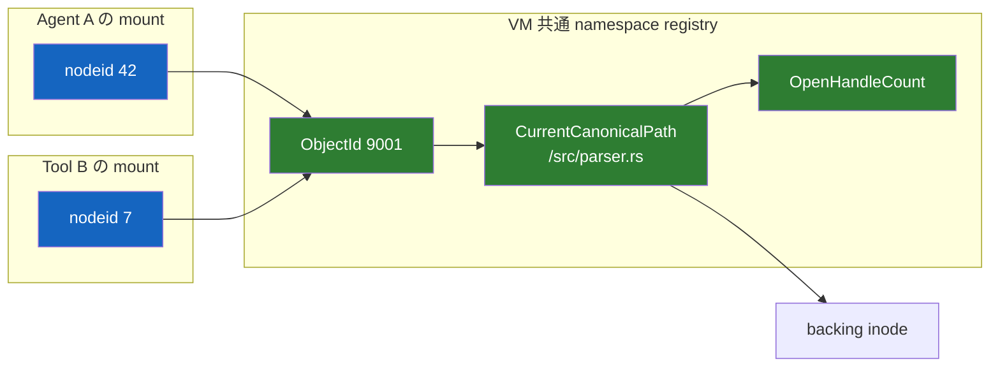
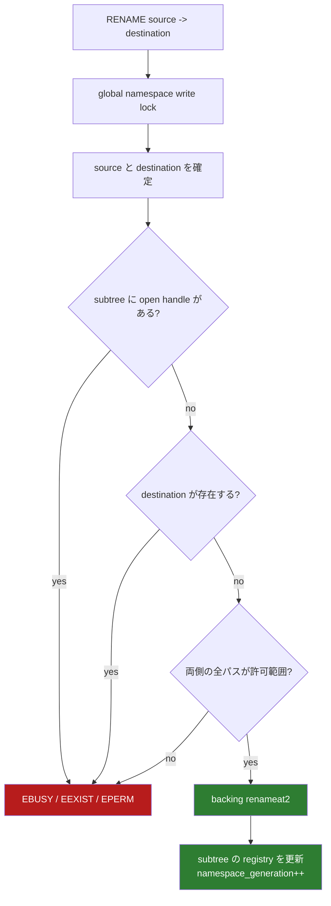

<!-- doc-type: design -->

# capfs

[設計書一覧](README.md) / capfs

> **対象読者:** filesystem 境界の設計者、capfs 実装者

`capfs` を挟む理由は、Agent に専用のファイル API を覚えさせるためではない。Agent には普通に `open`、`read`、`write` させつつ、最後の実行地点で Capability を強制するためである。

## ファイル操作の流れ

subject ごとに FUSE mount は分けるが、実ファイルと namespace の状態は VM 内で共有する。

## nodeid はパスではない

rename がある以上、`nodeid -> path` を不変にすると古いパスで認可して新しい場所へ書けてしまう。そこで `nodeid` は object を指し、現在パスは共有 registry から毎回引く。

`ObjectId` と mount 内の `nodeid` は再利用しない。

## 現在の実装位置

[`crates/capfs/src/backing.rs`](../../crates/capfs/src/backing.rs) に起動時の backing repository 検査、[`crates/capfs/src/namespace.rs`](../../crates/capfs/src/namespace.rs) にVM共通のnamespace registry、[`crates/capfs/src/node.rs`](../../crates/capfs/src/node.rs) にsubject mountごとのnode table、[`crates/capfs/src/runtime.rs`](../../crates/capfs/src/runtime.rs)と[`crates/capfs/src/read_only.rs`](../../crates/capfs/src/read_only.rs)に cache-aware FUSE adapterを実装している。

- root を symlink follow なしで開き、mount ID と inode の再照合後に directory fd を保持する。
- `statx` と `openat2` による fd-relative scan で special file と nested mount を拒否し、symlink の target を検証し、hard link の名前集合を確認する。repository 外にも名前がある inode は既定の `ExternalAliasPolicy::Materialize` で上限内に複製するか、`Reject` policy で拒否する。
- UTF-8・canonical segment、entry 数、depth を検査し、path 順の初期 manifest を作る。
- manifest全件へpath非依存の`ObjectId`を割り当て、root fdと完成したregistryを`ImportedRepository`で一緒に所有する。cloneしたmountは同じshared stateを参照する。
- host-assigned `RepoId`も`ImportedRepository`へ束ね、mount authorityとidentityが違うbacking接続をconstructorで拒否する。

- `ObjectId -> NamespaceObject` と `CanonicalPath -> ObjectId` を同じ lock 内で管理する。object は自分を指す path の集合と、symlink なら target を持つ。
- create、remove、subtree rename が成功したときだけ `namespace_generation` を進める。
- `ObjectId` は remove 後も再利用せず、rename 先は no-replace とする。
- subtree に open handle が1件でもあれば rename / remove executor を呼ばない。
- read / write adapter が現在 path 取得から backing I/O まで保持できる read-guard 付き closure API を持つ。
- backing executor 失敗では registry state を公開せず、writer panic 後は lock poison により fail closed にする。

- Linux FUSE の root nodeを`nodeid 1`へ固定し、通常nodeをmount内で単調に割り当てる。
- 同一objectのLOOKUP参照数を数え、最終FORGET後はmappingを外すがnodeidは再利用しない。
- stale node、過剰FORGET、counter / sequence枯渇、lock poison、index不一致をfail closedで拒否する。
- nodeidはsubject mount内だけのidentityとし、VM共通のpath解決には`ObjectId`を使う。

- `LOOKUP`と`GETATTR`はCapabilityの許可範囲またはその祖先だけを公開する。attribute TTLは有限値で、revokeが返る前に強制無効化される。
- `OPEN`はaccess modeを`ReadData` / `WriteData`の単一または複合認可へ変換する。writableな`O_TRUNC`には`Truncate`も同じ複合認可へ加える。`SETATTR`のsizeは`Truncate`、ordinary modeまたはatime/mtimeは`SetMetadata`を現在pathで再認可する。`CREATE`は`CreateFile`と返却handleのaccess effectを複合認可し、`MKDIR`は`CreateDirectory`を認可してから現在のparent pathの直下へno-replace作成する。`UNLINK`、`RMDIR`、`RENAME`も現在のchild / subtree全pathに対応effectを要求する。毎回の`READ` / `WRITE`はnamespace上の現在pathに対して対応effectを再認可する。
- regular fileはOSのpage cacheを使って開き、revokeが返る前に`RevocationObserver`がその全nodeidのcached pageとcached attributeを破棄する。revoke後のreadはcacheから答えられず`capfs`へ戻る。`FOPEN_KEEP_CACHE`、`FUSE_WRITEBACK_CACHE`、shared writable `mmap`は使わない。
- runtime metadata/open/read/writeはroot fdから`openat2`で解決し、path途中のsymlink、mount越境、registryが知らない名前の出現をfail closedで拒否する。
- FUSE handle、namespace open count、Authority open handleを同じ`ObjectId`へ結び、`RELEASE`で一緒に閉じる。

詳しい API と保証範囲は[Backing repository の事前検証](../capfs/backing-preflight.md)、[共有 namespace registry](../capfs/namespace-registry.md)、[mount ごとの node table](../capfs/node-tables.md)、[FUSE adapter](../capfs/read-only-fuse.md)を参照する。全13 `FileEffect`はFUSE operationへ接続済みである。directory streamはopen時のgenerationを保持し、途中でnamespaceが変われば`EAGAIN`を返してcookieの再利用を止める。

namespace writer lockとCapability kernelのshared / exclusive guardを組み合わせたbounded
競合契約を[`crates/capfs/tests/concurrency.rs`](../../crates/capfs/tests/concurrency.rs)で
実行する。write中のrevoke、open / close、rename、unlinkを32 round走らせ、writeのcommitが
revoke returnを越えないこと、revoke後のmutationがbacking executorへ入らないこと、open
count・authority handle・namespace pathのrollback / publishとcommitted effect数が一致することを確認する。
これはunit境界を閉じる検査であり、実FUSE kernelの複数thread
requestや敵対的backing差し替えを仮定しない。

## workspace が扱う object の universe

`capfs` が表現する object は directory、regular file、symlink の3種類だけである。device、FIFO、socket、workspace 内 mount は起動前に拒否し、`MKNOD` と `O_TMPFILE` は `EPERM` を返す。`MKNOD` は「未実装」ではなく policy による拒否なので、`ENOSYS` ではなく `EPERM` を明示的に返す。

Git は symlink を mode `120000` の tree entry として表現し、blob の内容に link target を保持する。[Git fast-import documentation](https://git-scm.com/docs/git-fast-import) 一般的な Git repository を扱うには symlink が要る。hard link も、object store を共有する repository では現れる。どちらも初期実装では拒否していたが、現在は両方を扱う。判断の記録は [ADR 0017](../decisions/0017-authorize-an-aliased-inode-on-every-name.md) にある。

## symlink は registry が target を所有する

**path 解決を行うのは `capfs` ではなく OS である。** FUSE kernel は `READLINK` で target 文字列を受け取り、その後の walk を自分で進める。`..` の解決に `capfs` は呼ばれない。したがって **`capfs` が返す文字列が唯一の強制点**であり、target はその文字列が mount の外へ出ないと証明できる形に限られる。

受理する文法は次のとおりである。

- 相対 path のみ。絶対 path は caller の mount namespace で解決されるので拒否する。
- `..` は先頭の連続部分にのみ現れてよい。
- 各名前付き component は canonical path segment の規則を満たす。
- 4096 byte 以内。

先頭の `..` だけを許すのは、それが link 自身の祖先 directory を辿るからである。registry 上、path の親は必ず directory であり、この pop は一意に決まる。名前付き component の後ろの `..` は、その component 自身が浅い directory を指す symlink だった場合、字句上の containment 検査が通っても kernel の walk は root の上へ出る。この形を予測するのではなく、受理しないことで穴を消す。

target は registry が保持し、`READLINK` のたびに **link の現在の path から**再解決する。rename は同じ literal の意味を変えるので、登録時の判定を使い回さない。解決が repository の外へ出るなら `EXDEV` を返し、文字列を kernel に渡さない。backing の link body は registry の記録と毎回照合し、食い違えば fail closed にする。`FUSE_CACHE_SYMLINKS` は要求しない。要求すれば、この再検査を経ずに kernel が古い body を辿り続ける。

file operation は link の見かけ上の path ではなく、kernel が到達した実 path に対して認可される。許可範囲内の link から許可範囲外の target へ向かう walk は、target 側の `LOOKUP` が `ENOENT` になって止まる。dangling link は `ENOENT`、cycle と40回を超える chain は kernel 自身の `ELOOP` で終わり、いずれも backing object へ到達しない。backing I/O の `RESOLVE_NO_SYMLINKS` と `RESOLVE_NO_MAGICLINKS` は、registry を迂回する symlink が存在しないことを強制する防御層として残っている。

## hard link は「全ての名前で認可する」ことで閉じる

hard link は1つの inode に複数の canonical path を与える。認可は path に対して与えられているので、「どの path の権限で判定するか」を決めなければならない。

**`capfs` は全ての path で判定する。** `NamespaceObject` は自分を指す path の集合を持ち、operation はその全要素に対して effect を要求する。1つでも許可されなければ失敗する。可視性（`LOOKUP` / `GETATTR` / `READDIR`）も同じ規則に従う。

この規則の下では、alias を増やすことで誰かの権限が広がることは決してない。増えるのは要求される authority の方である。`/secret/data.txt` への authority を持たない subject が `/allowed/alias` に link を作っても、`/allowed/alias` への操作は `/secret/data.txt` への authority も要求し続ける。逆に、権限を持つ object を到達不能にする嫌がらせは可能なので、`LINK` は新しい名前と既存の全ての名前の両方に `CreateHardLink` を要求する。

directory は alias を持てない。Linux 自身が禁じており、`..` と subtree 規則が扱えない。

名前が2つ以上ある object から1つを消しても inode は名前を失わないので、open handle の有無に依らず許される。最後の名前を消す場合だけ従来どおり `EBUSY` になる。「path を失ったまま生きる inode を作らない」という不変条件はそのまま保たれる。

link count の検査は `nlink == 1` から `nlink == 名前の数` に変わった。`capfs` 経由で作られた link は registry が知っているので、**`capfs` の外で作られた名前は依然として検出される**。repository の外に名前がある inode は、repository が inode の部分的な view でしかないことを意味する。既定では **内容を repository 内の新しい inode へ複製し、repository 側の名前をその複製へ移す**。外の名前は元の inode を持ったまま触らない。repository 内で互いに alias だった名前は複製の alias として残り、切れるのは境界をまたぐ関係だけである。複製する総 byte 数には上限があり、実体化した名前は呼び出し側へ報告する。startup が backing tree へ一切書いてはならない場合は、policy を `Reject` にして repository 全体を拒否できる。

## rename をどう閉じるか

unlink も open handle が残っている間は `EBUSY` にする。多少 POSIX 互換性を落としてでも、「パスを失ったまま生きる inode」を作らない方を選ぶ。

## revoke を page cache に抜かせない

cached FUSE read は page cache だけで完了する場合があり、cached attribute も同様に `LOOKUP` / `GETATTR` を `capfs` まで戻さない。放置すれば revoke 後の read も stat も止められない。[Linux FUSE I/O modes](https://docs.kernel.org/filesystems/fuse/fuse-io.html)

当初はこれを `FOPEN_DIRECT_IO` と全 timeout 0 で塞いだ。それは正しかったが、代償が大きい。毎 operation が 2 回の context switch を伴う FUSE 往復になり、4 KiB read で 32 µs、stat で 95 µs を要したという旧 benchmark がある。これは測定環境に依存する履歴値であり、verification gate の性能保証ではない。

現在は **cache を有効にし、revoke が cache を同期的に破棄してから返る**方式を採る。守る不変条件は変わらない。

> revoke が返った後、その Capability で満たされる operation は存在しない。

read-only handle は page cache を使い、`attr_timeout` / `entry_timeout` に有限値を置く。writable handle は `FOPEN_DIRECT_IO` のまま残す。`FUSE_WRITEBACK_CACHE`、`FOPEN_KEEP_CACHE`、shared writable `mmap` は引き続き使わない。

writable handle を direct のままにするのは 2 つの理由による。buffered な FUSE write は page 単位に分解され、partial page では read-modify-write を要するため直接書くより遅い。そして cached handle と direct handle が同一 inode に共存しても、direct write 側が cache を無効化するため古い内容が残らない（[`cached_read_handle_observes_writes_made_through_a_direct_handle`](../../crates/capfs/tests/read_only_fuse.rs) が実 mount 上で確認する）。write は毎回 `WRITE` として `capfs` へ戻り、再認可される。

### なぜ同じ強さが保てるのか

`CapabilityKernel` に `RevocationObserver` を置き、revoke と `begin_subject_close` は observer を走らせてから返る。`capfs` は mount ごとに observer を登録し、その mount が kernel へ渡した全 `nodeid` を `FUSE_NOTIFY_INVAL_INODE` で無効化する。

根拠は 3 点である。

1. FUSE notification は FUSE device への write 中に OS 側でインライン処理される。`inval_inode` が返った時点で、その inode の cached page と cached attribute は既に無い。
2. 無効化対象は node table が保持する「kernel へ渡した全 nodeid」であり、これが cache を持ち得る集合の上界である。`FORGET` 済みの identity は kernel が既に捨てており、identity は再利用されない。
3. したがって observer 復帰後に cache から答えられる要求は無い。以後の read は `capfs` へ戻り、再認可され、revoke 済みとして拒否される。

revoke 確定時点で既に in-flight の read は対象外である。それは revoke 前に認可されており、順序付けは kernel の state guard が行う。

### lock 順序が正しさの一部である

observer は **state の排他 guard を解放してから**走らせる。これは都合ではなく要件である。cache 無効化は OS がその mount の in-flight request を排出し終えるまでブロックし得るが、その request は拒否されるために shared state access を必要とする。排他 guard を保持したまま observer を走らせると、revoke は自分が止めようとしている request と deadlock する。

### 確認できないなら fail closed

notifier が未装着、node table が読めない、OS が無効化を拒否した、のいずれでも mount を fatal にし、revoke 呼び出し元へ `RevocationNotPropagated` を返す。空だと証明できない cache は、埋まっているものとして扱う。

### この方式が実際に検査されていること

[`mounted_read_only_view_denies_read_after_revoke`](../../crates/capfs/tests/read_only_fuse.rs) は revoke 前に file 全体を読んで cache を埋め、revoke 後の read が `EACCES` になることを実 mount 上で確認する。observer を外すとこの test は落ちる。`begin_subject_close` 経路は [`mounted_view_denies_cached_read_after_subject_close`](../../crates/capfs/tests/read_only_fuse.rs) が同じ形で押さえる。

### cache coherence の範囲

`FOPEN_KEEP_CACHE` は使わない。page cache は handle が開いている間だけ有効で、次の `OPEN` で破棄される。同一 repository を複数 mount が共有する場合、他 mount の write が見えるまでの遅れは 1 回の open 期間に収まる。attribute は `attr_timeout` に収まる。close-to-open coherence であり、これは security の弱化ではなく可視性の粒度である。

内部キャッシュも使ってよい。ただし key に `auth_epoch` と `namespace_generation` を含め、Capability の期限を越えて再利用しない。

## 実装する操作

| FUSE operation | 判断 |
|---|---|
| `LOOKUP`, `GETATTR` | 許可範囲またはその祖先だけ見せる。その他は `ENOENT` |
| `READDIR` | `ListDirectory` を確認し、見えてよい entry だけ返す。open後のnamespace変更時は `EAGAIN` でstream再開を要求する |
| `OPEN` | access mode を確認。`O_TRUNC` は open 前に別途認可 |
| `READ`, `WRITE` | object の現在パスに対して毎回再認可 |
| `CREATE`, `MKDIR` | これから作る子パスを認可 |
| `UNLINK`, `RMDIR` | 対象を認可。open 中なら拒否 |
| `RENAME` | source / destination を認可し、VM 共通 lock で更新 |
| `SETATTR` | size は `Truncate`、ordinary mode または atime/mtime は `SetMetadata`。owner・flag・複合metadata変更は拒否 |
| `READLINK` | `ReadLink` を確認。返す前に現在 path から再解決し、外へ出るなら `EXDEV` |
| `SYMLINK` | `CreateSymlink` を確認。target が repository 内に解決できなければ `EXDEV` / `EPERM` |
| `LINK` | 新しい名前と既存の全ての名前に `CreateHardLink` を要求。directory は不可 |
| device、xattr、ioctl、fallocate、copy-range | `EPERM` |
| 未実装 opcode | backing に触れず fail closed |

backing ext4 は supervisor の mount namespace にしか置かない。操作は事前に開いた directory fd から始め、`openat2` の `RESOLVE_BENEATH`、`RESOLVE_NO_SYMLINKS`、`RESOLVE_NO_MAGICLINKS`、`RESOLVE_NO_XDEV` を使う。[openat2(2)](https://man7.org/linux/man-pages/man2/openat2.2.html)

## 壊れたとき

`capfs` が停止したら要求は `EIO` になる。Agent / Tool に backing への別経路はない。supervisor が停止した場合は VM セッションごと捨て、Capability を workspace から復元しない。

## 関連

- [状態機械と revoke](state-and-revocation.md)
- [隔離基盤](runtime-isolation.md)
- [検証戦略](verification.md)
- [検証ステータス manifest](../verification-status.md)
- [実装順序](implementation-plan.md)
