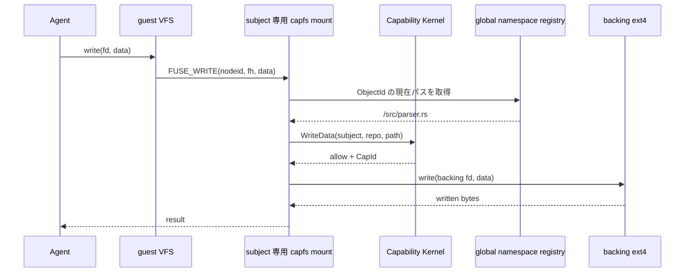
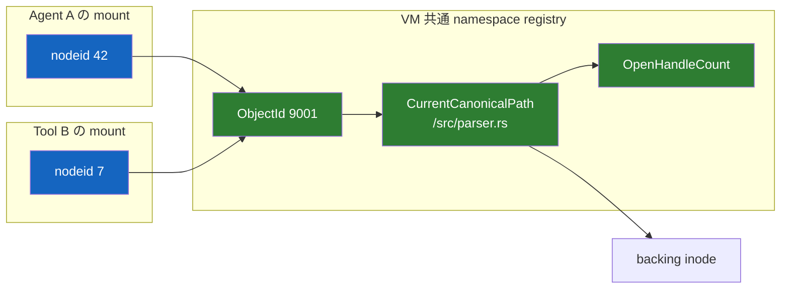
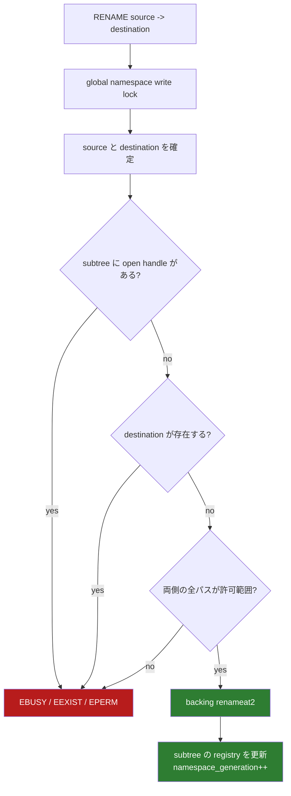

# capfs

[設計書一覧](README.md) / capfs

`capfs` を挟む理由は、Agent に専用のファイル API を覚えさせるためではない。Agent には普通に `open`、`read`、`write` させつつ、最後の実行地点で Capability を強制するためである。

## ファイル操作の流れ



subject ごとに FUSE mount は分けるが、実ファイルと namespace の状態は VM 内で共有する。

## nodeid はパスではない

rename がある以上、`nodeid -> path` を不変にすると古いパスで認可して新しい場所へ書けてしまう。そこで `nodeid` は object を指し、現在パスは共有 registry から毎回引く。



`ObjectId` と mount 内の `nodeid` は再利用しない。

## workspace を木に限定する

path-based authority と相性が悪い alias は最初から作らない。

- 起動前に symlink、hard link、device、FIFO、socket、workspace 内 mount を拒否する。
- `SYMLINK`、`LINK`、`MKNOD`、`O_TMPFILE` は `EPERM`。
- link を実体へ置換しない。対象 repository 自体を非対応として返す。
- 生きている object は必ず1つの canonical path を持つ。

## rename をどう閉じるか



unlink も open handle が残っている間は `EBUSY` にする。多少 POSIX 互換性を落としてでも、「パスを失ったまま生きる inode」を作らない方を選ぶ。

## revoke を page cache に抜かせない

regular file の `OPEN` は `FOPEN_DIRECT_IO` を返す。`FUSE_WRITEBACK_CACHE` と shared writable `mmap` は使わない。

cached FUSE read は page cache だけで完了する場合があり、それでは revoke 後の read を止められない。direct I/O にすることで、read / write の両方を毎回 `capfs` まで戻す。[Linux FUSE I/O modes](https://docs.kernel.org/filesystems/fuse/fuse-io.html)

```text
entry_timeout    = 0
attr_timeout     = 0
negative_timeout = 0
```

内部キャッシュは使ってよい。ただし key に `auth_epoch` と `namespace_generation` を含め、Capability の期限を越えて再利用しない。

## 実装する操作

| FUSE operation | 判断 |
|---|---|
| `LOOKUP`, `GETATTR` | 許可範囲またはその祖先だけ見せる。その他は `ENOENT` |
| `READDIR` | `ListDirectory` を確認し、見えてよい entry だけ返す |
| `OPEN` | access mode を確認。`O_TRUNC` は open 前に別途認可 |
| `READ`, `WRITE` | object の現在パスに対して毎回再認可 |
| `CREATE`, `MKDIR` | これから作る子パスを認可 |
| `UNLINK`, `RMDIR` | 対象を認可。open 中なら拒否 |
| `RENAME` | source / destination を認可し、VM 共通 lock で更新 |
| `SETATTR` | size は `Truncate`、mode / time は `SetMetadata`。owner 変更は拒否 |
| link、device、xattr、ioctl、fallocate、copy-range | `EPERM` |
| 未実装 opcode | backing に触れず fail closed |

backing ext4 は supervisor の mount namespace にしか置かない。操作は事前に開いた directory fd から始め、`openat2` の `RESOLVE_BENEATH`、`RESOLVE_NO_SYMLINKS`、`RESOLVE_NO_MAGICLINKS`、`RESOLVE_NO_XDEV` を使う。[openat2(2)](https://man7.org/linux/man-pages/man2/openat2.2.html)

## 壊れたとき

`capfs` が停止したら要求は `EIO` になる。Agent / Tool に backing への別経路はない。supervisor が停止した場合は VM セッションごと捨て、Capability を workspace から復元しない。

## 関連文書

- [状態機械と revoke](state-and-revocation.md)
- [隔離基盤](runtime-isolation.md)
- [検証戦略](verification.md)
